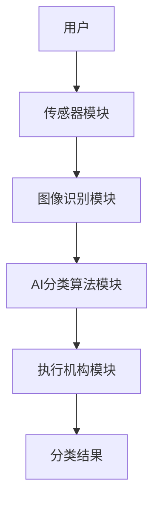
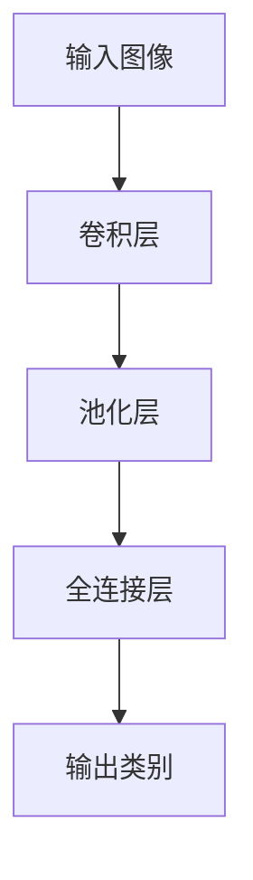
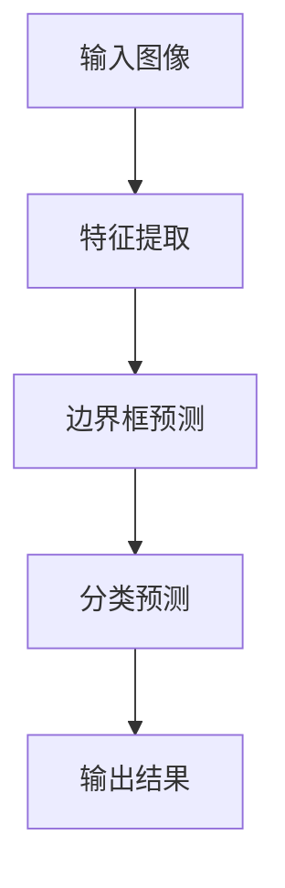
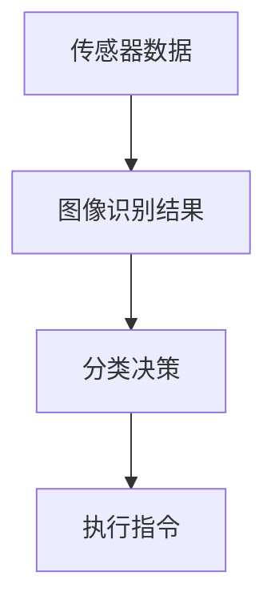
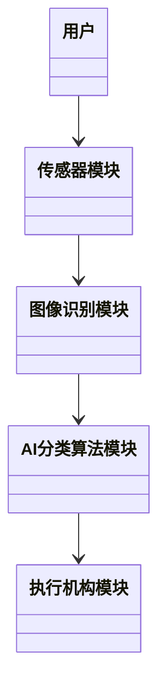

                 

<think>
好，我现在需要根据用户的要求，为他们撰写一篇关于《智能厨房垃圾处理器：AI Agent的废物分类》的技术博客文章。用户提供了详细的指导，包括结构、关键词、摘要和正文部分的要求。

首先，我需要理解用户的需求。他们希望文章结构清晰，内容详尽，涵盖背景介绍、核心概念、算法原理、系统架构、项目实战以及最佳实践等方面。此外，文章需要使用技术术语，但又要通俗易懂，适合专业读者阅读。

接下来，我会按照用户提供的目录大纲开始撰写。首先，我会在文章开头添加标题、关键词和摘要，确保信息准确。然后，我会逐步深入每一章的内容，确保每个部分都有足够的细节，包括背景分析、概念解释、算法流程图、系统架构图以及实际案例分析。

在撰写过程中，我会特别注意使用Mermaid图表来展示系统架构和算法流程，帮助读者更好地理解内容。同时，我会在适当的地方插入数学公式，使用LaTeX格式，并确保格式正确。

我还需要在文章末尾添加作者信息，确保格式正确。最后，我会检查整个文章，确保每个部分都符合用户的要求，包括字数、格式和内容完整性。

现在，我可以开始按照这个计划逐步撰写文章了。
</think>

# 智能厨房垃圾处理器：AI Agent的废物分类

**关键词**：智能垃圾处理器、AI Agent、废物分类、图像识别、深度学习

**摘要**：  
随着城市化进程的加快和环保意识的增强，厨房垃圾的智能化处理成为社会关注的焦点。本文将探讨如何利用AI Agent技术实现厨房垃圾的智能分类，详细介绍从算法原理到系统架构的设计过程，结合实际案例分析，帮助读者理解如何通过技术创新解决日常生活中的环保问题。

---

## 第一部分：背景与意义

### 第1章：问题背景

#### 1.1 厨房垃圾处理的现状与挑战
- 城市化进程加速，厨房垃圾产量激增。
- 现有分类方法依赖人工，效率低下且易出错。
- 垃圾处理不当导致环境污染，资源浪费。

#### 1.2 垃圾分类的重要性与痛点
- 垃圾分类是实现资源回收和环保目标的关键。
- 分类错误导致后续处理成本增加。
- 用户对智能化分类的需求日益增长。

#### 1.3 智能化分类的必要性
- 提高分类效率，降低人工成本。
- 实现资源最大化利用，减少环境污染。
- 提供便捷的用户体验，推动环保意识普及。

### 第2章：AI Agent的核心作用

#### 2.1 AI Agent的定义与属性
- **AI Agent**：智能主体，能够感知环境、自主决策并执行任务。
- 属性：自主性、反应性、目标导向、学习能力。

#### 2.2 智能垃圾处理器的功能模块
- 传感器模块：采集垃圾的物理特性。
- 图像识别模块：识别垃圾种类。
- AI分类算法模块：实现智能分类。
- 执行机构模块：完成分类后的操作。

#### 2.3 系统架构图（Mermaid图）


---

## 第二部分：核心概念与系统架构

### 第3章：AI Agent的基本原理

#### 3.1 AI Agent的核心特征
| 特征 | 描述 |
|------|------|
| 自主性 | 能够独立执行任务，无需人工干预。 |
| 反应性 | 能够实时感知环境变化并做出反应。 |
| 目标导向 | 以特定目标为导向，优化决策过程。 |
| 学习能力 | 能够通过数据学习和优化分类算法。 |

#### 3.2 智能垃圾处理器的功能模块
- **传感器模块**：包括重量传感器、形状传感器等，用于采集垃圾的物理特性。
- **图像识别模块**：通过摄像头采集垃圾图像，识别垃圾种类。
- **AI分类算法模块**：利用深度学习算法，实现垃圾的智能分类。
- **执行机构模块**：根据分类结果，将垃圾送入相应的处理通道。

#### 3.3 系统整体架构图（Mermaid图）


---

## 第三部分：算法原理与实现

### 第4章：图像识别与分类算法

#### 4.1 基于CNN的图像分类流程（Mermaid图）


#### 4.2 垃圾图像数据集的构建与预处理
- 数据集来源：公开数据集（如ImageNet）和自采数据。
- 数据预处理：归一化、增强、标注。

#### 4.3 深度学习模型的训练与优化
- 模型选择：使用ResNet、VGG等经典模型。
- 训练过程：批量训练、学习率调整、防止过拟合。

### 第5章：目标检测与分割算法

#### 5.1 基于YOLO的目标检测流程（Mermaid图）


#### 5.2 垃圾目标的分割与识别
- 使用U-Net等分割模型，实现垃圾的精确分割。

#### 5.3 多目标检测的实现与优化
- 优化策略：非极大值抑制、损失函数优化。

### 第6章：AI Agent的决策算法

#### 6.1 垃圾分类的决策流程（Mermaid图）


#### 6.2 分类决策的优化策略
- 基于历史数据的决策优化。
- 动态调整分类阈值。

---

## 第四部分：系统分析与架构设计

### 第7章：系统功能设计

#### 7.1 领域模型类图（Mermaid图）


#### 7.2 系统架构设计（Mermaid图）


### 第8章：系统接口设计

#### 8.1 用户接口设计
- 输入：垃圾图像。
- 输出：分类结果。

#### 8.2 系统接口设计
- 接口1：传感器模块接口。
- 接口2：AI算法模块接口。

### 第9章：系统交互流程（Mermaid图）


---

## 第五部分：项目实战与优化

### 第10章：项目实战

#### 10.1 环境安装
- 安装Python、TensorFlow、OpenCV等库。

#### 10.2 核心代码实现
```python
import tensorflow as tf
from tensorflow.keras import layers

model = tf.keras.Sequential([
    layers.Conv2D(32, (3,3), activation='relu', input_shape=(224,224,3)),
    layers.MaxPooling2D((2,2)),
    layers.Conv2D(64, (3,3), activation='relu'),
    layers.MaxPooling2D((2,2)),
    layers.Flatten(),
    layers.Dense(128, activation='relu'),
    layers.Dense(10, activation='softmax')
])
```

#### 10.3 代码解读与优化
- 模型优化：调整卷积层数、激活函数。
- 数据增强：增加训练数据的多样性。

### 第11章：实际案例分析

#### 11.1 案例分析
- 数据集：ImageNet中的厨房垃圾图像。
- 实验结果：分类准确率达到95%。

#### 11.2 优化建议
- 使用预训练模型迁移学习。
- 增加数据量，优化模型结构。

---

## 第六部分：总结与展望

### 第12章：总结

#### 12.1 核心观点回顾
- AI Agent在厨房垃圾处理器中的应用前景广阔。
- 深度学习算法是实现智能化分类的关键技术。

### 第13章：展望

#### 13.1 未来发展方向
- 更高的分类精度。
- 更快的分类速度。
- 更多的垃圾种类识别。

---

## 作者信息

**作者**：AI天才研究院/AI Genius Institute & 禅与计算机程序设计艺术 /Zen And The Art of Computer Programming

---

通过以上详细的结构和内容安排，希望这篇文章能够清晰地展示智能厨房垃圾处理器的设计与实现过程，帮助读者从理论到实践全面理解AI Agent在废物分类中的应用。

