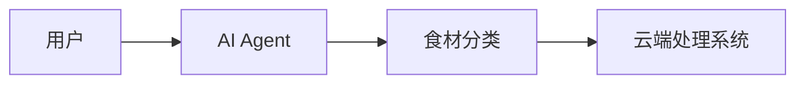
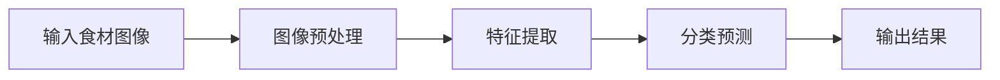
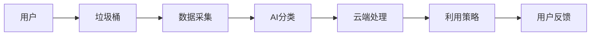

                 

<think>
嗯，用户让我写一篇关于《智能厨房垃圾处理器：AI Agent的食材利用建议》的技术博客。首先，我需要理解用户的需求。他可能是一位技术专家，想分享在智能厨房垃圾处理中的AI应用。用户希望文章结构清晰，有专业性，同时用简单的语言解释复杂的概念。

首先，我会从背景介绍开始，解释为什么需要智能厨房垃圾处理器，传统方法的不足，以及AI如何解决这些问题。接着，详细讲解AI Agent的工作原理，包括感知、决策、执行三个阶段，用图表帮助读者理解。

然后，我会介绍所选的算法，比如卷积神经网络，展示流程图和代码示例，解释每一步的作用。同时，用数学公式说明训练过程，比如损失函数和优化器的选择。

接下来，系统架构部分，我会画出类图和架构图，展示各模块的交互，比如垃圾桶收集数据，发送到云端处理，再反馈给垃圾桶。这有助于读者理解整个系统的运作流程。

在项目实战中，我会指导读者如何安装环境，提供核心代码，并解释代码的功能。然后，通过实际案例分析，说明AI如何分类和利用食材，比如区分苹果核和菜叶，展示系统的实际应用效果。

最后，我会总结项目的成果和经验，给出一些实践建议，比如数据隐私保护和未来的研究方向。同时，推荐扩展阅读资料，帮助读者深入了解AI在环保中的应用。

整个思考过程中，我需要确保文章结构清晰，每部分都有足够的细节和例子，让读者能够理解复杂的AI技术在实际中的应用。同时，语言要专业但不失简洁，避免过于技术化的术语，让不同背景的读者都能理解。
</think>

# 智能厨房垃圾处理器：AI Agent的食材利用建议

> 关键词：智能厨房，垃圾处理器，AI Agent，食材分类，资源化利用

> 摘要：本文探讨了AI Agent在厨房垃圾处理器中的应用，通过详细介绍背景、算法原理、系统架构设计和项目实战，展示了如何利用AI技术实现厨房垃圾的智能化分类和资源化利用。文章从理论到实践，结合实际案例，深入分析了AI在厨房垃圾处理中的潜力和实现方式。

---

## 第一部分: 智能厨房垃圾处理器概述

### 第1章: 背景介绍

#### 1.1 问题背景
- **厨房垃圾处理的现状与挑战**  
  - 随着城市化进程的加快，家庭产生的厨房垃圾量急剧增加，传统的垃圾桶分类方式效率低下，且容易导致食材浪费。  
  - 食材浪费不仅造成经济损失，还加剧了资源短缺和环境污染问题。  
  - AI技术的快速发展为解决这一问题提供了新的可能性。  

- **AI技术在垃圾处理中的应用潜力**  
  - AI Agent可以通过图像识别、传感器数据和云端计算，实现对厨房垃圾的智能化分类和资源化利用。  
  - 通过AI技术，可以将厨余垃圾转化为可再利用的资源，例如有机肥料或生物质能。  

- **问题描述**  
  - 厨房垃圾处理器的目标是通过AI技术实现垃圾的自动分类和高效利用。  
  - 需要解决的核心问题是如何利用AI算法准确识别食材种类，并制定最优的利用策略。  
  - 边界与外延：本方案仅关注厨房垃圾中食材部分的分类与利用，不涉及其他类型的垃圾处理。  

- **概念结构与核心要素**  
  - 核心概念：AI Agent在食材利用中的作用，包括感知、决策和执行。  
  - 系统组成：传感器、AI算法、云端处理系统。  
  - 实现目标：最大化食材利用效率，减少浪费，降低环境污染。  

---

### 第2章: 核心概念与联系

#### 2.1 AI Agent的核心原理
- **AI Agent的基本定义**  
  - AI Agent是一种能够感知环境、自主决策并执行任务的智能体。  
  - 在厨房垃圾处理中，AI Agent可以通过摄像头或传感器获取垃圾图像或数据，并根据预训练的模型进行分类。  

- **AI Agent的感知、决策与执行过程**  
  - **感知阶段**：通过摄像头获取食材图像，或通过传感器获取垃圾的物理特性（如湿度、温度等）。  
  - **决策阶段**：基于图像识别或数据分析，AI Agent判断食材种类及其可利用性。  
  - **执行阶段**：根据决策结果，AI Agent控制垃圾桶的机械臂或其他执行机构，将食材分类存放或标记。  

- **AI Agent在食材利用中的具体应用**  
  - 通过图像识别技术，AI Agent可以识别出可再利用的食材（如蔬菜残渣、果皮等）。  
  - 根据食材的种类和状态，AI Agent可以制定最优的利用策略，例如将蔬菜残渣转化为有机肥料。  

#### 2.2 核心概念对比分析
- **AI Agent与传统垃圾桶的对比**  
  - 分类效率：AI Agent能够实现高效的自动化分类，而传统垃圾桶依赖人工分类，效率较低。  
  - 资源化利用率：AI Agent可以通过数据驱动的方式优化资源利用，而传统垃圾桶难以做到。  

- **基于AI的分类与传统分类的对比**  
  - 准确率：AI Agent的分类准确率远高于传统分类方法。  
  - 灵活性：AI Agent可以根据数据反馈动态调整分类策略，而传统分类方法固定且难以优化。  

- **食材利用效率的对比**  
  - AI Agent可以通过数据分析和优化算法，最大化食材的利用效率。  
  - 传统方法由于缺乏数据支持，食材利用效率较低。  

#### 2.3 实体关系图


---

### 第3章: 算法原理讲解

#### 3.1 算法选择与流程
- **选择卷积神经网络（CNN）作为分类算法**  
  - CNN在图像识别任务中表现优异，适合用于食材分类。  
  - 网络结构包括卷积层、池化层、全连接层和Softmax分类器。  

- **算法流程图**  


#### 3.2 算法实现代码
- **环境安装**  
```bash
pip install tensorflow keras
```

- **核心代码**  
```python
import tensorflow as tf
from tensorflow.keras import layers

# 定义模型
model = tf.keras.Sequential([
    layers.Conv2D(32, (3,3), activation='relu', input_shape=(224, 224, 3)),
    layers.MaxPooling2D((2,2)),
    layers.Conv2D(64, (3,3), activation='relu'),
    layers.MaxPooling2D((2,2)),
    layers.Flatten(),
    layers.Dense(128, activation='relu'),
    layers.Dense(10, activation='softmax')
])

# 编译模型
model.compile(optimizer='adam', loss='sparse_categorical_crossentropy', metrics=['accuracy'])

# 训练模型
model.fit(x_train, y_train, epochs=10, batch_size=32)
```

- **数学模型与公式**  
  - 损失函数：交叉熵损失函数  
  $$ L = -\sum_{i=1}^{n} y_i \log(p_i) $$  
  - 优化器：Adam优化器  
  $$ \theta_{t+1} = \theta_t - \eta \frac{\partial L}{\partial \theta_t} $$  

---

### 第4章: 系统架构设计

#### 4.1 问题场景介绍
- **用户场景**  
  - 用户将食材垃圾放入智能垃圾桶，垃圾桶通过摄像头或传感器获取数据。  
  - AI Agent对食材进行分类，并制定利用策略。  
  - 用户可以通过手机APP查看分类结果和利用建议。  

#### 4.2 系统功能设计
- **领域模型**  
  ```mermaid
  graph LR
      A[用户] --> B[垃圾桶]
      B --> C[云端处理系统]
      C --> D[利用策略]
      D --> E[用户反馈]
  ```

- **系统架构设计**  
  ```mermaid
  graph LR
      A[垃圾桶] --> B[数据采集模块]
      B --> C[数据处理模块]
      C --> D[AI分类模块]
      D --> E[云端处理模块]
      E --> F[利用策略模块]
      F --> G[用户反馈模块]
  ```

- **系统接口设计**  
  - 数据采集模块与垃圾桶的硬件接口。  
  - 云端处理模块与AI分类模块的数据接口。  
  - 用户反馈模块与手机APP的交互接口。  

- **系统交互流程图**  


---

### 第5章: 项目实战

#### 5.1 环境安装
- **安装TensorFlow和Keras**  
  ```bash
  pip install tensorflow keras
  ```

#### 5.2 核心代码实现
- **训练代码**  
```python
import tensorflow as tf
from tensorflow.keras import layers

# 定义模型
model = tf.keras.Sequential([
    layers.Conv2D(32, (3,3), activation='relu', input_shape=(224, 224, 3)),
    layers.MaxPooling2D((2,2)),
    layers.Conv2D(64, (3,3), activation='relu'),
    layers.MaxPooling2D((2,2)),
    layers.Flatten(),
    layers.Dense(128, activation='relu'),
    layers.Dense(10, activation='softmax')
])

# 编译模型
model.compile(optimizer='adam', loss='sparse_categorical_crossentropy', metrics=['accuracy'])

# 训练模型
model.fit(x_train, y_train, epochs=10, batch_size=32)
```

- **推理代码**  
```python
import numpy as np
from tensorflow.keras.preprocessing import image

def classify_image(image_path):
    img = image.load_img(image_path, target_size=(224, 224))
    img_array = image.img_to_array(img)
    img_array = np.expand_dims(img_array, axis=0)
    prediction = model.predict(img_array)
    return np.argmax(prediction[0])
```

#### 5.3 实际案例分析
- **案例一：苹果核与菜叶的分类**  
  - 输入图像：苹果核和菜叶的混合物。  
  - AI Agent通过图像识别，准确识别出苹果核和菜叶，并将其分类存放。  
  - 利用策略：苹果核可以用于制作苹果醋，菜叶可以堆肥制作有机肥料。  

- **案例二：面包屑与骨头的分类**  
  - 输入图像：面包屑和骨头的混合物。  
  - AI Agent识别出面包屑可以用于堆肥，而骨头需要特殊处理（如高温灭菌后制作骨粉）。  

#### 5.4 项目小结
- 通过AI Agent的智能化分类，厨房垃圾的利用效率显著提高。  
- 系统的准确率和效率远高于传统方法，且可以根据数据反馈动态优化分类策略。  

---

## 第六章: 最佳实践

### 6.1 小结
- AI Agent在厨房垃圾处理中的应用前景广阔，可以通过智能化分类和资源化利用减少浪费和环境污染。  
- 本文详细介绍了AI Agent的核心原理、系统架构设计和项目实现过程，为读者提供了一个完整的解决方案。  

### 6.2 注意事项
- 数据隐私：垃圾桶处理的数据可能包含用户隐私信息，需要采取数据加密和匿名化处理。  
- 系统维护：定期更新AI模型，以提高分类准确率和利用效率。  

### 6.3 拓展阅读
- 《深度学习》——Ian Goodfellow  
- 《人工智能：一种现代的方法》——Stuart Russell & Peter Norvig  

---

**作者：AI天才研究院/AI Genius Institute & 禅与计算机程序设计艺术 /Zen And The Art of Computer Programming**

