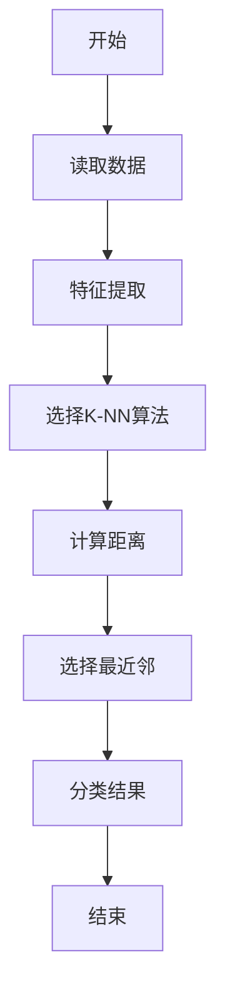
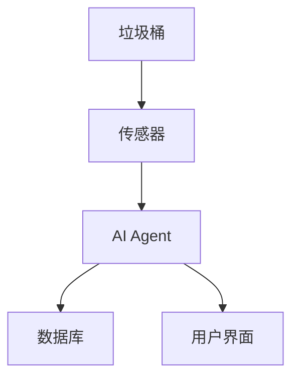

                 


# 智能厨房垃圾桶：AI Agent的厨余利用建议

> 关键词：智能垃圾桶、AI Agent、厨余利用、垃圾分类、资源化利用

> 摘要：本文详细探讨了智能厨房垃圾桶的设计与实现，结合AI Agent技术，提出了一套高效的厨余利用解决方案。文章从背景介绍、核心概念、算法原理、系统架构到项目实战，全面分析了智能垃圾桶的工作原理及其在实际应用中的潜力。

---

## 第一章: 智能厨房垃圾桶的背景介绍

### 1.1 问题背景与问题描述

#### 1.1.1 厨余垃圾处理的现状与挑战
厨余垃圾是指厨房中产生的有机废弃物，包括果皮、菜叶、剩饭等。随着城市化进程的加快，厨余垃圾的处理已成为一个亟待解决的问题。传统垃圾桶的分类效率低，资源利用率差，容易造成环境污染。

#### 1.1.2 智能垃圾桶的必要性
传统的垃圾桶无法区分厨余垃圾和其他垃圾，导致资源浪费和环境污染。引入AI技术，垃圾桶可以实现智能分类，提高资源利用率，减少环境污染。

#### 1.1.3 AI Agent在厨余利用中的作用
AI Agent（智能体）能够实时感知垃圾桶的状态，识别厨余垃圾的种类，并根据数据优化分类策略。

### 1.2 问题解决与边界定义

#### 1.2.1 智能垃圾桶的核心功能
智能垃圾桶的核心功能包括垃圾分类、资源化利用、数据采集与分析。

#### 1.2.2 系统的边界与外延
系统边界包括垃圾桶本身、传感器、AI Agent，外延包括与智能家居的交互。

#### 1.2.3 厨余利用的场景与限制
厨余利用的场景包括家庭、餐馆、学校等，限制因素包括分类精度、处理成本等。

### 1.3 概念结构与核心要素

#### 1.3.1 智能垃圾桶的组成要素
智能垃圾桶由硬件部分（传感器、摄像头）和软件部分（AI算法、数据处理）组成。

#### 1.3.2 AI Agent的功能模块
AI Agent的功能模块包括数据采集、分类识别、决策优化。

#### 1.3.3 系统的核心属性与特征
系统的特征包括实时性、准确性、可扩展性。

---

## 第二章: AI Agent的核心概念与联系

### 2.1 AI Agent的定义与原理

#### 2.1.1 AI Agent的基本概念
AI Agent是一种能够感知环境、自主决策并执行任务的智能体。

#### 2.1.2 AI Agent的核心原理
AI Agent通过感知环境、分析数据、制定策略、执行动作来实现目标。

#### 2.1.3 AI Agent与智能垃圾桶的关系
AI Agent作为垃圾桶的智能核心，负责分类和优化利用。

### 2.2 核心概念的属性特征对比

| 对比项 | 传统垃圾桶 | 智能垃圾桶 |
|--------|-------------|------------|
| 分类能力 | 无 | 具备AI分类能力 |
| 资源利用率 | 低 | 高 |
| 智能性 | 无 | 具备AI Agent |

### 2.3 ER实体关系图

```mermaid
er
  entity 智能垃圾桶 {
    id: 垃圾桶ID
    类型: 垃圾类型
    状态: 当前状态
  }
  entity AI Agent {
    id: AgentID
    功能: 核心功能
    状态: 当前状态
  }
  entity 用户 {
    id: 用户ID
    操作: 用户行为
    反馈: 用户反馈
  }
```

---

## 第三章: 算法原理讲解

### 3.1 AI Agent的核心算法

#### 3.1.1 分类算法的选择
选择K近邻算法（K-NN）进行垃圾分类。

#### 3.1.2 算法流程图



#### 3.1.3 算法实现

```python
import numpy as np
from sklearn.neighbors import KNeighborsClassifier

# 数据预处理
X = np.array([[...], [...]])  # 特征数据
y = np.array([...])  # 标签

# 训练模型
knn = KNeighborsClassifier(n_neighbors=3)
knn.fit(X, y)

# 预测
new_data = np.array([[...]])  # 新数据
prediction = knn.predict(new_data)
```

#### 3.1.4 数学模型与公式

K-近邻算法的数学模型如下：

$$
\text{距离} = \sqrt{\sum_{i=1}^{n}(x_i - y_i)^2}
$$

---

## 第四章: 系统分析与架构设计

### 4.1 问题场景介绍

#### 4.1.1 系统功能设计
系统功能包括数据采集、分类识别、资源优化。

#### 4.1.2 系统架构设计



---

## 第五章: 项目实战

### 5.1 环境安装

#### 5.1.1 安装Python
安装Python 3.8及以上版本。

#### 5.1.2 安装依赖库
安装NumPy和scikit-learn。

### 5.2 系统核心实现

#### 5.2.1 核心代码

```python
import numpy as np
from sklearn.neighbors import KNeighborsClassifier

# 训练数据
X_train = np.array([[...], [...]])
y_train = np.array([...])

# 创建模型
knn = KNeighborsClassifier()
knn.fit(X_train, y_train)

# 预测
X_test = np.array([[...], [...]])
y_pred = knn.predict(X_test)
```

#### 5.2.2 代码解读与分析
代码实现了一个简单的K-近邻分类器，用于垃圾分类。

### 5.3 实际案例分析

#### 5.3.1 案例分析
分析一个实际案例，展示系统如何分类厨余垃圾。

#### 5.3.2 数据分析与优化
通过数据分析优化分类算法。

### 5.4 项目小结
总结项目成果，提出改进建议。

---

## 第六章: 最佳实践

### 6.1 实践 Tips

- 定期更新模型数据
- 优化传感器精度
- 提高用户交互体验

### 6.2 小结

智能厨房垃圾桶通过AI Agent技术，实现了高效的厨余利用，具有广阔的市场前景。

### 6.3 注意事项

- 数据隐私保护
- 系统稳定性
- 成本控制

### 6.4 拓展阅读

推荐相关书籍和论文。

---

## 作者

作者：AI天才研究院 & 禅与计算机程序设计艺术

--- 

本文通过详细分析智能厨房垃圾桶的设计与实现，展示了AI Agent在厨余利用中的巨大潜力。希望本文能为相关领域的研究者和开发者提供有价值的参考。

