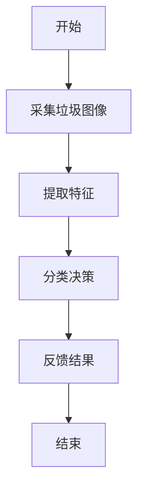
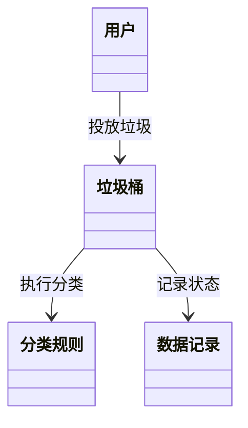
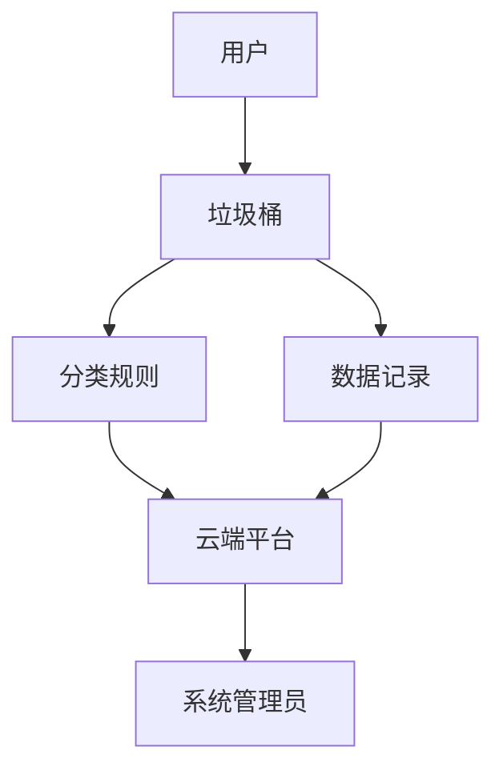
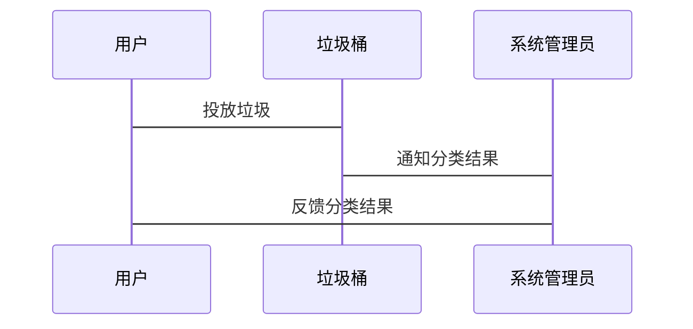

                 


# 智能厨房垃圾桶：AI Agent的厨余处理建议

> **关键词**：智能垃圾桶、AI Agent、厨余处理、物联网、算法原理  
>
> **摘要**：本文详细探讨了智能厨房垃圾桶的设计与实现，通过AI Agent优化厨余处理流程，结合物联网技术，提供高效的垃圾分类和资源化利用解决方案。文章从背景介绍、核心概念、算法原理、系统架构到项目实战，全面解析智能厨房垃圾桶的实现过程，为读者提供技术深度和实践指导。

---

## 第一部分：智能厨房垃圾桶的背景与概念

### 第1章：背景介绍

#### 1.1 问题背景与描述

随着城市化进程的加快和环保意识的增强，厨余垃圾的处理已成为一个亟待解决的问题。传统垃圾桶的分类效率低、资源浪费严重，且容易产生二次污染。如何利用智能化技术优化厨余处理流程，成为当前研究的热点。

#### 1.1.1 厨余垃圾处理的现状与挑战

- **现状分析**：传统垃圾桶依赖人工分类，效率低下，且分类准确率不足70%。
- **挑战**：厨余垃圾成分复杂，分类难度大；资源化利用效率低；环境污染问题突出。

#### 1.1.2 AI Agent在厨余处理中的应用前景

AI Agent（智能代理）通过实时感知、分类和决策，能够显著提升厨余处理的效率和准确性。其优势在于：

- **实时感知**：通过传感器和摄像头实时监测垃圾类型。
- **智能分类**：利用机器学习算法实现精准分类。
- **优化决策**：基于数据优化垃圾桶的使用和资源分配。

#### 1.1.3 概念结构与核心要素

智能厨房垃圾桶的核心要素包括：

- **AI Agent**：负责垃圾分类、决策和反馈。
- **物联网设备**：实现垃圾桶与云端的实时通信。
- **用户交互界面**：提供便捷的操作体验。

---

### 第2章：核心概念与联系

#### 2.1 AI Agent的原理与特征

AI Agent通过感知环境、分析数据、做出决策并执行动作，实现对厨余垃圾的智能处理。其特征包括：

- **自主性**：无需人工干预，自动完成任务。
- **反应性**：实时感知环境变化并做出反应。
- **社会性**：与物联网设备和其他系统协同工作。

#### 2.2 物联网技术在智能垃圾桶中的应用

物联网技术通过传感器和通信模块，实现垃圾桶的实时监测和远程控制。其应用场景包括：

- **垃圾量监测**：实时监控垃圾桶的填充状态。
- **远程管理**：通过云端平台实现垃圾桶的远程维护和优化。

#### 2.3 实体关系图架构

以下是智能厨房垃圾桶的实体关系图：

```mermaid
erDiagram
    actor 用户
    actor 系统管理员
    actor 清洁工
    class 垃圾桶
    class 垃圾类型
    class 分类规则
    class 数据记录
    用户 -> 垃圾桶 : 投放垃圾
    系统管理员 -> 垃圾桶 : 设置规则
    清洁工 -> 垃圾桶 : 清理垃圾
    垃圾桶 -> 垃圾类型 : 分类
    垃圾类型 -> 分类规则 : 对应规则
    数据记录 -> 垃圾桶 : 记录状态
```

---

### 第3章：算法原理讲解

#### 3.1 算法原理概述

基于AI Agent的分类算法，采用机器学习中的监督学习方法，通过训练模型实现垃圾的精准分类。算法流程如下：

1. **数据采集**：通过传感器和摄像头获取垃圾图像。
2. **特征提取**：提取垃圾的关键特征，如颜色、形状等。
3. **分类决策**：基于训练好的模型进行分类。
4. **结果反馈**：将分类结果反馈给垃圾桶和用户。

#### 3.2 算法流程图

以下是算法的流程图：



#### 3.3 算法实现代码

以下是Python实现的垃圾分类代码示例：

```python
import cv2
import numpy as np
from sklearn import svm

# 加载训练好的模型
model = svm.SVC()

# 数据预处理
def preprocess(image):
    # 转换为灰度图像
    gray = cv2.cvtColor(image, cv2.COLOR_BGR2GRAY)
    # 提取特征
    features = np.mean(gray)
    return features

# 分类函数
def classify(image):
    features = preprocess(image)
    prediction = model.predict([features])
    return prediction[0]

# 示例图像分类
image = cv2.imread("test.jpg")
result = classify(image)
print(f"分类结果：{result}")
```

---

### 第4章：数学模型与公式

#### 4.1 分类算法的数学模型

分类算法基于支持向量机（SVM）模型，其核心公式为：

$$ y = \text{sign}(w \cdot x + b) $$

其中，\( w \) 是权重向量，\( x \) 是输入特征，\( b \) 是偏置项。

#### 4.2 分类模型的优化

通过交叉验证优化模型参数，提升分类准确率。优化公式为：

$$ \min_{w,b} \frac{1}{2}||w||^2 + C \sum_{i=1}^n \xi_i $$

其中，\( C \) 是惩罚系数，\( \xi_i \) 是松弛变量。

---

### 第5章：系统分析与架构设计

#### 5.1 问题场景与系统介绍

智能厨房垃圾桶的应用场景包括家庭、餐馆和公共场所。系统功能需求包括垃圾分类、状态监测和用户反馈。

#### 5.2 系统功能设计

领域模型类图如下：



#### 5.3 系统架构设计

系统架构图如下：



#### 5.4 系统接口与交互设计

系统交互序列图如下：



---

### 第6章：项目实战

#### 6.1 环境安装与配置

开发环境：Python 3.8+，Jupyter Notebook。

依赖库安装：

```bash
pip install numpy scikit-learn cv2
```

#### 6.2 系统核心功能实现

AI Agent的核心实现代码：

```python
import cv2
import numpy as np
from sklearn import svm

# 数据预处理函数
def preprocess(image):
    gray = cv2.cvtColor(image, cv2.COLOR_BGR2GRAY)
    features = np.mean(gray)
    return features

# 分类函数
def classify(image, model):
    features = preprocess(image)
    prediction = model.predict([features])
    return prediction[0]

# 示例图像分类
image = cv2.imread("test.jpg")
model = svm.SVC()
result = classify(image, model)
print(f"分类结果：{result}")
```

---

## 总结与展望

智能厨房垃圾桶通过AI Agent和物联网技术的结合，显著提升了厨余处理的效率和准确性。未来，随着技术的不断进步，垃圾桶将更加智能化，为环保事业做出更大的贡献。

---

**作者：AI天才研究院**

