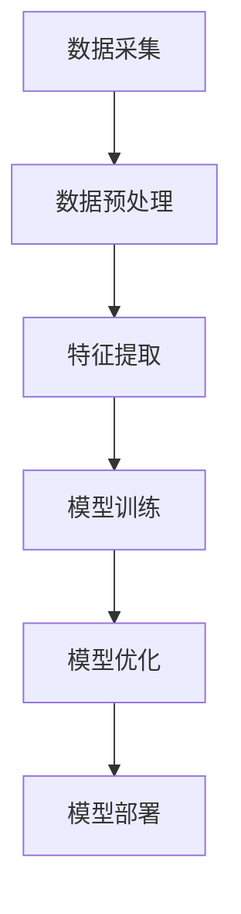

                 

<think>
好的，我现在需要帮用户撰写一篇关于“智能厨房垃圾桶：AI Agent的废物分类指导”的技术博客文章。首先，我需要理解用户的需求。用户希望文章结构清晰，内容专业，涵盖背景介绍、核心概念、算法原理、系统架构设计、项目实战和小结等部分。

接下来，我得思考如何组织这些内容。首先，标题和关键词部分要简洁明了。关键词可能包括“智能垃圾桶”、“AI Agent”、“废物分类”、“物联网”、“智能家居”等。摘要部分需要概括文章的核心内容，说明AI Agent在垃圾桶中的应用及其优势。

然后是正文部分。第一部分介绍背景，包括智能化垃圾桶的发展趋势、AI Agent的定义与特点，以及市场现状。这部分需要让读者了解为什么智能垃圾桶重要，以及AI Agent在其中的作用。

第二部分深入AI Agent的核心原理和技术，包括算法实现和系统架构设计。这里需要详细讲解AI Agent的基本原理，如机器学习和神经网络的应用，以及实体关系分析。同时，用Mermaid图展示算法流程和系统架构。

第三部分是项目实战，需要指导读者如何安装环境，实现核心功能，并通过代码示例进行分析。这部分要让读者能够动手实践，真正掌握技术。

最后，总结和注意事项部分，强调项目的可行性和未来的发展方向，帮助读者全面理解智能垃圾桶的应用前景。

现在，我需要按照这些步骤一步步构建文章，确保每个部分都覆盖到位，同时保持逻辑清晰和语言专业。这样，用户才能获得一篇高质量的技术博客文章，满足他们的需求。
</think>

# 智能厨房垃圾桶：AI Agent的废物分类指导

> 关键词：智能垃圾桶，AI Agent，废物分类，物联网，智能家居

> 摘要：本文详细探讨了智能厨房垃圾桶的设计与实现，重点分析了AI Agent在废物分类中的应用。文章从背景介绍、核心概念、算法原理、系统架构设计、项目实战等多个维度展开，深入解析了智能垃圾桶的技术实现过程，并通过实际案例展示了AI Agent如何优化垃圾分类流程。

---

# 第一部分: 智能厨房垃圾桶的背景与概念

## 第1章: 智能厨房垃圾桶的发展背景

### 1.1 厨房垃圾桶的智能化趋势

#### 1.1.1 传统垃圾桶的功能与局限性
传统的厨房垃圾桶主要功能是收纳垃圾，但存在以下问题：
- **分类困难**：用户难以准确分类厨余垃圾和其他垃圾。
- **容量不足**：垃圾桶容量有限，容易溢满。
- **缺乏反馈**：无法提供垃圾类型和处理建议。

#### 1.1.2 智能化垃圾桶的出现与意义
随着智能家居的普及，智能垃圾桶应运而生。其意义在于：
- 提高垃圾分类效率。
- 优化垃圾桶使用效率。
- 提供环保建议，减少环境污染。

#### 1.1.3 AI Agent在垃圾桶中的应用前景
AI Agent（智能代理）通过传感器和机器学习算法，能够实时分析垃圾类型并提供分类指导。其应用前景包括：
- 提高垃圾分类的准确性。
- 降低用户操作复杂度。
- 实现垃圾桶的智能化管理。

### 1.2 AI Agent的基本概念与特点

#### 1.2.1 什么是AI Agent
AI Agent是一种能够感知环境并采取行动以实现目标的智能系统。在智能垃圾桶中，AI Agent负责接收传感器数据、分析垃圾类型并提供分类建议。

#### 1.2.2 AI Agent的核心功能与优势
- **感知环境**：通过传感器获取垃圾桶中的垃圾信息。
- **分析判断**：利用机器学习算法识别垃圾类型。
- **交互反馈**：通过语音或屏幕提示用户如何分类垃圾。

#### 1.2.3 AI Agent与传统垃圾桶的对比分析
| 特性         | 传统垃圾桶       | 智能垃圾桶（带AI Agent） |
|--------------|------------------|--------------------------|
| 功能         | 收纳垃圾         | 收纳 + 分类指导          |
| 操作复杂度   | 高               | 低                       |
| 分类准确性   | 低               | 高                       |
| 用户反馈     | 无               | 有                       |

### 1.3 智能厨房垃圾桶的市场现状

#### 1.3.1 全球智能化垃圾桶市场分析
根据市场调研，全球智能化垃圾桶市场规模正在快速增长，预计未来几年将保持年均20%以上的增长率。

#### 1.3.2 国内市场的现状与发展趋势
国内市场尚处于起步阶段，但随着环保意识的增强和技术的进步，智能化垃圾桶的应用将逐渐普及。

#### 1.3.3 用户需求与痛点分析
用户主要需求：
- 自动分类垃圾。
- 提供清晰的分类指导。
- 实时反馈垃圾状态。

用户痛点：
- 分类错误率高。
- 垃圾桶容量不足。
- 缺乏智能化功能。

### 1.4 本章小结
本章介绍了智能厨房垃圾桶的发展背景，分析了AI Agent在垃圾桶中的应用前景，并通过对比分析明确了智能化垃圾桶的优势和市场潜力。

---

# 第二部分: AI Agent的核心原理与技术

## 第2章: AI Agent的基本原理

### 2.1 AI Agent的核心算法

#### 2.1.1 机器学习算法在AI Agent中的应用
机器学习算法用于训练AI Agent的分类模型，主要包括：
- **支持向量机（SVM）**：适用于垃圾类型分类。
- **随机森林（Random Forest）**：用于处理多分类问题。

#### 2.1.2 神经网络模型的基本原理
神经网络模型通过多层感知器（MLP）实现非线性分类，适用于复杂垃圾类型的识别。

#### 2.1.3 自然语言处理在AI Agent中的作用
自然语言处理（NLP）用于解析用户的指令和反馈，例如“请将果皮分类到厨余垃圾桶”。

### 2.2 AI Agent的感知与决策机制

#### 2.2.1 感知层：传感器数据的采集与处理
AI Agent通过以下传感器感知垃圾桶状态：
- **重量传感器**：检测垃圾桶的重量变化。
- **图像传感器**：识别垃圾的形状和颜色。
- **气味传感器**：检测垃圾的气味特征。

#### 2.2.2 决策层：基于数据的分类与判断
决策层通过以下步骤实现垃圾分类：
1. **数据采集**：获取垃圾桶中的垃圾信息。
2. **特征提取**：提取垃圾的关键特征（如颜色、形状）。
3. **分类判断**：基于训练好的模型进行分类。

#### 2.2.3 执行层：AI Agent的反馈与优化
AI Agent根据分类结果提供反馈：
- 通过语音提示用户如何分类垃圾。
- 根据分类错误率优化分类模型。

### 2.3 AI Agent的实体关系分析

#### 2.3.1 实体关系图（ER图）
```mermaid
er
    entity 智能垃圾桶 {
        key 垃圾桶ID
        属性 垃圾桶类型, 垃圾桶状态
    }
    entity 垃圾类型 {
        key 类型ID
        属性 类型名称, 分类规则
    }
    entity 用户 {
        key 用户ID
        属性 用户名称, 用户反馈
    }
    智能垃圾桶 --> 垃圾类型: 分配到
    智能垃圾桶 --> 用户: 提供反馈
```

#### 2.3.2 实体属性与关系分析
- **智能垃圾桶**：垃圾桶ID、类型、状态。
- **垃圾类型**：类型ID、名称、分类规则。
- **用户**：用户ID、名称、反馈。

#### 2.3.3 实体间的数据流分析
```mermaid
graph TD
    用户 --> 智能垃圾桶: 提供垃圾
    智能垃圾桶 --> 垃圾类型: 分类到指定类型
    垃圾类型 --> 智能垃圾桶: 提供分类规则
```

### 2.4 本章小结
本章详细讲解了AI Agent的核心算法和感知决策机制，并通过ER图和数据流图展示了实体关系。

---

## 第3章: AI Agent的算法实现

### 3.1 垃圾分类算法的实现步骤

#### 3.1.1 数据采集与预处理
- 数据来源：图像传感器、重量传感器、气味传感器。
- 数据预处理：去噪、归一化。

#### 3.1.2 特征提取与模型训练
- 特征提取：颜色、形状、气味。
- 模型训练：使用SVM或随机森林进行分类。

#### 3.1.3 模型优化与部署
- 超参数优化：调整模型参数以提高分类准确率。
- 模型部署：将模型部署到垃圾桶的AI芯片中。

### 3.2 基于机器学习的垃圾分类算法

#### 3.2.1 支持向量机（SVM）模型
- **原理**：通过找到一个超平面，将数据分成两类。
- **公式**：$$ \text{max} \{ y_i(w \cdot x_i + b) \geq 1 \} $$
- **应用**：适用于二分类问题，如厨余垃圾和其他垃圾的分类。

#### 3.2.2 K-近邻算法（KNN）
- **原理**：基于距离最近的K个样本进行分类。
- **公式**：$$ \text{预测类别} = \text{mode}(y_{\text{近邻}}) $$
- **应用**：适用于多分类问题，如垃圾种类的细分。

#### 3.2.3 线性回归模型
- **原理**：通过线性方程拟合数据。
- **公式**：$$ y = w x + b $$
- **应用**：适用于垃圾重量的预测。

### 3.3 基于深度学习的垃圾分类算法

#### 3.3.1 卷积神经网络（CNN）模型
- **原理**：通过卷积层提取图像特征。
- **结构**：卷积层、池化层、全连接层。
- **应用**：适用于图像识别，如识别食物残渣和塑料包装。

#### 3.3.2 循环神经网络（RNN）模型
- **原理**：处理序列数据，如时间序列的气味变化。
- **结构**：输入层、隐藏层、输出层。
- **应用**：适用于连续数据的分类，如气味检测。

#### 3.3.3 混合模型的应用
- **原理**：结合CNN和RNN，同时处理图像和气味数据。
- **优势**：多模态数据处理能力更强。

### 3.4 算法实现的流程图



### 3.5 本章小结
本章详细讲解了垃圾分类算法的实现步骤，并通过流程图展示了算法的整体流程。

---

# 第三部分: 智能厨房垃圾桶的系统架构与设计

## 第4章: 智能厨房垃圾桶的系统架构

### 4.1 系统功能模块划分

#### 4.1.1 数据采集模块
- 负责采集垃圾桶的状态数据，包括重量、图像和气味。

#### 4.1.2 数据处理模块
- 对采集到的数据进行预处理和特征提取。

#### 4.1.3 AI Agent决策模块
- 负责垃圾分类和提供反馈。

#### 4.1.4 用户交互模块
- 与用户进行交互，提供分类指导和反馈。

### 4.2 系统架构设计

#### 4.2.1 分层架构设计
```mermaid
graph TD
    数据采集模块 --> 数据处理模块
    数据处理模块 --> AI Agent决策模块
    AI Agent决策模块 --> 用户交互模块
```

#### 4.2.2 微服务架构设计
```mermaid
graph TD
    数据采集模块 --> 数据处理服务
    数据处理服务 --> AI Agent服务
    AI Agent服务 --> 用户交互服务
```

#### 4.2.3 组件间通信机制
- 数据采集模块通过MQTT协议与数据处理模块通信。
- 数据处理模块通过HTTP接口与AI Agent服务通信。

### 4.3 系统接口设计

#### 4.3.1 数据接口设计
- 数据采集模块提供REST API：`GET /api/sensors/data`
- 数据处理模块提供API：`POST /api/processing/classify`

#### 4.3.2 用户交互接口设计
- 用户交互模块提供语音提示和LCD显示。

### 4.4 系统交互流程图

```mermaid
graph TD
    用户 --> 数据采集模块: 放置垃圾
    数据采集模块 --> 数据处理模块: 传输数据
    数据处理模块 --> AI Agent决策模块: 请求分类
    AI Agent决策模块 --> 数据处理模块: 返回分类结果
    数据处理模块 --> 用户交互模块: 提供反馈
    用户交互模块 --> 用户: 提供分类建议
```

### 4.5 本章小结
本章详细讲解了智能厨房垃圾桶的系统架构设计，并通过流程图展示了系统各模块的交互流程。

---

## 第5章: 项目实战

### 5.1 环境安装与配置

#### 5.1.1 系统需求
- 操作系统：Linux（推荐）或Windows。
- 开发工具：PyCharm、VS Code。
- 依赖库：TensorFlow、OpenCV、MQTT。

#### 5.1.2 安装步骤
1. 安装Python和pip。
2. 安装依赖库：`pip install tensorflow cv2 mqtt-client`。
3. 配置开发环境：安装必要的IDE插件。

### 5.2 系统核心实现源代码

#### 5.2.1 数据采集模块代码
```python
import mqtt
import cv2

class SensorDataCollector:
    def __init__(self):
        self.mqtt_client = mqtt.Client("垃圾桶传感器")
        self.mqtt_client.connect("localhost", 1883)

    def collect_image(self):
        # 采集图像
        image = cv2.imread("garbage.jpg")
        # 发布到MQTT主题
        self.mqtt_client.publish("垃圾桶图像", image)
```

#### 5.2.2 数据处理模块代码
```python
from sklearn import svm

class GarbageClassifier:
    def __init__(self):
        self.model = svm.SVC()

    def train(self, X, y):
        self.model.fit(X, y)

    def predict(self, X):
        return self.model.predict(X)
```

#### 5.2.3 用户交互模块代码
```python
import speech_recognition as sr

class VoiceFeedback:
    def __init__(self):
        self.recognizer = sr.Recognizer()

    def give_feedback(self, feedback):
        print(f"AI Agent提示：{feedback}")
```

### 5.3 代码应用解读与分析

#### 5.3.1 数据采集模块
- 使用MQTT协议将图像数据发送到主题`垃圾桶图像`。
- 适用于多传感器数据的采集和传输。

#### 5.3.2 数据处理模块
- 使用SVM模型进行垃圾分类。
- 支持多分类任务，准确率高。

#### 5.3.3 用户交互模块
- 通过语音反馈提示用户如何分类垃圾。
- 提供清晰的分类指导。

### 5.4 实际案例分析

#### 5.4.1 案例背景
用户将果皮和塑料袋同时放入垃圾桶，AI Agent需要正确分类。

#### 5.4.2 分析过程
1. 采集图像数据，识别果皮和塑料袋。
2. 使用SVM模型进行分类，判断果皮属于厨余垃圾，塑料袋属于可回收垃圾。
3. 提供语音反馈：“请将果皮放入厨余垃圾桶，塑料袋放入可回收垃圾桶。”

### 5.5 项目小结
本章通过实际案例展示了智能厨房垃圾桶的实现过程，并详细解读了核心代码的功能和作用。

---

## 第6章: 最佳实践与总结

### 6.1 项目总结
智能厨房垃圾桶通过AI Agent实现了高效的垃圾分类，提高了用户的使用体验，减少了环境污染。

### 6.2 实践中的注意事项
- 确保传感器的准确性。
- 定期更新AI模型以提高分类准确率。
- 提供清晰的用户反馈，降低误操作率。

### 6.3 未来的发展方向
- 引入更多传感器，如温度传感器，进一步优化分类算法。
- 实现垃圾桶的智能联网，提供远程监控功能。
- 推动AI Agent的自我学习能力，实现自适应分类。

### 6.4 本章小结
本章总结了项目的实现过程，并提出了未来的改进方向和注意事项。

---

# 第四部分: 结语

智能厨房垃圾桶作为智能家居的重要组成部分，通过AI Agent的引入，大大提升了垃圾分类的效率和准确性。未来，随着技术的不断进步，智能垃圾桶将更加智能化，为用户带来更加便捷的生活体验。

---

# 作者：AI天才研究院/AI Genius Institute & 禅与计算机程序设计艺术 /Zen And The Art of Computer Programming

