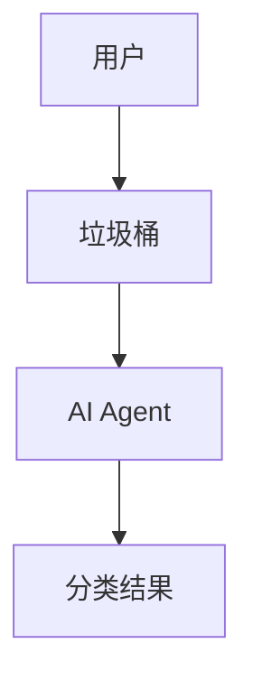
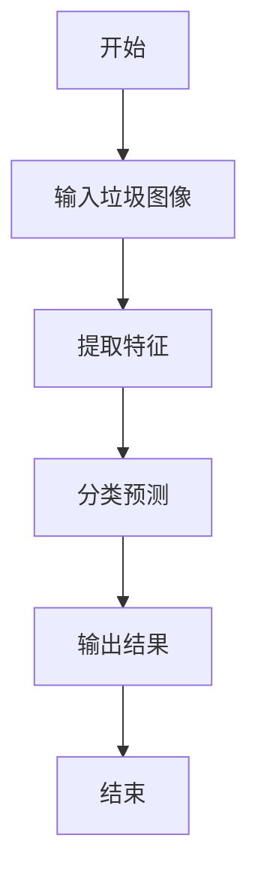
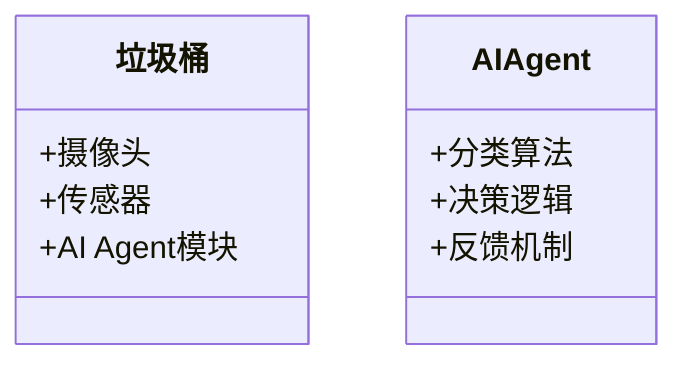
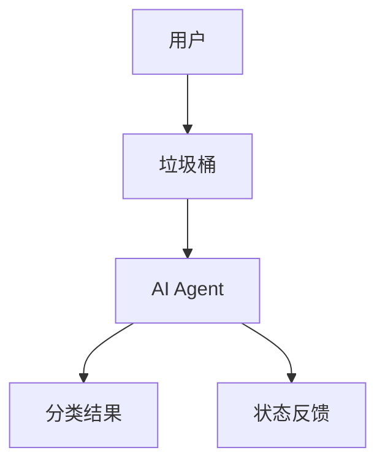
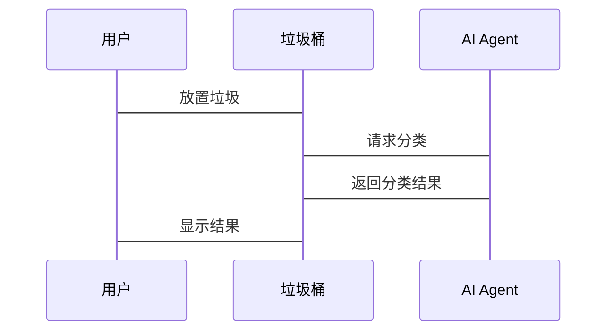

                 


# 智能厨房垃圾桶：AI Agent的废物回收建议

## 关键词：
智能垃圾桶，AI Agent，废物回收，垃圾分类，深度学习

## 摘要：
本文深入探讨了智能厨房垃圾桶的设计与实现，重点介绍了AI Agent在废物回收中的应用。通过背景分析、核心概念解析、算法原理、系统架构设计、项目实战和最佳实践，全面阐述了如何利用AI技术优化厨房垃圾桶的功能，提升废物回收效率和用户体验。

---

# 第一部分: 智能厨房垃圾桶的背景与概念

## 第1章: 智能厨房垃圾桶的背景介绍

### 1.1 问题背景

#### 1.1.1 当前垃圾分类的重要性
随着城市化进程的加快，垃圾产生量急剧增加。垃圾分类成为解决环境污染和资源浪费的关键。厨房垃圾作为主要组成部分，具有多样化和复杂性的特点，传统垃圾桶难以满足智能化需求。

#### 1.1.2 厨房垃圾桶的特殊性
厨房垃圾桶处理的垃圾种类繁多，包括有机物、可回收物、有害物等。这些垃圾的混合处理增加了分类难度，需要智能化解决方案。

#### 1.1.3 AI Agent在废物回收中的作用
AI Agent通过实时感知、分析和决策，能够自动分类垃圾，提升回收效率，减少人工干预，降低管理成本。

### 1.2 问题描述

#### 1.2.1 废物分类的复杂性
不同垃圾的物理特性和化学性质差异大，分类标准多样，增加了分类难度。

#### 1.2.2 用户需求的多样性
用户对垃圾桶的功能需求多样化，包括智能分类、实时反馈、远程控制等。

#### 1.2.3 当前垃圾桶的智能化现状
现有垃圾桶多为被动式，缺乏智能化分类和管理功能，难以满足现代垃圾分类需求。

### 1.3 问题解决

#### 1.3.1 AI Agent如何优化废物回收
AI Agent通过图像识别、语音交互和实时反馈，实现垃圾的智能分类和管理。

#### 1.3.2 智能垃圾桶的设计目标
设计目标包括高精度分类、用户友好的交互界面、实时数据反馈和远程控制。

#### 1.3.3 边界与外延
明确系统的功能边界，如仅处理厨房垃圾，不涉及其他类型垃圾；外延包括与智能家居系统的集成。

### 1.4 概念结构与核心要素

#### 1.4.1 智能垃圾桶的核心要素
包括传感器模块、AI分类模块、存储模块和用户交互模块。

#### 1.4.2 AI Agent的功能模块
包括数据采集、分类算法、决策逻辑和反馈机制。

#### 1.4.3 系统的输入与输出
输入包括垃圾图像、用户指令，输出包括分类结果、错误提示和状态反馈。

---

# 第二部分: AI Agent的核心概念与联系

## 第2章: AI Agent的原理与实现

### 2.1 核心概念原理

#### 2.1.1 AI Agent的基本原理
AI Agent通过感知环境数据，运用机器学习算法进行分类和决策，实现智能化管理。

#### 2.1.2 垃圾分类的算法基础
基于深度学习的图像识别技术，训练模型识别不同垃圾类型。

#### 2.1.3 多模态数据处理
整合图像、声音和传感器数据，提升分类准确率和系统稳定性。

### 2.2 概念属性对比

#### 2.2.1 不同分类方法的对比
- 有监督学习：需要大量标注数据，分类准确率高。
- 无监督学习：适用于无标签数据，分类效果依赖数据分布。

#### 2.2.2 AI Agent与传统垃圾桶的对比
AI Agent能够主动分类和反馈，而传统垃圾桶仅提供存储功能。

#### 2.2.3 有监督与无监督学习的对比
有监督学习需要人工标注数据，分类准确率高；无监督学习无需标注，但分类效果不稳定。

### 2.3 ER实体关系图


---

# 第三部分: 算法原理与数学模型

## 第3章: 分类算法的实现

### 3.1 算法原理

#### 3.1.1 垃圾分类的常见算法
- CNN（卷积神经网络）：用于图像识别。
- RNN（循环神经网络）：用于序列数据处理。
- SVM（支持向量机）：用于分类。

#### 3.1.2 基于深度学习的分类模型
使用预训练的深度学习模型（如ResNet、Inception）进行微调，提升分类精度。

#### 3.1.3 模型训练与优化
通过数据增强、学习率调整和正则化技术优化模型性能。

### 3.2 分类准确率计算

#### 3.2.1 分类准确率的数学公式
$$ \text{准确率} = \frac{\text{正确分类数}}{\text{总分类数}} $$

#### 3.2.2 混淆矩阵分析
使用混淆矩阵分析分类结果，计算精确率、召回率和F1值。

### 3.3 分类算法流程图


### 3.4 Python代码实现

#### 3.4.1 图像预处理
```python
import cv2
import numpy as np

def preprocess_image(image_path):
    img = cv2.imread(image_path)
    img = cv2.resize(img, (224, 224))
    img = img / 255.0
    return img
```

#### 3.4.2 加载预训练模型
```python
import tensorflow as tf
from tensorflow.keras.models import load_model

model = load_model('garbage_classifier.h5')
```

#### 3.4.3 分类预测
```python
def predict_garbage(image):
    prediction = model.predict(np.array([image]))
    class_index = np.argmax(prediction[0])
    return class_index
```

---

## 第4章: 系统分析与架构设计方案

### 4.1 问题场景介绍
厨房垃圾桶需要处理多种垃圾类型，用户需要实时反馈和远程控制功能。

### 4.2 项目介绍
设计一个基于AI Agent的智能垃圾桶，实现垃圾的自动分类、实时反馈和远程管理。

### 4.3 系统功能设计

#### 4.3.1 领域模型类图


#### 4.3.2 系统架构设计


### 4.4 系统接口设计
- 用户接口：垃圾桶上的触摸屏和语音提示。
- 系统接口：垃圾桶与智能家居系统的数据接口。

### 4.5 系统交互设计

#### 4.5.1 用户交互流程


---

## 第5章: 项目实战

### 5.1 环境安装

#### 5.1.1 安装Python和依赖库
```bash
pip install tensorflow numpy cv2 matplotlib
```

#### 5.1.2 安装深度学习框架
```bash
pip install tensorflow-gpu==2.5.0
```

### 5.2 核心代码实现

#### 5.2.1 图像分类代码
```python
import tensorflow as tf
from tensorflow.keras.models import Sequential
from tensorflow.keras.layers import Conv2D, MaxPooling2D, Flatten, Dense

model = Sequential()
model.add(Conv2D(32, (3,3), activation='relu', input_shape=(224,224,3)))
model.add(MaxPooling2D((2,2)))
model.add(Conv2D(64, (3,3), activation='relu'))
model.add(MaxPooling2D((2,2)))
model.add(Flatten())
model.add(Dense(256, activation='relu'))
model.add(Dense(10, activation='softmax'))
model.compile(optimizer='adam', loss='sparse_categorical_crossentropy', metrics=['accuracy'])
```

#### 5.2.2 训练模型
```python
model.fit(x_train, y_train, epochs=10, batch_size=32)
```

#### 5.2.3 保存和加载模型
```python
model.save('garbage_classifier.h5')
model = load_model('garbage_classifier.h5')
```

### 5.3 代码解读与分析
- 模型结构：使用卷积层和池化层提取图像特征，全连接层进行分类。
- 损失函数：使用交叉熵损失函数，优化器选择Adam。
- 评估指标：准确率作为模型性能的评估标准。

### 5.4 实际案例分析
通过实际测试案例，展示模型在不同场景下的分类效果和用户反馈。

### 5.5 项目小结
总结项目实现的关键步骤和成果，分析存在的问题和改进方向。

---

## 第6章: 最佳实践

### 6.1 小结
本文详细介绍了智能厨房垃圾桶的设计与实现，展示了AI Agent在废物回收中的应用价值。

### 6.2 注意事项
- 数据质量对分类准确率的影响。
- 系统安全性和隐私保护。
- 用户界面的易用性和反馈机制。

### 6.3 拓展阅读
建议读者深入学习深度学习和图像处理技术，探索AI在更多领域的应用。

---

# 结语

通过本文的分析和实践，我们可以看到，AI Agent在智能厨房垃圾桶中的应用前景广阔。随着技术的不断进步，未来的垃圾桶将更加智能化和人性化，为用户和环境带来更大的价值。

---

# 作者

作者：AI天才研究院/AI Genius Institute & 禅与计算机程序设计艺术 /Zen And The Art of Computer Programming

---

感谢您的阅读，希望本文对您有所帮助！

