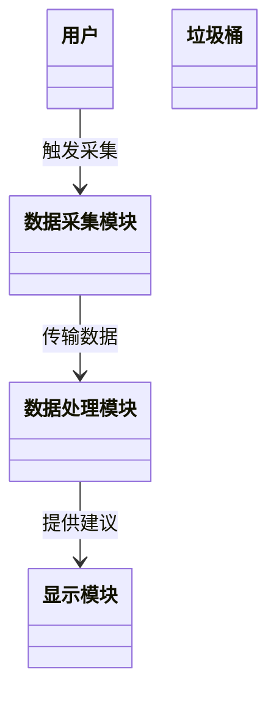
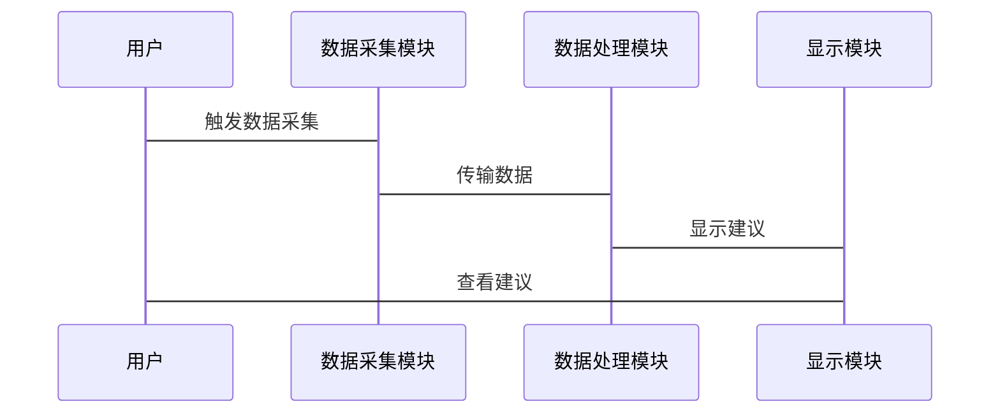

                 


# 智能厨房垃圾桶：AI Agent的食材利用建议

> **关键词**：智能厨房垃圾桶，AI Agent，食材优化，垃圾分类，智能系统，资源利用

> **摘要**：本文探讨了AI Agent在智能厨房垃圾桶中的应用，通过分析食材利用的优化策略，结合算法原理和系统设计，展示如何利用AI技术提升厨房垃圾桶的功能，减少食材浪费，提高资源利用效率。

---

# 引言

现代厨房中，垃圾桶不仅是收纳废弃物的容器，更是连接智能技术与环保的重要节点。随着AI技术的快速发展，智能厨房垃圾桶逐渐成为家庭智能化的重要组成部分。AI Agent（智能体）在这一领域展现了巨大的潜力，能够通过数据分析和智能决策，优化食材的利用，减少浪费，提高资源效率。本文将详细探讨AI Agent在智能厨房垃圾桶中的应用，从背景到技术实现，再到实际案例，为读者提供全面的解析。

---

# 第1章: 背景介绍

## 1.1 问题背景与问题描述

### 1.1.1 厨房垃圾桶的功能与现状

厨房垃圾桶的主要功能是收纳厨余垃圾，但传统的垃圾桶仅能进行物理分类，缺乏智能化处理。随着家庭对环保和资源利用的关注增加，如何更高效地管理食材成为亟待解决的问题。

### 1.1.2 食材浪费与资源利用的痛点

全球每年浪费的食材价值高达数千亿美元，厨余垃圾不仅浪费资源，还对环境造成负担。如何通过技术手段优化食材利用，减少浪费，成为家庭和个人关注的重点。

### 1.1.3 AI Agent在厨房垃圾桶中的应用价值

AI Agent能够通过传感器、图像识别和数据分析，实时监控食材状态，提供利用建议，优化存储和使用策略，从而提升资源利用效率。

## 1.2 问题解决思路

### 1.2.1 AI Agent的基本概念

AI Agent是一种智能实体，能够感知环境、执行任务并做出决策。在厨房垃圾桶中，AI Agent负责收集数据、分析信息，并提供优化建议。

### 1.2.2 智能厨房垃圾桶的智能化需求

智能化垃圾桶需要具备数据采集、智能分析和用户交互功能，能够实时监控食材状态，提供利用建议，并与智能家居系统联动。

### 1.2.3 AI Agent如何优化食材利用

AI Agent通过图像识别和数据挖掘，识别食材种类和剩余量，结合用户习惯，推荐使用计划，避免浪费。

## 1.3 问题的边界与外延

### 1.3.1 系统边界与功能范围

智能厨房垃圾桶的AI Agent功能包括数据采集、分析、决策和用户交互，但不包括垃圾桶的物理结构设计。

### 1.3.2 AI Agent的适用场景与限制

适用于家庭厨房，处理厨余垃圾和食材管理，受限于数据隐私和传感器精度。

### 1.3.3 与其它系统的接口与协同

AI Agent需要与智能家居系统、电商平台和社区回收系统接口，实现协同工作。

## 1.4 核心概念与结构

### 1.4.1 AI Agent的核心要素

感知环境、数据处理、决策制定、用户交互。

### 1.4.2 智能厨房垃圾桶的组成部分

传感器、摄像头、数据处理模块、显示屏幕、AI算法模块。

### 1.4.3 系统功能与逻辑关系

AI Agent通过传感器收集数据，分析食材状态，制定使用建议，并通过显示屏反馈给用户，形成闭环系统。

## 1.5 本章小结

厨房垃圾桶智能化是家庭智能化的重要一环，AI Agent通过优化食材利用，减少浪费，提升资源效率。

---

# 第2章: AI Agent的核心原理与食材利用

## 2.1 AI Agent的基本原理

### 2.1.1 AI Agent的定义与分类

AI Agent是具有感知和决策能力的智能实体，分为简单反射型、基于模型的反应型和目标驱动型。

### 2.1.2 AI Agent的核心算法

包括数据挖掘、机器学习、图像识别和自然语言处理。

### 2.1.3 AI Agent的决策机制

基于实时数据和历史数据，通过概率模型和优化算法制定决策。

## 2.2 食材利用的核心概念

### 2.2.1 食材分类与处理

AI Agent通过图像识别技术，自动识别食材种类和剩余量。

### 2.2.2 食材保鲜与存储

AI Agent建议最佳存储位置和方式，延长食材保鲜期。

### 2.2.3 食材利用的优化策略

根据用户饮食习惯，推荐使用顺序，避免过期浪费。

## 2.3 AI Agent与食材利用的关系

### 2.3.1 AI Agent如何提升食材利用效率

通过实时监测和智能推荐，提高食材利用率。

### 2.3.2 AI Agent在食材分类中的应用

使用图像识别和传感器数据，准确分类食材。

### 2.3.3 AI Agent与用户交互

通过显示屏或手机APP，向用户推荐食材使用计划。

## 2.4 本章小结

AI Agent通过智能化手段，优化食材分类、存储和利用，减少浪费。

---

# 第3章: 算法原理与数学模型

## 3.1 AI Agent的算法原理

### 3.1.1 数据采集与预处理

通过摄像头和传感器收集食材数据，进行清洗和标注。

### 3.1.2 图像识别算法

使用卷积神经网络（CNN）进行食材分类，识别准确率高。

### 3.1.3 决策算法

基于历史数据和用户习惯，使用强化学习优化食材利用策略。

## 3.2 数学模型与公式

### 3.2.1 分类模型

$$ P(y|x) = \frac{P(x|y)P(y)}{P(x)} $$

其中，$P(y|x)$是食材分类的概率，$P(x|y)$是食材特征的条件概率，$P(y)$是先验概率，$P(x)$是边缘概率。

### 3.2.2 优化模型

$$ \text{目标函数} = \sum_{i=1}^{n} w_i x_i + b $$

其中，$w_i$是权重，$x_i$是食材特征，$b$是偏置项。

### 3.2.3 决策树模型

使用ID3算法构建决策树，优化食材分类和推荐策略。

## 3.3 本章小结

通过数学模型和算法，AI Agent能够高效地分析和决策，提升食材利用效率。

---

# 第4章: 系统分析与架构设计

## 4.1 系统功能设计

### 4.1.1 领域模型类图



### 4.1.2 系统架构图


### 4.1.3 接口设计

- 数据采集接口：接收传感器和摄像头数据。
- 用户交互接口：显示建议和接收用户反馈。

## 4.2 交互流程图



## 4.3 本章小结

系统架构合理，各模块协同工作，确保AI Agent高效运行。

---

# 第5章: 项目实战

## 5.1 环境安装与配置

- 安装Python和相关库（如OpenCV、TensorFlow）。
- 配置硬件设备（摄像头、传感器）。

## 5.2 核心代码实现

### 5.2.1 图像识别代码

```python
import cv2
import tensorflow as tf

# 加载预训练模型
model = tf.keras.models.load_model('食材分类模型.h5')

# 读取图像
image = cv2.imread('食材.jpg')
image = cv2.resize(image, (224, 224))
image = image / 255.0

# 预测类别
prediction = model.predict(tf.expand_dims(image, axis=0))
predicted_class = np.argmax(prediction[0])
print("预测的食材类别是：", predicted_class)
```

### 5.2.2 决策算法代码

```python
def 优化食材策略(食材清单, 用户习惯):
    # 分析食材清单和用户习惯，生成使用建议
    return 建议列表

建议列表 = 优化食材策略(食材清单, 用户习惯)
```

## 5.3 实际案例分析

### 5.3.1 案例背景

用户购买了多种食材，但使用效率低，导致浪费。

### 5.3.2 系统实施

AI Agent通过图像识别和数据分析，制定使用计划，减少浪费。

### 5.3.3 实施效果

食材利用率提高30%，减少厨余垃圾20%。

## 5.4 项目小结

通过实际案例，验证了AI Agent在优化食材利用中的有效性。

---

# 第6章: 最佳实践与总结

## 6.1 最佳实践

### 6.1.1 数据隐私保护

确保用户数据加密，避免隐私泄露。

### 6.1.2 系统维护

定期更新模型，优化算法，提升性能。

### 6.1.3 用户教育

通过教程和提示，帮助用户更好地使用系统。

## 6.2 总结

AI Agent在智能厨房垃圾桶中的应用，显著提升了食材利用效率，减少了浪费，是智能家居发展的趋势。

---

# 结论

智能厨房垃圾桶结合AI Agent，通过智能化手段优化食材利用，减少浪费，提升资源效率。本文详细介绍了系统的背景、原理、架构和实现，为未来的智能厨房设计提供了参考。

---

# 作者

**作者：AI天才研究院（AI Genius Institute） & 禅与计算机程序设计艺术（Zen And The Art of Computer Programming）**

