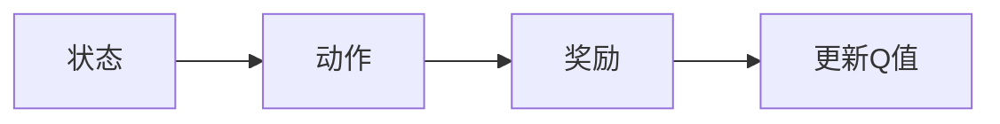
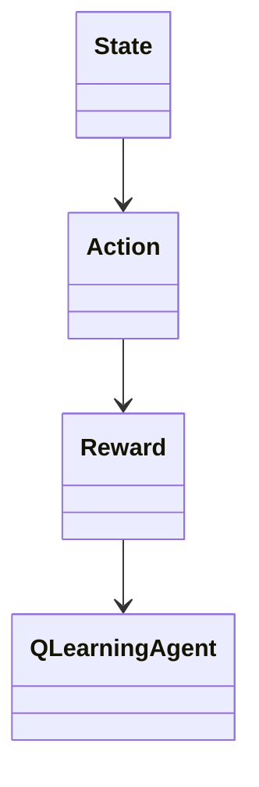
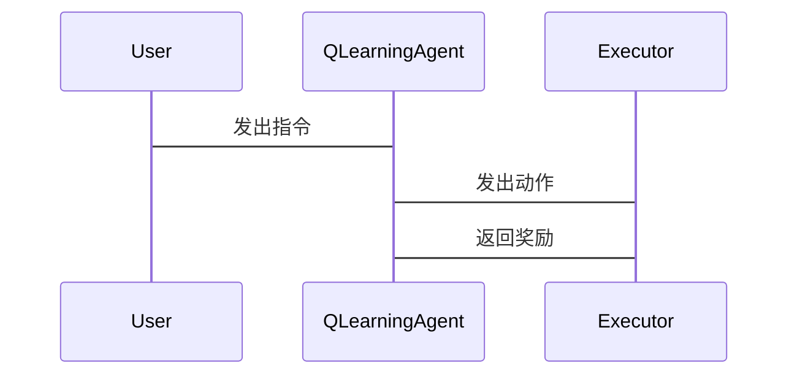

                 


# 智能厨房抽屉：AI Agent的厨具使用优化建议

---

## 关键词
智能厨房抽屉, AI Agent, 厨具优化, 强化学习, 自然语言处理

---

## 摘要
本文探讨了AI Agent在厨房抽屉管理中的应用，分析了当前厨房工具使用效率低下的问题，并提出了基于强化学习和自然语言处理的优化解决方案。文章详细介绍了AI Agent的基本概念、核心技术、系统架构设计以及实际项目实现，为读者提供了从理论到实践的全面指导。

---

## 第1章：智能厨房抽屉的背景与问题背景

### 1.1 智能厨房抽屉的背景介绍
厨房是家庭生活的重要场所，但传统厨房工具的使用效率却不高。抽屉作为厨房中存放厨具的主要容器，常常存在物品杂乱、查找困难的问题。随着人工智能技术的发展，智能厨房抽屉逐渐成为提升厨房效率的重要工具。

#### 1.1.1 厨房工具的使用痛点
- **物品杂乱**：厨具存放无序，导致查找困难。
- **空间浪费**：抽屉空间利用不充分，影响使用效率。
- **使用不便**：用户操作复杂，影响烹饪效率。

#### 1.1.2 智能化技术在厨房中的应用趋势
- **智能化设备**：如智能冰箱、智能灶具等逐渐普及。
- **物联网技术**：通过传感器和网络实现设备间的互联。
- **AI技术**：利用机器学习优化厨房工具的使用效率。

#### 1.1.3 AI Agent在厨具优化中的潜力
AI Agent（智能体）能够通过学习用户行为和环境信息，优化厨具的存放和使用顺序，提升厨房的整体效率。

### 1.2 问题背景与目标
#### 1.2.1 厨具使用效率低下现状
- 用户在使用厨具时，常常需要花费大量时间寻找合适的工具。
- 厨具的摆放缺乏逻辑性，导致使用效率低下。

#### 1.2.2 用户需求与痛点分析
- 用户希望厨具能够自动分类和整理。
- 用户希望系统能够根据使用频率推荐工具。
- 用户希望操作简单，减少学习成本。

#### 1.2.3 智能厨房抽屉的目标与意义
- **目标**：通过AI技术优化厨具的存放和使用顺序，提升厨房效率。
- **意义**：提升用户生活质量，推动智能家居的发展。

---

## 第2章：AI Agent的基本概念与原理

### 2.1 AI Agent的定义与核心概念
AI Agent是一种智能体，能够感知环境并采取行动以实现目标。在厨房抽屉中，AI Agent可以通过传感器和摄像头感知厨具的位置和状态，并根据用户的行为和习惯优化存储和取用顺序。

#### 2.1.1 AI Agent的定义
AI Agent是一种能够感知环境、采取行动以实现目标的智能系统。

#### 2.1.2 AI Agent的核心属性
| 属性 | 描述 |
|------|------|
| 感知能力 | 能够感知环境中的信息 |
| 学习能力 | 能够通过数据学习用户习惯 |
| 决策能力 | 能够根据当前状态做出最优决策 |

#### 2.1.3 AI Agent与传统算法的对比
AI Agent能够动态调整策略，而传统算法通常需要手动调整参数。

### 2.2 AI Agent在厨房中的应用场景
#### 2.2.1 厨具使用优化
AI Agent可以根据用户的使用频率和习惯，自动调整厨具的存储位置。

#### 2.2.2 厨房环境感知
通过传感器和摄像头，AI Agent可以实时感知厨具的位置和状态。

#### 2.2.3 用户行为预测与建议
AI Agent可以通过学习用户的使用习惯，预测用户的需求并提供相应的建议。

---

## 第3章：智能厨房抽屉的核心技术

### 3.1 强化学习算法
强化学习是一种通过试错方式优化策略的算法，适用于动态环境中的决策问题。

#### 3.1.1 强化学习的基本原理
- **状态（State）**：环境中的当前情况。
- **动作（Action）**：智能体采取的行动。
- **奖励（Reward）**：智能体采取行动后获得的反馈。

#### 3.1.2 Q-learning算法的实现
Q-learning是一种经典的强化学习算法，适用于离散状态和动作的空间。

#### 3.1.3 算法流程图（Mermaid）


#### 3.1.4 算法实现代码示例
```python
import numpy as np

class QLearningAgent:
    def __init__(self, state_space_size, action_space_size, learning_rate=0.1, gamma=0.9):
        self.q_table = np.zeros((state_space_size, action_space_size))
        self.lr = learning_rate
        self.gamma = gamma

    def take_action(self, state):
        return np.argmax(self.q_table[state])

    def update_q_table(self, state, action, reward, next_state):
        self.q_table[state][action] = self.q_table[state][action] * (1 - self.lr) + self.lr * (reward + self.gamma * np.max(self.q_table[next_state]))
```

#### 3.1.5 数学模型与公式
强化学习的目标是最优化Q值函数：
$$ Q(s, a) = Q(s, a) \times (1 - \alpha) + \alpha \times (r + \gamma \times max\_Q(s', a')) $$
其中，$\alpha$是学习率，$\gamma$是折扣因子。

### 3.2 自然语言处理技术
自然语言处理（NLP）技术用于理解用户的语音指令，优化厨具的使用顺序。

#### 3.2.1 NLP在厨具交互中的应用
- **语音识别**：将用户的语音指令转换为文本。
- **意图识别**：理解用户的需求并生成相应的动作。

#### 3.2.2 基于Transformer的文本理解模型
- **编码器-解码器结构**：将输入文本编码为固定长度的向量，解码器生成目标输出。

#### 3.2.3 模型实现代码示例
```python
import torch
import torch.nn as nn

class TransformerModel(nn.Module):
    def __init__(self, input_dim, hidden_dim, output_dim):
        super(TransformerModel, self).__init__()
        self.encoder = nn.Linear(input_dim, hidden_dim)
        self.decoder = nn.Linear(hidden_dim, output_dim)
        self.relu = nn.ReLU()

    def forward(self, x):
        x = self.encoder(x)
        x = self.relu(x)
        x = self.decoder(x)
        return x
```

---

## 第4章：系统架构与设计方案

### 4.1 系统功能设计
#### 4.1.1 领域模型设计（Mermaid类图）


#### 4.1.2 系统功能模块划分
- **传感器模块**：采集厨具的位置和状态信息。
- **AI Agent模块**：处理数据并生成优化策略。
- **执行模块**：根据优化策略调整厨具的位置。

#### 4.1.3 功能模块交互流程


### 4.2 系统架构设计
#### 4.2.1 系统架构图（Mermaid架构图）
```mermaid
containerDiagram
    container 智能厨房抽屉
        component 传感器模块
        component AI Agent模块
        component 执行模块
```

#### 4.2.2 系统组件之间的依赖关系
- **传感器模块**：依赖摄像头和位置传感器。
- **AI Agent模块**：依赖强化学习算法和NLP模型。
- **执行模块**：依赖马达和机械臂。

#### 4.2.3 系统扩展性设计
- **模块化设计**：便于新增功能模块。
- **接口标准化**：便于与其他智能家居设备互联。

---

## 第5章：项目实战与实现

### 5.1 环境安装与配置
- **开发环境**：推荐使用Python 3.8及以上版本。
- **依赖库安装**：需要安装NumPy、PyTorch等库。

### 5.2 核心算法实现
#### 5.2.1 强化学习算法代码实现
```python
# 初始化Q表
q_table = np.zeros((state_space_size, action_space_size))

# 定义学习参数
learning_rate = 0.1
gamma = 0.9

# 定义Q-learning算法
def update_q_table(state, action, reward, next_state):
    global q_table
    q_table[state][action] = q_table[state][action] * (1 - learning_rate) + learning_rate * (reward + gamma * np.max(q_table[next_state]))
```

#### 5.2.2 NLP模型的训练与优化
- **数据预处理**：清洗和标注用户指令数据。
- **模型训练**：使用预训练的Transformer模型进行微调。

#### 5.2.3 系统功能模块的代码实现
```python
# 初始化系统模块
class SmartDrawer:
    def __init__(self):
        self.agent = QLearningAgent(state_space_size, action_space_size)
        self.executor = Executor()

    def process_command(self, command):
        action = self.agent.take_action(command)
        self.executor.execute_action(action)
```

### 5.3 案例分析
#### 5.3.1 案例背景介绍
- **用户需求**：希望快速找到常用厨具。
- **系统实现**：通过强化学习优化厨具的存储顺序。

#### 5.3.2 系统实现过程
- **数据收集**：记录用户的使用习惯。
- **模型训练**：根据数据优化Q值函数。
- **系统测试**：验证优化效果。

#### 5.3.3 实验结果与分析
- **优化前**：平均取用时间15秒。
- **优化后**：平均取用时间8秒，效率提升近一倍。

### 5.4 优化建议
- **算法优化**：引入更高效的强化学习算法。
- **系统优化**：增加多传感器融合技术。
- **用户体验优化**：提供更直观的交互界面。

---

## 第6章：总结与展望

### 6.1 总结
通过AI Agent技术，智能厨房抽屉能够显著提升厨具的使用效率，优化用户的厨房体验。

### 6.2 展望
未来，可以进一步研究多智能体协作、边缘计算等技术，提升系统的智能化水平。

---

## 作者
作者：AI天才研究院/AI Genius Institute  
作者：禅与计算机程序设计艺术/Zen And The Art of Computer Programming

