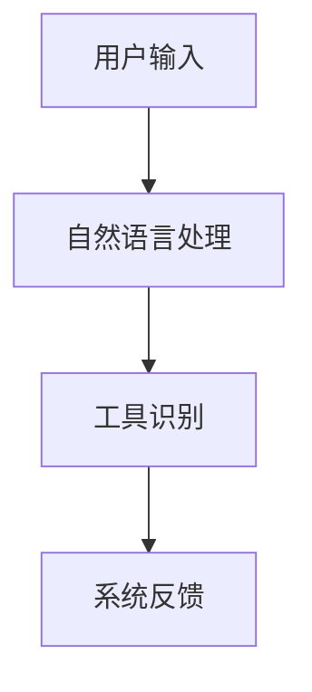
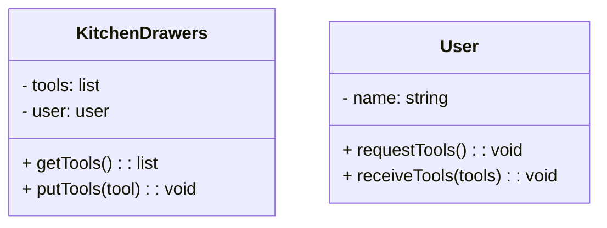
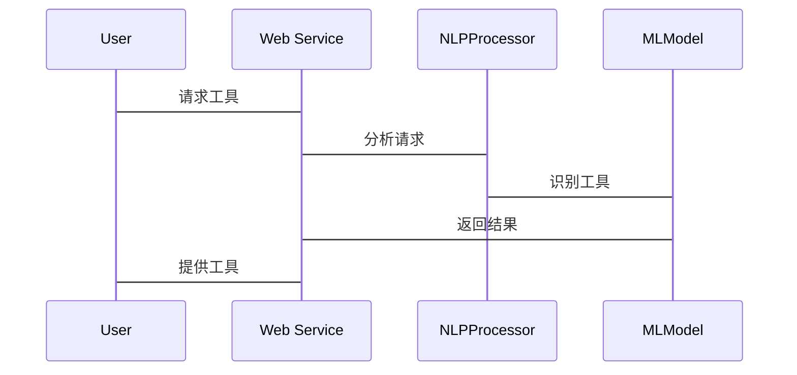

                 

<think>
好，我需要为《智能厨房抽屉：AI Agent的烹饪工具使用建议》这本书设计一个详细的目录大纲。这本书主要讨论如何利用AI Agent来优化厨房抽屉中的烹饪工具管理。以下是我的思考过程：

首先，我需要理解这本书的主题。它结合了智能家居和人工智能技术，帮助用户更高效地管理厨房工具。接下来，我按照用户的要求，将目录分为几个主要部分：背景介绍、核心概念、算法原理、系统架构、项目实战和最佳实践。

1. **背景介绍**：这部分需要说明为什么需要智能厨房抽屉，当前厨房管理中存在的问题，以及AI Agent如何解决这些问题。我需要包括问题背景、问题描述、解决方案、边界和外延，以及核心概念和核心要素。

2. **核心概念与联系**：在这里，我需要详细解释AI Agent的基本原理，比较其与传统软件的不同，以及如何应用于厨房工具管理。我还需要使用Mermaid图来展示实体关系，帮助读者更好地理解系统结构。

3. **算法原理讲解**：这部分要深入探讨AI Agent所使用的算法，如自然语言处理和机器学习模型。我需要使用Mermaid流程图和Python代码示例，展示算法的工作流程。同时，数学公式需要用LaTeX表示，确保专业性。

4. **系统分析与架构设计**：我需要描述系统的设计架构，包括问题场景、系统功能、领域模型类图、架构图、接口设计和交互序列图。这部分帮助读者理解系统的整体结构和各模块之间的关系。

5. **项目实战**：提供实际的项目实施步骤，包括环境安装、核心功能实现、代码解读和案例分析。这部分需要具体的代码示例和详细的分析，帮助读者动手实践。

6. **最佳实践与总结**：总结书中的主要内容，提供使用建议和注意事项，同时推荐进一步阅读的资料，帮助读者巩固所学知识，并指导进一步的学习和实践。

在编写过程中，我需要确保每一章都详细且逻辑清晰，涵盖所有要求的部分，并且使用专业的技术语言，同时保持内容易懂。可能遇到的困难是如何将AI算法与厨房工具管理实际结合，这需要找到合适的例子和应用场景。此外，系统架构设计部分需要清晰展示各模块的交互，可能需要多次调整和优化。

总体来说，我需要按照用户的要求，一步步构建目录，确保每个部分都详细且结构合理，最终形成一个完整的、结构合理的目录大纲。
</think>

# 《智能厨房抽屉：AI Agent的烹饪工具使用建议》

## 关键词：
智能厨房抽屉, AI Agent, 烹饪工具, 智能家居, 人工智能, 自然语言处理, 机器学习

## 摘要：
本文探讨了AI Agent在智能厨房抽屉中的应用，通过分析厨房工具管理的问题，提出利用AI技术优化工具管理的解决方案。文章详细介绍了AI Agent的基本原理，算法实现，系统架构设计，并通过实际案例展示其在厨房管理中的应用，最后提供使用建议和注意事项。

---

## 第一部分：智能厨房抽屉的背景与需求

### 第1章：问题背景与需求分析

#### 1.1 问题背景
- 1.1.1 厨房空间利用效率低下
- 1.1.2 烹饪工具管理的复杂性
- 1.1.3 用户对智能厨房工具的需求

#### 1.2 问题描述
- 1.2.1 烹饪工具存放混乱
- 1.2.2 工具查找困难
- 1.2.3 工具使用效率低

#### 1.3 问题解决
- 1.3.1 引入AI Agent的概念
- 1.3.2 AI Agent如何优化工具管理
- 1.3.3 提升用户使用体验

#### 1.4 边界与外延
- 1.4.1 系统边界
- 1.4.2 外延功能
- 1.4.3 与其他智能家居的协同

#### 1.5 概念结构与核心要素
- 1.5.1 核心概念组成
- 1.5.2 概念之间的关系
- 1.5.3 核心要素的详细描述

---

## 第二部分：AI Agent的核心概念与联系

### 第2章：AI Agent的基本原理

#### 2.1 核心概念原理
- 2.1.1 AI Agent的定义
- 2.1.2 AI Agent的核心功能
- 2.1.3 AI Agent与传统软件的区别

#### 2.2 概念属性特征对比表
| 属性 | 传统软件 | AI Agent |
|------|----------|----------|
| 学习能力 | 无 | 有 |
| 自适应性 | 无 | 有 |
| 主动性 | 无 | 有 |

#### 2.3 ER实体关系图
```mermaid
erDiagram
    kitchen_drawers : 实体
    tools : 实体
    user : 实体
    kitchen_drawers --|> tools : 包含
    user --|> kitchen_drawers : 管理
```

---

## 第三部分：AI Agent的算法原理

### 第3章：算法原理讲解

#### 3.1 自然语言处理流程


#### 3.2 机器学习模型实现
```python
import numpy as np
from sklearn.feature_extraction.text import TfidfVectorizer
from sklearn.svm import SVC

# 示例数据
corpus = ["刀具", "砧板", "锅"]
labels = [0, 1, 2]

# 特征提取
vectorizer = TfidfVectorizer()
X = vectorizer.fit_transform(corpus)

# 模型训练
model = SVC()
model.fit(X, labels)

# 预测
new_query = ["刀"]
X_new = vectorizer.transform(new_query)
print(model.predict(X_new))
```

#### 3.3 数学模型与公式
- 3.3.1 TF-IDF计算公式：
$$ \text{TF-IDF}(t, d) = \text{TF}(t, d) \times \text{IDF}(t, d) $$
- 3.3.2 支持向量机分类公式：
$$ \text{max}(\text{arg} \, \text{min} \, \gamma > 0, C > 0) $$

---

## 第四部分：系统分析与架构设计方案

### 第4章：系统架构设计

#### 4.1 问题场景介绍
- 4.1.1 用户需求
- 4.1.2 功能需求
- 4.1.3 性能需求

#### 4.2 系统功能设计
- 4.2.1 自然语言处理模块
- 4.2.2 工具识别模块
- 4.2.3 用户交互模块

#### 4.3 领域模型类图


#### 4.4 系统架构图
```mermaid
containerDiagram
    container Web Service {
        service KitchenDrawerService
        service NLPProcessor
        service MLModel
    }
    participant User
    participant Web Service
```

#### 4.5 接口设计与交互
- 4.5.1 API接口定义
- 4.5.2 交互序列图


---

## 第五部分：项目实战

### 第5章：环境安装与系统实现

#### 5.1 环境安装
- Python 3.8+
- Jupyter Notebook
- pip install numpy sklearn

#### 5.2 核心功能实现
- 自然语言处理实现
- 工具识别模块
- 用户交互界面

#### 5.3 代码解读与分析
```python
# 环境安装示例
import numpy as np
from sklearn.feature_extraction.text import TfidfVectorizer
from sklearn.svm import SVC

# 数据准备
corpus = ["刀具", "砧板", "锅"]
labels = [0, 1, 2]

# 特征提取
vectorizer = TfidfVectorizer()
X = vectorizer.fit_transform(corpus)

# 模型训练
model = SVC()
model.fit(X, labels)

# 预测
new_query = ["刀"]
X_new = vectorizer.transform(new_query)
print(model.predict(X_new))  # 输出结果
```

#### 5.4 实际案例分析
- 使用场景
- 代码实现
- 结果分析

#### 5.5 项目小结
- 项目总结
- 成功经验
- 改进建议

---

## 第六部分：最佳实践与总结

### 第6章：最佳实践与使用建议

#### 6.1 小结
- 本章总结
- 关键点回顾

#### 6.2 使用建议
- 系统维护
- 功能扩展
- 用户培训

#### 6.3 注意事项
- 系统兼容性
- 数据安全
- 隐私保护

#### 6.4 拓展阅读
- 推荐书籍
- 在线资源
- 技术博客

---

## 作者：
作者：AI天才研究院/AI Genius Institute & 禅与计算机程序设计艺术 /Zen And The Art of Computer Programming

