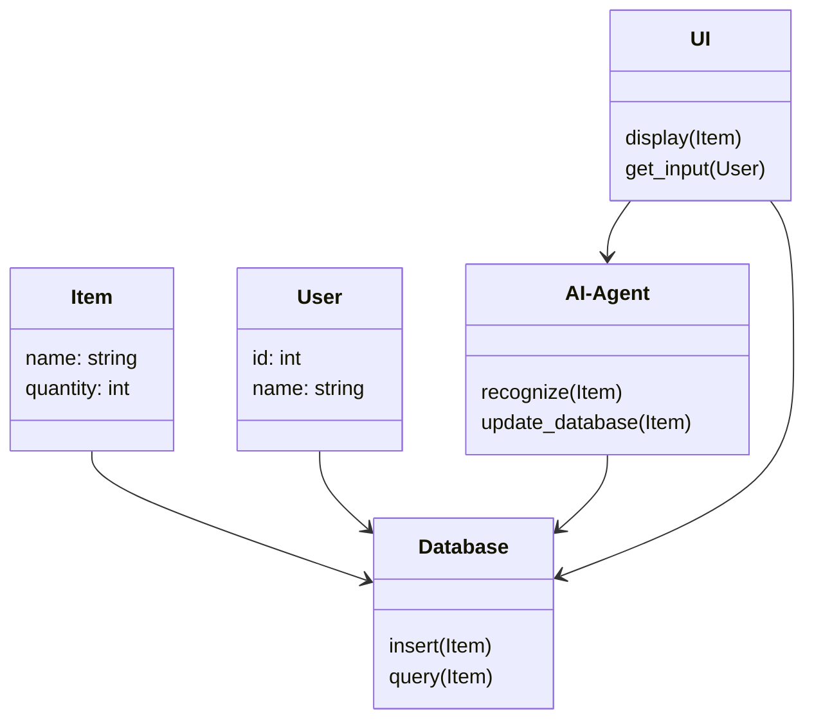
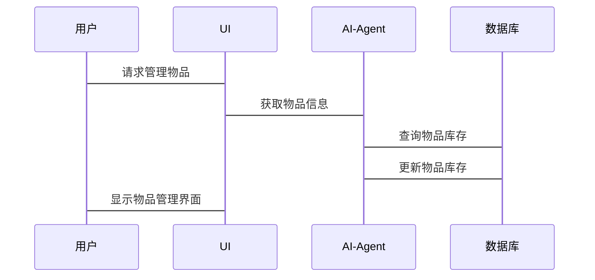

                 

<think>
好的，我现在需要按照用户的要求，逐步构建一篇关于《智能厨房抽屉：AI Agent的物品管理系统》的技术博客文章。用户已经提供了一个详细的目录大纲，我需要根据这个大纲，逐步完成每个部分的内容。

首先，我会从“背景介绍”开始，解释为什么需要智能厨房抽屉以及AI代理在其中的作用。接着，我会详细讲解AI Agent的核心原理，包括其定义、分类和工作原理。然后，我会讨论物品管理系统的核心要素，如功能模块、数据模型和系统功能的对比分析。

接下来，我需要设计一个AI代理的算法，使用mermaid流程图和Python代码来展示其实现。同时，我会提供数学模型和公式，确保技术细节准确无误。之后，我会分析系统架构，包括问题场景介绍、系统功能设计（领域模型类图）、系统架构图、接口设计和交互流程图。

在项目实战部分，我会指导读者如何安装环境，并提供核心代码的实现，解读代码的功能，并通过实际案例分析，展示系统的实际应用。最后，我会总结全文，提出最佳实践建议，注意事项，并推荐拓展阅读的内容。

整个过程中，我需要确保每个部分都详细具体，逻辑清晰，语言专业且易于理解。此外，数学公式要用latex格式，算法流程图用mermaid，系统架构图也用相应的图表工具来展示。

通过这样的逐步分析和构建，我将完成一篇符合用户要求的高质量技术博客文章，帮助读者深入了解智能厨房抽屉背后的AI Agent物品管理系统。
</think>

# 智能厨房抽屉：AI Agent的物品管理系统

## 关键词：
智能厨房抽屉, AI Agent, 物品管理, 系统架构, 算法原理, 项目实战

## 摘要：
本文详细探讨了智能厨房抽屉中的AI Agent物品管理系统，从背景介绍、核心概念、算法原理到系统架构和项目实战，全面解析了该系统的实现过程。通过分析AI Agent的工作原理，物品管理系统的数据模型设计，以及系统架构的实现，展示了如何利用AI技术提升厨房物品管理的智能化水平。文章最后通过实际案例分析，总结了系统的优势和应用前景。

---

# 第一部分: 智能厨房抽屉的背景与需求

## 第1章: 智能厨房抽屉的背景介绍

### 1.1 问题背景
#### 1.1.1 厨房物品管理的痛点
在现代家庭中，厨房物品的管理常常面临以下痛点：
- 物品数量多，种类繁杂，难以高效管理。
- 手动记录物品使用情况，容易出错且效率低下。
- 缺乏智能化手段，无法实时追踪物品的状态。

#### 1.1.2 智能化管理的需求
随着智能家居的普及，用户对厨房物品管理的智能化需求日益增长：
- 自动识别物品，实时更新库存。
- 智能推荐使用物品，减少浪费。
- 提供使用记录，便于用户回顾和管理。

#### 1.1.3 AI Agent在厨房管理中的作用
AI Agent（智能代理）通过自动化处理和学习能力，能够有效解决厨房物品管理中的痛点：
- 自动识别和分类物品。
- 实时更新库存，提供使用建议。
- 学习用户的使用习惯，优化管理策略。

### 1.2 问题描述
#### 1.2.1 厨房物品管理的复杂性
厨房中常见的物品种类繁多，包括食材、厨具、清洁用品等，管理起来较为复杂。

#### 1.2.2 用户需求的多样性
不同用户对厨房物品管理的需求各异，有的注重效率，有的关注健康饮食。

#### 1.2.3 系统功能的必要性
为了满足用户需求，系统需要具备以下功能：
- 自动识别物品。
- 实时更新库存。
- 提供使用建议。

### 1.3 问题解决
#### 1.3.1 AI Agent的核心作用
AI Agent通过感知、决策和执行，实现对厨房物品的智能化管理。

#### 1.3.2 物品管理的智能化实现
结合AI技术和物联网设备，实现物品的自动识别和管理。

#### 1.3.3 系统设计的目标与实现路径
系统设计的目标是实现高效、智能的物品管理，路径包括需求分析、系统设计、算法实现和系统测试。

### 1.4 边界与外延
#### 1.4.1 系统功能的边界
系统仅负责厨房物品的管理，不涉及其他家庭区域。

#### 1.4.2 系统与外部环境的交互
通过物联网设备与用户进行交互，如智能音箱、手机APP等。

#### 1.4.3 系统功能的扩展性
未来可以扩展到家庭其他区域的物品管理。

### 1.5 概念结构与核心要素
#### 1.5.1 系统核心概念的结构化分析
系统由AI Agent、物联网设备、数据库和用户界面四部分组成。

#### 1.5.2 核心要素的对比分析
通过对比分析，确定系统的核心要素和次要功能。

#### 1.5.3 系统功能的模块化分解
将系统功能分解为物品识别、库存管理、使用建议三个模块。

---

# 第二部分: AI Agent与物品管理的核心概念

## 第2章: AI Agent的核心原理

### 2.1 AI Agent的基本概念
#### 2.1.1 AI Agent的定义
AI Agent是一种能够感知环境并采取行动以实现目标的智能实体。

#### 2.1.2 AI Agent的分类
AI Agent可以分为简单反射型、基于模型的反应型、目标驱动型和效用驱动型。

#### 2.1.3 AI Agent的核心特征
- 感知能力：通过传感器或摄像头感知环境。
- 决策能力：基于感知信息做出决策。
- 执行能力：通过执行机构完成任务。

### 2.2 AI Agent的工作原理
#### 2.2.1 信息感知与处理
AI Agent通过摄像头和传感器获取物品信息，并通过图像识别技术进行分类。

#### 2.2.2 行为决策机制
基于物品信息和用户需求，AI Agent决定是否采取行动，如记录使用情况或提醒补充物品。

#### 2.2.3 系统交互流程
AI Agent通过物联网设备与用户交互，如智能音箱或手机APP。

### 2.3 AI Agent与物品管理的结合
#### 2.3.1 物品管理的核心需求
- 实时库存管理。
- 自动识别和分类。
- 智能推荐使用物品。

#### 2.3.2 AI Agent在物品管理中的应用场景
- 自动识别新放入的物品，更新库存。
- 根据使用频率推荐使用物品。
- 提醒用户补充即将用尽的物品。

#### 2.3.3 系统功能的实现逻辑
AI Agent通过感知环境、处理信息、做出决策，实现对厨房物品的智能化管理。

---

## 第3章: 物品管理系统的核心要素

### 3.1 系统功能模块
#### 3.1.1 物品识别与分类
AI Agent通过图像识别技术，自动识别物品并进行分类。

#### 3.1.2 存储与检索
系统将物品信息存储在数据库中，支持快速检索和更新。

#### 3.1.3 使用记录与分析
系统记录用户使用物品的情况，并进行数据分析，提供使用建议。

### 3.2 系统数据模型
#### 3.2.1 数据结构设计
数据库设计包括物品表、用户表和使用记录表。

#### 3.2.2 数据关系图
物品表与使用记录表之间是一对多的关系。

#### 3.2.3 数据存储方案
采用关系型数据库，支持事务处理和数据一致性。

### 3.3 系统功能的对比分析
#### 3.3.1 不同管理方式的对比
传统手动管理与AI Agent智能化管理的对比，突出智能化的优势。

#### 3.3.2 系统功能的优劣势分析
智能化管理的优势包括高效、准确，劣势包括初期成本高和需要依赖智能设备。

#### 3.3.3 系统功能的模块化分解
将系统功能分解为物品识别、库存管理、使用建议三个模块。

---

# 第三部分: 算法原理讲解

## 第4章: AI Agent的算法实现

### 4.1 算法原理
#### 4.1.1 算法的整体流程
AI Agent通过感知环境、处理信息、做出决策并执行行动。

#### 4.1.2 算法的详细步骤
1. 感知环境：通过摄像头获取物品图像。
2. 图像识别：使用深度学习模型识别物品。
3. 数据存储：将物品信息存储到数据库。
4. 使用记录：记录用户使用物品的情况。
5. 使用建议：基于使用记录推荐使用物品。

#### 4.1.3 算法的数学模型和公式
- 图像识别使用卷积神经网络（CNN）模型。
- 使用记录分析使用关联规则挖掘算法。

### 4.2 算法实现代码
#### 4.2.1 环境安装
需要安装Python、TensorFlow、OpenCV和数据库（如MySQL）。

#### 4.2.2 核心代码实现
```python
import tensorflow as tf
import cv2
import pymysql

# 图像识别部分
def recognize_item(image):
    model = tf.keras.models.load_model('item_model.h5')
    prediction = model.predict(image)
    return prediction

# 数据库部分
def update_database(item):
    db = pymysql.connect(host='localhost', user='root', password='password', database='kitchen')
    cursor = db.cursor()
    cursor.execute('INSERT INTO items (name, quantity) VALUES (%s, %s)', (item['name'], item['quantity']))
    db.commit()
    db.close()
```

#### 4.2.3 代码解读与分析
- 图像识别部分使用预训练的CNN模型进行分类。
- 数据库部分通过 pymysql 插入数据，记录物品的名称和数量。

### 4.3 算法的数学模型和公式
#### 4.3.1 图像识别的数学模型
使用卷积神经网络进行图像分类，模型结构如下：
$$
\text{CNN} = \text{Conv2D} \rightarrow \text{MaxPooling} \rightarrow \text{Flatten} \rightarrow \text{Dense}
$$

#### 4.3.2 使用记录分析的数学模型
使用关联规则挖掘算法，计算物品之间的关联度：
$$
\text{关联度} = \text{支持度} \times \text{置信度}
$$

---

# 第四部分: 系统分析与架构设计方案

## 第5章: 系统架构设计

### 5.1 问题场景介绍
厨房中需要对物品进行智能化管理，用户希望系统能够自动识别物品、记录使用情况并提供使用建议。

### 5.2 项目介绍
项目名称：智能厨房抽屉物品管理系统
目标：实现厨房物品的智能化管理，提升用户体验。

### 5.3 系统功能设计
#### 5.3.1 领域模型设计
使用mermaid类图展示系统中的类及其关系。



#### 5.3.2 系统架构设计
使用mermaid架构图展示系统的整体架构。


#### 5.3.3 系统接口设计
- AI Agent与物联网设备之间的接口：RESTful API。
- 用户界面与数据库之间的接口：数据库查询和插入接口。

#### 5.3.4 系统交互流程图
使用mermaid序列图展示系统交互流程。



---

# 第五部分: 项目实战

## 第6章: 项目实现

### 6.1 环境安装
安装所需的软件和库：
- Python 3.8+
- TensorFlow 2.5+
- OpenCV 4.5+
- pymysql 1.0+

### 6.2 系统核心实现
#### 6.2.1 核心代码实现
```python
# AI Agent实现
import cv2
import pymysql
import tensorflow as tf

def recognize_item(image_path):
    # 加载模型
    model = tf.keras.models.load_model('item_model.h5')
    # 加载图像
    image = cv2.imread(image_path)
    image = cv2.resize(image, (224, 224))
    image = image / 255.0
    # 预测
    prediction = model.predict(tf.expand_dims(image, axis=0))
    return prediction

def update_database(item_info):
    db = pymysql.connect(host='localhost', user='root', password='password', database='kitchen')
    cursor = db.cursor()
    cursor.execute('INSERT INTO items (name, quantity) VALUES (%s, %s)', (item_info['name'], item_info['quantity']))
    db.commit()
    db.close()
```

#### 6.2.2 代码解读与分析
- `recognize_item`函数：使用预训练的模型识别物品。
- `update_database`函数：将物品信息存储到数据库中。

### 6.3 实际案例分析
#### 6.3.1 实际案例1
用户放入牛奶，系统识别并更新库存。

#### 6.3.2 实际案例2
用户使用完鸡蛋，系统记录使用情况并提醒补充。

#### 6.3.3 实际案例3
系统分析用户的使用习惯，推荐使用频率高的物品。

### 6.4 项目小结
通过实际案例分析，验证了系统的功能和性能，展示了AI Agent在厨房物品管理中的优势。

---

# 第六部分: 总结与展望

## 第7章: 总结与展望

### 7.1 总结
本文详细介绍了智能厨房抽屉中的AI Agent物品管理系统，从背景介绍、核心概念、算法原理到系统架构和项目实战，全面解析了该系统的实现过程。通过AI Agent的技术实现，系统能够高效地管理厨房物品，提升用户体验。

### 7.2 最佳实践 tips
- 确保系统与物联网设备的兼容性。
- 定期更新AI模型，提升识别准确率。
- 提供良好的用户界面，方便用户操作。

### 7.3 注意事项
- 数据安全：保护用户隐私和数据安全。
- 系统稳定性：确保系统在长时间运行中的稳定性。
- 设备兼容性：支持多种物联网设备，提升用户体验。

### 7.4 拓展阅读
- 推荐阅读《深度学习实战》和《智能系统设计》等书籍，进一步了解AI技术的应用。

---

# 作者：AI天才研究院/AI Genius Institute & 禅与计算机程序设计艺术 /Zen And The Art of Computer Programming

---

本文通过详细的技术分析和实际案例，展示了AI Agent在厨房物品管理中的应用，为未来的智能家居系统提供了有益的参考和借鉴。

