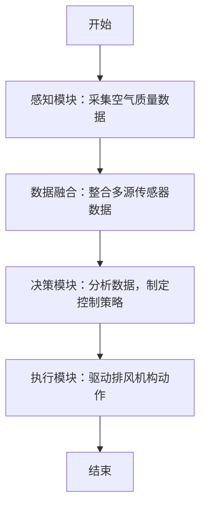
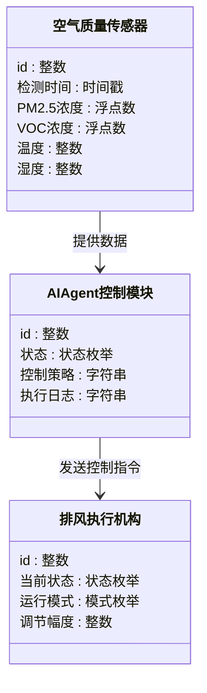
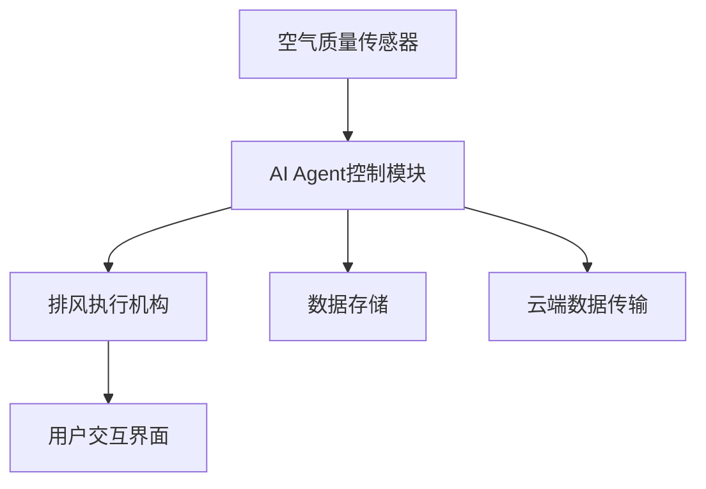
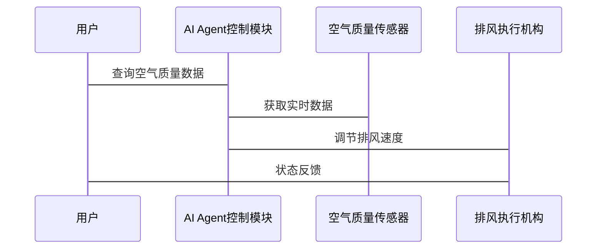

                 


# 智能厨房抽油烟机：AI Agent的空气质量控制

## 关键词：智能厨房抽油烟机，AI Agent，空气质量控制，物联网，智能家居

## 摘要：本文详细探讨了智能厨房抽油烟机在空气质量控制中的应用，通过AI Agent技术实现智能化管理。文章从背景、概念、算法、系统架构、项目实战等多方面展开，深入分析了智能厨房抽油烟机的工作原理、技术实现和实际应用。

---

# 第一部分: 背景介绍

## 第1章: 背景介绍

### 1.1 问题背景

#### 1.1.1 厨房环境中的空气质量问题
厨房环境通常油腻潮湿，传统抽油烟机仅能排出油烟，无法实时监测和控制空气质量。厨房环境中PM2.5、VOC（挥发性有机化合物）等污染物浓度较高，长期暴露可能导致健康问题。

#### 1.1.2 传统抽油烟机的局限性
传统抽油烟机功能单一，仅能机械式排烟，无法根据空气质量变化智能调节运行模式。用户需要手动操作，体验较差。

#### 1.1.3 引入AI Agent的必要性
引入AI Agent（智能代理）技术，使抽油烟机能够实时感知厨房空气质量，智能决策并执行控制操作，提升用户体验和空气质量管理效率。

### 1.2 问题描述

#### 1.2.1 空气质量监测的挑战
厨房环境复杂，空气质量受烹饪方式、油烟浓度、室内外温湿度等多种因素影响。如何准确监测并实时响应是关键。

#### 1.2.2 用户需求分析
用户期望抽油烟机能够：
1. 实时监测厨房空气质量。
2. 根据空气质量智能调节排风速度。
3. 提供健康、舒适的厨房环境。
4. 与智能家居系统联动，实现远程控制和数据共享。

#### 1.2.3 现有解决方案的不足
现有解决方案多局限于机械排烟，缺乏智能化管理和实时反馈机制，无法满足用户日益增长的智能需求。

### 1.3 问题解决

#### 1.3.1 AI Agent的核心作用
AI Agent通过实时感知、智能决策和主动执行，实现厨房空气质量的智能化管理，提升用户体验。

#### 1.3.2 技术实现路径
1. 传感器数据采集与融合。
2. AI算法分析与决策。
3. 执行机构的智能控制。

#### 1.3.3 用户体验提升
通过智能化管理，用户可以享受更健康、更便捷的厨房环境，同时降低能耗，节省成本。

### 1.4 边界与外延

#### 1.4.1 系统边界定义
智能厨房抽油烟机系统边界包括：
1. 空气质量传感器。
2. AI Agent控制模块。
3. 排风执行机构。
4. 用户交互界面。

#### 1.4.2 功能的外延与扩展
未来可以扩展的功能包括：
1. 与智能家居联动。
2. 数据云端存储与分析。
3. 用户行为分析与个性化推荐。

#### 1.4.3 与其他智能家居的协同
通过物联网技术，智能厨房抽油烟机可以与智能空调、智能灶具等设备联动，实现整体厨房环境的智能管理。

### 1.5 概念结构与核心要素

#### 1.5.1 系统架构图


#### 1.5.2 核心要素组成
1. 空气质量传感器：PM2.5、VOC、温湿度传感器。
2. AI Agent控制模块：包括感知、决策、执行三个子模块。
3. 排风执行机构：智能排风扇、风道调节机构。

#### 1.5.3 系统功能模块
1. 感知模块：实时采集厨房空气质量数据。
2. 决策模块：基于AI算法分析数据，制定控制策略。
3. 执行模块：根据决策结果，调节排风机构。

---

## 第2章: 核心概念与联系

### 2.1 AI Agent的基本原理

#### 2.1.1 定义与特点
AI Agent是一种智能代理系统，能够感知环境、自主决策并执行动作。其特点包括：
- **自主性**：无需人工干预，自主完成任务。
- **反应性**：实时感知环境变化，快速响应。
- **智能性**：基于AI算法，进行决策和优化。

#### 2.1.2 工作原理
AI Agent的工作流程包括：
1. **感知**：通过传感器获取环境数据。
2. **决策**：基于感知数据，分析并制定控制策略。
3. **执行**：根据决策结果，驱动执行机构动作。

#### 2.1.3 与传统控制系统的区别
| 对比维度 | 传统控制系统 | AI Agent |
|----------|--------------|----------|
| 感知能力 | 单一传感器数据 | 多源传感器融合 |
| 决策方式 | 固定规则 | AI算法动态优化 |
| 执行方式 | 单一模式 | 多模式智能调节 |

### 2.2 核心概念对比表

#### 2.2.1 概念属性特征对比
| 概念 | 属性 | 特征 |
|------|------|------|
| AI Agent | 感知 | 多源数据融合 |
|        | 决策 | AI算法驱动 |
|        | 执行 | 智能调节 |

#### 2.2.2 功能对比分析
| 功能 | AI Agent | 传统控制系统 |
|------|----------|--------------|
| 数据采集 | 多源传感器 | 单一传感器 |
| 数据分析 | AI算法 | 固定规则 |
| 控制策略 | 动态优化 | 固定模式 |

#### 2.2.3 性能对比
| 性能指标 | AI Agent | 传统控制系统 |
|----------|----------|--------------|
| 响应速度 | 快速 | 较慢 |
| 能耗效率 | 较低 | 较高 |
| 精确度 | 高 | 中等 |

### 2.3 ER实体关系图

```mermaid
erDiagram
    class 空气质量传感器 {
        id : 整数
        检测时间 : 时间戳
        PM2.5浓度 : 浮点数
        VOC浓度 : 浮点数
        温度 : 整数
        湿度 : 整数
    }
    class AI Agent控制模块 {
        id : 整数
        状态 : 状态枚举
        控制策略 : 字符串
        执行日志 : 字符串
    }
    class 排风执行机构 {
        id : 整数
        当前状态 : 状态枚举
        运行模式 : 模式枚举
        调节幅度 : 整数
    }
    空气质量传感器 --> AI Agent控制模块 : 提供数据
    AI Agent控制模块 --> 排风执行机构 : 发送控制指令
```

---

## 第3章: 算法原理讲解

### 3.1 算法原理

#### 3.1.1 AI Agent的感知模块
感知模块通过多种传感器（PM2.5、VOC、温湿度传感器）采集厨房空气质量数据，并进行数据融合，提升感知精度。

#### 3.1.2 决策模块
基于融合后的空气质量数据，AI Agent通过机器学习算法（如支持向量机、随机森林等）进行分析，制定最优控制策略。

#### 3.1.3 执行模块
根据决策模块的控制策略，驱动排风执行机构动作，调节排风速度、风道角度等参数。

### 3.2 算法流程图



### 3.3 数学模型与公式

#### 3.3.1 传感器数据融合公式
$$ y = \alpha_1 x_1 + \alpha_2 x_2 + \alpha_3 x_3 $$
其中：
- $x_1, x_2, x_3$ 分别表示PM2.5、VOC、温湿度传感器的数据
- $\alpha_1, \alpha_2, \alpha_3$ 为融合权重系数

#### 3.3.2 PID控制公式
$$ u(t) = K_p e(t) + K_i \int_{0}^{t} e(\tau) d\tau + K_d \frac{de(\tau)}{d\tau} $$
其中：
- $e(t)$ 为系统误差
- $K_p, K_i, K_d$ 分别为比例、积分、微分系数

### 3.4 举例说明

---

## 第4章: 系统分析与架构设计

### 4.1 系统分析

#### 4.1.1 问题场景介绍
智能厨房抽油烟机需要在复杂环境中实时感知、分析并控制空气质量，实现智能化管理。

#### 4.1.2 系统功能设计
1. **空气质量监测**：实时采集PM2.5、VOC、温湿度等数据。
2. **智能控制**：根据空气质量数据，动态调节排风速度和风道角度。
3. **用户交互**：提供本地和远程控制界面，显示实时数据和控制状态。

#### 4.1.3 领域模型mermaid类图


### 4.2 系统架构设计

#### 4.2.1 系统架构mermaid图


#### 4.2.2 系统接口设计
1. **传感器接口**：提供PM2.5、VOC、温湿度传感器的数据接口。
2. **控制接口**：AI Agent控制模块通过CAN总线或蓝牙与排风执行机构通信。
3. **用户交互接口**：提供本地按键和手机APP远程控制。

#### 4.2.3 系统交互mermaid序列图


---

## 第5章: 项目实战

### 5.1 环境安装

#### 5.1.1 系统环境
- 操作系统：Linux（推荐）或Windows
- 开发工具：Python、TensorFlow、Mermaid、Git
- 传感器：PM2.5、VOC、温湿度传感器
- 排风执行机构：智能排风扇

### 5.2 系统核心实现源代码

#### 5.2.1 数据采集模块
```python
import serial

ser = serial.Serial('COM3', 9600)

def get_sensor_data():
    data = ser.readline().decode().strip()
    return {
        'pm25': float(data.split(',')[0]),
        'voc': float(data.split(',')[1]),
        'temperature': float(data.split(',')[2]),
        'humidity': float(data.split(',')[3])
    }
```

#### 5.2.2 数据融合与分析
```python
from sklearn.ensemble import RandomForestRegressor

def data_fusion(pm25, voc, temperature, humidity):
    model = RandomForestRegressor()
    model.fit(X_train, y_train)
    predicted = model.predict([[pm25, voc, temperature, humidity]])
    return predicted[0]
```

#### 5.2.3 控制策略实现
```python
def control_strategy(predicted_value):
    if predicted_value > threshold:
        return '高速运行'
    elif predicted_value > threshold - 50:
        return '中速运行'
    else:
        return '低速运行'
```

### 5.3 代码应用解读与分析

#### 5.3.1 数据采集模块
通过串口与空气质量传感器通信，获取实时数据。

#### 5.3.2 数据融合与分析
使用随机森林算法对多源传感器数据进行融合，提升空气质量预测精度。

#### 5.3.3 控制策略实现
根据融合后的空气质量数据，动态调节排风速度。

### 5.4 实际案例分析

#### 5.4.1 案例一：正常烹饪
- PM2.5：50 μg/m³
- VOC：100 μg/m³
- 温度：25°C
- 湿度：50%
- AI Agent决策：中速运行

#### 5.4.2 案例二：油烟较大
- PM2.5：100 μg/m³
- VOC：200 μg/m³
- 温度：28°C
- 湿度：60%
- AI Agent决策：高速运行

### 5.5 项目小结
通过实际案例分析，展示了AI Agent在智能厨房抽油烟机中的实际应用，验证了系统的有效性和智能化水平。

---

## 第6章: 最佳实践

### 6.1 小结
本文详细探讨了智能厨房抽油烟机在空气质量控制中的应用，通过AI Agent技术实现了智能化管理。

### 6.2 注意事项
1. 硬件安装要确保传感器的准确性。
2. AI算法需要定期更新和优化。
3. 系统维护要定期检查传感器和执行机构。

### 6.3 拓展阅读
1. **相关书籍**：《智能控制系统设计与实现》
2. **技术文档**：智能家居AI Agent技术白皮书
3. **在线资源**：智能家居AI Agent开发社区

---

## 作者：AI天才研究院 & 禅与计算机程序设计艺术

---

通过本文的详细分析，我们了解了智能厨房抽油烟机在空气质量控制中的重要作用，以及AI Agent技术如何助力其实现智能化管理。希望本文能为智能家居领域的研究和应用提供有价值的参考。

