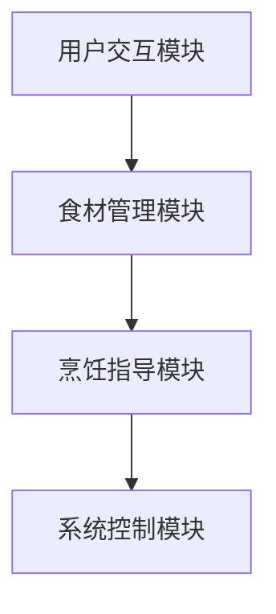
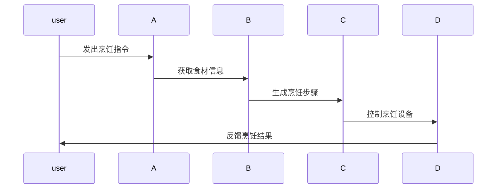

                 


# 智能厨房机器人：AI Agent的烹饪技巧指导

> 关键词：智能厨房机器人, AI Agent, 智能烹饪, 人工智能, 自然语言处理, 计算机视觉, 智能家居

> 摘要：本文深入探讨了智能厨房机器人的设计与实现，结合AI代理技术，详细分析了其在烹饪指导中的应用。从背景介绍、核心概念、算法原理到系统架构、项目实战，系统阐述了智能厨房机器人的技术细节和实际应用。通过本文，读者可以全面了解智能厨房机器人的工作原理及其在现代厨房中的重要性。

---

## 第一部分: 智能厨房机器人背景与概念

### 第1章: 智能厨房机器人的概念与背景

#### 1.1 智能厨房机器人的概念
##### 1.1.1 智能厨房机器人的定义
智能厨房机器人是一种结合人工智能技术的自动化烹饪设备，能够通过AI代理技术为用户提供个性化的烹饪指导和服务。

##### 1.1.2 智能厨房机器人的发展背景
随着人工智能技术的快速发展，厨房机器人从简单的自动化设备逐渐向智能化方向发展。用户对烹饪效率和个性化需求的增加，推动了智能厨房机器人的兴起。

##### 1.1.3 智能厨房机器人的应用价值
智能厨房机器人能够帮助用户实现高效、精准的烹饪，同时提供丰富的食谱建议和健康饮食指导。

#### 1.2 智能厨房机器人的现状
##### 1.2.1 当前市场现状
目前市场上的智能厨房机器人主要集中在基础自动化功能上，如自动切菜、搅拌等，但在智能化和个性化服务方面仍有较大提升空间。

##### 1.2.2 技术发展趋势
随着AI技术的不断进步，智能厨房机器人将更加智能化，具备自然语言处理和计算机视觉等能力，能够提供更精准的烹饪指导。

##### 1.2.3 市场竞争格局
当前市场上的竞争主要集中在硬件性能和功能上，未来竞争的关键将转向AI技术的深度应用。

#### 1.3 智能厨房机器人与AI代理的关系
##### 1.3.1 AI代理的基本概念
AI代理是一种能够感知环境、理解用户需求，并通过决策和执行来实现目标的智能系统。

##### 1.3.2 AI代理在厨房中的应用
AI代理可以通过自然语言处理和计算机视觉技术，帮助用户完成烹饪过程中的食材识别、食谱推荐和操作指导。

##### 1.3.3 智能厨房机器人作为AI代理的载体
智能厨房机器人是AI代理在厨房场景中的具体应用，AI代理为其提供了智能化的核心功能。

#### 1.4 智能厨房机器人用户的痛点与需求
##### 1.4.1 用户需求分析
用户希望厨房机器人能够提供个性化的烹饪建议、高效的食材管理以及便捷的操作体验。

##### 1.4.2 当前产品的主要问题
现有产品在智能化水平、用户体验和个性化服务方面仍有不足。

##### 1.4.3 用户对智能厨房机器人的期望
用户期望智能厨房机器人能够真正成为厨房中的智能助手，提供全方位的烹饪支持。

#### 1.5 智能厨房机器人市场前景
##### 1.5.1 市场规模预测
随着技术进步和用户需求的增长，智能厨房机器人的市场规模将呈现快速增长趋势。

##### 1.5.2 技术进步对市场的推动
AI技术的提升将显著增强厨房机器人的智能化水平，进一步扩大市场需求。

##### 1.5.3 用户接受度分析
随着用户对智能化产品接受度的提高，智能厨房机器人将迎来更广阔的市场空间。

### 第2章: AI代理的核心概念与原理

#### 2.1 AI代理的基本原理
##### 2.1.1 AI代理的定义
AI代理是一种能够感知环境、理解用户需求，并通过决策和执行来实现目标的智能系统。

##### 2.1.2 AI代理的工作原理
AI代理通过感知环境、理解用户需求，利用算法进行决策，并通过执行机构完成任务。

##### 2.1.3 AI代理的核心功能
- 感知与识别
- 信息处理与分析
- 决策与规划
- 执行与反馈

#### 2.2 AI代理与传统烹饪机器人的对比
##### 2.2.1 传统烹饪机器人的局限性
传统烹饪机器人主要依赖预设程序，缺乏智能化和个性化服务。

##### 2.2.2 AI代理带来的创新
AI代理的引入使厨房机器人具备了智能化和个性化服务能力。

##### 2.2.3 AI代理在厨房中的优势
- 提供个性化的烹饪建议
- 实现高效的食材管理
- 提供实时的操作指导

#### 2.3 AI代理在智能厨房机器人中的具体应用
##### 2.3.1 自然语言处理在烹饪指导中的应用
AI代理通过自然语言处理技术理解用户的烹饪需求，并提供相应的指导。

##### 2.3.2 计算机视觉在食材识别中的应用
AI代理利用计算机视觉技术对食材进行识别和分类，确保烹饪过程的准确性。

##### 2.3.3 AI代理在烹饪过程中的实时反馈
AI代理能够根据烹饪过程中的实时数据进行调整，确保烹饪结果符合预期。

---

## 第二部分: AI代理的算法原理与实现

### 第3章: 自然语言处理在烹饪指导中的应用

#### 3.1 自然语言处理的基本原理
##### 3.1.1 语言理解的基本概念
自然语言处理（NLP）是让计算机理解和生成人类语言的技术。

##### 3.1.2 基于深度学习的NLP模型
当前主流的NLP模型基于深度学习技术，如BERT、GPT等。

##### 3.1.3 NLP在烹饪指导中的具体应用
- 食谱理解
- 用户意图识别
- 烹饪步骤生成

#### 3.2 NLP算法实现
##### 3.2.1 分词与词性标注
使用分词算法对烹饪相关文本进行分词和词性标注。

##### 3.2.2 食谱理解与生成
通过NLP模型理解用户的需求，并生成相应的食谱。

##### 3.2.3 基于NLP的对话交互
AI代理与用户进行自然语言对话，提供实时的烹饪指导。

### 第4章: 计算机视觉在食材识别中的应用

#### 4.1 计算机视觉的基本原理
##### 4.1.1 图像处理与识别
计算机视觉技术能够对图像进行处理和识别，提取有用的特征信息。

##### 4.1.2 基于深度学习的图像识别模型
使用卷积神经网络（CNN）等深度学习模型进行图像识别。

##### 4.1.3 图像识别在烹饪中的应用
- 食材分类
- 食材数量识别
- 烹饪状态监测

#### 4.2 计算机视觉算法实现
##### 4.2.1 图像采集与预处理
对食材图像进行采集和预处理，确保识别的准确性。

##### 4.2.2 基于CNN的食材分类
使用卷积神经网络对食材图像进行分类，识别食材种类和数量。

##### 4.2.3 图像识别与烹饪流程控制
根据食材识别结果，实时调整烹饪参数，确保烹饪质量。

### 第5章: AI代理的算法实现

#### 5.1 AI代理的整体架构
##### 5.1.1 感知层
- 多模态数据采集
- 数据预处理与特征提取

##### 5.1.2 决策层
- 基于NLP和CV的多模态数据融合
- 基于强化学习的决策模型

##### 5.1.3 执行层
- 烹饪设备的控制
- 用户反馈的实时响应

#### 5.2 多模态数据融合
##### 5.2.1 多模态数据的采集与预处理
- 文本数据（用户指令、食谱描述）
- 图像数据（食材图像、烹饪状态）
- 声音数据（语音指令、环境噪音）

##### 5.2.2 基于深度学习的多模态融合模型
使用深度学习模型对多模态数据进行融合，提升AI代理的理解和决策能力。

##### 5.2.3 多模态数据融合的应用
- 综合文本和图像信息进行烹饪指导
- 基于语音指令优化烹饪流程

#### 5.3 基于强化学习的决策模型
##### 5.3.1 强化学习的基本原理
强化学习是一种通过试错机制优化决策模型的技术。

##### 5.3.2 在烹饪中的应用
- 烹饪参数的优化
- 烹饪流程的动态调整

##### 5.3.3 强化学习模型的训练与优化
通过大量烹饪数据的训练，优化AI代理的决策能力。

---

## 第三部分: 系统分析与架构设计

### 第6章: 智能厨房机器人系统架构设计

#### 6.1 系统功能设计
##### 6.1.1 领域模型设计
- 用户需求分析
- 功能模块划分

##### 6.1.2 系统功能模块
- 用户交互模块
- 食材管理模块
- 烹饪指导模块
- 系统控制模块

##### 6.1.3 功能模块之间的关系
- 用户交互模块与食材管理模块的交互
- 食材管理模块与烹饪指导模块的协同

#### 6.2 系统架构设计
##### 6.2.1 分层架构设计
- 数据层
- 业务逻辑层
- 用户界面层

##### 6.2.2 微服务架构设计
- 各功能模块独立服务化
- 服务之间的通信与协调

##### 6.2.3 系统架构图


#### 6.3 系统接口设计
##### 6.3.1 用户接口
- 前端界面设计
- API接口定义

##### 6.3.2 系统内部接口
- 各功能模块之间的接口
- 数据传输格式与协议

##### 6.3.3 第三方服务接口
- 云服务接口
- 数据库接口

#### 6.4 系统交互设计
##### 6.4.1 交互流程设计


##### 6.4.2 交互流程优化
- 响应时间优化
- 交互流程简化

##### 6.4.3 交互反馈机制
- 实时反馈
- 历史记录

---

## 第四部分: 项目实战与应用

### 第7章: 项目实战

#### 7.1 环境安装与配置
##### 7.1.1 开发环境搭建
- Python开发环境
- 必要的Python库安装（如TensorFlow、Keras、OpenCV）

##### 7.1.2 数据集准备
- 食材图像数据集
- 文本食谱数据集

##### 7.1.3 开发工具配置
- IDE配置
- 版本控制工具配置

#### 7.2 系统核心实现
##### 7.2.1 自然语言处理模块实现
```python
import tensorflow as tf
from tensorflow.keras import layers

# 定义NLP模型
model_nlp = tf.keras.Sequential([
    layers.Embedding(input_dim=10000, output_dim=16),
    layers.LSTM(64),
    layers.Dense(1, activation='sigmoid')
])
```

##### 7.2.2 计算机视觉模块实现
```python
import cv2

def preprocess_image(image):
    # 图像预处理
    image = cv2.resize(image, (224, 224))
    image = image / 255.0
    return image
```

##### 7.2.3 多模态数据融合实现
```python
import tensorflow as tf
from tensorflow.keras import layers

# 定义多模态融合模型
model_fusion = tf.keras.Sequential([
    layers.Input(shape=(224, 224, 3)),  # 图像输入
    layers.Conv2D(32, (3, 3), activation='relu'),
    layers.MaxPooling2D((2, 2)),
    layers.Flatten(),
    layers.Dense(128, activation='relu'),
    layers.Input(shape=(100,)),  # 文本向量输入
    layers.Dense(1, activation='sigmoid')
])
```

#### 7.3 代码应用与解读
##### 7.3.1 烹饪指导模块的实现
```python
def generate_recipe(steps):
    # 根据步骤生成食谱
    recipe = []
    for step in steps:
        recipe.append(step)
    return recipe
```

##### 7.3.2 图像识别模块的实现
```python
def recognize_food(image):
    # 使用预训练模型识别食材
    prediction = model.predict(image)
    return prediction.argmax(axis=-1)
```

##### 7.3.3 系统控制模块的实现
```python
def control_cooking_device(setting):
    # 控制烹饪设备
    pass
```

#### 7.4 实际案例分析
##### 7.4.1 案例背景
用户希望制作一道红烧肉，AI代理根据用户的指令，提供相应的烹饪指导。

##### 7.4.2 烹饪过程中的实时反馈
AI代理根据烹饪过程中的实时数据，动态调整烹饪参数。

##### 7.4.3 最终结果与分析
烹饪结果符合预期，用户对AI代理的指导表示满意。

#### 7.5 项目总结
##### 7.5.1 项目成果
成功实现了智能厨房机器人的核心功能，包括食材识别、烹饪指导和系统控制。

##### 7.5.2 经验与教训
- 系统设计中的模块划分需要合理
- 数据预处理对模型性能影响较大
- 用户反馈对于系统优化至关重要

##### 7.5.3 未来改进方向
- 提升AI代理的决策能力
- 优化系统的响应速度
- 增强系统的容错能力

---

## 第五部分: 最佳实践与总结

### 第8章: 最佳实践与小结

#### 8.1 最佳实践
##### 8.1.1 系统设计中的注意事项
- 模块化设计
- 高可用性设计
- 可扩展性设计

##### 8.1.2 开发过程中的经验分享
- 代码规范
- 文档管理
- 团队协作

##### 8.1.3 测试与优化
- 单元测试
- 性能优化
- 用户测试

#### 8.2 注意事项
##### 8.2.1 系统安全
- 用户数据安全
- 系统运行安全

##### 8.2.2 系统维护
- 定期更新
- 故障排查
- 性能监控

##### 8.2.3 用户隐私保护
- 数据加密
- 隐私政策
- 用户授权

#### 8.3 未来展望
##### 8.3.1 技术发展
- 更强的AI代理能力
- 更先进的烹饪技术
- 更智能化的厨房设备

##### 8.3.2 市场趋势
- 更多智能化厨房设备的出现
- 更多AI代理技术的应用
- 更多智能厨房解决方案的出现

##### 8.3.3 用户需求的变化
- 更高的智能化要求
- 更个性化的服务
- 更高效的用户体验

---

## 作者

作者：AI天才研究院/AI Genius Institute & 禅与计算机程序设计艺术 /Zen And The Art of Computer Programming

