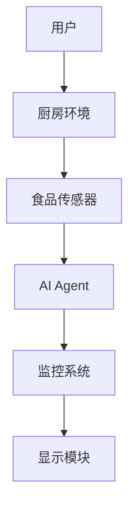
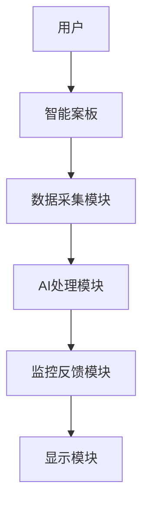
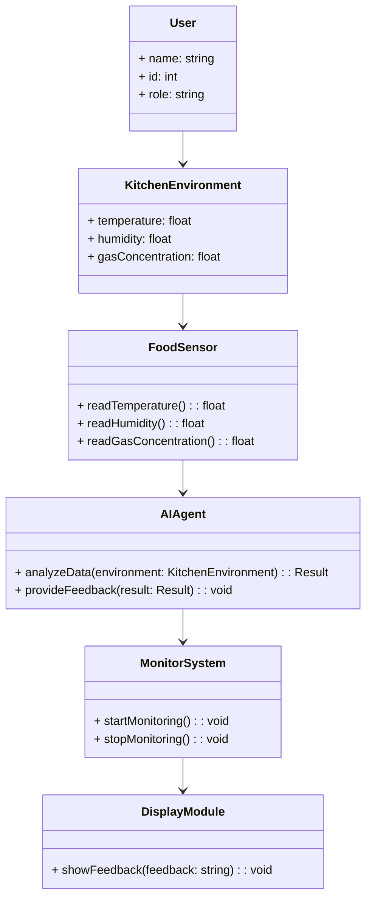

                 


# 智能厨房案板：AI Agent的食品安全监控

> **关键词**：智能厨房案板，AI Agent，食品安全，实时监控，深度学习，时间序列分析，异常检测

> **摘要**：本文详细探讨了智能厨房案板在食品安全监控中的应用，重点介绍了AI Agent的核心原理、系统架构设计、算法实现及实际应用场景。通过理论与实践相结合的方式，展示了如何利用人工智能技术实现厨房环境中的食品安全实时监控，为厨房智能化和食品安全保障提供了新的思路和解决方案。

---

## 第一部分: 智能厨房案板与AI Agent概述

### 第1章: 背景介绍

#### 1.1 智能厨房案板的背景
厨房作为家庭生活中最重要的场所之一，其安全性直接关系到家庭成员的健康。然而，传统厨房中存在诸多安全隐患，例如食材变质、过期食品的误用、厨具的安全操作等。这些问题不仅影响烹饪体验，更可能引发严重的健康问题甚至安全事故。

随着人工智能技术的快速发展，智能化厨房设备逐渐成为趋势。智能厨房案板作为一种创新的厨房工具，不仅具备传统案板的基本功能，还集成了多种智能传感器和AI Agent，能够实时监控厨房环境中的食品安全问题。

#### 1.2 问题背景与描述
食品安全问题一直是全球关注的焦点。在家庭厨房中，食材的保存、加工和烹饪过程中的安全监控尤为重要。然而，传统厨房中缺乏有效的食品安全监控手段，主要依赖人工检查和感官判断，这种方式不仅效率低下，而且容易出现疏漏。

智能厨房案板通过集成AI Agent技术，能够实时感知厨房环境中的温度、湿度、气体浓度等关键参数，并结合食材的特性，智能判断食材的状态，从而实现食品安全的实时监控。

#### 1.3 问题解决与边界
AI Agent在智能厨房案板中的应用，能够实时检测食材的新鲜度、是否存在变质或污染等问题，并通过反馈机制提醒用户采取相应的措施。这种智能化的食品安全监控系统，不仅提高了厨房的安全性，还为用户提供了更加便捷和高效的厨房管理方式。

在功能边界上，智能厨房案板的AI Agent主要关注食品安全监控，不涉及厨房设备的控制或其他智能家居功能。然而，通过与其他智能家居设备的联动，智能厨房案板可以进一步扩展其应用场景，例如联动空调调节厨房温度、联动净化器改善厨房空气质量等。

---

### 第2章: 核心概念与联系

#### 2.1 AI Agent的基本原理
AI Agent（人工智能代理）是一种能够感知环境、自主决策并执行任务的智能系统。在智能厨房案板中，AI Agent通过集成多种传感器（如温度传感器、湿度传感器、气体传感器等）实时感知厨房环境，并结合预先训练好的模型进行数据分析和判断。

AI Agent的核心属性包括：
- **自主性**：能够在无需人工干预的情况下自主运行。
- **反应性**：能够实时感知环境变化并做出相应的反应。
- **目标导向性**：具有明确的目标，例如检测食材的新鲜度。
- **学习能力**：能够通过数据反馈不断优化自身的判断模型。

#### 2.2 核心概念对比分析
为了更好地理解智能厨房案板中的AI Agent，我们需要将其与传统传感器和简单自动化设备进行对比。

**功能对比表**：

| **功能特性** | **传统传感器** | **简单自动化设备** | **智能厨房案板中的AI Agent** |
|--------------|----------------|--------------------|-----------------------------|
| **感知能力** | 单一传感器数据 | 多传感器数据       | 多维度传感器数据 + 数据分析 |
| **决策能力** | 无              | 基于规则的简单判断 | 基于AI模型的智能判断       |
| **反馈机制** | 无              | 单向反馈           | 实时双向反馈               |
| **学习能力** | 无              | 无                 | 基于数据的自适应学习       |

#### 2.3 实体关系与架构设计
为了更好地理解智能厨房案板的系统架构，我们可以使用ER图和流程图来描述其实体关系和系统架构。

**ER实体关系图**：


**系统架构图**：


---

### 第3章: 算法原理与数学模型

#### 3.1 AI Agent的核心算法
智能厨房案板中的AI Agent主要依赖以下几种算法：
1. **基于深度学习的实时检测算法**：用于图像识别和异常检测。
2. **时间序列分析模型**：用于预测食材的新鲜度变化。
3. **异常检测算法**：用于识别环境中的异常情况。

#### 3.2 数学模型与公式
##### 3.2.1 深度学习模型的数学基础
深度学习模型通常基于神经网络进行训练。例如，一个简单的全连接神经网络可以表示为：
$$ y = f(x) $$
其中，$x$ 是输入数据，$y$ 是输出结果，$f$ 是深度学习模型。

##### 3.2.2 时间序列预测模型
时间序列预测模型通常基于ARIMA（自回归积分滑动平均模型）。其公式为：
$$ P(t) = aP(t-1) + b $$

##### 3.2.3 异常检测算法
异常检测算法通常基于统计学方法。例如，使用均值和标准差进行异常判断：
$$ score = \sum_{i=1}^{n} (x_i - \mu)^2 $$

---

### 第4章: 系统分析与架构设计方案

#### 4.1 项目背景
智能厨房案板的开发目标是实现厨房环境中的食品安全实时监控。通过集成多种传感器和AI Agent技术，系统能够实时感知厨房环境中的温度、湿度、气体浓度等参数，并结合食材的特性进行智能判断。

#### 4.2 系统功能设计
智能厨房案板的核心功能包括：
1. **数据采集**：通过传感器采集厨房环境中的关键参数。
2. **数据处理**：利用AI算法对采集的数据进行分析和判断。
3. **监控反馈**：根据分析结果提供实时反馈和建议。

**领域模型类图**：


#### 4.3 系统架构设计
智能厨房案板的系统架构包括以下几个部分：
1. **数据采集模块**：负责采集厨房环境中的关键参数。
2. **AI处理模块**：利用深度学习和时间序列分析模型进行数据分析。
3. **监控反馈模块**：根据分析结果提供实时反馈和建议。
4. **显示模块**：用于展示反馈信息。

**系统架构图**：


---

## 第二部分: 项目实战

### 第5章: 项目环境与核心实现

#### 5.1 环境安装
为了运行智能厨房案板系统，我们需要安装以下环境和库：
- **Python 3.8+**
- **TensorFlow或Keras**
- **NumPy**
- **Scikit-learn**
- **Mermaid**
- **Matplotlib**

#### 5.2 核心实现
以下是智能厨房案板的核心代码实现：

```python
import numpy as np
from sklearn import linear_model
import tensorflow as tf
from tensorflow.keras import layers

# 数据采集模块
class FoodSensor:
    def __init__(self):
        self.temperature = 0.0
        self.humidity = 0.0
        self.gas_concentration = 0.0

    def read_data(self):
        # 模拟传感器数据
        self.temperature = np.random.normal(25, 2)
        self.humidity = np.random.uniform(30, 80)
        self.gas_concentration = np.random.uniform(0, 100)
        return {
            'temperature': self.temperature,
            'humidity': self.humidity,
            'gas_concentration': self.gas_concentration
        }

# AI处理模块
class AIAgent:
    def __init__(self):
        # 初始化深度学习模型
        self.model = tf.keras.Sequential([
            layers.Dense(64, activation='relu', input_shape=(3,)),
            layers.Dense(1, activation='sigmoid')
        ])
        self.model.compile(optimizer='adam', loss='binary_crossentropy')

    def analyze_data(self, data):
        # 数据预处理
        X = np.array([data['temperature'], data['humidity'], data['gas_concentration']]).reshape(1, 3)
        # 预测结果
        y_pred = self.model.predict(X)
        return y_pred[0][0]

# 监控反馈模块
class MonitorSystem:
    def __init__(self):
        pass

    def provide_feedback(self, prediction):
        if prediction > 0.9:
            return "食材新鲜"
        elif prediction > 0.5:
            return "食材可能变质"
        else:
            return "食材已变质，请更换"

# 显示模块
class DisplayModule:
    def show_message(self, message):
        print(f"显示信息：{message}")

# 主程序
if __name__ == '__main__':
    sensor = FoodSensor()
    aiagent = AIAgent()
    monitor = MonitorSystem()
    display = DisplayModule()

    data = sensor.read_data()
    prediction = aiagent.analyze_data(data)
    feedback = monitor.provide_feedback(prediction)
    display.show_message(feedback)
```

#### 5.3 代码解读与分析
上述代码实现了一个简单的智能厨房案板系统，主要包含以下几个部分：
1. **FoodSensor**：模拟厨房环境中的传感器，采集温度、湿度和气体浓度数据。
2. **AIAgent**：基于深度学习的AI代理，利用神经网络模型对传感器数据进行分析和预测。
3. **MonitorSystem**：根据AI代理的预测结果提供实时反馈。
4. **DisplayModule**：显示反馈信息。

#### 5.4 实际案例分析
通过上述代码，我们可以看到智能厨房案板系统的基本实现。例如，当传感器采集到的温度、湿度和气体浓度数据经过AI代理分析后，预测结果大于0.9时，系统会反馈“食材新鲜”；预测结果在0.5到0.9之间时，系统会反馈“食材可能变质”；预测结果小于0.5时，系统会反馈“食材已变质，请更换”。

---

## 第三部分: 最佳实践与总结

### 第6章: 最佳实践

#### 6.1 小结
智能厨房案板通过集成AI Agent技术，能够实现厨房环境中的食品安全实时监控。本文详细探讨了AI Agent的核心原理、系统架构设计、算法实现及实际应用场景。

#### 6.2 注意事项
在实际应用中，需要注意以下几点：
1. **数据隐私**：确保用户数据的安全性和隐私性。
2. **传感器精度**：选择高精度的传感器以提高系统的准确性。
3. **模型优化**：定期更新和优化AI模型以提高预测的准确性。

#### 6.3 拓展阅读
1. 《深度学习实战》
2. 《时间序列分析与预测》
3. 《人工智能在物联网中的应用》

---

## 作者信息

作者：AI天才研究院/AI Genius Institute & 禅与计算机程序设计艺术 /Zen And The Art of Computer Programming

