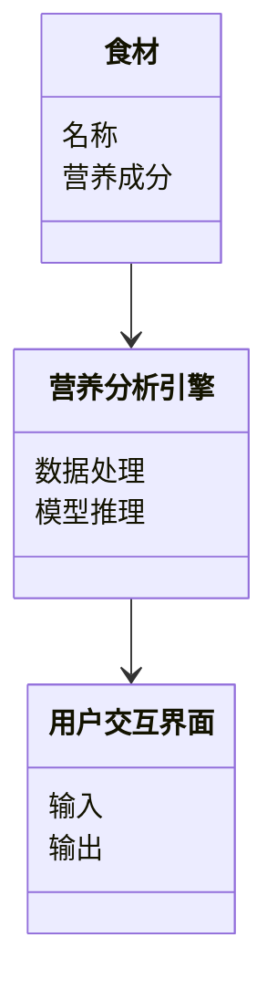
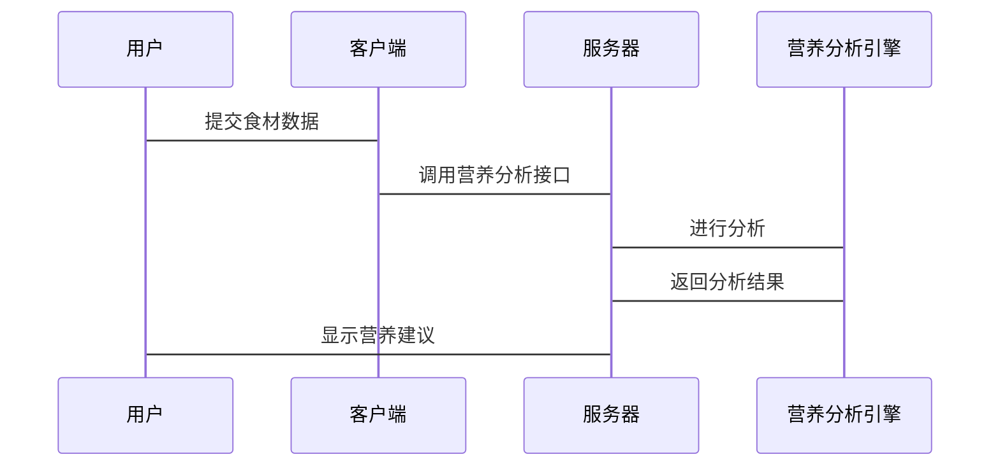

                 

<think>
好的，我现在需要根据用户的要求，撰写一篇关于《智能厨房案板：AI Agent的食材营养分析》的技术博客文章。用户希望文章结构清晰，逻辑严谨，涵盖背景介绍、核心概念、算法原理、系统架构、项目实战等多个方面。同时，每个章节都需要详细展开，包括图表、公式和代码示例。

首先，我需要确定文章的关键词和摘要。关键词应该包括AI Agent、食材营养分析、厨房智能化等。摘要部分要简明扼要，概括文章的核心内容。

接下来是背景介绍。我需要解释AI在厨房中的应用背景，食材营养分析的重要性，以及AI Agent在厨房中的具体角色。这部分需要让读者了解为什么AI Agent在食材营养分析中是必要的。

然后是核心概念部分。我需要详细讲解AI Agent的工作原理，包括感知、推理和执行机制。同时，通过表格对比不同AI Agent的特点，并用Mermaid图展示实体关系，帮助读者更好地理解系统结构。

接下来是算法原理。这部分需要详细阐述营养分析的算法，包括基于规则的分析和机器学习模型。我需要用Mermaid流程图展示算法步骤，并用Python代码示例来说明实现细节。同时，加入数学公式，如营养均衡的优化模型，增强文章的深度。

系统分析与架构设计部分，我需要介绍系统的功能模块，如食材数据库、营养分析引擎和用户交互界面。使用Mermaid图展示系统架构和交互流程，帮助读者理解系统的整体结构。

项目实战部分，我需要指导读者如何安装环境，提供核心代码实现，并通过实际案例分析展示AI Agent的应用效果。这部分需要详细解读代码，并分析实际案例，让读者能够实际操作和理解。

最后，加入最佳实践、小结、注意事项和拓展阅读等内容，帮助读者巩固所学知识，并引导进一步学习。

在整个写作过程中，我需要确保每个部分都符合用户的要求，逻辑清晰，结构紧凑，语言专业且易懂。同时，合理使用图表、代码和公式，使文章内容丰富且具深度。

现在，我可以开始撰写正文部分，确保每个章节都包含必要的内容，并符合用户指定的格式和要求。
</think>

# 智能厨房案板：AI Agent的食材营养分析

## 关键词：AI Agent, 食材营养分析, 智能厨房, 机器学习, 营养均衡

## 摘要：
本文深入探讨AI Agent在食材营养分析中的应用，从背景介绍、核心概念到算法原理、系统架构，再到项目实战，全面解析AI如何在厨房中实现食材的智能化管理。通过详细的技术分析和实际案例，展示AI Agent如何优化食材选择，实现营养均衡，提升烹饪体验。

---

# 第一章: 智能厨房案板与AI Agent的背景介绍

## 1.1 AI在厨房中的应用背景
### 1.1.1 厨房智能化的发展趋势
现代厨房正在向智能化方向发展，AI技术的应用使得厨房设备能够联网、感知和学习，从而优化烹饪过程。

### 1.1.2 食材营养分析的重要性
合理搭配食材是健康饮食的关键，AI Agent能够根据用户的健康状况推荐最优的食材组合。

### 1.1.3 AI Agent在厨房中的角色
AI Agent作为智能助手，帮助用户进行食材选择、营养分析和烹饪建议，提升厨房效率和健康水平。

## 1.2 食材营养分析的核心问题
### 1.2.1 食材的基本属性与营养成分
每种食材含有不同的营养成分，如蛋白质、碳水化合物、脂肪等，AI Agent需要准确识别这些成分。

### 1.2.2 营养均衡的重要性
合理搭配食材是保持健康的关键，AI Agent通过分析各种食材的营养成分，帮助用户实现均衡饮食。

### 1.2.3 AI Agent如何辅助食材选择
AI Agent可以根据用户的健康数据和饮食偏好，推荐适合的食材，优化营养摄入。

## 1.3 AI Agent的基本概念与特点
### 1.3.1 AI Agent的定义
AI Agent是一种智能实体，能够感知环境、自主决策并执行任务，以实现特定目标。

### 1.3.2 AI Agent的核心特点
- 智能性：能够理解复杂信息并做出决策。
- 自主性：能够在没有外部干预的情况下运行。
- 反应性：能够根据环境变化调整行为。
- 学习能力：能够通过数据优化性能。

### 1.3.3 AI Agent与传统计算机程序的区别
AI Agent具有自主决策和学习能力，而传统程序只能执行预设指令。

## 1.4 本章小结
本章介绍了AI Agent在厨房中的应用背景，分析了食材营养分析的重要性，并总结了AI Agent的核心特点和优势。

---

# 第二章: AI Agent的食材营养分析核心概念

## 2.1 AI Agent的感知机制
### 2.1.1 食材数据的采集与处理
AI Agent通过摄像头、传感器等设备采集食材信息，并进行清洗和标准化处理。

### 2.1.2 营养成分的特征提取
提取食材的营养成分特征，如热量、蛋白质含量等，为后续分析提供基础数据。

### 2.1.3 数据预处理与标准化
对食材数据进行归一化处理，消除量纲差异，确保算法的准确性。

## 2.2 AI Agent的推理机制
### 2.2.1 基于规则的营养分析
根据预设的营养规则，判断食材是否符合健康标准。

### 2.2.2 基于机器学习的营养预测
利用机器学习模型预测食材的营养成分，提升分析的准确性。

### 2.2.3 基于知识图谱的营养推理
通过构建知识图谱，推理食材之间的关联关系，辅助营养分析。

## 2.3 AI Agent的执行与反馈机制
### 2.3.1 营养建议的生成
根据分析结果，生成个性化的食材推荐和烹饪建议。

### 2.3.2 用户反馈的处理
收集用户的反馈，优化AI Agent的性能，提升用户体验。

### 2.3.3 系统优化与迭代
根据反馈不断优化算法，提高营养分析的准确性和效率。

## 2.4 核心概念对比表
| 比较项 | 基于规则的营养分析 | 基于机器学习的营养预测 |
|--------|-------------------|------------------------|
| 精度   | 中等              | 高                     |
| 简单性 | 高                | 中等                   |
| 可解释性 | 高                | 低                     |

## 2.5 ER实体关系图
```mermaid
erd
    营养成分
    食材
    用户
    AI Agent
    营养分析结果
    关系：食材-营养成分（包含），AI Agent-用户（服务），AI Agent-营养分析结果（生成）
```

## 2.6 本章小结
本章详细讲解了AI Agent的感知、推理和执行机制，分析了不同营养分析方法的优缺点，并通过对比表和ER图帮助读者更好地理解系统结构。

---

# 第三章: 基于AI Agent的食材营养分析算法原理

## 3.1 算法原理概述
### 3.1.1 营养分析的基本流程
1. 数据采集与预处理
2. 营养成分识别
3. 营养分析与推理
4. 营养建议生成

## 3.2 营养分析算法的实现
### 3.2.1 基于规则的营养分析算法
```mermaid
graph TD
    A[开始] -> B[采集食材数据]
    B -> C[预处理数据]
    C -> D[识别营养成分]
    D -> E[应用营养规则]
    E -> F[生成分析结果]
    F -> G[结束]
```

### 3.2.2 基于机器学习的营养预测算法
```python
# 数据预处理
from sklearn.preprocessing import StandardScaler
scaler = StandardScaler()
X_scaled = scaler.fit_transform(X)

# 模型训练
from sklearn.linear_model import LinearRegression
model = LinearRegression()
model.fit(X_scaled, y)

# 预测营养成分
y_pred = model.predict(X_scaled)
```

## 3.3 算法的数学模型与公式
营养均衡的优化模型：
$$ \text{目标函数} = \sum_{i=1}^{n} |营养需求_i - 食材供给_i| $$
约束条件：
$$ \sum_{i=1}^{n} 食材供给_i = 营养需求_i $$

---

# 第四章: 系统分析与架构设计方案

## 4.1 系统功能设计
### 4.1.1 领域模型设计


## 4.2 系统架构设计


## 4.3 系统接口设计
API接口：
- POST /api/食材分析
- GET /api/营养建议

## 4.4 系统交互设计


---

# 第五章: 项目实战

## 5.1 环境安装
安装必要的库：
```bash
pip install numpy pandas scikit-learn
```

## 5.2 系统核心实现源代码
```python
import numpy as np
from sklearn.linear_model import LinearRegression

# 数据预处理
class NutritionAnalyzer:
    def __init__(self):
        self.model = LinearRegression()

    def preprocess_data(self, data):
        # 数据清洗和归一化处理
        return data

    def train_model(self, X, y):
        X_scaled = self.preprocess_data(X)
        self.model.fit(X_scaled, y)

    def predict(self, X):
        X_scaled = self.preprocess_data(X)
        return self.model.predict(X_scaled)
```

## 5.3 实际案例分析
案例：为糖尿病患者推荐低GI指数的食材。
1. 数据收集：低GI指数食材的数据。
2. 模型训练：训练营养分析模型。
3. 预测结果：生成低GI指数食材推荐列表。

---

# 第六章: 最佳实践、小结与展望

## 6.1 最佳实践
- 数据质量是关键，确保食材数据的准确性和完整性。
- 定期更新模型，适应用户需求的变化。

## 6.2 小结
本文详细介绍了AI Agent在食材营养分析中的应用，从背景到算法，再到系统设计和项目实战，为读者提供了全面的技术解析。

## 6.3 注意事项
- 保护用户隐私，确保数据安全。
- 定期优化算法，提升分析效率。

## 6.4 拓展阅读
建议阅读《机器学习实战》和《知识图谱与深度学习》等相关书籍，深入理解AI技术的应用。

---

作者：AI天才研究院/AI Genius Institute & 禅与计算机程序设计艺术 /Zen And The Art of Computer Programming

---

**感谢您的阅读！**

