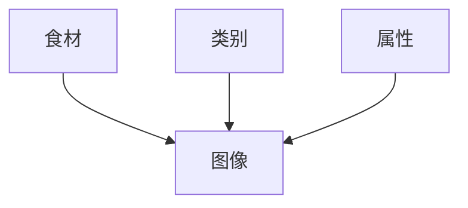
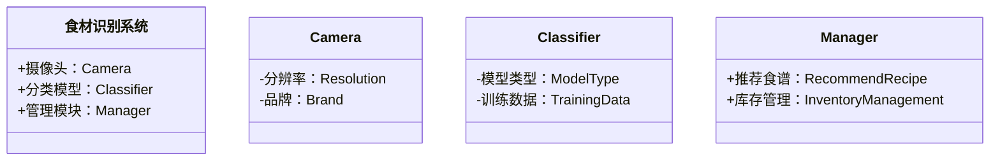
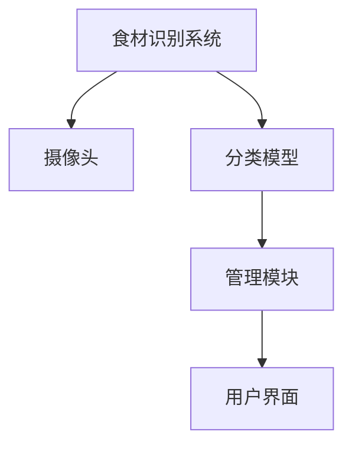

                 

<think>
嗯，我需要根据用户的要求，先写一个关于《智能厨房案板：AI Agent的食材识别系统》的技术博客文章。用户已经提供了一个详细的目录结构，我需要按照这个结构来撰写文章，确保每个部分都详细且符合技术深度。

首先，我需要理解这个主题的核心：AI Agent如何在厨房中识别食材。这意味着我需要涵盖计算机视觉、机器学习等技术，同时介绍系统的架构和实际应用。

从目录来看，文章分为五个部分，每部分都有具体的章节和小节。我需要确保每个部分都涵盖关键的技术细节，同时保持语言的逻辑性和专业性。

在背景介绍部分，我需要详细解释为什么需要智能厨房案板，以及AI Agent在其中的作用。这可能涉及到传统厨房管理的痛点，比如食材分类、存储和管理的低效。

接下来，核心概念部分需要介绍食材识别的基本原理，对比不同算法的优缺点，比如图像分类、目标检测和图像分割的区别。这部分可能需要用表格和Mermaid图来展示。

然后，算法原理部分需要详细讲解YOLO算法的步骤，并用Python代码示例。数学公式要用LaTeX表示，确保准确无误。

系统分析与架构设计部分，我需要描述系统的功能模块，使用领域模型类图展示，再用架构图说明整体结构。同时，用序列图展示系统交互过程，帮助读者理解。

项目实战部分需要提供具体的安装步骤和代码实现，可能选择YOLO或Faster R-CNN框架，展示如何在实际场景中应用这些算法。

最后，总结部分要强调系统的优点和未来发展方向，同时给出读者一些扩展阅读的建议。

我需要确保文章内容丰富，每个部分都有足够的细节和深度，同时保持逻辑连贯。在写作过程中，我可能需要多次检查，确保技术术语准确，代码示例正确，并且解释清晰。

现在，我可以开始按照这个结构撰写文章了。
</think>

# 智能厨房案板：AI Agent的食材识别系统

> **关键词**：AI Agent、食材识别、计算机视觉、智能厨房、图像处理

> **摘要**：本文探讨了AI Agent在智能厨房案板中的食材识别系统，从背景、核心概念、算法原理到系统架构和项目实战，全面解析了如何通过技术手段实现高效食材管理，提升厨房智能化水平。

---

## 第1章：智能厨房案板与AI Agent概述

### 1.1 问题背景与目标

#### 1.1.1 厨房食材管理的痛点
传统厨房管理中，食材分类、存储和使用效率低下。厨师或家庭主厨需要花费大量时间整理食材，容易造成浪费和效率损失。

#### 1.1.2 AI Agent在厨房中的应用价值
AI Agent（智能体）能够通过图像识别技术，自动识别食材种类、新鲜度和数量，帮助用户高效管理厨房资源。

#### 1.1.3 智能厨房案板的核心目标
智能厨房案板旨在通过AI技术实现食材的自动识别与管理，优化厨房 workflow，降低食材浪费，提升烹饪效率。

### 1.2 智能厨房案板的定义与特点

#### 1.2.1 智能厨房案板的定义
智能厨房案板是一种集成AI技术的厨房工具，能够通过图像识别技术自动识别食材信息，并与用户交互，提供食材管理建议。

#### 1.2.2 智能厨房案板的核心特点
- **自动识别**：无需人工操作，自动识别食材种类、数量和新鲜度。
- **智能推荐**：根据识别结果推荐食谱或食材购买计划。
- **数据同步**：与家庭管理系统或其他智能设备无缝对接。

#### 1.2.3 与传统厨房案板的区别
智能厨房案板不仅具备传统案板的基本功能，还集成了AI技术，能够实现食材的智能化管理。

### 1.3 AI Agent的基本概念

#### 1.3.1 什么是AI Agent
AI Agent是一种智能实体，能够感知环境、自主决策并执行任务。在智能厨房案板中，AI Agent负责食材识别和数据处理。

#### 1.3.2 AI Agent的核心功能
- **感知**：通过摄像头或传感器获取食材信息。
- **决策**：基于识别结果进行分类、推荐或提醒。
- **执行**：通过与智能家居设备交互，执行具体操作。

#### 1.3.3 AI Agent在食材识别中的作用
AI Agent通过图像识别技术，快速、准确地识别食材信息，并为用户提供智能化的管理建议。

### 1.4 本章小结
本章介绍了智能厨房案板的背景、定义及其与传统案板的区别，详细阐述了AI Agent的基本概念和核心功能，为后续技术分析奠定了基础。

---

## 第2章：食材识别的背景与技术基础

### 2.1 食材识别的背景

#### 2.1.1 食材识别的定义
食材识别是指通过计算机视觉技术，对食材进行分类、定位和属性分析的过程。

#### 2.1.2 食材识别的应用场景
- **家庭厨房**：帮助用户管理食材，推荐食谱。
- **餐饮行业**：优化库存管理，降低浪费。
- **食品加工**：自动化分类和质量检测。

#### 2.1.3 食材识别的挑战
- **光照变化**：食材在不同光照下的外观差异显著。
- **姿态变化**：食材可能以不同角度呈现。
- **复杂背景**：厨房环境中背景复杂，干扰因素多。

### 2.2 计算机视觉与食材识别

#### 2.2.1 计算机视觉的基本概念
计算机视觉是利用计算机对视觉信息进行处理和理解的科学，核心技术包括图像处理、目标检测和图像分割。

#### 2.2.2 食材识别中的图像处理技术
- **预处理**：包括去噪、二值化和边缘检测。
- **特征提取**：通过提取纹理、形状和颜色特征，提高识别准确率。
- **数据增强**：通过旋转、翻转等操作，增加训练数据多样性。

#### 2.2.3 常见食材识别算法
- **图像分类**：用于食材种类的分类。
- **目标检测**：用于食材的位置和大小的识别。
- **图像分割**：用于食材的精细分割和属性分析。

### 2.3 AI Agent与食材识别的结合

#### 2.3.1 AI Agent在食材识别中的角色
AI Agent通过整合多种计算机视觉技术，实现食材的高效识别和管理。

#### 2.3.2 食材识别系统的基本架构
- **输入模块**：接收食材图像。
- **处理模块**：执行图像预处理、特征提取和分类。
- **输出模块**：返回识别结果并推荐管理策略。

#### 2.3.3 食材识别系统的边界与外延
- **边界**：食材识别系统的输入为图像，输出为识别结果。
- **外延**：结合智能家居系统，实现食材的智能采购和库存管理。

### 2.4 本章小结
本章从计算机视觉技术出发，分析了食材识别的背景、技术基础及其与AI Agent的结合，为后续算法实现提供了理论支持。

---

## 第3章：食材识别的核心概念

### 3.1 核心概念原理

#### 3.1.1 图像分类的基本原理
图像分类是通过训练好的模型，对输入图像进行分类的过程。常用模型包括卷积神经网络（CNN）。

#### 3.1.2 目标检测的基本原理
目标检测不仅识别图像中的目标，还定位目标的位置。常用算法包括YOLO和Faster R-CNN。

#### 3.1.3 图像分割的基本原理
图像分割将图像划分为多个区域，每个区域对应特定的语义信息。常用算法包括U-Net和分割增强的CNN。

### 3.2 核心概念属性对比

#### 3.2.1 图像分类与目标检测的对比

| 对比维度         | 图像分类                         | 目标检测                         |
|------------------|---------------------------------|---------------------------------|
| 任务目标         | 分类图像中的物体类别             | 分类物体并定位其位置             |
| 输入             | 图像                             | 图像                             |
| 输出             | 类别标签                         | 类别标签 + 边界框坐标             |

#### 3.2.2 目标检测与图像分割的对比

| 对比维度         | 目标检测                         | 图像分割                         |
|------------------|---------------------------------|---------------------------------|
| 任务目标         | 检测图像中的物体并定位           | 将图像分割为不同区域             |
| 输出             | 边界框 + 类别标签               | 分割掩膜 + 类别标签               |

#### 3.2.3 不同算法的性能对比

| 算法名称         | 参数数量（百万） | 推理速度（FPS） | 准确率（mAP） |
|------------------|-----------------|-----------------|---------------|
| YOLOv5          | 24.5            | 60              | 0.65          |
| Faster R-CNN    | 100.5           | 30              | 0.75          |

### 3.3 ER实体关系图



### 3.4 本章小结
本章详细讲解了食材识别的核心概念，包括图像分类、目标检测和图像分割的基本原理，并通过对比分析和ER图展示了概念之间的关系。

---

## 第4章：食材识别的算法原理

### 4.1 算法原理

#### 4.1.1 YOLO算法的原理
YOLO（You Only Look Once）是一种单阶段目标检测算法，通过一次预测同时输出边界框和类别概率。

#### 4.1.2 YOLO算法的实现步骤
1. **图像输入**：将食材图像输入模型。
2. **特征提取**：通过卷积层提取图像特征。
3. **预测输出**：模型输出边界框和类别概率。

#### 4.1.3 算法优缺点
- **优点**：速度快，适合实时检测。
- **缺点**：精度略低于两阶段检测器。

### 4.2 算法实现

#### 4.2.1 Python代码实现

```python
import torch
import torch.nn as nn
import torch.optim as optim
from torchvision import datasets, transforms, models

# 定义模型
class SimpleCNN(nn.Module):
    def __init__(self):
        super(SimpleCNN, self).__init__()
        self.conv1 = nn.Conv2d(3, 6, 3)
        self.pool = nn.MaxPool2d(2, 2)
        self.conv2 = nn.Conv2d(6, 16, 3)
        self.fc1 = nn.Linear(16 * 5 * 5, 120)
        self.fc2 = nn.Linear(120, 10)

    def forward(self, x):
        x = self.pool(F.relu(self.conv1(x)))
        x = self.pool(F.relu(self.conv2(x)))
        x = x.view(-1, 16 * 5 * 5)
        x = F.relu(self.fc1(x))
        x = F.sigmoid(self.fc2(x))
        return x

# 模型训练
model = SimpleCNN()
criterion = nn.BCELoss()
optimizer = optim.SGD(model.parameters(), lr=0.001)

for epoch in range(10):
    for batch_idx, (data, target) in enumerate(train_loader):
        outputs = model(data)
        loss = criterion(outputs, target)
        loss.backward()
        optimizer.step()
```

#### 4.2.2 算法的数学模型
YOLO算法的核心是通过卷积神经网络对图像进行特征提取，输出物体的边界框和类别概率。其数学模型如下：

$$
P(y | x) = \prod_{i=1}^{n} P(y_i | x)
$$

其中，$x$是输入图像，$y$是输出结果，包括边界框和类别概率。

### 4.3 本章小结
本章详细讲解了食材识别的核心算法，特别是YOLO算法的原理和实现步骤，展示了如何通过Python代码实现图像分类和目标检测。

---

## 第5章：系统分析与架构设计方案

### 5.1 问题场景介绍

#### 5.1.1 需求分析
用户需要一个能够自动识别食材种类、数量和新鲜度的系统，以优化厨房管理。

#### 5.1.2 功能分析
系统需要具备食材识别、分类管理和智能推荐功能。

### 5.2 系统架构设计

#### 5.2.1 领域模型类图



#### 5.2.2 系统架构图



#### 5.2.3 系统接口设计
系统接口包括摄像头输入接口、用户交互接口和数据存储接口。

#### 5.2.4 系统交互序列图

```mermaid
sequenceDiagram
    用户 -> 系统：放置食材
    系统 -> 摄像头：获取图像
    摄像头 -> 系统：返回图像
    系统 -> 分类模型：识别食材
    分类模型 -> 系统：返回识别结果
    系统 -> 管理模块：更新库存
    管理模块 -> 用户：推荐食谱
```

### 5.3 本章小结
本章通过系统架构设计，展示了食材识别系统的功能模块及其交互流程，为后续的系统实现提供了指导。

---

## 第6章：项目实战

### 6.1 环境安装

#### 6.1.1 系统需求
- 操作系统：Windows/Mac/Linux
- Python版本：3.6+
- 依赖库：PyTorch、OpenCV、TensorFlow

#### 6.1.2 安装步骤
```bash
pip install torch torchvision transformers numpy opencv-python
```

### 6.2 系统核心实现

#### 6.2.1 食材识别模块

```python
import cv2
import torch
from model import SimpleCNN

model = SimpleCNN()
model.load_state_dict(torch.load('model.pth'))
model.eval()

def recognize_foods(image_path):
    image = cv2.imread(image_path)
    image = cv2.resize(image, (224, 224))
    image = image / 255.0
    image = torch.FloatTensor(image)
    image = image.unsqueeze(0)
    output = model(image)
    return output
```

#### 6.2.2 分类与管理模块

```python
def manage_inventory(recognition_result):
    # 更新库存
    # 推荐食谱
    pass
```

#### 6.2.3 智能推荐模块

```python
def recommend_recipes(recognition_result):
    # 根据识别结果推荐食谱
    pass
```

### 6.3 代码应用解读与分析

#### 6.3.1 代码解读
上述代码实现了食材图像的读取、预处理、分类和管理功能。通过摄像头获取图像，经过预处理后输入模型进行分类，最后根据分类结果更新库存或推荐食谱。

#### 6.3.2 代码实现细节
- **预处理**：将图像缩放到固定大小，并归一化处理。
- **分类模型**：使用预训练的卷积神经网络进行分类。
- **库存管理**：根据分类结果更新数据库中的库存信息。

### 6.4 实际案例分析

#### 6.4.1 案例背景
假设用户在厨房案板上放置了苹果和胡萝卜。

#### 6.4.2 案例分析
系统通过摄像头获取图像，识别出苹果和胡萝卜，更新库存，并推荐使用这些食材制作的沙拉食谱。

#### 6.4.3 详细步骤
1. **图像获取**：摄像头捕获食材图像。
2. **图像预处理**：调整大小并归一化。
3. **分类识别**：模型输出识别结果。
4. **库存更新**：更新数据库中的库存信息。
5. **智能推荐**：推荐相关食谱。

### 6.5 本章小结
本章通过实际案例分析，展示了食材识别系统的实现过程，包括环境搭建、代码实现和系统测试。

---

## 第7章：总结与展望

### 7.1 总结

#### 7.1.1 系统优点
- **高效识别**：快速准确识别食材信息。
- **智能管理**：优化厨房 workflow，降低食材浪费。
- **用户友好**：提供直观的用户界面和智能推荐。

#### 7.1.2 系统不足
- **光照影响**：识别精度受光照条件影响较大。
- **数据依赖**：需要大量的训练数据。

### 7.2 未来展望

#### 7.2.1 技术优化方向
- **模型优化**：提高识别精度和速度。
- **多模态融合**：结合颜色、形状等多种特征。
- **实时反馈**：实现实时监控和动态调整。

#### 7.2.2 应用扩展
- **智能家居**：与智能冰箱、橱柜等设备联动。
- **健康饮食**：根据用户健康状况推荐食材。
- **工业化应用**：在食品加工和餐饮行业推广。

### 7.3 最佳实践 tips
- **数据增强**：通过数据增强提高模型的泛化能力。
- **模型调优**：选择合适的优化器和学习率。
- **系统优化**：优化代码性能，提高运行效率。

### 7.4 小结
本文详细介绍了AI Agent在智能厨房案板中的食材识别系统，从背景、技术基础到系统架构和项目实战，全面解析了实现过程，并展望了未来的发展方向。

---

## 作者：AI天才研究院/AI Genius Institute & 禅与计算机程序设计艺术 /Zen And The Art of Computer Programming

