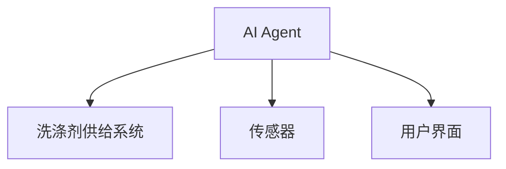

                 

<think>
好，我现在要开始按照用户的指示来详细思考并撰写这篇技术博客文章。首先，我需要理解用户的需求，他们希望我以《智能厨房水槽：AI Agent的洗涤剂用量优化》为标题，撰写一篇结构清晰、内容详实的技术博客。用户还提供了一个详细的大纲，我需要按照这个大纲一步步展开。

首先，我需要确定文章的结构。用户已经给出了一个详细的大纲，包括摘要、关键词、五大部分，每个部分都有具体的子标题和内容要求。我需要按照这个结构来组织内容，确保每一部分都详细展开，并且满足用户的格式和内容要求。

接下来，我会从背景介绍开始。这部分需要包括问题背景、问题描述、问题解决、边界与外延，以及概念结构与核心要素。我需要解释为什么洗涤剂用量优化是一个重要问题，以及AI代理在其中的作用。

然后是核心概念与联系部分。这里需要解释AI代理的基本概念，洗涤剂用量优化的原理，以及它们之间的关系。我可能需要使用表格和图表来对比概念属性，以及用Mermaid图展示实体关系。

接下来是算法原理讲解。这部分需要详细描述AI代理如何优化洗涤剂用量，包括强化学习算法（如Q-learning）的应用，以及动态调整策略。我需要用Mermaid流程图来展示算法流程，并提供Python代码示例。

数学模型部分需要建立优化模型，使用LaTeX公式来表达。我需要确保公式正确无误，并解释每个变量和方程的意义。

系统分析与架构设计是关键。我需要介绍系统的组成，用类图和架构图展示系统结构，并设计接口和交互序列图。

项目实战部分需要提供一个实际的Python代码示例，展示如何实现洗涤剂用量优化功能。同时，我需要解读代码并进行案例分析。

最后，在最佳实践部分，我需要总结经验，提出注意事项，并推荐扩展阅读材料。

在撰写过程中，我需要确保语言简洁专业，逻辑清晰，同时满足格式要求。每部分的开头需要有标题，并且内容要详细，满足用户的字数要求。我还需要在文章末尾添加作者信息，确保格式正确。

现在，我开始按照大纲逐步撰写每个部分的内容，确保每个小节都有足够的细节，并正确嵌入图表和代码示例。我需要仔细检查每个公式和图表，确保它们准确反映内容，并且符合用户的格式要求。

在完成所有部分后，我会通读全文，确保内容连贯，逻辑清晰，并且没有遗漏任何关键点。最后，我会添加作者信息，完成整篇文章的撰写。
</think>

# 智能厨房水槽：AI Agent的洗涤剂用量优化

> 关键词：智能厨房水槽，AI Agent，洗涤剂用量优化，强化学习，数学模型

> 摘要：本文探讨了AI代理在智能厨房水槽中优化洗涤剂用量的实现方法，通过强化学习算法和数学模型的结合，详细分析了洗涤剂用量优化的背景、原理、算法实现、系统架构以及实际应用场景，为智能厨房水槽的优化设计提供了理论和实践参考。

---

# 第一部分: 智能厨房水槽与AI Agent概述

## 第1章: 背景介绍

### 1.1 问题背景

#### 1.1.1 洗涤剂用量问题的提出
在现代家庭中，厨房水槽的清洁效率和洗涤剂的使用量直接关系到家庭开支和环保问题。传统水槽清洁过程中，用户往往无法准确掌握洗涤剂的使用量，导致资源浪费和清洁效果不佳。此外，洗涤剂的过量使用还可能对环境造成污染。

#### 1.1.2 智能厨房水槽的发展现状
随着智能家居技术的普及，智能厨房水槽逐渐成为家庭厨房的重要设备。这类设备通常集成传感器和智能控制系统，能够监测水温、水量和污垢程度，从而实现更高效的清洁过程。

#### 1.1.3 AI Agent在洗涤剂用量优化中的作用
AI Agent（智能代理）通过实时感知水槽的使用情况，结合历史数据和用户习惯，优化洗涤剂的使用量，从而实现高效清洁和资源节约。

### 1.2 问题描述

#### 1.2.1 洗涤剂用量的浪费现象
传统洗涤剂用量往往基于经验或固定的模式，容易导致用量过多或不足，不仅浪费资源，还可能影响清洁效果。

#### 1.2.2 智能厨房水槽的洗涤需求分析
智能厨房水槽需要根据不同的洗涤需求（如油污程度、水量、温度等）动态调整洗涤剂的使用量，以达到最佳清洁效果。

#### 1.2.3 用户对洗涤剂用量的期望
用户期望洗涤剂用量能够智能化、精准化，同时降低使用成本和环境影响。

### 1.3 问题解决

#### 1.3.1 AI Agent的核心解决方案
AI Agent通过实时监测水槽的使用状态，结合历史数据和用户习惯，动态优化洗涤剂的使用量。

#### 1.3.2 洗涤剂用量优化的实现路径
通过强化学习算法，AI Agent能够在实际使用中不断优化洗涤剂的用量，从而实现高效清洁。

#### 1.3.3 智能厨房水槽的优化目标
实现洗涤剂用量的精准控制，提高清洁效率，降低资源浪费和环境影响。

### 1.4 边界与外延

#### 1.4.1 洗涤剂用量优化的边界条件
洗涤剂用量优化仅适用于智能厨房水槽，且需要满足一定的环境条件（如水温、水量等）。

#### 1.4.2 智能厨房水槽的功能范围
智能厨房水槽的核心功能包括洗涤剂用量优化、水温控制、清洁模式选择等。

#### 1.4.3 AI Agent的适用场景与限制
AI Agent适用于需要动态优化的场景，但在复杂环境或极端条件下可能受到限制。

### 1.5 概念结构与核心要素

#### 1.5.1 智能厨房水槽的组成要素
智能厨房水槽主要由传感器、智能控制系统、洗涤剂供给系统和AI Agent组成。

#### 1.5.2 AI Agent的核心功能模块
AI Agent包括感知模块、决策模块和执行模块，分别负责数据采集、优化决策和指令执行。

#### 1.5.3 洗涤剂用量优化的数学模型
数学模型描述洗涤剂用量与清洁效果之间的关系，为AI Agent提供决策依据。

---

# 第二部分: 核心概念与联系

## 第2章: AI Agent的核心原理

### 2.1 AI Agent的基本概念

#### 2.1.1 AI Agent的定义与分类
AI Agent是一种能够感知环境并采取行动以实现目标的智能系统，分为简单反射Agent和基于模型的反射Agent。

#### 2.1.2 AI Agent的感知与决策机制
AI Agent通过传感器感知环境，利用算法进行决策，并通过执行器采取行动。

#### 2.1.3 AI Agent在智能厨房水槽中的应用场景
在智能厨房水槽中，AI Agent实时监测洗涤过程，优化洗涤剂用量。

### 2.2 洗涤剂用量优化的核心原理

#### 2.2.1 洗涤剂用量的影响因素分析
洗涤剂用量受水温、水量、污垢程度和洗涤时间等因素影响。

#### 2.2.2 AI Agent如何实现洗涤剂用量优化
通过强化学习算法，AI Agent动态调整洗涤剂用量，以达到最佳清洁效果。

#### 2.2.3 洗涤剂用量优化的数学模型与算法
数学模型描述洗涤剂用量与清洁效果的关系，强化学习算法实现动态优化。

### 2.3 核心概念的联系

#### 2.3.1 AI Agent与智能厨房水槽的关系
AI Agent作为智能厨房水槽的核心组件，实现洗涤剂用量的动态优化。

#### 2.3.2 洗涤剂用量优化与用户需求的关联
通过优化洗涤剂用量，满足用户对高效清洁和资源节约的需求。

#### 2.3.3 算法优化与实际应用场景的结合
强化学习算法在实际洗涤过程中不断优化，提高洗涤剂用量的精准度。

---

# 第三部分: 算法原理讲解

## 第3章: 算法原理与实现

### 3.1 强化学习算法

#### 3.1.1 强化学习的基本原理
强化学习是一种通过试错机制，学习最优策略的方法，适用于动态环境中的决策问题。

#### 3.1.2 Q-learning算法在洗涤剂用量优化中的应用
Q-learning算法通过状态-动作-奖励机制，优化洗涤剂的使用量。

#### 3.1.3 算法实现的步骤与流程
1. 初始化Q表。
2. 状态感知。
3. 动作选择。
4. 执行动作。
5. 获取奖励。
6. 更新Q表。

### 3.2 洗涤剂用量优化的动态调整策略

#### 3.2.1 动态调整的必要性
洗涤剂用量需要根据实时环境变化进行调整，以确保最佳清洁效果。

#### 3.2.2 基于历史数据的优化策略
利用历史数据，AI Agent学习最优洗涤剂用量策略。

#### 3.2.3 算法的收敛性分析
Q-learning算法在有限状态空间中具有良好的收敛性。

### 3.3 强化学习算法的实现步骤

#### 3.3.1 状态空间定义
状态包括水温、水量、污垢程度等。

#### 3.3.2 动作空间定义
动作包括调整洗涤剂用量、调整水温等。

#### 3.3.3 奖励函数设计
奖励函数根据清洁效果和洗涤剂用量给出奖励。

---

# 第四部分: 数学模型与系统架构设计

## 第4章: 数学模型与系统架构

### 4.1 洗涤剂用量优化的数学模型

#### 4.1.1 优化目标
最小化洗涤剂用量，最大化清洁效果。

#### 4.1.2 约束条件
水温、水量、洗涤时间等约束。

#### 4.1.3 数学表达式
$$ \text{目标函数：} \min_{x} \text{用量} $$
$$ \text{约束条件：} x \geq 0, x \leq x_{\text{max}} $$

### 4.2 系统架构设计

#### 4.2.1 系统组成
系统包括传感器、AI Agent、洗涤剂供给系统和用户界面。

#### 4.2.2 系统功能设计
洗涤剂用量优化、实时监测、用户反馈。

#### 4.2.3 系统架构图


### 4.3 接口设计与交互流程

#### 4.3.1 接口设计
洗涤剂供给系统与AI Agent通过API接口通信。

#### 4.3.2 交互流程
1. 传感器采集数据。
2. AI Agent分析数据。
3. AI Agent调整洗涤剂用量。
4. 用户反馈。

---

# 第五部分: 项目实战与优化建议

## 第5章: 项目实战

### 5.1 环境安装

#### 5.1.1 Python环境安装
安装Python 3.8及以上版本。

#### 5.1.2 强化学习库安装
安装`gym`和`numpy`库。

### 5.2 系统核心实现

#### 5.2.1 AI Agent代码实现
```python
import gym
import numpy as np

class Agent:
    def __init__(self, env):
        self.env = env
        self.Q = np.zeros((env.observation_space.n, env.action_space.n))

    def act(self, observation):
        if np.max(self.Q[observation, :]) == 0:
            return self.env.action_space.sample()
        else:
            return np.argmax(self.Q[observation, :])

    def learn(self, observation, action, reward):
        self.Q[observation, action] = self.Q[observation, action] + 0.1 * (reward + np.max(self.Q[observation, :]) - self.Q[observation, action])
```

#### 5.2.2 环境模拟代码
```python
env = gym.make('CustomKitchenEnv-v0')
agent = Agent(env)
observation = env.reset()
for _ in range(100):
    action = agent.act(observation)
    new_observation, reward, done, _ = env.step(action)
    agent.learn(observation, action, reward)
    observation = new_observation
    if done:
        break
```

### 5.3 案例分析与优化建议

#### 5.3.1 案例分析
通过实际案例分析，验证AI Agent在洗涤剂用量优化中的效果。

#### 5.3.2 优化建议
定期更新AI Agent的优化模型，确保洗涤剂用量始终最优。

---

# 第六部分: 总结与展望

## 第6章: 总结与展望

### 6.1 小结
通过AI Agent实现洗涤剂用量优化，不仅提高了清洁效率，还降低了资源浪费和环境影响。

### 6.2 注意事项
在实际应用中，需注意环境条件的变化，及时调整优化策略。

### 6.3 拓展阅读
建议读者进一步学习强化学习算法和智能系统设计的相关知识。

---

作者：AI天才研究院 & 禅与计算机程序设计艺术

