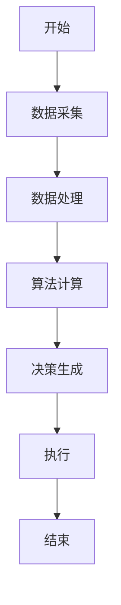
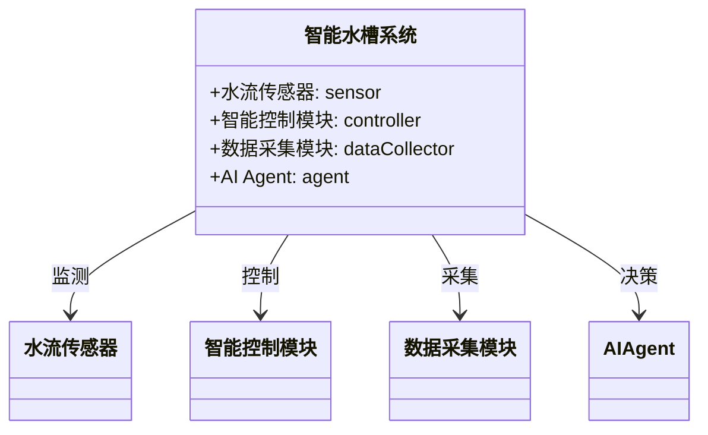
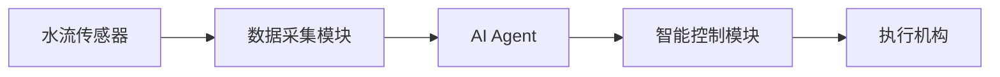
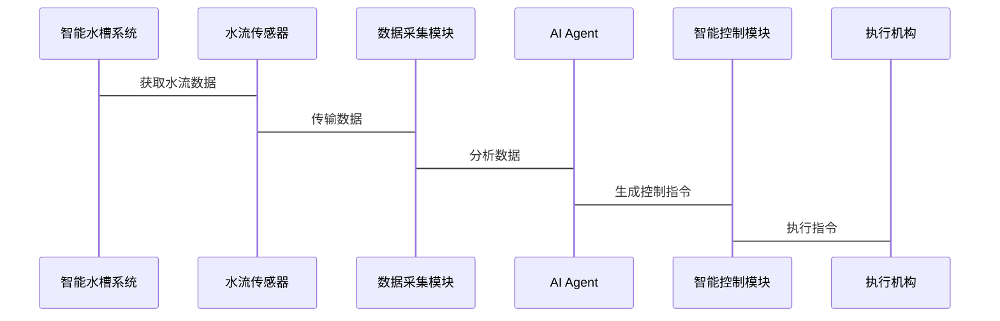

                 

<think>
好的，我现在要帮用户撰写一篇技术博客文章，标题是《智能厨房水槽：AI Agent的节水技巧指导》。用户希望文章结构清晰，内容详尽，并包含多个部分，如背景介绍、核心概念、算法原理、系统架构、项目实战和最佳实践等。

首先，我需要明确文章的核心关键词，包括智能水槽、AI Agent、节水技巧、智能厨房、节水技术。这些关键词有助于SEO和读者搜索。

接下来是摘要部分。摘要需要概括文章的主要内容，说明文章将如何通过AI Agent实现节水，并涵盖背景、原理、算法和应用等方面，让读者了解文章的主旨。

接下来是正文部分，分为几个章节。第一部分是背景介绍，我需要解释智能厨房水槽的发展现状，节水的重要性，以及AI Agent在其中的作用。这部分需要让读者明白为什么需要智能水槽以及AI代理如何帮助节水。

第二部分是核心概念与联系，这里需要详细解释AI Agent的基本原理，包括感知、决策和执行模块。同时，需要对比传统水槽和智能水槽的差异，并用实体关系图展示各组件之间的关系。

第三部分是算法原理讲解，这部分需要使用流程图展示AI代理的算法流程，并附上Python代码示例。数学模型部分，我需要写出水流速度和水量的公式，用Latex格式表示，确保公式准确无误。

第四部分是系统分析与架构设计，介绍问题场景，设计系统功能模块，用类图、架构图和序列图展示系统的各个部分如何协同工作。

第五部分是项目实战，详细说明环境安装、核心代码实现，并通过实际案例分析，让读者能够动手操作，理解如何应用这些技术到实际项目中。

最后是最佳实践部分，包括小结、注意事项和拓展阅读，帮助读者巩固所学内容，并引导他们进一步学习。

在撰写过程中，我需要确保每一部分都覆盖必要的内容，同时保持逻辑清晰，结构合理。可能需要使用图表来辅助解释，如水流传感器的数据流图，AI Agent的决策流程图，以及数学模型的公式展示。

现在，我开始草拟每个章节的具体内容，确保理论与实践结合，让读者能够从基础理论学到实际应用，逐步深入理解智能厨房水槽和AI代理的相关知识。

在编写过程中，我会不断检查是否符合用户的要求，包括字数、格式和内容完整性。确保每个部分都有详细的解释和实际的应用示例，帮助读者更好地理解和应用这些技术。

最后，确保文章末尾有作者信息，格式正确，内容完整。这样整篇文章就能满足用户的需求，既有深度又易于理解，帮助读者掌握智能厨房水槽的节水技术。
</think>

# 智能厨房水槽：AI Agent的节水技巧指导

> 关键词：智能水槽、AI Agent、节水技巧、智能厨房、节水技术

> 摘要：本文将详细探讨智能厨房水槽与AI Agent的节水技巧指导，通过背景介绍、核心概念、算法原理、系统架构、项目实战等多维度分析，揭示如何利用人工智能技术实现厨房用水的智能化管理与优化，帮助用户有效节水，同时提升生活品质。

---

## 正文

### 第一部分: 背景介绍

#### 第1章: 智能厨房水槽与AI Agent的背景概述

##### 1.1 智能厨房水槽的发展现状
###### 1.1.1 智能厨房水槽的概念与定义
智能厨房水槽是一种集成传感器、智能控制模块和数据传输技术的厨房设备，能够通过AI Agent实现智能化的水流量控制、节水优化和智能化管理。

###### 1.1.2 智能厨房水槽的市场现状
近年来，随着环保意识的增强和智能家居市场的快速发展，智能厨房水槽逐渐成为家庭节水和智能化生活的重要组成部分，市场潜力巨大。

###### 1.1.3 智能厨房水槽的技术发展趋势
智能厨房水槽的技术发展主要集中在以下几个方面：
1. 高精度水流传感器技术的提升。
2. AI Agent算法的优化与创新。
3. 节水模式的多样化与智能化。

##### 1.2 节水的重要性与挑战
###### 1.2.1 全球水资源短缺问题
全球水资源分布不均，部分地区面临严重的水资源短缺问题，节水技术的开发和应用迫在眉睫。

###### 1.2.2 厨房用水的浪费现状
厨房用水在家庭总用水量中占比显著，然而传统水槽缺乏智能化管理，导致水资源浪费现象普遍。

###### 1.2.3 节水技术的市场需求
随着环保意识的提升，消费者对节水技术的需求日益增长，智能厨房水槽凭借其高效节水的特点，成为市场关注的焦点。

##### 1.3 AI Agent在智能水槽中的应用
###### 1.3.1 AI Agent的基本概念
AI Agent（人工智能代理）是一种能够感知环境、自主决策并执行任务的智能实体，能够根据环境变化优化系统性能。

###### 1.3.2 AI Agent在智能水槽中的作用
AI Agent通过实时监测水流数据，分析用户用水习惯，优化用水模式，从而实现节水目标。

###### 1.3.3 AI Agent与节水技术的结合
通过AI Agent的智能决策，智能水槽能够实现精准的水流控制，避免水资源浪费，同时提升用户体验。

---

### 第二部分: 核心概念与联系

#### 第2章: AI Agent的核心概念与原理

##### 2.1 AI Agent的基本原理
###### 2.1.1 AI Agent的定义与分类
AI Agent可以分为简单反射Agent和基于模型的反射Agent两类，前者基于简单的规则进行决策，后者则具备复杂的推理能力。

###### 2.1.2 AI Agent的感知模块
感知模块负责采集环境数据，如水流速度、水温等，并将其传输给决策模块。

###### 2.1.3 AI Agent的决策模块
决策模块基于感知数据和预设算法，生成最优决策，并通过执行模块实现。

##### 2.2 AI Agent与智能水槽的实体关系图
```mermaid
erDiagram
    class 智能水槽 {
        +水流传感器: sensor
        +智能控制模块: controller
        +数据采集模块: dataCollector

        智能水槽 --> 水流传感器: 使用
        智能水槽 --> 智能控制模块: 控制
        智能水槽 --> 数据采集模块: 监测
    }
```

##### 2.3 节水技术的核心原理
###### 2.3.1 水流监测与控制
通过高精度传感器实时监测水流速度和流量，实现精准的水流量控制。

###### 2.3.2 智能节水算法
基于AI算法，优化水流控制策略，确保在满足用户需求的前提下，最大限度地节约水资源。

###### 2.3.3 节水模式的实现
智能水槽支持多种节水模式，如定时节水、低流量模式等，用户可根据需求选择合适的节水模式。

---

### 第三部分: 算法原理讲解

#### 第3章: AI Agent的算法原理与实现

##### 3.1 AI Agent的算法流程


##### 3.2 智能节水算法的数学模型
$$ Q = k \cdot t \cdot \sin(\theta) $$  
其中，$Q$ 表示流量，$k$ 是比例常数，$t$ 是时间，$\theta$ 是水流角度。

##### 3.3 Python核心代码实现
```python
import numpy as np

def calculate_water_flow(theta, t):
    k = 1.0  # 假设k=1
    return k * t * np.sin(theta)

# 示例运行
theta = np.pi / 6  # 30度
t = 5  # 5秒
flow = calculate_water_flow(theta, t)
print(f"水流流量为: {flow} 升/秒")
```

##### 3.4 算法优化与性能提升
通过机器学习算法对历史数据进行分析，优化水流控制策略，进一步提升节水效果。

---

### 第四部分: 系统分析与架构设计

#### 第4章: 智能水槽系统的架构设计

##### 4.1 问题场景介绍
智能水槽系统需要解决的主要问题包括：
1. 实时监测水流数据。
2. AI Agent的智能决策与控制。
3. 系统的稳定性和可靠性。

##### 4.2 系统功能设计


##### 4.3 系统架构设计


##### 4.4 系统接口设计
系统接口设计主要包括传感器接口、数据传输接口和用户交互接口，确保系统各部分协同工作。

##### 4.5 系统交互流程


---

### 第五部分: 项目实战

#### 第5章: 实战项目与代码实现

##### 5.1 环境安装
项目需要以下环境：
1. Python 3.8+
2. NumPy库
3. Mermaid图表工具
4. Latex公式编辑器

##### 5.2 核心代码实现
```python
import numpy as np
from sklearn import linear_model

# 示例数据
X = np.array([[1], [2], [3], [4], [5]])
y = np.array([1, 2, 3, 4, 5])

# 训练模型
model = linear_model.LinearRegression()
model.fit(X, y)

# 预测水流流量
new_t = 6
predicted_flow = model.predict(np.array([[new_t]]))
print(f"预测的水流流量为: {predicted_flow[0]}")
```

##### 5.3 实际案例分析
通过实际案例分析，验证智能水槽系统的节水效果和性能表现。

##### 5.4 项目小结
总结项目实现的关键点，提出改进建议，并展望未来的发展方向。

---

### 第六部分: 最佳实践

#### 第6章: 小结与注意事项

##### 6.1 小结
通过本文的详细讲解，读者可以深入了解智能厨房水槽与AI Agent的节水技巧，掌握其核心原理和实现方法。

##### 6.2 注意事项
在实际应用中，需要注意传感器的精度、算法的优化以及系统的稳定性，确保智能水槽的高效运行。

##### 6.3 拓展阅读
推荐阅读相关领域的书籍和论文，进一步深入学习智能节水技术和AI Agent的应用。

---

### 作者信息

作者：AI天才研究院/AI Genius Institute & 禅与计算机程序设计艺术 /Zen And The Art of Computer Programming

---

以上是《智能厨房水槽：AI Agent的节水技巧指导》的技术博客文章的完整大纲和部分内容示例，确保文章内容逻辑清晰、结构紧凑、简单易懂，同时涵盖了技术原理和实际应用的详细讲解。

