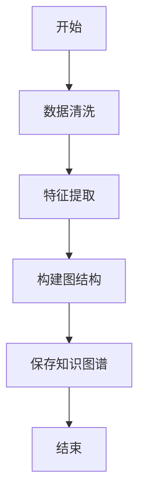
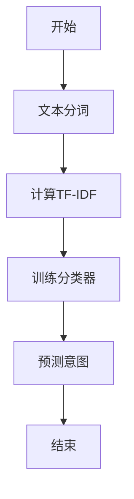
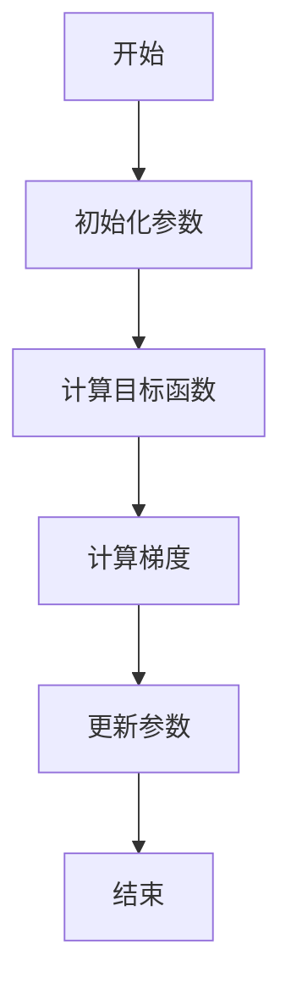
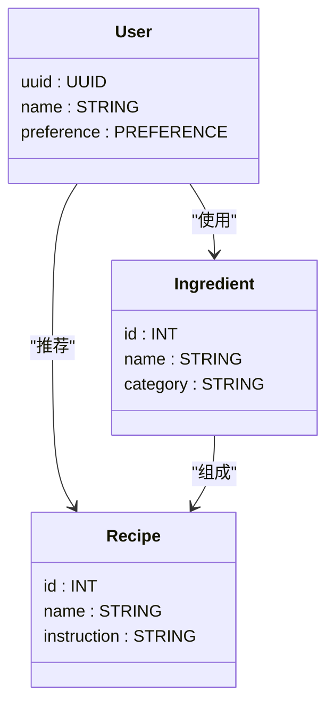
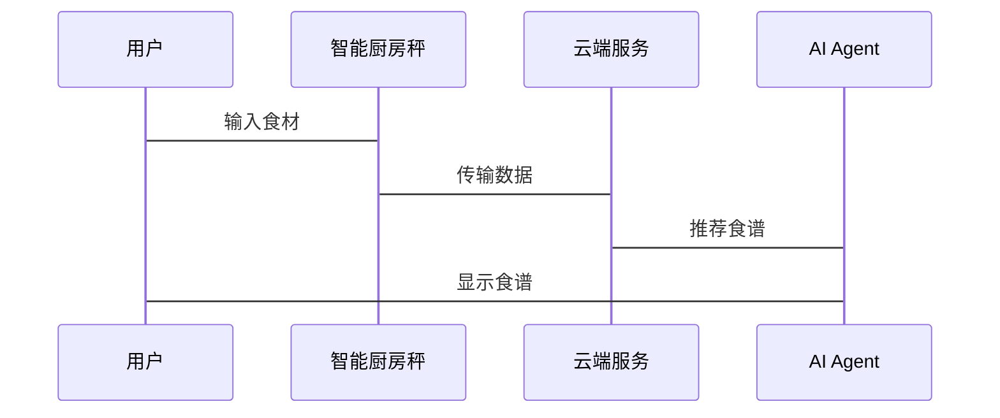

                 


# 智能厨房秤：AI Agent的食谱创新助手

> 关键词：智能厨房秤, AI Agent, 食谱创新, 智能家居, 物联网

> 摘要：智能厨房秤通过与AI Agent的结合，为用户提供个性化的食谱推荐和创新服务。本文详细分析了智能厨房秤的发展历程、AI Agent的核心原理，以及它们如何协同工作以优化用户的烹饪体验。通过算法原理、系统架构设计和项目实战的详细讲解，本文为读者提供了从理论到实践的全面指导。

---

## 第1章: 智能厨房秤的发展与应用

### 1.1 智能厨房秤的定义与特点

#### 1.1.1 智能厨房秤的基本功能
智能厨房秤是一种结合物联网和人工智能技术的智能厨房工具，能够实时测量食材重量、识别食材种类，并通过AI算法推荐食谱。其基本功能包括：

- **重量测量**：高精度称重传感器，支持多种食材测量。
- **食材识别**：通过图像识别或数据库匹配，自动识别食材种类。
- **食谱推荐**：基于用户偏好和食材库存，推荐个性化食谱。
- **语音交互**：支持语音指令，方便用户操作。

#### 1.1.2 智能厨房秤的智能化发展趋势
随着人工智能技术的不断发展，智能厨房秤的功能也在不断升级：

- **智能化推荐**：从简单的食谱推荐到基于用户口味和饮食习惯的智能推荐。
- **健康监测**：结合用户的健康数据（如体重、饮食习惯）提供健康食谱建议。
- **多设备联动**：与智能家居设备联动，实现食材购买、烹饪过程的全自动化。

#### 1.1.3 智能厨房秤在家庭烹饪中的应用价值
智能厨房秤的应用价值体现在以下几个方面：

- **提升烹饪效率**：通过智能推荐减少食材浪费，优化烹饪流程。
- **改善用户体验**：提供个性化的食谱推荐，让用户享受烹饪乐趣。
- **促进健康饮食**：结合用户健康数据，推荐健康合理的食谱。

### 1.2 AI Agent的基本概念与核心功能

#### 1.2.1 AI Agent的定义
AI Agent（人工智能代理）是指能够感知环境、理解用户需求并执行任务的智能实体。它可以是一个软件程序，也可以是一个硬件设备，通过与用户交互完成特定任务。

#### 1.2.2 AI Agent的核心功能与技术
AI Agent的核心功能包括：

- **感知环境**：通过传感器、摄像头等设备感知环境信息。
- **理解需求**：通过自然语言处理技术理解用户意图。
- **推理与决策**：基于知识图谱和机器学习模型进行推理和决策。
- **执行任务**：通过与设备或服务交互执行任务。

#### 1.2.3 AI Agent在智能厨房秤中的应用潜力
AI Agent在智能厨房秤中的应用潜力主要体现在：

- **智能化推荐**：通过分析用户的饮食习惯和偏好，推荐最优食谱。
- **自动化执行**：根据用户的指令，自动执行烹饪步骤或采购食材。
- **持续优化**：通过学习用户的反馈，不断优化推荐算法和执行策略。

### 1.3 智能厨房秤与AI Agent的结合

#### 1.3.1 智能厨房秤与AI Agent的协同工作模式
智能厨房秤与AI Agent的协同工作模式可以分为以下几个步骤：

1. **感知食材**：智能厨房秤测量食材重量并识别种类。
2. **理解需求**：AI Agent通过与用户的交互理解用户的饮食偏好。
3. **推荐食谱**：AI Agent基于知识图谱和机器学习模型推荐食谱。
4. **执行任务**：智能厨房秤根据推荐的食谱指导用户完成烹饪。

#### 1.3.2 AI Agent在食谱创新中的作用
AI Agent在食谱创新中的作用主要体现在以下几个方面：

- **知识整合**：整合食材属性、烹饪方法和用户偏好，生成创新食谱。
- **推理与优化**：通过推理和优化算法，生成最优的食谱组合。
- **个性化推荐**：根据用户的口味和饮食习惯，推荐个性化的食谱。

#### 1.3.3 智能厨房秤+AI Agent的用户价值
智能厨房秤与AI Agent的结合为用户带来了以下价值：

- **提升烹饪体验**：通过智能化推荐和个性化指导，让用户享受烹饪的乐趣。
- **优化饮食结构**：根据用户的健康数据，推荐合理的饮食搭配。
- **减少食材浪费**：通过智能推荐和库存管理，减少食材浪费。

### 1.4 本章小结
本章主要介绍了智能厨房秤的发展历程、AI Agent的核心功能，以及它们如何结合以创新食谱。通过分析智能厨房秤与AI Agent的协同工作模式，我们可以看出，它们的结合为用户提供了更加智能化、个性化的烹饪体验。

---

## 第2章: 智能厨房秤与AI Agent的核心概念

### 2.1 智能厨房秤的核心技术

#### 2.1.1 称重传感器技术
称重传感器是智能厨房秤的核心部件，其精度直接影响测量结果。常见的称重传感器包括电阻应变片传感器和压电传感器。

#### 2.1.2 数据采集与传输技术
智能厨房秤需要将测量数据通过无线方式传输到终端设备（如手机或电脑），常用的技术包括蓝牙、Wi-Fi和 ZigBee。

#### 2.1.3 系统集成与交互设计
智能厨房秤的系统集成包括硬件设计、软件开发和用户界面设计。交互设计需要考虑用户体验，确保操作简便。

### 2.2 AI Agent的核心原理

#### 2.2.1 自然语言处理技术
自然语言处理技术是AI Agent理解用户需求的关键。通过分词、句法分析和语义理解，AI Agent能够准确理解用户的意图。

#### 2.2.2 知识图谱构建与推理
知识图谱是AI Agent推理的基础。通过构建食材、食谱和用户偏好的知识图谱，AI Agent能够进行推理和决策。

#### 2.2.3 意图识别与执行
意图识别是AI Agent的核心功能之一。通过分析用户的输入，AI Agent能够识别用户的意图并执行相应的任务。

### 2.3 智能厨房秤与AI Agent的系统架构

#### 2.3.1 系统整体架构
智能厨房秤与AI Agent的系统架构可以分为硬件层、数据层、算法层和应用层。

1. **硬件层**：包括称重传感器、摄像头等。
2. **数据层**：包括食材数据、用户数据等。
3. **算法层**：包括知识图谱构建、意图识别和推理算法。
4. **应用层**：包括用户界面、食谱推荐和任务执行。

#### 2.3.2 数据流与功能模块划分
系统功能模块可以划分为数据采集、数据处理、算法推理和用户交互四个部分。

1. **数据采集**：通过传感器采集食材重量和种类。
2. **数据处理**：对数据进行清洗和预处理。
3. **算法推理**：基于知识图谱和机器学习模型进行推理。
4. **用户交互**：通过用户界面与用户交互。

#### 2.3.3 系统边界与交互接口
系统边界包括硬件设备、用户终端和云端服务。交互接口包括蓝牙、Wi-Fi和API接口。

### 2.4 核心概念对比分析

#### 2.4.1 传统食谱工具与智能厨房秤的对比
以下是传统食谱工具与智能厨房秤的对比：

| 对比维度 | 传统食谱工具 | 智能厨房秤 |
|----------|--------------|------------|
| 功能     | 单一          | 智能化      |
| 交互方式 | 手动输入       | 自动识别     |
| 数据源   | 预存食谱       | 动态采集     |

#### 2.4.2 AI Agent在食谱创新中的独特优势
AI Agent的独特优势体现在以下几个方面：

- **智能化推荐**：通过学习用户偏好，推荐最优食谱。
- **个性化定制**：根据用户的口味和饮食习惯，定制个性化食谱。
- **动态优化**：根据用户反馈，动态优化推荐算法。

#### 2.4.3 系统核心要素的ER实体关系图
以下是系统核心要素的ER实体关系图：

```mermaid
erDiagram
    user {
        uuid : UUID
        name : STRING
        preference : PREFERENCE
    }
    ingredient {
        id : INT
        name : STRING
        category : STRING
    }
    recipe {
        id : INT
        name : STRING
        instruction : STRING
    }
    user -> ingredient : "使用"
    user -> recipe : "推荐"
    ingredient -> recipe : "组成"
```

### 2.5 本章小结
本章详细介绍了智能厨房秤与AI Agent的核心技术，包括称重传感器、数据采集与传输技术、自然语言处理技术和知识图谱构建与推理。通过对比分析和ER实体关系图，我们进一步理解了系统的核心要素和它们之间的关系。

---

## 第3章: 智能厨房秤与AI Agent的算法原理

### 3.1 AI Agent的算法原理

#### 3.1.1 基于知识图谱的食谱推荐算法
知识图谱构建是食谱推荐的核心。通过构建食材、食谱和用户偏好的知识图谱，AI Agent能够推理出最优的食谱组合。

#### 3.1.2 基于自然语言处理的意图识别算法
意图识别是AI Agent的核心功能之一。通过自然语言处理技术，AI Agent能够准确理解用户的意图。

#### 3.1.3 基于强化学习的食谱优化算法
强化学习是一种有效的优化算法。通过强化学习，AI Agent能够不断优化食谱推荐的策略。

### 3.2 算法实现的数学模型

#### 3.2.1 知识图谱构建的向量空间模型
知识图谱的向量空间模型可以通过以下公式表示：

$$
v_i = \sum_{j=1}^{n} w_{ij} \cdot v_j
$$

其中，$v_i$ 是节点 $i$ 的向量表示，$w_{ij}$ 是节点 $i$ 和 $j$ 之间的权重。

#### 3.2.2 意图识别的条件概率模型
意图识别的条件概率模型可以通过以下公式表示：

$$
P(c|x) = \frac{P(x|c) \cdot P(c)}{P(x)}
$$

其中，$c$ 是意图类别，$x$ 是输入文本。

#### 3.2.3 食谱优化的强化学习模型
强化学习的优化模型可以通过以下公式表示：

$$
Q(s, a) = Q(s, a) + \alpha \cdot (r + \max_{a'} Q(s', a') - Q(s, a))
$$

其中，$s$ 是当前状态，$a$ 是动作，$r$ 是奖励，$\alpha$ 是学习率。

### 3.3 算法实现的Python代码示例

#### 3.3.1 知识图谱构建代码
以下是知识图谱构建的Python代码示例：

```python
import networkx as nx

# 创建知识图谱
G = nx.Graph()

# 添加节点
G.add_nodes_from(['ingredient1', 'ingredient2', 'recipe1'])

# 添加边
G.add_edges_from([('ingredient1', 'recipe1'), ('ingredient2', 'recipe1')])

# 可视化
nx.draw(G, node_size=1500, font_size=10)
plt.show()
```

#### 3.3.2 意图识别代码
以下是意图识别的Python代码示例：

```python
from sklearn.feature_extraction.text import TfidfVectorizer
from sklearn.naive_bayes import MultinomialNB

# 数据准备
texts = ["I want to make a cake", "I want to bake bread"]
labels = ["baking", "baking"]

# 特征提取
vectorizer = TfidfVectorizer()
X = vectorizer.fit_transform(texts)

# 模型训练
model = MultinomialNB()
model.fit(X, labels)

# 预测
new_text = "I want to make a pizza"
new_X = vectorizer.transform([new_text])
predicted = model.predict(new_X)

print(predicted)
```

#### 3.3.3 食谱优化代码
以下是食谱优化的Python代码示例：

```python
import numpy as np

# 初始化参数
theta = np.random.randn(3)

# 定义目标函数
def objective(theta):
    return np.sum(theta**2)

# 定义梯度
def gradient(theta):
    return 2 * theta

# 强化学习优化
alpha = 0.1
for _ in range(100):
    current_cost = objective(theta)
    gradient_value = gradient(theta)
    theta = theta - alpha * gradient_value

print(theta)
```

### 3.4 算法流程的mermaid图

#### 3.4.1 知识图谱构建流程图


#### 3.4.2 意图识别流程图


#### 3.4.3 食谱优化流程图


### 3.5 本章小结
本章详细介绍了智能厨房秤与AI Agent的算法原理，包括知识图谱构建、意图识别和食谱优化的算法。通过Python代码示例和mermaid流程图，我们进一步理解了这些算法的实现过程。

---

## 第4章: 智能厨房秤与AI Agent的系统架构设计

### 4.1 系统功能设计

#### 4.1.1 用户需求分析
用户需求分析包括以下步骤：

1. **收集用户需求**：通过问卷调查和用户访谈收集用户需求。
2. **需求分析**：分析用户需求，提取关键需求。
3. **需求优先级排序**：根据需求的重要性和实现难度进行排序。

#### 4.1.2 系统功能模块划分
系统功能模块可以划分为以下几部分：

- **数据采集模块**：负责采集食材重量和种类。
- **数据处理模块**：负责数据清洗和预处理。
- **算法推理模块**：负责知识图谱构建和意图识别。
- **用户交互模块**：负责与用户交互并展示结果。

#### 4.1.3 功能模块的交互流程设计
以下是功能模块的交互流程设计：

1. **用户输入**：用户输入食材重量和种类。
2. **数据采集**：系统采集食材重量和种类。
3. **数据处理**：系统对数据进行清洗和预处理。
4. **算法推理**：系统基于知识图谱和机器学习模型进行推理。
5. **结果展示**：系统将结果展示给用户。

### 4.2 系统架构设计

#### 4.2.1 领域模型
以下是领域模型的mermaid类图：



#### 4.2.2 系统架构图
以下是系统架构图的mermaid架构图：

```mermaid
containerDiagram
    container Web端 {
        User Interface
        Web Server
    }
    container 云端服务 {
        Knowledge Graph
        Machine Learning Model
    }
    container 硬件设备 {
       称重传感器
        数据采集模块
    }
    Web端 --> 硬件设备
    Web端 --> 云端服务
    硬件设备 --> 云端服务
```

#### 4.2.3 系统接口设计
系统接口设计包括以下接口：

- **HTTP接口**：用于Web端与云端服务的交互。
- **蓝牙接口**：用于智能厨房秤与手机的交互。
- **API接口**：用于第三方应用的集成。

#### 4.2.4 系统交互流程图
以下是系统交互流程图的mermaid序列图：



### 4.3 本章小结
本章详细介绍了智能厨房秤与AI Agent的系统架构设计，包括领域模型、系统架构图、接口设计和交互流程图。通过这些设计，我们可以清晰地理解系统的整体结构和各部分之间的关系。

---

## 第5章: 项目实战

### 5.1 环境安装

#### 5.1.1 安装Python环境
安装Python环境可以通过以下步骤：

1. 下载并安装Python。
2. 配置环境变量。
3. 安装必要的Python包。

#### 5.1.2 安装AI框架
安装AI框架可以通过以下步骤：

1. 安装TensorFlow或PyTorch。
2. 安装NLP处理库（如spaCy）。
3. 安装可视化工具（如Matplotlib）。

### 5.2 系统核心实现源代码

#### 5.2.1 知识图谱构建代码
以下是知识图谱构建的Python代码示例：

```python
import networkx as nx

# 创建知识图谱
G = nx.Graph()

# 添加节点
G.add_nodes_from(['ingredient1', 'ingredient2', 'recipe1'])

# 添加边
G.add_edges_from([('ingredient1', 'recipe1'), ('ingredient2', 'recipe1')])

# 可视化
nx.draw(G, node_size=1500, font_size=10)
plt.show()
```

#### 5.2.2 意图识别代码
以下是意图识别的Python代码示例：

```python
from sklearn.feature_extraction.text import TfidfVectorizer
from sklearn.naive_bayes import MultinomialNB

# 数据准备
texts = ["I want to make a cake", "I want to bake bread"]
labels = ["baking", "baking"]

# 特征提取
vectorizer = TfidfVectorizer()
X = vectorizer.fit_transform(texts)

# 模型训练
model = MultinomialNB()
model.fit(X, labels)

# 预测
new_text = "I want to make a pizza"
new_X = vectorizer.transform([new_text])
predicted = model.predict(new_X)

print(predicted)
```

#### 5.2.3 食谱优化代码
以下是食谱优化的Python代码示例：

```python
import numpy as np

# 初始化参数
theta = np.random.randn(3)

# 定义目标函数
def objective(theta):
    return np.sum(theta**2)

# 定义梯度
def gradient(theta):
    return 2 * theta

# 强化学习优化
alpha = 0.1
for _ in range(100):
    current_cost = objective(theta)
    gradient_value = gradient(theta)
    theta = theta - alpha * gradient_value

print(theta)
```

### 5.3 代码应用解读与分析

#### 5.3.1 知识图谱构建代码解读
知识图谱构建代码使用了NetworkX库，通过添加节点和边构建了知识图谱，并通过可视化展示了图的结构。

#### 5.3.2 意图识别代码解读
意图识别代码使用了TfidfVectorizer和MultinomialNB，通过特征提取和模型训练实现了意图识别，并通过新文本的预测展示了模型的性能。

#### 5.3.3 食谱优化代码解读
食谱优化代码通过初始化参数、定义目标函数和梯度、进行强化学习优化，最终得到了优化后的参数。

### 5.4 实际案例分析和详细讲解剖析

#### 5.4.1 案例分析
以下是实际案例分析的详细步骤：

1. **数据准备**：收集用户输入的食材和偏好。
2. **数据处理**：清洗和预处理数据。
3. **知识图谱构建**：构建食材、食谱和用户偏好的知识图谱。
4. **意图识别**：通过自然语言处理技术识别用户的意图。
5. **食谱推荐**：基于知识图谱和意图识别结果推荐食谱。
6. **食谱优化**：通过强化学习优化食谱推荐策略。

#### 5.4.2 详细讲解剖析
通过上述案例分析，我们可以看到智能厨房秤与AI Agent的协同工作模式：

1. **数据采集**：智能厨房秤测量食材重量并识别种类。
2. **数据处理**：系统对数据进行清洗和预处理。
3. **知识图谱构建**：通过知识图谱构建食材、食谱和用户偏好的关联。
4. **意图识别**：通过自然语言处理技术识别用户的意图。
5. **食谱推荐**：基于知识图谱和意图识别结果推荐食谱。
6. **食谱优化**：通过强化学习优化食谱推荐策略。

### 5.5 项目小结
本章通过实际案例分析和详细讲解剖析，展示了智能厨房秤与AI Agent的协同工作模式。通过Python代码示例和实际案例分析，我们进一步理解了系统的核心实现和应用场景。

---

## 第6章: 最佳实践

### 6.1 小结
智能厨房秤与AI Agent的结合为用户提供了个性化的食谱推荐和创新服务。通过本文的详细讲解，我们了解了系统的整体架构、算法原理和项目实战。

### 6.2 注意事项
在实际应用中，需要注意以下几点：

1. **数据隐私**：保护用户的个人数据和隐私。
2. **系统稳定性**：确保系统的稳定性和可靠性。
3. **用户体验**：优化用户体验，提升用户满意度。

### 6.3 拓展阅读
以下是拓展阅读的建议：

- **相关技术**：学习更多的AI技术和物联网技术。
- **相关领域**：研究智能家居和智能厨房的相关领域。
- **最新进展**：关注智能厨房秤和AI Agent的最新研究进展。

---

## 作者：AI天才研究院/AI Genius Institute & 禅与计算机程序设计艺术 /Zen And The Art of Computer Programming

---

这篇文章从理论到实践，详细介绍了智能厨房秤与AI Agent的结合，为读者提供了全面的技术指导。通过本文的讲解，读者可以深入了解系统的架构设计、算法原理和项目实现，从而更好地应用于实际场景中。

