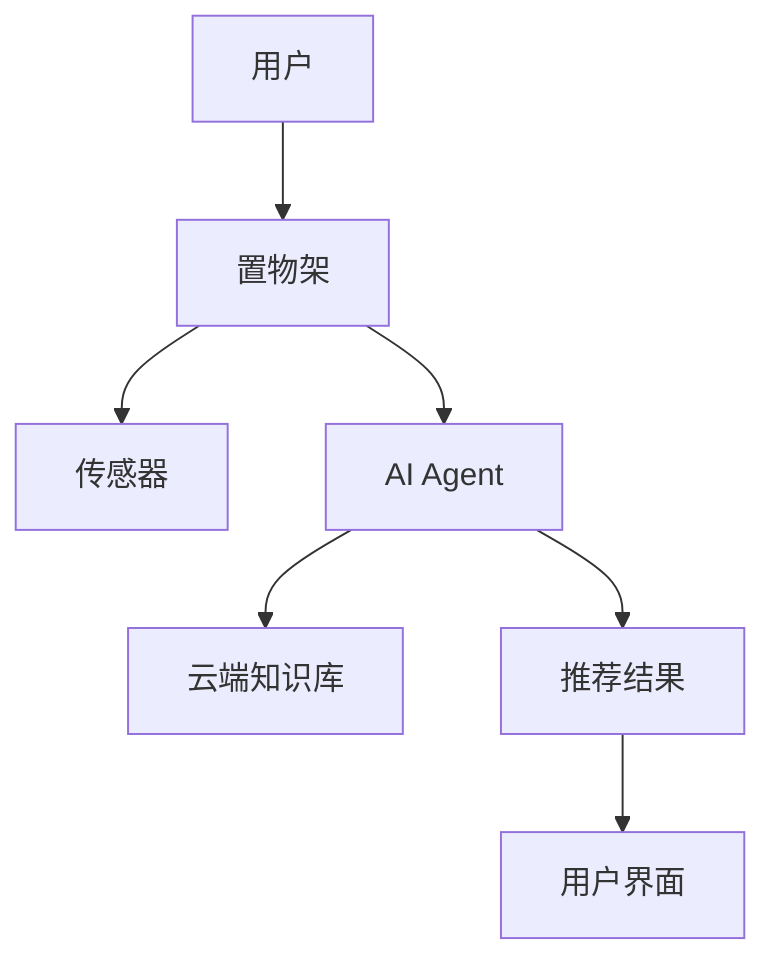

                 

<think>
嗯，我需要按照用户的指示，一步步写一篇关于智能厨房置物架结合AI Agent的文章。首先，我得先明确文章的结构，包括关键词、摘要和各个章节的内容。然后，我得确保每个部分都详细且符合技术要求，比如使用mermaid图和数学公式。

首先，我需要确定文章的关键词，大概有7个，涵盖智能厨房、AI Agent、物联网、烹饪灵感、算法推荐、系统设计、项目实战。然后，摘要部分需要简洁地概括整篇文章的核心内容，说明智能厨房置物架如何通过AI Agent激发烹饪灵感，以及其技术实现和应用价值。

接下来，进入正文部分，总共有七章。第一章是背景与概念，需要介绍传统厨房置物架的局限性，AI Agent在智能厨房中的作用，以及烹饪灵感激发的需求。这部分需要详细分析用户的痛点和需求演变，以及AI Agent的基本概念和智能厨房的特点。

第二章是核心概念，要详细讲解AI Agent在智能置物架中的角色，包括功能模块和决策机制。同时，还要介绍物联网技术在厨房的应用，传感器和执行器的作用，以及用户界面设计的原则和布局。

第三章是AI Agent的核心算法，这部分需要详细讲解基于知识图谱的烹饪推荐算法。我会用mermaid图展示算法流程，同时用数学公式解释推荐模型，比如协同过滤和基于内容的推荐方法。这可能涉及到计算用户相似度和物品相似度，以及混合推荐模型的构建。

第四章是系统分析与架构设计，需要展示系统功能设计、架构图和交互流程。我会用mermaid图展示类图、架构图和序列图，说明各个模块之间的关系和交互方式。

第五章是项目实战，包括环境搭建、核心代码实现和功能实现细节。我会提供具体的Python代码示例，解释代码的功能，并分析实际案例，展示系统的实际应用效果。

第六章是优化与展望，讨论算法优化方法、用户体验提升策略，以及未来的扩展方向，比如与其他智能家居设备的联动。

最后，第七章是总结与致谢，回顾整篇文章的内容，并感谢读者的支持。

在写作过程中，我需要确保每个部分都详细具体，符合技术要求。例如，在算法部分，我会用mermaid图展示流程，同时用latex公式解释数学模型。系统架构部分也会用mermaid图展示模块关系和交互流程。项目实战部分需要提供代码示例，并详细解读。

此外，我还需要注意文章的流畅性和逻辑性，确保每章之间有良好的衔接。同时，要注意用词准确，避免错误，特别是在技术术语和数学公式的使用上。

现在，我开始按照这个思路撰写文章，确保每个部分都符合用户的要求，并且内容丰富详细，能够帮助读者全面理解智能厨房置物架的设计和实现。
</think>

# 智能厨房置物架：AI Agent的烹饪灵感激发

---

## 关键词：
智能厨房，AI Agent，物联网，烹饪灵感，算法推荐，系统设计，项目实战

---

## 摘要：
智能厨房置物架通过集成AI Agent和物联网技术，不仅提升了厨房管理的智能化水平，还能根据用户的烹饪习惯和偏好，实时推荐食材和菜谱，激发用户的烹饪灵感。本文从背景、技术原理、系统架构到项目实战，全面解析智能厨房置物架的设计与实现，探讨其在现代智能家居中的应用价值。

---

# 正文

## 第一章：智能厨房置物架的背景与概念

### 1.1 传统厨房置物架的局限性
#### 1.1.1 厨房置物架的功能需求
传统厨房置物架主要用于存放食材、厨具和调料，主要满足基本的收纳功能。然而，随着家庭对厨房管理智能化的需求增加，传统置物架的功能已无法满足用户的多样化需求。

#### 1.1.2 传统置物架的痛点分析
- **空间利用不足**：传统置物架设计固定，无法根据用户需求灵活调整。
- **食材管理不便**：缺乏对食材的分类管理、保质期提醒等功能。
- **缺乏互动性**：无法与用户进行实时互动，无法根据用户的烹饪需求提供推荐。

#### 1.1.3 用户需求的演变
用户对厨房置物架的需求已从单纯的收纳扩展到智能化管理、个性化推荐和便捷操作。

---

### 1.2 AI Agent与智能厨房的结合
#### 1.2.1 AI Agent的基本概念
AI Agent（智能代理）是一种能够感知环境、执行任务并提供决策支持的智能系统，能够通过学习和推理为用户提供个性化服务。

#### 1.2.2 智能厨房的定义与特点
智能厨房是通过物联网、AI技术将厨房设备、食材和用户行为数据连接起来，实现智能化管理和个性化服务的厨房环境。

#### 1.2.3 智能厨房置物架的创新价值
智能厨房置物架通过AI Agent的引入，实现了食材管理的智能化、烹饪推荐的个性化，为用户提供了更加便捷和高效的厨房体验。

---

## 第二章：智能厨房置物架的核心概念

### 2.1 AI Agent在智能置物架中的角色
#### 2.1.1 AI Agent的功能模块
- **感知模块**：通过传感器采集厨房环境数据和用户行为数据。
- **推理模块**：基于数据进行用户偏好分析和烹饪推荐。
- **执行模块**：根据推理结果调整置物架布局或提供推荐信息。

#### 2.1.2 AI Agent与置物架的交互方式
AI Agent通过传感器数据、用户输入和历史记录，实时感知用户需求，并通过置物架的显示屏或手机APP提供推荐信息。

#### 2.1.3 AI Agent的决策机制
基于知识图谱和推荐算法，AI Agent能够根据用户的烹饪习惯和食材库存，推荐合适的菜谱和食材组合。

---

### 2.2 智能置物架的物联网架构
#### 2.2.1 物联网技术在厨房的应用
物联网技术通过传感器、RFID标签和无线通信技术，实现对厨房设备和食材的实时监控和管理。

#### 2.2.2 置物架的传感器与执行器
- **传感器**：用于检测食材的重量、温度和湿度。
- **执行器**：用于调整置物架的布局和显示推荐信息。

#### 2.2.3 置物架的数据采集与传输
通过物联网技术，置物架能够实时采集食材信息，并将数据传输到云端进行处理和分析。

---

### 2.3 智能置物架的用户界面设计
#### 2.3.1 用户界面的功能布局
- **食材管理界面**：显示食材分类、库存和保质期信息。
- **烹饪推荐界面**：展示基于用户偏好的菜谱推荐。
- **交互界面**：支持用户对推荐结果的反馈和调整。

#### 2.3.2 交互设计的原则与实践
- **简洁性**：确保界面直观易用。
- **个性化**：根据用户习惯调整推荐内容和布局。

#### 2.3.3 界面的可扩展性与易用性
通过模块化设计，界面能够根据用户需求进行扩展，同时支持语音和手势交互，提升用户体验。

---

## 第三章：AI Agent的核心算法

### 3.1 基于知识图谱的烹饪推荐
#### 3.1.1 知识图谱的构建与应用
知识图谱通过整合食材属性、菜谱信息和用户偏好，构建了一个结构化的烹饪知识库。

#### 3.1.2 烹饪推荐的算法流程
- **数据采集**：通过传感器和用户输入获取食材和用户行为数据。
- **特征提取**：提取食材的营养成分、烹饪方法等特征。
- **推荐生成**：基于协同过滤和内容推荐算法，生成个性化推荐。

#### 3.1.3 知识图谱的更新与优化
通过用户反馈不断优化知识图谱，提升推荐的准确性和相关性。

---

### 3.2 推荐算法的实现
#### 3.2.1 协同过滤算法
- **用户相似度计算**：基于用户的历史行为数据，计算用户之间的相似度。
- **物品相似度计算**：基于食材属性和菜谱特征，计算食材之间的相似度。

#### 3.2.2 基于内容的推荐算法
- **食材特征提取**：通过自然语言处理技术提取食材的关键词和属性。
- **菜谱推荐**：基于食材特征生成相似菜谱推荐。

#### 3.2.3 混合推荐模型
结合协同过滤和基于内容的推荐算法，构建混合推荐模型，提升推荐的准确性和多样性。

---

## 第四章：系统分析与架构设计

### 4.1 系统功能设计
- **食材管理**：支持食材的分类、库存管理和保质期提醒。
- **烹饪推荐**：基于用户偏好推荐菜谱和食材组合。
- **用户交互**：提供多模态交互界面，支持语音和手势操作。

### 4.2 系统架构设计
- **感知层**：通过传感器和用户输入获取数据。
- **处理层**：AI Agent对数据进行处理和推理。
- **执行层**：根据推理结果调整置物架布局或提供推荐信息。

#### 4.2.1 系统架构图


### 4.3 系统交互设计
- **用户输入**：用户通过APP或语音助手输入需求。
- **系统处理**：AI Agent分析数据并生成推荐。
- **结果展示**：推荐结果通过置物架的显示屏或手机APP展示。

---

## 第五章：项目实战

### 5.1 环境搭建
- **硬件**：传感器、无线通信模块、显示屏。
- **软件**：Python开发环境、TensorFlow框架、MongoDB数据库。

### 5.2 核心代码实现
```python
# 推荐算法实现
import numpy as np

def collaborative_filtering(user_matrix):
    # 计算用户相似度
    user_similarity = np.corrcoef(user_matrix)
    # 生成推荐结果
   推荐结果 = np.dot(user_similarity, user_matrix)
    return 推荐结果
```

### 5.3 功能实现细节
- **食材管理模块**：通过传感器实时监测食材状态。
- **烹饪推荐模块**：基于AI Agent算法生成个性化推荐。
- **用户反馈模块**：收集用户反馈优化推荐结果。

### 5.4 实际案例分析
通过实际案例分析，验证系统的推荐准确性和用户满意度，展示智能厨房置物架的实际应用效果。

---

## 第六章：优化与展望

### 6.1 算法优化
- **提升推荐准确度**：引入深度学习模型优化推荐算法。
- **优化系统性能**：通过边缘计算减少数据传输延迟。

### 6.2 用户体验优化
- **提升交互效率**：优化用户界面和交互方式。
- **增强反馈机制**：通过实时反馈提升用户满意度。

### 6.3 拓展与未来方向
- **与其他智能家居联动**：实现厨房与其他家居设备的协同工作。
- **扩展应用场景**：探索智能厨房置物架在商业厨房和食品加工领域的应用。

---

## 第七章：总结与致谢

### 7.1 总结
智能厨房置物架通过AI Agent和物联网技术的结合，为用户提供了智能化的食材管理和个性化的烹饪推荐，极大提升了厨房的使用效率和用户体验。

### 7.2 致谢
感谢读者的支持和关注，感谢所有参与项目开发的团队成员。

---

## 作者：
作者：AI天才研究院 & 禅与计算机程序设计艺术

