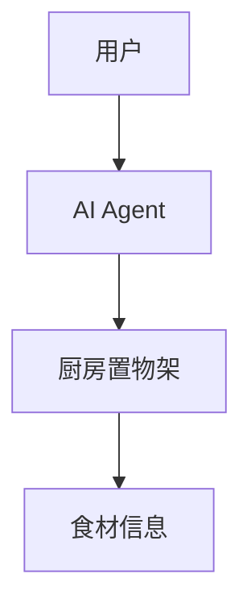
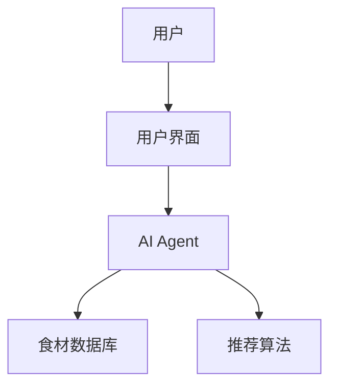
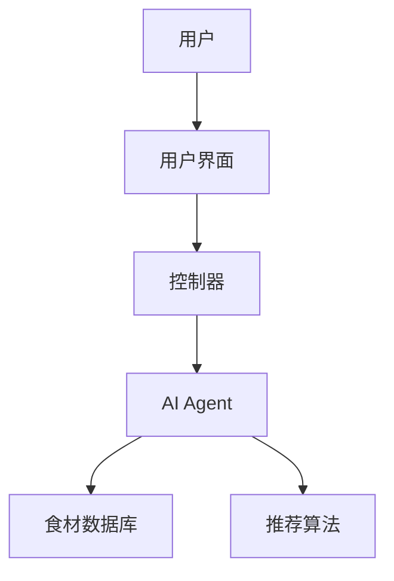

                 

<think>
好的，我现在需要帮助用户完成一个技术博客文章的撰写，主题是《智能厨房置物架：AI Agent的食材使用优化》。用户已经给出了一个详细的目录结构，我需要按照这个结构来逐步完成每一部分的内容，确保逻辑清晰、内容详实。

首先，我会从第一部分开始，也就是“智能厨房置物架的背景与核心概念”。这部分包括了背景介绍、核心概念与联系，以及设计目标与系统架构。我需要详细讲解每个部分，确保读者能够理解为什么智能厨房置物架需要AI Agent，以及它们是如何结合在一起工作的。

接下来是第二部分，关于AI Agent的核心原理。这部分需要解释AI Agent的基本原理，它如何与智能厨房置物架结合，以及它们之间的联系。这部分可能需要引入一些图表，比如实体关系图和系统架构图，来帮助读者更好地理解。

第三部分是AI Agent的算法原理与数学模型。这部分需要详细讲解推荐算法，包括协同过滤、内容推荐和混合推荐算法，并提供相应的数学模型和公式。可能还需要用代码示例来说明这些算法的应用。

第四部分是系统分析与架构设计。这里需要介绍系统的功能模块、架构设计、接口设计和交互流程。使用Mermaid图来展示系统的结构和流程，确保读者能够清晰理解系统是如何运作的。

第五部分是项目实战，通过具体的案例来展示如何实现智能厨房置物架的AI优化。包括环境安装、核心代码实现、实际应用分析和项目总结。

最后，我会总结整个项目，给出最佳实践的建议，注意事项，以及拓展阅读的方向，帮助读者进一步深入学习。

在整个过程中，我需要确保每一部分都详细、准确，并且使用清晰易懂的语言。同时，图表和代码示例要准确无误，能够帮助读者更好地理解和应用这些知识。

现在，我将按照目录结构一步步完成这篇文章的内容，确保每一部分都符合用户的要求，并且内容丰富、逻辑清晰。
</think>

# 智能厨房置物架：AI Agent的食材使用优化

## 关键词：智能厨房置物架、AI Agent、食材优化、推荐算法、系统架构、项目实战

## 摘要：  
本文探讨如何利用AI Agent技术优化智能厨房置物架的食材管理，通过推荐算法和系统架构设计，实现食材的高效使用和浪费最小化。文章从背景介绍、核心概念、算法原理、系统架构到项目实战，全面解析智能厨房置物架的AI优化方案。

---

# 第一部分: 智能厨房置物架的背景与核心概念

## 第1章: 背景介绍

### 1.1 问题背景

#### 1.1.1 厨房置物架的传统问题
传统的厨房置物架主要用于存储食材和厨具，但存在以下问题：
- **空间利用不足**：食材和厨具杂乱放置，空间利用率低。
- **食材管理混乱**：缺乏对食材的分类管理，容易过期或遗忘。
- **使用效率低下**：用户难以快速找到所需食材，影响烹饪效率。

#### 1.1.2 食材管理中的浪费问题
- **食材过期**：未及时使用导致浪费。
- **重复购买**：因忘记已有库存而重复采购。

#### 1.1.3 智能化技术的引入必要性
随着智能家居的普及，利用AI技术优化厨房管理成为趋势：
- **提高管理效率**：通过AI分析食材使用情况，优化存储和使用计划。
- **减少浪费**：通过智能推荐和库存管理，避免食材过期浪费。
- **提升用户体验**：通过个性化推荐，帮助用户更好地利用食材。

### 1.2 问题描述

#### 1.2.1 厨房置物架的功能需求
- **食材分类存储**：支持不同类别食材的存储和管理。
- **食材使用推荐**：根据用户习惯推荐食材使用顺序。
- **库存实时更新**：动态更新食材库存信息。

#### 1.2.2 食材管理的优化目标
- **最大化食材利用率**：通过AI推荐，优先使用即将过期的食材。
- **最小化食材浪费**：通过库存管理，避免重复购买和浪费。
- **提升用户满意度**：通过个性化推荐，提升用户体验。

#### 1.2.3 用户使用中的痛点分析
- **用户痛点**：用户希望快速找到所需食材，避免浪费，同时希望得到使用建议。
- **技术痛点**：如何通过AI技术实现食材推荐和库存管理。

### 1.3 问题解决

#### 1.3.1 AI Agent的核心作用
AI Agent（智能体）在厨房置物架中的作用：
- **实时监控**：监测食材库存和使用情况。
- **智能推荐**：基于用户行为推荐食材使用顺序。
- **动态优化**：根据库存变化动态调整推荐策略。

#### 1.3.2 智能厨房置物架的设计目标
- **智能化管理**：通过AI技术实现食材的智能存储和推荐。
- **高效利用**：最大化食材利用率，减少浪费。
- **用户友好**：提供简单直观的用户界面和个性化服务。

#### 1.3.3 技术实现路径概述
- **数据采集**：通过传感器采集食材存储和使用数据。
- **数据处理**：对食材数据进行清洗和预处理。
- **算法实现**：基于机器学习算法实现食材推荐和库存管理。
- **系统集成**：将AI算法集成到厨房置物架系统中。

### 1.4 边界与外延

#### 1.4.1 系统边界定义
- **输入边界**：食材的存储和使用数据。
- **输出边界**：食材推荐和库存更新信息。
- **用户界面**：用户与系统交互的界面。

#### 1.4.2 功能的外延扩展
- **食材分类**：支持更多种类食材的分类和管理。
- **健康推荐**：根据用户的健康需求推荐食材搭配。
- **购物清单**：根据库存情况生成购物清单。

#### 1.4.3 与其他智能家居的协同
- **与其他设备联动**：与智能冰箱、智能烤箱等设备联动，实现更高效的厨房管理。
- **数据共享**：与其他智能家居设备共享食材数据，提升整体智能家居的协同效率。

### 1.5 概念结构与核心要素

#### 1.5.1 智能厨房置物架的组成要素
- **传感器**：用于采集食材存储和使用数据。
- **AI Agent**：负责数据分析和推荐。
- **用户界面**：用户与系统交互的界面。
- **数据库**：存储食材信息和用户行为数据。

#### 1.5.2 AI Agent的核心功能模块
- **数据采集模块**：采集食材数据。
- **数据处理模块**：对食材数据进行清洗和预处理。
- **推荐算法模块**：基于机器学习算法实现食材推荐。
- **库存管理模块**：动态更新食材库存信息。

#### 1.5.3 系统与用户交互的界面设计
- **用户界面**：支持用户查看食材库存、接收推荐信息。
- **交互流程**：用户输入需求，系统推荐食材，用户确认后系统更新库存。

---

## 第2章: 核心概念与联系

### 2.1 核心概念的联系

#### 2.1.1 实体关系图（ER图）


#### 2.1.2 系统功能模块图


---

## 第3章: 设计目标与系统架构

### 3.1 设计目标

- **功能目标**：实现食材的智能存储、推荐和库存管理。
- **性能目标**：确保系统运行高效，推荐准确率高。
- **用户体验目标**：提供简单直观的用户界面，提升用户满意度。

### 3.2 系统架构设计

#### 3.2.1 功能模块设计
- **数据采集模块**：采集食材存储和使用数据。
- **数据处理模块**：对食材数据进行清洗和预处理。
- **推荐算法模块**：基于机器学习算法实现食材推荐。
- **库存管理模块**：动态更新食材库存信息。

#### 3.2.2 系统架构图


---

## 第4章: 项目实战

### 4.1 环境安装

#### 4.1.1 开发环境
- **操作系统**：Windows 10 或 macOS 10.15+
- **编程语言**：Python 3.8+
- **开发工具**：PyCharm 或 VS Code
- **依赖库**：numpy、pandas、scikit-learn

#### 4.1.2 硬件设备
- **传感器**：用于采集食材数据。
- **显示屏**：用于显示推荐信息。
- **网络连接**：用于数据传输和云端计算。

---

## 第5章: 算法原理与数学模型

### 5.1 推荐算法

#### 5.1.1 协同过滤推荐算法
协同过滤是一种基于用户行为的推荐算法，通过分析用户的历史行为来推荐食材。
- **算法流程**
  1. 收集用户历史数据。
  2. 计算用户相似度。
  3. 基于相似用户的偏好推荐食材。

#### 5.1.2 基于内容的推荐算法
基于内容的推荐算法通过分析食材的属性（如类别、保质期）来推荐食材。
- **算法流程**
  1. 收集食材信息。
  2. 提取食材特征。
  3. 基于特征相似度推荐食材。

#### 5.1.3 混合推荐算法
混合推荐算法结合协同过滤和基于内容的推荐算法，通过加权的方式提高推荐的准确性。
- **算法流程**
  1. 收集用户历史数据和食材信息。
  2. 计算协同过滤和基于内容的相似度。
  3. 基于相似度加权推荐食材。

---

## 第6章: 数学模型与公式

### 6.1 协同过滤推荐算法

#### 6.1.1 相似度计算公式
使用余弦相似度计算用户相似度：
$$
\text{similarity}(u, v) = \frac{\sum_{i=1}^{n} u_i v_i}{\sqrt{\sum_{i=1}^{n} u_i^2} \sqrt{\sum_{i=1}^{n} v_i^2}}
$$

#### 6.1.2 推荐得分计算公式
基于相似用户的平均评分计算推荐得分：
$$
\text{score}(i, u) = \frac{\sum_{v \in N(u)} \text{similarity}(u, v) \times \text{rating}(i, v)}{\sum_{v \in N(u)} \text{similarity}(u, v)}
$$

---

## 第7章: 系统分析与架构设计

### 7.1 系统分析

#### 7.1.1 问题场景介绍
用户希望通过智能厨房置物架实现食材的智能存储和推荐，减少浪费，提高使用效率。

#### 7.1.2 项目介绍
本项目旨在开发一个基于AI Agent的智能厨房置物架，通过推荐算法和库存管理优化食材使用。

---

## 第8章: 项目实战

### 8.1 核心代码实现

#### 8.1.1 环境安装
安装所需的依赖库：
```bash
pip install numpy pandas scikit-learn
```

#### 8.1.2 核心代码
```python
import numpy as np
import pandas as pd
from sklearn.metrics.pairwise import cosine_similarity

# 数据预处理
data = pd.read_csv('食材数据.csv')
user_matrix = data.pivot('用户', '食材').fillna(0)

# 协同过滤推荐
similarity_matrix = cosine_similarity(user_matrix.values)
def recommend(user_id, similarity_matrix, user_matrix):
    user_index = user_matrix.index.get_loc(user_id)
    similar_users = np.argsort(similarity_matrix[user_index])[::-1][:5]
    recommended_items = user_matrix.iloc[similar_users].sum()
    return recommended_items

# 库存管理
inventory = {}
def update_inventory(item, quantity):
    inventory[item] = quantity
```

---

## 第9章: 项目总结

### 9.1 最佳实践 tips

#### 9.1.1 技术建议
- **数据清洗**：确保数据准确无误。
- **算法优化**：根据实际需求调整推荐算法。
- **系统测试**：进行全面的功能测试和性能优化。

#### 9.1.2 用户建议
- **定期检查库存**：确保食材新鲜。
- **合理规划使用**：根据推荐信息合理安排食材使用。

### 9.2 小结
通过AI Agent和推荐算法的结合，智能厨房置物架能够实现食材的高效管理和使用优化，减少浪费，提升用户体验。

### 9.3 注意事项
- **数据隐私**：确保用户数据的安全和隐私。
- **系统稳定性**：确保系统运行稳定，避免数据丢失。

### 9.4 拓展阅读
- **推荐算法优化**：探索更高效的推荐算法，如深度学习模型。
- **系统集成**：与其他智能家居设备联动，实现更高效的厨房管理。

---

## 作者：AI天才研究院 & 禅与计算机程序设计艺术

