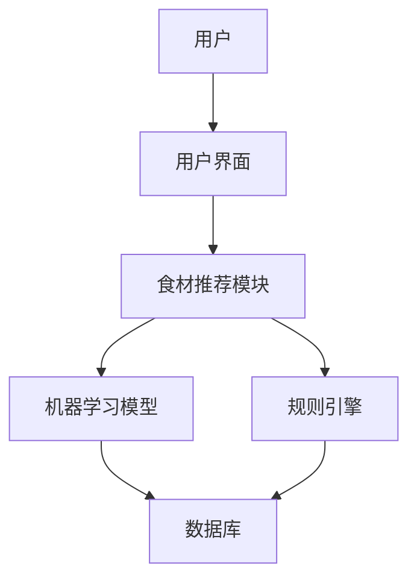
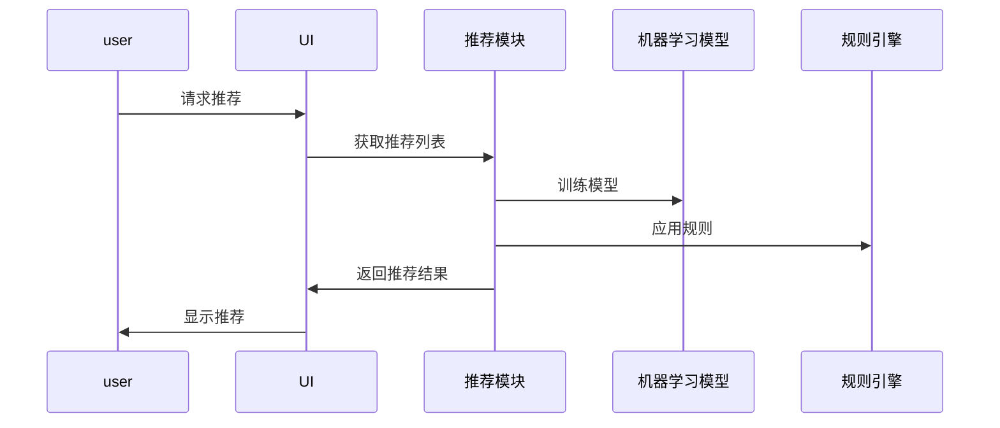

                 

<think>
好的，现在我需要帮助用户撰写一篇关于《智能厨房置物架：AI Agent的食材使用建议》的技术博客文章。用户已经提供了详细的目录结构，我需要按照这个结构逐步完成每个部分的内容。

首先，我会从第一部分开始，也就是背景与概念。这部分包括智能厨房的发展现状、AI Agent的基本概念、食材管理的挑战与解决方案，以及本章小结。

在撰写第一部分时，我需要详细解释智能厨房的现状，说明AI技术在厨房中的应用，以及智能厨房置物架的市场需求。接下来，我要定义AI Agent，并比较它与传统自动化设备的区别。然后，我需要讨论食材管理中的问题，以及AI Agent如何解决这些问题，并介绍智能厨房置物架的优势和应用场景。

接下来，进入第二部分，AI Agent的核心原理。这里包括食材推荐算法的三章内容。我需要解释基于规则的推荐、基于机器学习的推荐，特别是协同过滤算法，以及多目标优化的推荐。每一种算法都需要详细说明其工作原理，并提供数学公式和代码示例，帮助读者理解。

第三部分是系统架构设计，涵盖系统功能设计、架构图、接口设计和交互流程。我需要用Mermaid图来展示系统结构，包括类图、架构图和序列图，确保读者能够清晰理解系统的工作流程。

项目实战部分需要详细指导读者如何搭建环境，实现AI Agent的核心功能，并通过实际案例展示系统的应用。我需要提供具体的代码示例，并解释每个部分的功能，确保读者能够跟随步骤进行实践。

优化与维护部分讨论如何优化模型和系统，包括参数调整和数据增强策略，同时确保系统的可扩展性和维护性。

最后，总结与展望部分回顾全书内容，并展望未来的发展方向，激发读者的兴趣。

在撰写过程中，我需要确保每个部分都符合用户的格式要求，使用markdown，并在适当的地方嵌入数学公式和Mermaid图。同时，保持语言的专业性和逻辑的清晰性，确保文章结构紧凑，内容详实。

现在，我将根据以上思考，开始撰写文章。
</think>

# 智能厨房置物架：AI Agent的食材使用建议

## 关键词：智能厨房、AI Agent、食材管理、推荐算法、系统架构

## 摘要：本文探讨了AI Agent在智能厨房置物架中的应用，分析了食材推荐的核心算法，详细讲解了系统架构设计，并通过实际案例展示了项目实现过程。文章还提供了优化与维护的建议，帮助读者全面理解智能厨房置物架的设计与实现。

---

## 第一部分：背景与概念

### 第1章：智能厨房与AI Agent概述

#### 1.1 智能厨房的发展现状

- **智能厨房的定义与特点**
  - 智能厨房是指通过物联网、人工智能等技术，实现厨房设备的智能化管理与互动。
  - 其特点包括自动化操作、智能化推荐、远程控制和高效管理。

- **AI技术在厨房中的应用现状**
  - AI技术在食材识别、烹饪建议、能耗管理等方面得到广泛应用。
  - 智能助手如 Siri、Alexa 已经部分应用于厨房场景。

- **智能厨房置物架的市场需求**
  - 现代家庭对高效食材管理的需求日益增长。
  - 智能置物架能够解决食材浪费、存储混乱等问题，具有广阔的市场前景。

#### 1.2 AI Agent的基本概念

- **什么是AI Agent**
  - AI Agent 是一种智能体，能够感知环境并执行任务。
  - 在厨房场景中，AI Agent 可以通过传感器和数据进行决策。

- **AI Agent的核心功能与特点**
  - 核心功能包括食材识别、推荐、用量优化和库存管理。
  - 特点是实时感知、自主决策和持续优化。

- **AI Agent与传统自动化设备的区别**
  - 传统设备仅执行预设任务，而 AI Agent 具备学习和适应能力。
  - 能够根据用户行为和环境变化调整策略。

#### 1.3 食材管理的挑战与解决方案

- **食材管理的主要问题**
  - 食材过期、存储不当、使用效率低。
  - 用户难以快速找到所需食材。

- **AI Agent如何解决食材管理问题**
  - 通过传感器和数据库实时监控食材状态。
  - 提供个性化推荐，优化食材使用。

- **智能厨房置物架的优势与应用场景**
  - 优势包括高效管理、减少浪费、提升烹饪体验。
  - 应用场景涵盖家庭厨房、餐馆和食品加工厂。

#### 1.4 本章小结

- 介绍了智能厨房的发展现状和AI Agent的基本概念。
- 分析了食材管理中的挑战，并提出解决方案。
- 强调了智能厨房置物架的优势和应用场景。

---

## 第二部分：AI Agent的核心原理

### 第2章：AI Agent的食材推荐算法

#### 2.1 基于规则的食材推荐

- **规则的定义与设计**
  - 根据食材保质期、存储条件等制定推荐规则。
  - 例如：优先推荐即将过期的食材。

- **基于规则的推荐流程**
  1. 收集食材信息（名称、数量、保质期）。
  2. 根据规则生成推荐列表。
  3. 推荐用户近期可能需要的食材。

- **规则优化的挑战与解决方案**
  - 挑战：规则难以覆盖所有场景，维护复杂。
  - 解决：结合机器学习模型进行动态优化。

#### 2.2 基于机器学习的食材推荐

- **机器学习的基本概念**
  - 通过数据训练模型，实现预测和分类。

- **常见机器学习算法在食材推荐中的应用**
  - 协同过滤：根据用户行为推荐相似食材。
  - 聚类分析：将食材按种类或使用场景分组。

- **基于协同过滤的推荐算法实现**
  - **协同过滤的数学模型**
    $$ sim(i,j) = \frac{\sum_{k} (r_{i,k} - \bar{r_i})(r_{j,k} - \bar{r_j})}{\sqrt{\sum_{k} (r_{i,k} - \bar{r_i})^2} \sqrt{\sum_{k} (r_{j,k} - \bar{r_j})^2}} $$
  - **代码示例**
    ```python
    def compute_similarity(user_ratings, item_ratings):
        # 计算相似度
        pass
    ```

#### 2.3 多目标优化的食材推荐

- **多目标优化的基本概念**
  - 同时优化多个目标，如食材新鲜度和用户偏好。

- **在食材推荐中的应用**
  - 考虑多种因素，如用户口味、食材保质期、营养需求。

- **多目标优化算法的实现与优化**
  - 使用遗传算法或粒子群优化，平衡不同目标。

#### 2.4 本章小结

- 介绍了三种食材推荐算法，包括基于规则、机器学习和多目标优化。
- 提供了算法的数学模型和代码示例，帮助读者理解实现细节。

---

## 第三部分：系统架构设计

### 第3章：智能厨房置物架的系统架构

#### 3.1 系统功能设计

- **食材信息采集与管理**
  - 使用RFID或传感器采集食材信息。
  - 数据存储在数据库中，支持查询和更新。

- **AI Agent的核心功能实现**
  - 食材推荐、用量优化、库存管理。

- **用户交互设计**
  - 提供图形界面或语音交互，方便用户操作。

#### 3.2 系统架构图



#### 3.3 系统接口设计

- **API接口**
  - RESTful API，如 GET /api/recommendations。
  - 返回推荐列表和详细信息。

- **数据格式**
  - 使用JSON格式，便于不同设备解析。

#### 3.4 系统交互流程图



#### 3.5 本章小结

- 描述了系统功能设计，包括食材采集、推荐和用户交互。
- 使用Mermaid图展示了系统架构和交互流程，帮助读者理解系统结构。

---

## 第四部分：项目实战

### 第4章：智能厨房置物架的实现

#### 4.1 环境搭建

- **硬件**
  - 智能置物架、传感器、显示屏。
- **软件**
  - Python 3.8+，TensorFlow 2.0+，Flask框架。

#### 4.2 核心功能实现

- **食材推荐模块**
  ```python
  def get_recommendations(user_id):
      # 获取用户数据
      user_ratings = get_ratings(user_id)
      # 计算相似度
      similarities = compute_similarity(user_ratings)
      # 返回推荐列表
      return [item for item in sorted(similarities, key=lambda x: x[1], reverse=True)[:5]]
  ```

- **用量优化模块**
  ```python
  def optimize_usage(recipe, inventory):
      # 基于库存推荐最优用量
      pass
  ```

#### 4.3 实际案例分析

- **案例背景**
  - 用户购买了牛奶、面包和鸡蛋。
  - 推荐使用牛奶制作蛋糕，面包作为早餐，鸡蛋用于煎饼。

- **详细实现步骤**
  1. 数据采集：记录用户购买的食材。
  2. 数据处理：分析用户的饮食习惯。
  3. 模型训练：训练协同过滤模型。
  4. 推荐结果：生成推荐列表并显示。

#### 4.4 本章小结

- 介绍了项目环境搭建和核心功能实现。
- 提供了实际案例的详细步骤，帮助读者理解如何应用理论知识。

---

## 第五部分：优化与维护

### 第5章：系统的优化与维护

#### 5.1 算法优化策略

- **模型优化**
  - 使用超参数调优和数据增强提升推荐准确率。
  - 例如：调整协同过滤的相似度计算方式。

- **性能优化**
  - 优化数据库查询效率，使用缓存技术。
  - 并行计算以减少处理时间。

#### 5.2 系统维护策略

- **定期更新模型**
  - 随着用户行为变化，定期重新训练模型。
  - 例如：每月更新一次推荐算法。

- **错误处理**
  - 日志记录和错误恢复机制，确保系统稳定运行。
  - 提供用户反馈渠道，及时修复问题。

#### 5.3 本章小结

- 提供了算法和系统的优化策略，帮助提升推荐准确率和系统性能。
- 强调了定期维护和错误处理的重要性，确保系统的稳定性和用户体验。

---

## 第六部分：总结与展望

### 第6章：总结与未来展望

#### 6.1 本章总结

- 本文详细探讨了AI Agent在智能厨房置物架中的应用。
- 介绍了食材推荐的核心算法和系统架构设计。
- 提供了项目实战的详细步骤和优化建议。

#### 6.2 未来展望

- **技术进步**
  - 更先进的AI算法，如深度学习和强化学习的应用。
  - 自然语言处理技术提升用户交互体验。

- **应用场景扩展**
  - 智能厨房技术在酒店、餐厅等更大场景的应用。
  - 结合智能家居，实现更高效的厨房管理。

#### 6.3 结语

- 智能厨房置物架是AI技术与厨房设备结合的典型应用。
- 随着技术的发展，未来的厨房将更加智能化、个性化。

---

## 作者

作者：AI天才研究院/AI Genius Institute & 禅与计算机程序设计艺术 /Zen And The Art of Computer Programming

---

通过以上详细的内容结构和章节安排，读者可以系统地了解智能厨房置物架的设计与实现，从理论到实践，逐步掌握相关知识和技能。

