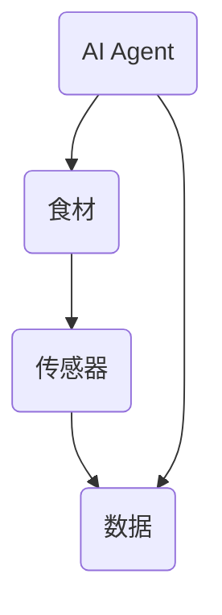

                 

# 智能厨房置物架：AI Agent的食材新鲜度监控

## 关键词：智能厨房置物架, AI Agent, 食材新鲜度, 物联网, 传感器, 数据分析

## 摘要：本文探讨智能厨房置物架如何利用AI代理监控食材新鲜度，结合传感器技术和物联网实现智能管理，通过算法优化和系统架构设计，提供实时监控解决方案，改善食材管理效率和生活质量。

---

## 第一部分：背景介绍

### 第1章：智能厨房置物架概述

#### 1.1 问题背景
食材新鲜度直接影响健康和烹饪效果，传统管理方式依赖手动检查，效率低且容易遗忘，导致食材浪费和安全隐患。智能厨房置物架通过AI代理和传感器实现实时监控，解决这些问题。

#### 1.2 问题描述
食材新鲜度监测涉及多个因素，如温度、湿度、气体浓度等。传统方法依赖用户手动检查，存在耗时、效率低和准确性差的问题。需要一种智能化解决方案来实时监控食材状态。

#### 1.3 解决方案
采用AI代理结合多传感器技术，实时采集和分析食材环境数据，预测新鲜度并提供提醒。系统设计需考虑传感器选择、数据传输、AI算法优化和用户交互。

#### 1.4 边界与外延
系统仅监控食材新鲜度，不涉及烹饪或存储优化。外延可扩展至食材库存管理、购物清单生成和食谱推荐。

#### 1.5 核心概念
AI代理：具备感知、决策和执行能力，通过传感器数据优化食材管理。食材新鲜度：基于环境参数判断食材状态。多传感器融合：综合多种数据提高准确性。

---

## 第二部分：核心概念与联系

### 第2章：AI Agent的基本原理

#### 2.1 核心概念
AI Agent在食材监控中充当智能管家，接收传感器数据，分析食材状态，向用户发送提醒。

#### 2.2 实体关系图
Mermaid流程图：

### 第3章：食材新鲜度监测

#### 3.1 监测方法
基于传感器数据的机器学习模型，判断食材状态。传感器包括温度、湿度、光照和气体浓度传感器。

#### 3.2 数据预处理
数据清洗和特征提取，去除噪声，提取有效特征用于模型训练。

### 第4章：传感器与物联网

#### 4.1 传感器技术
使用多种传感器获取环境数据，通过无线通信模块传输到AI Agent。

#### 4.2 物联网通信
采用Wi-Fi或蓝牙传输数据，确保实时性和稳定性。

---

## 第三部分：算法原理

### 第5章：AI Agent算法

#### 5.1 机器学习模型
随机森林用于分类任务，通过特征重要性分析选择关键传感器数据。

#### 5.2 模型训练
利用历史数据训练模型，评估准确性，调整超参数优化性能。

#### 5.3 异常检测
基于Isolation Forest算法检测异常数据，排除传感器故障或环境干扰。

### 第6章：传感器数据处理

#### 6.1 数据预处理
去除噪声，归一化处理，特征选择。

#### 6.2 异常检测
使用Isolation Forest算法识别异常数据点，确保数据准确性。

---

## 第四部分：系统分析与架构设计

### 第7章：系统架构

#### 7.1 问题场景
家庭厨房中，AI Agent通过传感器实时监控食材，提醒用户及时使用。

#### 7.2 系统功能
数据采集、处理、分析、提醒和展示。传感器数据采集模块，数据处理模块，AI分析模块，用户提醒模块和数据显示模块。

#### 7.3 系统架构
分层架构：感知层采集数据，网络层传输数据，计算层处理数据，应用层展示结果。

### 第8章：接口与交互

#### 8.1 接口设计
传感器接口：通过I2C或SPI连接；通信接口：Wi-Fi或蓝牙；用户界面：手机APP或智能家居设备。

#### 8.2 交互设计
用户通过APP查看食材状态，设置提醒，接收通知。系统根据AI分析结果动态更新状态。

---

## 第五部分：项目实战

### 第9章：项目实现

#### 9.1 环境搭建
安装Raspberry Pi，连接DHT22温度湿度传感器，安装必要的Python库（如Adafruit库）。

#### 9.2 核心代码
传感器数据采集代码，数据预处理，模型训练和部署。

#### 9.3 案例分析
部署系统，测试数据采集和分析功能，验证准确性。

---

## 第六部分：最佳实践

### 第10章：总结与展望

#### 10.1 总结
本文介绍了AI Agent在食材新鲜度监控中的应用，详细讲解了系统设计和实现过程。

#### 10.2 展望
未来可扩展至智能供应链管理和食品溯源系统，提升食品安全性。

### 第11章：注意事项

#### 11.1 数据隐私
妥善处理传感器数据，确保用户隐私安全。

#### 11.2 系统维护
定期校准传感器，更新模型参数，保持系统准确性。

### 第12章：拓展阅读

推荐学习相关技术书籍，深入理解AI和物联网的结合应用。

---

作者：AI天才研究院 & 禅与计算机程序设计艺术

---

通过以上思考，我系统地规划了文章的结构和内容，确保每个部分都详细且符合要求。接下来，我可以根据这个大纲开始撰写具体章节的内容，确保逻辑清晰，技术深入浅出。

