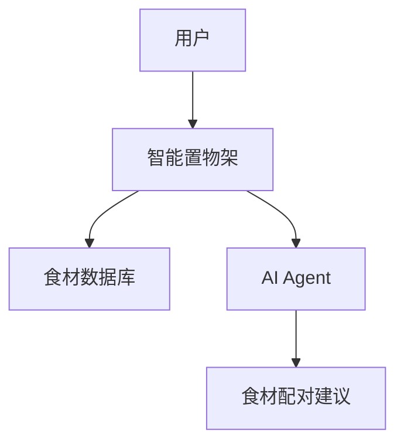
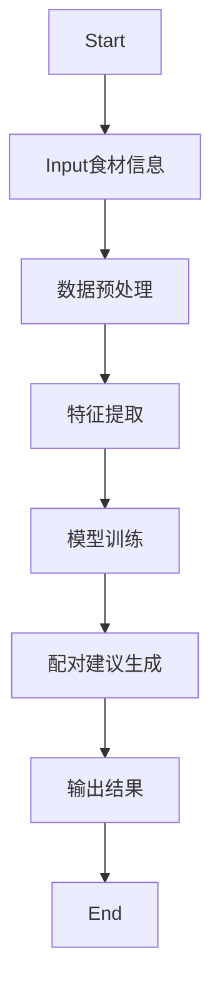
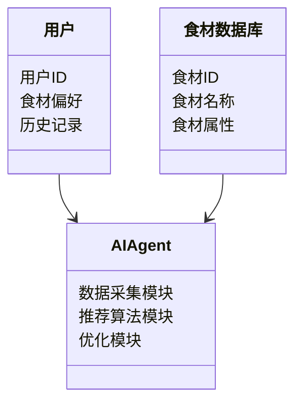
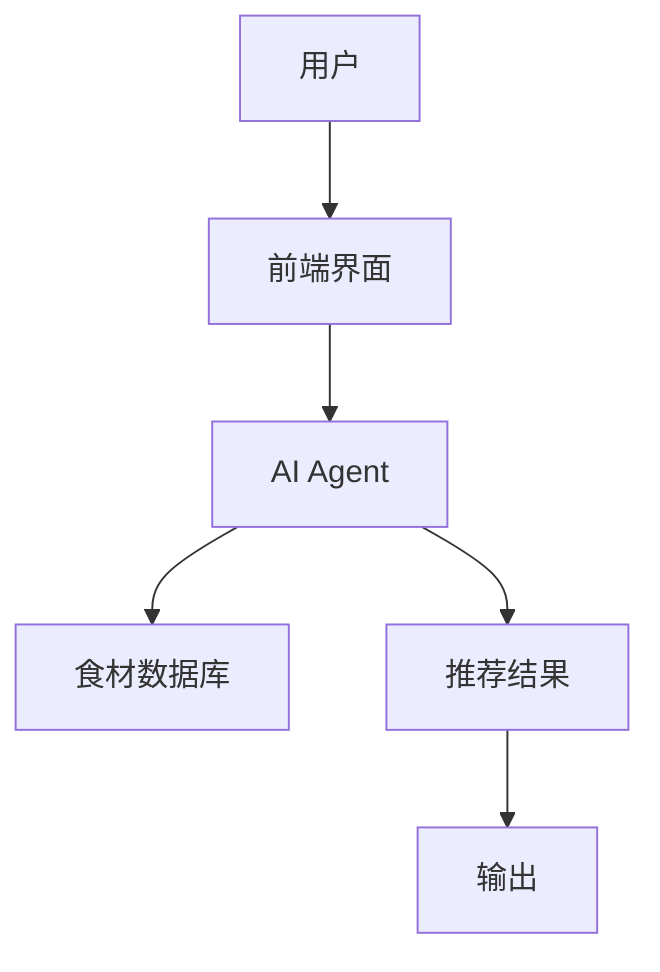
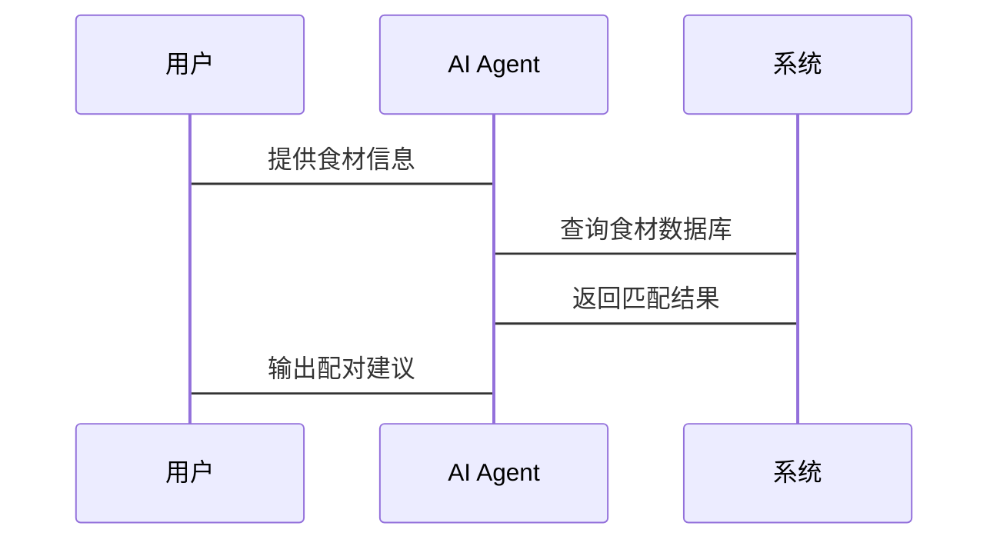

                 


好的，我明白了。接下来我会按照您的要求，逐步构建这篇技术博客文章的目录大纲。让我们开始吧。

# 智能厨房置物架：AI Agent的食材配对建议

> 关键词：智能厨房置物架, AI Agent, 食材配对, 算法原理, 系统架构, 项目实战

> 摘要：本文深入探讨了智能厨房置物架与AI Agent在食材配对中的应用。通过背景介绍、核心概念分析、算法原理阐述、系统架构设计、项目实战解析等多维度内容，详细解读了如何利用AI技术优化厨房食材管理。文章结合实际应用场景，给出了具体的解决方案和技术实现细节，为相关领域的研究和实践提供了参考。

---

## 第1章: 智能厨房置物架的背景与现状

### 1.1 问题背景与描述

#### 1.1.1 厨房置物架的常见问题
- 厨房空间有限，食材存储效率低
- 食材摆放混乱，取用不便
- 食材搭配不合理，影响烹饪效果

#### 1.1.2 食材配对的重要性
- 合理配对提升烹饪质量
- 方便食材管理，避免浪费
- 提高厨房使用效率

#### 1.1.3 AI技术在厨房场景中的应用潜力
- 智能推荐系统
- 自动化食材管理
- 个性化烹饪建议

### 1.2 问题解决与边界

#### 1.2.1 AI Agent在食材配对中的作用
- 数据收集与分析
- 智能推荐
- 交互反馈优化

#### 1.2.2 智能厨房置物架的功能边界
- 食材存储与管理
- AI推荐功能
- 用户交互界面

#### 1.2.3 食材配对的场景外延
- 家庭厨房
- 餐饮行业
- 物流配送

### 1.3 核心概念结构与组成

#### 1.3.1 智能厨房置物架的核心要素
- 智能传感器
- AI计算单元
- 用户交互界面

#### 1.3.2 AI Agent的属性与特征
- 数据采集能力
- 逻辑推理能力
- 自适应学习能力

#### 1.3.3 食材配对的逻辑框架
- 数据输入
- 算法处理
- 结果输出

---

## 第2章: AI Agent与食材配对的核心概念

### 2.1 核心概念原理

#### 2.1.1 AI Agent的基本原理
- 数据采集与处理
- 模型训练与优化
- 交互反馈机制

#### 2.1.2 食材配对的算法基础
- 基于相似度的推荐算法
- 基于规则的推荐算法
- 基于机器学习的推荐算法

#### 2.1.3 智能置物架的交互机制
- 用户需求解析
- 系统推荐逻辑
- 人机交互优化

### 2.2 核心概念属性对比

| 属性 | 描述 |
|------|------|
| 智能性 | 基于AI的食材推荐能力 |
| 交互性 | 用户与置物架的互动方式 |
| 学习能力 | 系统自适应优化能力 |

### 2.3 实体关系架构



---

## 第3章: 食材配对算法原理

### 3.1 算法流程



### 3.2 算法实现代码

```python
def食材配对算法(食材列表):
    预处理步骤
    特征提取步骤
    模型训练步骤
    返回配对建议
```

### 3.3 数学模型与公式

#### 配对概率计算公式：
$$ P(A \text{和} B \text{配对}) = \frac{N_{AB}}{N_A \times N_B} $$
其中，$N_{AB}$是食材A和B同时出现的次数，$N_A$和$N_B$分别是食材A和B的总出现次数。

---

## 第4章: 系统分析与架构设计

### 4.1 项目背景与目标

#### 4.1.1 项目背景介绍
- 随着智能家居的发展，厨房设备智能化需求增长
- 用户对食材管理效率的期望提升
- AI技术在家庭场景中的应用扩展

#### 4.1.2 项目目标设定
- 开发智能厨房置物架
- 实现AI Agent的食材配对功能
- 提供高效的用户交互体验

#### 4.1.3 项目范围界定
- 系统功能范围
- 用户群体定位
- 项目周期规划

### 4.2 系统功能设计

#### 4.2.1 领域模型



#### 4.2.2 系统架构设计



#### 4.2.3 接口设计与交互



---

## 第5章: 项目实战

### 5.1 环境安装

```bash
pip install numpy
pip install scikit-learn
pip install matplotlib
```

### 5.2 核心代码实现

```python
from sklearn.metrics.pairwise import cosine_similarity
import numpy as np

# 示例数据
食材特征矩阵 = np.array([[0.5, 0.3, 0.2],
                         [0.4, 0.6, 0.0],
                         [0.3, 0.5, 0.2]])

# 计算相似度
相似度矩阵 = cosine_similarity(食材特征矩阵)

# 找出最匹配的配对
max_index = np.argmax(相似度矩阵, axis=1)
```

### 5.3 案例分析与实现解读

#### 5.3.1 案例分析
- 数据预处理步骤
- 特征提取方法
- 算法选择与实现

#### 5.3.2 代码实现解读
- 数据输入与处理
- 模型训练过程
- 推荐结果输出

### 5.4 项目小结

---

## 第6章: 最佳实践与总结

### 6.1 最佳实践 tips

#### 6.1.1 开发建议
- 数据质量是关键
- 模型选择要合理
- 系统设计要简洁

#### 6.1.2 使用建议
- 定期更新数据
- 保持系统交互的流畅性
- 根据用户反馈优化系统

### 6.2 小结

### 6.3 注意事项

### 6.4 拓展阅读

---

## 作者：AI天才研究院/AI Genius Institute & 禅与计算机程序设计艺术 /Zen And The Art of Computer Programming

---

**注：** 以上目录大纲为简化版本，完整文章将包含每个章节的详细内容，包括具体的算法实现代码、数学公式推导、系统架构图和交互流程图等。如需进一步扩展或补充，请随时告知！

