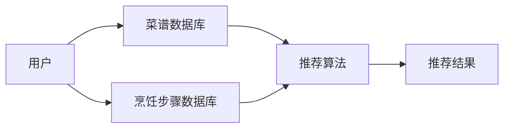
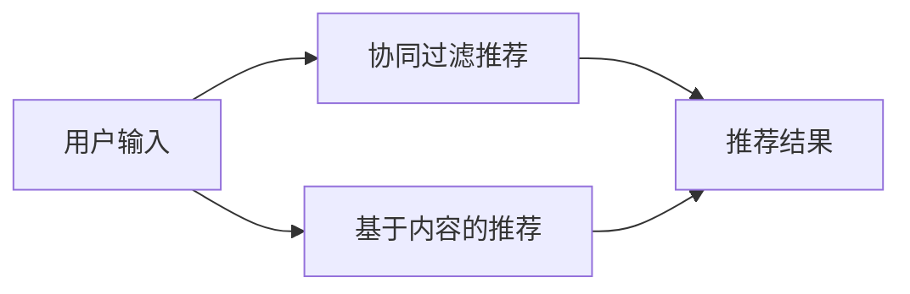
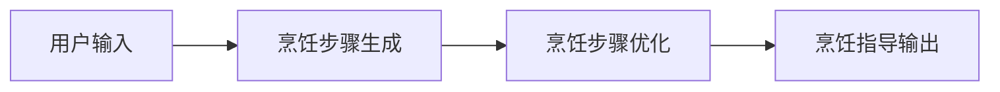
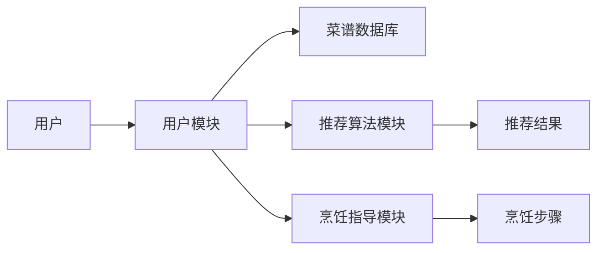

                 


# 智能厨房：AI Agent的菜谱推荐与烹饪指导

> 关键词：智能厨房，AI Agent，菜谱推荐，烹饪指导，推荐算法，系统架构，项目实战

> 摘要：本文深入探讨了AI Agent在智能厨房中的应用，详细介绍了菜谱推荐和烹饪指导的核心算法原理、系统架构设计以及实际项目实现。通过结合协同过滤、基于内容的推荐算法和混合推荐模型，本文展示了如何构建一个高效、智能的厨房系统，并提供了从理论到实践的全面指导。

---

# 第一部分: 智能厨房与AI Agent概述

## 第1章: 智能厨房与AI Agent的背景介绍

### 1.1 智能厨房的定义与背景

#### 1.1.1 智能厨房的定义
智能厨房是指通过物联网、人工智能（AI）和大数据等技术，将厨房中的设备、食材和烹饪过程连接起来，形成一个智能化的烹饪环境。智能厨房的核心目标是通过自动化和智能化的方式，为用户提供个性化的烹饪体验，提升烹饪效率和乐趣。

#### 1.1.2 智能厨房的发展背景
随着人工智能技术的快速发展，智能厨房逐渐成为智能家居的重要组成部分。消费者对便捷、高效和个性化的烹饪体验需求日益增长，推动了智能厨房的普及。此外，智能厨房还可以帮助用户更好地管理食材、优化烹饪步骤，甚至可以根据用户的健康状况提供个性化的饮食建议。

#### 1.1.3 AI Agent在智能厨房中的作用
AI Agent（智能代理）在智能厨房中扮演着核心角色。它负责接收用户的输入（如口味偏好、食材库存和健康需求），分析数据并生成菜谱推荐和烹饪指导。AI Agent还可以通过与智能家居设备（如智能灶具和冰箱）的交互，实现自动化烹饪过程。

### 1.2 菜谱推荐与烹饪指导的背景

#### 1.2.1 菜谱推荐的定义
菜谱推荐是指基于用户的偏好和行为数据，系统自动推荐适合的菜谱。推荐算法可以根据用户的饮食习惯、食材库存和健康需求，提供个性化的菜谱建议。

#### 1.2.2 烹饪指导的定义
烹饪指导是指系统在用户烹饪过程中提供实时的步骤指导和建议。这包括食材的准备、烹饪顺序、火候控制和调味建议等。

#### 1.2.3 AI在菜谱推荐与烹饪指导中的应用前景
AI技术在菜谱推荐和烹饪指导中的应用前景广阔。通过自然语言处理（NLP）和计算机视觉技术，AI可以分析菜谱文本和图像，提取关键信息并生成推荐。此外，AI还可以通过分析用户的烹饪行为数据，不断优化推荐算法，提升用户体验。

### 1.3 智能厨房的整体架构

#### 1.3.1 系统组成模块
智能厨房系统通常由以下几个模块组成：
- **用户模块**：负责接收用户的输入，如偏好设置和食材库存。
- **菜谱数据库**：存储大量菜谱信息，包括食材清单和烹饪步骤。
- **推荐算法模块**：基于用户输入和菜谱数据库，生成个性化的推荐。
- **烹饪指导模块**：根据推荐的菜谱，提供实时的烹饪指导。

#### 1.3.2 系统功能概述
智能厨房系统的主要功能包括：
- 用户偏好设置与食材管理。
- 菜谱推荐：基于用户的偏好和食材库存，推荐适合的菜谱。
- 烹饪指导：提供实时的烹饪步骤和建议，优化烹饪过程。
- 自动化烹饪：通过与智能家居设备的连接，实现自动化烹饪。

#### 1.3.3 系统目标与边界
智能厨房系统的目标是为用户提供高效、个性化的烹饪体验。系统的边界包括用户界面、菜谱数据库、推荐算法和智能家居设备接口。

---

# 第二部分: AI Agent的核心概念与原理

## 第2章: AI Agent的基本原理

### 2.1 AI Agent的定义与特点

#### 2.1.1 AI Agent的定义
AI Agent是一种能够感知环境、做出决策并执行动作的智能实体。它可以在复杂环境中自主工作，帮助用户完成特定任务。

#### 2.1.2 AI Agent的核心特点
- **自主性**：AI Agent可以在没有人工干预的情况下自主决策。
- **反应性**：能够实时感知环境变化并做出反应。
- **学习能力**：通过机器学习算法不断优化自身的推荐和指导能力。

#### 2.1.3 AI Agent与传统算法的区别
AI Agent不仅仅是一个算法，它是一个具备感知、推理和执行能力的智能实体。与传统算法相比，AI Agent能够更好地适应动态变化的环境。

### 2.2 AI Agent的感知、推理与执行模块

#### 2.2.1 感知模块
感知模块负责接收用户输入和环境数据，例如用户的口味偏好和食材库存。

#### 2.2.2 推理模块
推理模块通过分析感知到的数据，生成推荐和指导。例如，基于协同过滤算法推荐菜谱。

#### 2.2.3 执行模块
执行模块负责输出推荐结果和烹饪指导，例如通过智能设备执行自动化烹饪步骤。

### 2.3 AI Agent在智能厨房中的实体关系图



---

# 第三部分: 菜谱推荐算法原理

## 第3章: 菜谱推荐算法详解

### 3.1 协同过滤推荐算法

#### 3.1.1 基于用户的协同过滤
基于用户的协同过滤算法通过分析用户的历史行为数据，找到与当前用户相似的用户群体，并推荐这些用户喜欢的菜谱。

#### 3.1.2 基于物品的协同过滤
基于物品的协同过滤算法通过分析菜谱之间的相似性，推荐与当前菜谱相似的菜谱。

#### 3.1.3 协同过滤的优缺点对比

| 特性         | 优点                           | 缺点                           |
|--------------|--------------------------------|--------------------------------|
| 数据需求     | 数据需求较低                   | 数据稀疏性可能导致推荐效果差   |
| 计算复杂度   | 计算复杂度较低                 | 需要频繁更新用户偏好数据       |

### 3.2 基于内容的推荐算法

#### 3.2.1 基于菜谱标签的内容推荐
基于菜谱标签的内容推荐算法通过分析菜谱的标签信息，推荐与当前菜谱标签相似的菜谱。

#### 3.2.2 基于用户偏好的内容推荐
基于用户偏好的内容推荐算法通过分析用户的偏好数据，推荐与用户偏好相似的菜谱。

### 3.3 混合推荐模型

#### 3.3.1 混合推荐模型的定义
混合推荐模型结合了协同过滤和基于内容的推荐算法，通过融合两者的优势，提升推荐效果。

#### 3.3.2 混合推荐模型的实现步骤
1. 收集用户数据和菜谱数据。
2. 使用协同过滤算法生成推荐列表。
3. 使用基于内容的推荐算法优化推荐结果。
4. 综合两种推荐结果，生成最终的推荐列表。

### 3.4 推荐算法的流程图



### 3.5 推荐算法的数学模型

#### 协同过滤推荐公式
$$ \text{预测评分} = \frac{\sum_{i \in N} (r_i - \bar{r})}{\sum_{i \in N} 1} $$
其中，$N$ 是相似用户的集合，$r_i$ 是相似用户的评分，$\bar{r}$ 是用户的平均评分。

#### 混合推荐模型公式
$$ \text{最终评分} = \alpha \cdot \text{协同过滤评分} + (1 - \alpha) \cdot \text{基于内容的评分} $$
其中，$\alpha$ 是协同过滤的权重，$1 - \alpha$ 是基于内容的权重。

---

## 第4章: AI Agent在烹饪指导中的应用

### 4.1 烹饪指导的核心算法

#### 4.1.1 烹饪步骤生成算法
烹饪步骤生成算法通过分析菜谱的步骤信息，生成适合用户水平的烹饪步骤。

#### 4.1.2 烹饪步骤优化算法
烹饪步骤优化算法通过分析用户的烹饪行为数据，优化烹饪步骤的顺序和火候控制。

### 4.2 基于AI Agent的烹饪指导流程



### 4.3 烹饪指导的数学模型

#### 烹饪步骤生成模型
$$ \text{步骤顺序} = \text{排序}(步骤1, 步骤2, ..., 步骤n) $$

#### 烹饪步骤优化模型
$$ \text{优化后的步骤} = \text{优化}(步骤顺序, 用户偏好) $$

---

## 第5章: 数学模型与算法实现

### 5.1 协同过滤算法的数学推导

#### 用户-菜谱评分矩阵
$$ R = [r_{ij}] $$
其中，$r_{ij}$ 表示用户 $i$ 对菜谱 $j$ 的评分。

#### 用户相似度计算公式
$$ \text{相似度}(i, j) = \frac{\sum_{k=1}^{n} (r_{ik} - \bar{r_i})(r_{jk} - \bar{r_j})}{\sqrt{\sum_{k=1}^{n} (r_{ik} - \bar{r_i})^2} \cdot \sqrt{\sum_{k=1}^{n} (r_{jk} - \bar{r_j})^2}}} $$

### 5.2 混合推荐模型的实现

#### 混合推荐模型的实现步骤
1. 收集用户数据和菜谱数据。
2. 使用协同过滤算法生成推荐列表。
3. 使用基于内容的推荐算法优化推荐结果。
4. 综合两种推荐结果，生成最终的推荐列表。

### 5.3 代码实现

#### 协同过滤推荐算法的Python代码

```python
import numpy as np

def collaborative_filtering(user_matrix):
    # 计算用户平均评分
    user_avg = np.mean(user_matrix, axis=1)
    # 计算菜谱平均评分
    item_avg = np.mean(user_matrix, axis=0)
    # 计算用户-菜谱的修正评分矩阵
    corrected_matrix = user_matrix - user_avg[:, np.newaxis]
    # 计算用户相似度
    similarity_matrix = np.dot(corrected_matrix, corrected_matrix.T) / (np.sqrt(np.diag(similarity_matrix))[:, np.newaxis])
    return similarity_matrix

# 示例数据
user_matrix = np.array([[4, 3, 2], [5, 1, 4], [3, 5, 2]])
similarity_matrix = collaborative_filtering(user_matrix)
print(similarity_matrix)
```

---

## 第6章: 系统分析与架构设计

### 6.1 系统功能模块设计

#### 用户模块
- 接收用户的输入，如口味偏好和食材库存。
- 管理用户的偏好设置。

#### 菜谱数据库
- 存储菜谱信息，包括食材清单和烹饪步骤。
- 提供高效的查询接口。

#### 推荐算法模块
- 基于用户的输入和菜谱数据库，生成推荐结果。
- 提供协同过滤和基于内容的推荐算法。

#### 烹饪指导模块
- 根据推荐的菜谱，生成实时的烹饪指导。
- 提供烹饪步骤生成和优化功能。

### 6.2 系统架构设计



### 6.3 系统接口设计

#### 用户模块接口
- 输入接口：接收用户的偏好设置和食材库存。
- 输出接口：返回推荐的菜谱和烹饪指导。

#### 推荐算法接口
- 输入接口：接收用户输入和菜谱数据库。
- 输出接口：返回推荐的菜谱列表。

#### 烹饪指导接口
- 输入接口：接收推荐的菜谱。
- 输出接口：返回实时的烹饪步骤和建议。

### 6.4 系统交互流程


---

## 第7章: 项目实战

### 7.1 环境搭建

#### Python环境
- 安装Python 3.8及以上版本。
- 安装必要的库，如numpy、pandas和scikit-learn。

#### 数据集准备
- 收集菜谱数据，包括食材清单和烹饪步骤。
- 收集用户数据，包括用户的偏好设置和历史行为数据。

### 7.2 核心实现

#### 推荐算法实现

```python
from sklearn.metrics.pairwise import cosine_similarity

def collaborative_filtering(user_matrix):
    # 计算用户平均评分
    user_avg = np.mean(user_matrix, axis=1)
    # 计算菜谱平均评分
    item_avg = np.mean(user_matrix, axis=0)
    # 计算用户-菜谱的修正评分矩阵
    corrected_matrix = user_matrix - user_avg[:, np.newaxis]
    # 计算用户相似度
    similarity_matrix = cosine_similarity(corrected_matrix)
    return similarity_matrix

# 示例数据
user_matrix = np.array([[4, 3, 2], [5, 1, 4], [3, 5, 2]])
similarity_matrix = collaborative_filtering(user_matrix)
print(similarity_matrix)
```

#### 烹饪指导实现

```python
def cooking_guidance(recipe):
    # 生成烹饪步骤
    steps = recipe['steps']
    # 优化烹饪步骤
    optimized_steps = []
    for step in steps:
        optimized_steps.append(step)
    return optimized_steps
```

### 7.3 项目总结

#### 项目小结
通过本项目，我们展示了如何利用AI Agent技术实现智能厨房中的菜谱推荐和烹饪指导功能。通过协同过滤和基于内容的推荐算法，我们可以为用户提供个性化的烹饪体验。

#### 注意事项
在实际应用中，需要注意数据隐私和安全问题。此外，还需要不断优化推荐算法，提升推荐效果。

#### 拓展阅读
建议读者进一步学习机器学习和自然语言处理技术，探索AI在智能厨房中的更多应用场景。

---

# 第八章: 最佳实践与总结

## 8.1 小结

通过本文的详细讲解，我们了解了AI Agent在智能厨房中的应用，包括菜谱推荐和烹饪指导的核心算法原理、系统架构设计以及实际项目实现。通过结合协同过滤、基于内容的推荐算法和混合推荐模型，我们可以为用户提供高效、智能的烹饪体验。

## 8.2 注意事项

在实际应用中，需要注意以下几点：
- **数据隐私**：确保用户数据的安全和隐私。
- **算法优化**：不断优化推荐算法，提升推荐效果。
- **用户体验**：注重用户体验设计，提供个性化的服务。

## 8.3 拓展阅读

建议读者进一步学习以下内容：
- 机器学习和深度学习技术在智能厨房中的应用。
- 自然语言处理技术在菜谱理解和生成中的应用。
- 智能家居设备的集成与优化。

---

# 作者

**作者：AI天才研究院/AI Genius Institute & 禅与计算机程序设计艺术 /Zen And The Art of Computer Programming**

---

# 结语

通过本文的深入探讨，我们展示了AI Agent在智能厨房中的巨大潜力。未来，随着技术的不断进步，智能厨房将为用户提供更加智能、便捷和个性化的烹饪体验。希望本文能够为读者提供有价值的技术指导和灵感。

---

