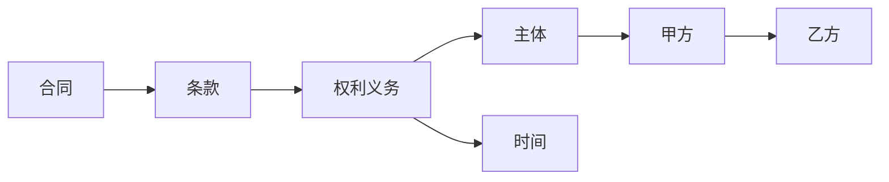
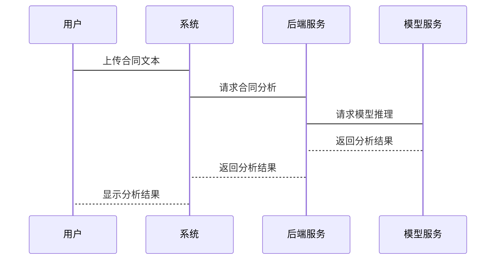

                 


# 智能合同分析AI Agent：LLM在法律文本理解中的应用

> 关键词：智能合同分析，LLM，法律文本理解，大语言模型，合同自动化

> 摘要：本文探讨了智能合同分析AI Agent在法律文本理解中的应用，详细分析了大语言模型（LLM）在合同分类、实体识别、关系推理等任务中的优势，并结合实际案例展示了如何通过LLM实现高效的合同自动化分析。文章内容涵盖背景介绍、核心概念、算法原理、系统架构设计、项目实战及最佳实践，为读者提供全面的技术视角。

---

## 第一部分：智能合同分析的背景与核心概念

### 第1章：智能合同分析的背景与问题描述

#### 1.1 智能合同分析的背景
- 1.1.1 传统合同分析的痛点
  - 人工审查耗时耗力
  - 易错性和不一致性的风险
  - 数据量爆炸性增长的需求

- 1.1.2 AI技术在法律领域的应用趋势
  - 自然语言处理（NLP）的发展
  - 大语言模型（LLM）的崛起
  - 法律科技（LegalTech）的兴起

- 1.1.3 大语言模型（LLM）的优势
  - 强大的文本理解和生成能力
  - 可扩展性和灵活性
  - 高效处理复杂法律文本的能力

#### 1.2 问题描述与目标
- 1.2.1 合同分析的典型问题
  - 文本的多样性和复杂性
  - 实体识别和关系推理的挑战
  - 合同分类的准确性和效率

- 1.2.2 智能合同分析的目标
  - 高效、准确地理解合同内容
  - 自动化提取关键信息
  - 支持法律推理和决策

- 1.2.3 LLM在合同分析中的角色
  - 作为核心引擎提供文本理解能力
  - 支持合同分类、实体识别和关系推理
  - 提供可解释性和灵活性

#### 1.3 问题解决的路径与方法
- 1.3.1 数据驱动的合同分析
  - 数据收集与预处理
  - 基于数据的模式识别
  - 数据驱动的模型优化

- 1.3.2 知识图谱构建与应用
  - 构建法律领域的知识图谱
  - 知识图谱在合同分析中的应用
  - 知识图谱的动态更新与维护

- 1.3.3 基于LLM的合同理解与推理
  - 利用LLM进行合同理解
  - 结合知识图谱的合同推理
  - 基于LLM的合同生成与改写

### 第2章：智能合同分析的核心概念与联系

#### 2.1 大语言模型（LLM）的基本原理
- 2.1.1 LLM的定义与特点
  - 大语言模型的定义
  - 模型的规模和参数特点
  - 模型的通用性和适应性

- 2.1.2 LLM的训练与微调
  - 预训练过程
  - 微调策略
  - 基于特定任务的优化

- 2.1.3 LLM在法律文本理解中的优势
  - 高效理解复杂法律文本
  - 支持多种法律任务
  - 良好的可解释性

#### 2.2 法律文本分析的核心概念
- 2.2.1 合同文本的结构与特征
  - 合同的基本结构
  - 合同的语义特征
  - 合同的法律术语和规范

- 2.2.2 合同实体与关系的定义
  - 实体识别
  - 关系推理
  - 实体与关系的关联性

- 2.2.3 合同分类与信息提取的流程
  - 合同分类的标准与流程
  - 信息提取的关键步骤
  - 分类与提取的结合

#### 2.3 LLM与法律文本分析的结合
- 2.3.1 LLM在合同分类中的应用
  - 基于LLM的合同分类方法
  - 分类模型的训练与优化
  - 分类结果的评估与验证

- 2.3.2 LLM在合同实体识别中的应用
  - 实体识别的实现流程
  - 基于LLM的实体识别模型
  - 实体识别的精度与效率

- 2.3.3 LLM在合同关系推理中的应用
  - 关系推理的实现步骤
  - 基于LLM的关系推理模型
  - 推理结果的验证与解释

#### 2.4 核心概念对比分析
- 2.4.1 传统NLP与LLM的对比
  - 传统NLP的特点与局限性
  - LLM的优势与突破点
  - 传统NLP与LLM的结合与互补

- 2.4.2 合同分析中的实体与关系对比
  - 实体与关系的定义与区别
  - 实体与关系的复杂性对比
  - 不同合同类型中的实体与关系特点

- 2.4.3 LLM与其他AI技术的对比
  - LLM与其他NLP技术的对比
  - LLM与规则-based系统的对比
  - LLM与基于知识图谱的系统的对比

#### 2.5 实体关系图（ER图）展示


---

## 第二部分：LLM在合同分析中的算法原理

### 第3章：LLM在合同分析中的算法原理

#### 3.1 LLM的训练过程
- 3.1.1 预训练过程
  - 预训练的目标函数
  - 预训练的数据来源
  - 预训练的模型结构

- 3.1.2 微调过程
  - 微调的任务目标
  - 微调的数据准备
  - 微调的模型优化

- 3.1.3 微调策略对比
  - 不同微调策略的效果对比
  - 微调对模型性能的影响
  - 微调对模型稳定性的考量

#### 3.2 合同分类算法
- 3.2.1 合同分类的实现流程
  - 数据预处理
  - 特征提取
  - 分类模型训练
  - 分类结果评估

- 3.2.2 基于LLM的合同分类模型
  - 模型结构
  - 模型训练细节
  - 模型优化策略

- 3.2.3 合同分类的评估指标
  - 精度、召回率、F1值
  - 混淆矩阵分析
  - ROC曲线分析

#### 3.3 实体识别算法
- 3.3.1 实体识别的实现流程
  - 数据准备
  - 特征提取
  - 模型训练
  - 结果评估

- 3.3.2 基于LLM的实体识别模型
  - 模型结构
  - 模型训练细节
  - 模型优化策略

- 3.3.3 实体识别的评估指标
  - 精度、召回率、F1值
  - 基准测试与对比分析
  - 模型的可解释性分析

#### 3.4 关系推理算法
- 3.4.1 关系推理的实现流程
  - 数据准备
  - 特征提取
  - 模型训练
  - 结果评估

- 3.4.2 基于LLM的关系推理模型
  - 模型结构
  - 模型训练细节
  - 模型优化策略

- 3.4.3 关系推理的评估指标
  - 精度、召回率、F1值
  - 基准测试与对比分析
  - 模型的可解释性分析

#### 3.5 数学模型与公式
- 3.5.1 概率分布
  - 分布式语义表示
  - 概率语言模型
  - 分布式假设

- 3.5.2 损失函数
  - 交叉熵损失函数
  - 负对数似然损失函数
  - 均方误差损失函数

- 3.5.3 优化器
  - 随机梯度下降（SGD）
  - 动量优化器（Momentum）
  - Adam优化器

#### 3.6 Python代码实现
- 3.6.1 合同分类代码示例
```python
import torch
from transformers import AutoTokenizer, AutoModelForSequenceClassification

tokenizer = AutoTokenizer.from_pretrained('bert-base-uncased')
model = AutoModelForSequenceClassification.from_pretrained('bert-base-uncased', num_labels=3)
```

- 3.6.2 实体识别代码示例
```python
def extract_entities(text):
    inputs = tokenizer.encode_plus(text, return_tensors='pt', padding=True, truncation=True)
    outputs = model(**inputs)
    prediction = torch.argmax(outputs.logits, dim=1).item()
    return prediction
```

- 3.6.3 关系推理代码示例
```python
def infer_relationships(text):
    inputs = tokenizer.encode_plus(text, return_tensors='pt', padding=True, truncation=True)
    outputs = model(**inputs)
    prediction = torch.argmax(outputs.logits, dim=1).item()
    return prediction
```

---

## 第三部分：系统分析与架构设计方案

### 第4章：智能合同分析系统的架构设计

#### 4.1 问题场景介绍
- 法律事务所的合同分析需求
- 企业的合同管理系统
- 法律咨询服务中的合同分析

#### 4.2 系统功能设计
- 4.2.1 功能模块划分
  - 合同上传与管理
  - 合同分类与筛选
  - 实体识别与信息提取
  - 关系推理与法律建议

- 4.2.2 功能流程设计
  - 用户输入合同文本
  - 系统进行合同分类
  - 系统提取合同实体
  - 系统推理合同关系
  - 系统生成法律建议

- 4.2.3 功能模块交互图


#### 4.3 系统架构设计
- 4.3.1 微服务架构
  - 前端服务
  - 后端服务
  - 数据存储服务

- 4.3.2 模块间交互
  - 用户与前端交互
  - 前端调用后端API
  - 后端调用模型服务
  - 数据存储与检索

- 4.3.3 模块间通信协议
  - HTTP协议
  - RPC协议
  - 其他协议

#### 4.4 接口设计
- 4.4.1 API接口定义
  - RESTful API
  - GraphQL API
  - 其他接口形式

- 4.4.2 接口文档
  - API文档示例
  - 请求参数说明
  - 响应格式说明

- 4.4.3 接口安全设计
  - 认证与授权
  - 数据加密
  - API速率限制

#### 4.5 交互流程图


---

## 第四部分：项目实战

### 第5章：智能合同分析系统的实现

#### 5.1 项目环境安装
- 5.1.1 系统运行环境
  - 操作系统要求
  - Python版本
  - 硬件要求

- 5.1.2 依赖库安装
  - Transformers库
  - PyTorch库
  - Sentence-transformers库
  - 其他依赖库

#### 5.2 系统核心实现
- 5.2.1 数据预处理
  - 文本清洗
  - 分段处理
  - 特征提取

- 5.2.2 模型训练
  - 数据准备
  - 模型微调
  - 模型保存

- 5.2.3 API接口开发
  - 接口设计
  - 接口实现
  - 接口测试

#### 5.3 代码实现
- 5.3.1 数据预处理代码
```python
import pandas as pd

def preprocess_data(data):
    df = pd.DataFrame(data)
    df['text'] = df['text'].apply(lambda x: x.strip().lower())
    return df
```

- 5.3.2 模型微调代码
```python
from transformers import AutoTokenizer, AutoModelForSequenceClassification, TrainingArguments, Trainer

tokenizer = AutoTokenizer.from_pretrained('bert-base-uncased')
model = AutoModelForSequenceClassification.from_pretrained('bert-base-uncased', num_labels=3)

training_args = TrainingArguments(
    output_dir='./result',
    num_epochs=3,
    per_device_train_batch_size=16,
)

trainer = Trainer(
    model=model,
    args=training_args,
    tokenizer=tokenizer,
    train_dataset=train_dataset,
)
trainer.train()
```

- 5.3.3 API接口代码
```python
from flask import Flask, request, jsonify

app = Flask(__name__)

@app.route('/analyze', methods=['POST'])
def analyze():
    data = request.json
    text = data['text']
    inputs = tokenizer.encode_plus(text, return_tensors='pt', padding=True, truncation=True)
    outputs = model(**inputs)
    prediction = torch.argmax(outputs.logits, dim=1).item()
    return jsonify({'result': prediction})

if __name__ == '__main__':
    app.run(debug=True)
```

#### 5.4 实际案例分析
- 5.4.1 案例背景
  - 某公司的合同分析需求
  - 合同类型与内容概述

- 5.4.2 案例分析过程
  - 数据准备
  - 模型训练
  - 模型推理
  - 结果分析

- 5.4.3 分析结果解读
  - 分类结果
  - 实体识别结果
  - 关系推理结果

#### 5.5 项目小结
- 项目成果
- 经验总结
- 改进建议

---

## 第五部分：最佳实践与注意事项

### 第6章：智能合同分析系统的最佳实践

#### 6.1 使用LLM的注意事项
- 数据隐私与安全
- 模型的可解释性
- 模型的泛化能力

#### 6.2 系统优化与维护
- 模型的持续优化
- 系统的可扩展性设计
- 系统的维护与更新

#### 6.3 项目小结
- 项目总结
- 成果回顾
- 未来展望

### 第7章：注意事项与拓展阅读

#### 7.1 注意事项
- 数据质量问题
- 模型调优的注意事项
- 系统性能优化

#### 7.2 拓展阅读
- 推荐书籍
- 推荐论文
- 其他参考资料

#### 7.3 作者简介
- 作者：AI天才研究院/AI Genius Institute
- 著作：《禅与计算机程序设计艺术》

---

# 作者：AI天才研究院/AI Genius Institute & 禅与计算机程序设计艺术 /Zen And The Art of Computer Programming

