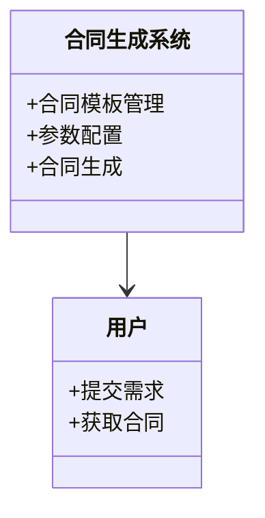

                 


```markdown
# 智能合同生成AI Agent：LLM在法律文书撰写中的应用

> 关键词：智能合同生成，LLM，大语言模型，法律文书，文本生成

> 摘要：本文探讨了智能合同生成AI Agent的核心原理，重点分析了大语言模型（LLM）在法律文书撰写中的应用。从LLM的基本概念到系统架构设计，再到项目实战，详细阐述了智能合同生成的实现过程，结合实际案例和法律合规性分析，提供了全面的技术解读。

---

# 引言与背景

## 1.1 合同生成的背景

### 1.1.1 传统合同生成的痛点

传统合同生成过程中，法律专业人士需要手动编写或修改合同条款，这不仅耗时耗力，还容易出现遗漏或错误。企业或个人在面对大量合同需求时，往往需要投入大量资源。

### 1.1.2 AI技术在合同生成中的优势

AI技术，特别是大语言模型（LLM），能够快速生成标准化合同，大幅提高效率。通过自然语言处理技术，LLM能够理解上下文，生成符合具体需求的法律文本。

### 1.1.3 法律文书自动化的行业趋势

随着AI技术的快速发展，法律文书自动化成为趋势。企业开始采用智能合同生成系统，以降低法律服务成本，提高效率。

---

## 1.2 问题背景

### 1.2.1 合同生成的复杂性

合同生成需要考虑条款的准确性和法律合规性，传统方法难以快速响应和处理。

### 1.2.2 人工生成的局限性

人工生成合同不仅效率低下，还容易出现错误，尤其是在处理大量合同时，容易遗漏关键条款。

### 1.2.3 对AI技术的需求

企业需要一种高效、准确的合同生成方式，AI技术成为解决这一问题的关键。

---

## 1.3 问题解决

### 1.3.1 AI技术如何解决合同生成问题

通过大语言模型，AI能够快速生成合同文本，理解上下文，并根据需求调整条款内容。

### 1.3.2 边界与外延

智能合同生成的边界在于生成的文本需要符合法律法规，而外延则包括合同审核、条款解释等功能。

### 1.3.3 智能合同生成的核心要素

- **大语言模型**：提供文本生成能力。
- **法律知识库**：确保生成内容的准确性。
- **用户需求解析**：准确理解用户需求。

---

## 1.4 核心概念与联系

### 1.4.1 核心概念原理

大语言模型通过预训练掌握大量法律文本，生成合同时结合上下文进行预测。

### 1.4.2 概念属性特征对比表格

| 特征 | 传统合同生成 | 智能合同生成 |
|------|---------------|--------------|
| 效率 | 低             | 高           |
| 准确性 | 中             | 高           |
| 成本 | 高             | 低           |

### 1.4.3 ER实体关系图

```mermaid
er
    entity 合同生成系统 {
        <合同模板>
        <用户输入>
        <生成合同>
    }
    entity 法律知识库 {
        <法律条款>
        <行业规范>
    }
    entity 大语言模型 {
        <训练数据>
        <模型参数>
    }
```

---

## 1.5 算法原理

### 1.5.1 大语言模型的训练过程


### 1.5.2 生成模型的数学表达

损失函数：
$$ \text{loss} = -\sum_{t} \log P(w_t|w_{<t}) $$

优化目标：
$$ \text{优化} = \text{min loss} $$

### 1.5.3 实际案例分析

```python
# 训练过程示例
def train_model():
    model = load_model()
    optimizer = Adam(lr=0.001)
    for epoch in range(num_epochs):
        for batch in data_loader():
            loss = model.compute_loss(batch)
            model.backward(loss)
            optimizer.step()
```

---

## 1.6 系统架构设计

### 1.6.1 功能设计



### 1.6.2 架构图


---

## 1.7 法律合规性分析

### 1.7.1 合同生成的法律风险

- **内容准确性**：生成的合同可能不符合法律法规。
- **合规性**：需要通过法律审核确保合规性。
- **隐私问题**：用户数据的安全性。

### 1.7.2 解决方案

- **审核机制**：生成合同后，进行人工审核。
- **数据隐私保护**：确保用户数据不被滥用。

---

## 1.8 项目实战

### 1.8.1 环境搭建

```bash
pip install transformers torch
```

### 1.8.2 核心代码实现

```python
def generate_contract(contract_type, terms):
    model = AutoModelForCausalLM.from_pretrained("gpt2")
    tokenizer = AutoTokenizer.from_pretrained("gpt2")
    inputs = tokenizer.encode(f"生成一份{contract_type}合同，条款如下：{terms}", return_tensors="pt")
    outputs = model.generate(inputs, max_length=500)
    return tokenizer.decode(outputs[0])
```

### 1.8.3 实际案例分析

案例：生成一份服务合同，条款包括服务范围、期限、费用等。

---

## 1.9 最佳实践

### 1.9.1 注意事项

- 确保生成合同的法律合规性。
- 定期更新模型和法律知识库。

### 1.9.2 小结

智能合同生成AI Agent通过大语言模型实现了高效、准确的合同生成，但仍需人工审核确保合规性。

---

## 1.10 拓展阅读

- 《大语言模型在法律领域的应用》
- 《AI驱动的法律服务系统设计与实现》

---

作者：AI天才研究院 & 禅与计算机程序设计艺术
```

