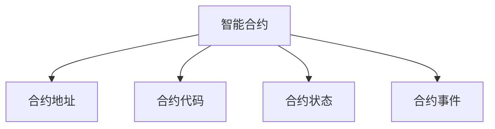
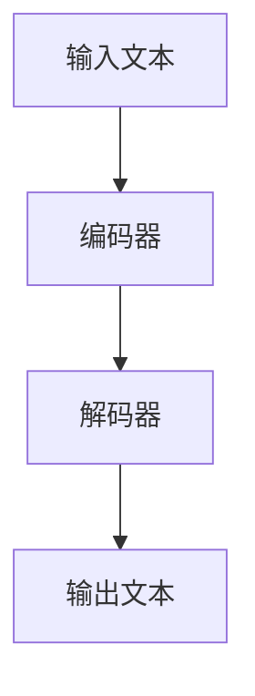
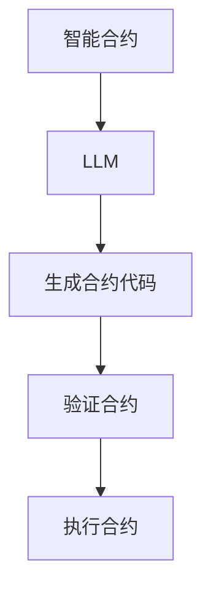
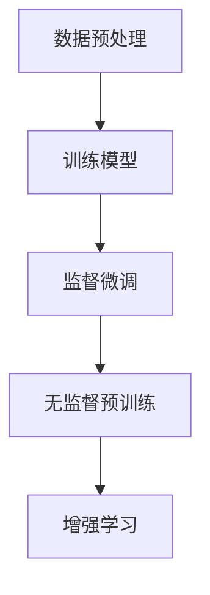
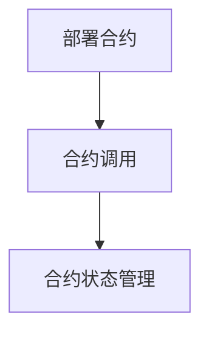
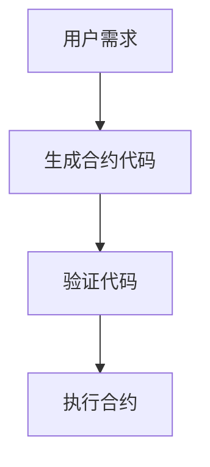
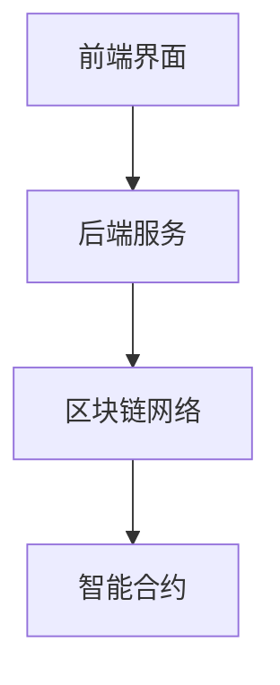
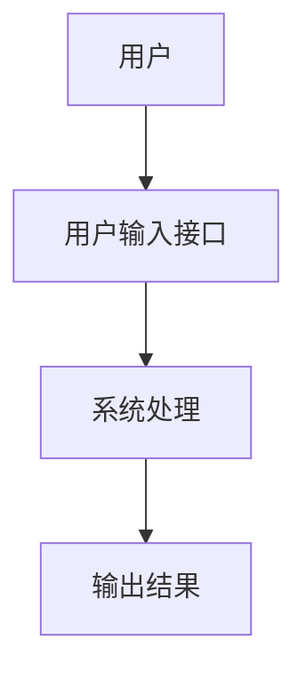
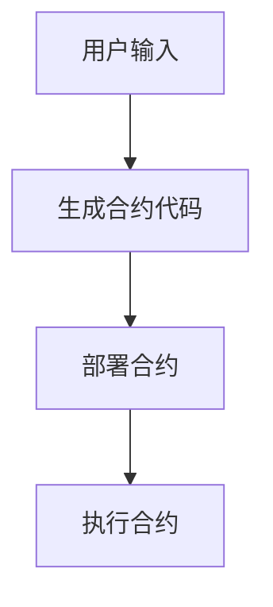

                 


# 智能合约 AI Agent：LLM 在区块链应用中的角色

> 关键词：智能合约，AI Agent，LLM，区块链，大语言模型

> 摘要：随着区块链技术的快速发展和大语言模型（LLM）的崛起，智能合约与AI Agent的结合正在成为区块链应用的重要趋势。本文将深入探讨LLM在智能合约中的角色，分析其在区块链中的实际应用，以及如何通过AI Agent提升智能合约的智能化水平。通过系统化的分析与实践案例，本文旨在为读者提供关于智能合约AI Agent的全面理解。

---

## 第1章: 智能合约与AI Agent的背景介绍

### 1.1 智能合约的概念与特点
智能合约是一种基于区块链技术的自动执行合约，其特点包括：
- **去中心化**：运行在区块链网络上，无需依赖中央机构。
- **自动执行**：通过预设的代码逻辑自动执行合约条款。
- **不可篡改**：区块链的特性确保合约代码不可篡改。
- **透明性**：所有交易记录在区块链上公开透明。

#### 表1-1 智能合约的关键特点
| 特性         | 描述                                   |
|--------------|--------------------------------------|
| 去中心化      | 运行在区块链上，无中心机构控制         |
| 自动执行      | 根据预设条件自动触发合约执行         |
| 不可篡改      | 区块链特性确保代码和数据不可修改     |
| 透明性        | 合约执行记录公开可查               |

### 1.2 AI Agent的基本概念
AI Agent（人工智能代理）是一种能够感知环境并采取行动以实现目标的智能实体。其核心功能包括：
- **感知环境**：通过传感器或API获取环境信息。
- **决策与推理**：基于获取的信息进行推理和决策。
- **执行行动**：通过执行器或API实现决策结果。

#### 表1-2 AI Agent的核心功能
| 功能         | 描述                                   |
|--------------|--------------------------------------|
| 感知环境      | 通过多种方式获取环境数据           |
| 决策与推理    | 基于数据进行分析和决策             |
| 执行行动      | 执行决策结果，影响环境状态         |

### 1.3 LLM在AI Agent中的作用
大语言模型（LLM）通过强大的文本生成和理解能力，为AI Agent提供了自然语言处理的核心支持。LLM能够：
- **生成文本**：根据上下文生成连贯的文本输出。
- **理解意图**：通过上下文理解用户的意图和需求。
- **多语言支持**：支持多种语言的交互和处理。

### 1.4 智能合约与AI Agent的结合
智能合约AI Agent通过将LLM集成到智能合约中，实现了智能化的合约管理和执行。这种结合使得智能合约能够：
- **自动化决策**：基于LLM的推理能力，自动判断合约执行的条件。
- **智能交互**：通过自然语言处理能力，与用户进行智能化的交互。
- **动态调整**：根据环境变化动态调整合约执行策略。

---

## 第2章: 智能合约与LLM的核心概念

### 2.1 智能合约的结构与功能
智能合约通常由以下几个部分组成：
- **合约地址**：合约在区块链上的唯一标识。
- **合约代码**：实现合约功能的代码。
- **合约状态**：合约执行过程中的状态信息。
- **合约事件**：合约执行时触发的事件。

#### 图2-1 智能合约结构图


### 2.2 LLM的算法原理
大语言模型通过预训练和微调技术，实现了强大的文本生成和理解能力。其核心算法包括：
- **Transformer模型**：用于处理序列数据。
- **自注意力机制**：通过全局上下文理解文本。
- **解码器结构**：生成连贯的文本输出。

#### 图2-2 LLM算法流程图


### 2.3 智能合约与LLM的结合原理
通过将LLM集成到智能合约中，可以实现智能化的合约管理和执行。具体包括：
- **合约生成**：LLM根据需求生成智能合约代码。
- **合约验证**：LLM验证合约的合法性和有效性。
- **合约执行**：LLM根据环境变化动态调整合约执行策略。

#### 图2-3 智能合约与LLM结合流程图


---

## 第3章: LLM在智能合约中的算法原理

### 3.1 LLM的训练过程
大语言模型的训练过程包括：
- **监督微调**：在特定任务上进行微调。
- **无监督预训练**：通过大量无标签数据进行预训练。
- **增强学习**：通过奖励机制优化模型输出。

#### 图3-1 LLM训练流程图


### 3.2 智能合约的执行流程
智能合约的执行流程包括：
- **合约部署**：将合约部署到区块链网络。
- **合约调用**：通过调用合约接口触发合约执行。
- **合约状态管理**：管理合约执行过程中的状态变化。

#### 图3-2 智能合约执行流程图


### 3.3 LLM在智能合约中的应用算法
通过LLM生成智能合约代码的算法包括：
- **文本生成**：生成符合要求的合约代码。
- **意图理解**：理解用户的合约需求。
- **代码验证**：验证生成代码的正确性。

#### 图3-3 LLM生成智能合约代码流程图


---

## 第4章: 智能合约AI Agent的系统架构设计

### 4.1 系统架构概述
智能合约AI Agent的系统架构包括：
- **前端界面**：用户与AI Agent交互的界面。
- **后端服务**：处理用户请求和合约执行。
- **区块链网络**：智能合约运行的区块链环境。

#### 图4-1 智能合约AI Agent系统架构图


### 4.2 系统功能模块
系统功能模块包括：
- **合约生成模块**：生成智能合约代码。
- **合约执行模块**：执行智能合约。
- **交互模块**：与用户进行自然语言交互。

#### 表4-1 系统功能模块
| 模块         | 描述               |
|--------------|--------------------|
| 合约生成模块 | 生成智能合约代码   |
| 合约执行模块 | 执行智能合约       |
| 交互模块     | 与用户进行交互     |

### 4.3 系统接口设计
系统接口设计包括：
- **用户输入接口**：接收用户的输入请求。
- **合约调用接口**：调用智能合约接口。
- **合约状态接口**：获取合约执行状态。

#### 图4-2 系统接口交互图


---

## 第5章: 智能合约AI Agent的项目实战

### 5.1 项目介绍
本项目旨在通过LLM生成智能合约代码，并实现智能合约AI Agent的功能。

### 5.2 核心代码实现
以下是智能合约生成的Python代码示例：

```python
def generate_contract_code(contract_type):
    # 根据合约类型生成合约代码
    if contract_type == 'payment':
        return """contract Payment {
    function pay(uint amount) public {
        // 合约支付逻辑
    }
}"""
    elif contract_type == 'token':
        return """contract Token {
    function transfer(address to, uint amount) public {
        // 合约转账逻辑
    }
}"""
    else:
        return "Invalid contract type"
```

### 5.3 代码应用解读与分析
上述代码根据输入的合约类型生成相应的智能合约代码。通过LLM模型的文本生成能力，可以进一步优化代码生成的准确性和智能化。

### 5.4 实际案例分析
以下是以太坊上的一个简单支付合约案例：

```solidity
pragma solidity ^0.8.0;

contract Payment {
    function pay(address payable recipient, uint amount) public {
        recipient.transfer(amount);
    }
}
```

#### 图5-1 智能合约生成流程图


### 5.5 项目小结
通过本项目，我们可以看到LLM在智能合约生成和执行中的重要性，以及智能合约AI Agent的潜力。

---

## 第6章: 智能合约AI Agent的最佳实践与未来展望

### 6.1 最佳实践
- **选择合适的LLM模型**：根据需求选择适合的LLM模型。
- **优化合约代码**：通过代码优化提高合约执行效率。
- **确保安全性**：加强合约的安全性防护。

### 6.2 小结
智能合约AI Agent通过将LLM集成到智能合约中，显著提升了合约的智能化水平和执行效率。

### 6.3 注意事项
- **合约的安全性**：确保合约代码的安全性。
- **模型的可解释性**：提高LLM的可解释性。
- **环境的兼容性**：确保合约在不同区块链环境中的兼容性。

### 6.4 拓展阅读
- 推荐阅读《区块链技术与智能合约开发》和《大语言模型与人工智能应用》。

---

## 作者：AI天才研究院/AI Genius Institute & 禅与计算机程序设计艺术 /Zen And The Art of Computer Programming

---

以上是《智能合约 AI Agent：LLM 在区块链应用中的角色》的技术博客文章的完整内容。

