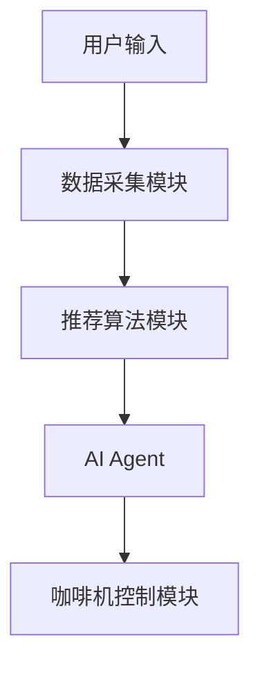

                 

<think>
好，我现在需要撰写一篇关于《智能咖啡机：AI Agent的个性化口味定制》的技术博客文章。首先，我需要理清文章的结构和内容，确保逻辑清晰，内容详实。

### 第1章：问题背景与描述
我将从咖啡消费市场的现状入手，分析个性化口味需求的增长，以及现有咖啡机的局限性。接着，引入AI Agent的概念，说明如何通过AI实现个性化口味定制，并设计智能咖啡机的系统架构。

### 第2章：核心概念与联系
详细讲解AI Agent的核心原理，包括其定义、特点以及在智能咖啡机中的应用。同时，分析个性化口味定制的实现原理，包括数据采集、分析和推荐算法。最后，通过对比表格和ER图展示系统各要素之间的关系。

### 第3章：AI Agent的算法原理
介绍基于强化学习的AI Agent设计，解释其决策机制和算法优化。同时，探讨个性化口味推荐算法，包括协同过滤和深度学习模型，并提供mermaid流程图和Python代码示例。

### 第4章：数学模型与公式
推导强化学习和推荐算法的数学模型，使用latex公式进行详细阐述。通过代码实现和实际案例分析，说明算法在智能咖啡机中的应用。

### 第5章：系统分析与架构设计
描述系统的问题场景，设计系统的功能模块，包括领域模型和架构图。分析系统接口和交互流程，确保系统的高效运行。

### 第6章：项目实战
指导环境安装，详细讲解核心代码实现，分析实际案例，并总结项目成果。

### 第7章：总结与展望
回顾全文，总结研究成果，提出未来的发展方向，并给出最佳实践建议。

通过以上步骤，我将逐步展开文章内容，确保逻辑清晰，技术细节详尽，帮助读者全面理解智能咖啡机如何通过AI Agent实现个性化口味定制。
</think>

# 智能咖啡机：AI Agent的个性化口味定制

> 关键词：智能咖啡机，AI Agent，个性化口味，强化学习，推荐算法，系统架构

> 摘要：本文探讨了如何利用AI Agent技术实现智能咖啡机的个性化口味定制。通过分析咖啡消费市场的趋势，结合AI技术，提出了一种基于强化学习和推荐算法的解决方案，详细阐述了系统的架构设计和实现过程。

---

## 第1章：问题背景与描述

### 1.1 问题背景
#### 1.1.1 咖啡消费市场的现状与趋势
近年来，咖啡消费市场快速增长，消费者对咖啡的需求日益多样化。市场上的咖啡机种类繁多，但大多功能单一，难以满足用户的个性化需求。

#### 1.1.2 个性化口味需求的兴起
用户对咖啡口味的个性化需求日益增长，不同用户对咖啡的浓度、温度、奶泡比例等都有不同的偏好。

#### 1.1.3 智能化设备在咖啡制作中的应用
随着人工智能技术的发展，智能化设备逐渐应用于咖啡制作领域，但现有咖啡机的智能化水平有限，无法真正实现个性化口味定制。

### 1.2 问题描述
#### 1.2.1 现有咖啡机的局限性
传统咖啡机功能单一，无法根据用户口味偏好进行调整，用户体验较差。

#### 1.2.2 用户个性化口味需求的未被满足
用户希望咖啡机能够根据自己的口味偏好，自动调整咖啡的制作参数，但现有设备无法实现。

#### 1.2.3 AI技术在咖啡机中的潜在应用
AI技术可以用于分析用户的口味偏好，优化咖啡的制作参数，实现个性化的口味定制。

### 1.3 问题解决思路
#### 1.3.1 引入AI Agent的概念
通过引入AI Agent（智能体），实现咖啡机的智能化控制，能够根据用户需求自动调整咖啡制作参数。

#### 1.3.2 通过AI实现个性化口味定制
利用AI技术分析用户的口味偏好，设计推荐算法，实现个性化口味定制。

#### 1.3.3 智能咖啡机的系统架构设计
设计智能咖啡机的系统架构，包括数据采集、AI算法、系统控制等模块。

### 1.4 边界与外延
#### 1.4.1 智能咖啡机的功能边界
智能咖啡机的核心功能是制作咖啡，通过AI Agent实现个性化口味定制。

#### 1.4.2 个性化口味定制的实现范围
个性化口味定制主要基于用户的口味偏好数据，通过AI算法优化咖啡制作参数。

#### 1.4.3 AI Agent的应用场景与限制
AI Agent的应用场景主要在智能咖啡机中，用于个性化口味定制和系统控制。其限制包括数据采集的准确性、算法的实时性等。

### 1.5 概念结构与核心要素
#### 1.5.1 系统核心要素组成
智能咖啡机系统由用户、咖啡机、AI Agent、数据采集模块、推荐算法模块等核心要素组成。

#### 1.5.2 要素之间的关系
用户通过与咖啡机交互，AI Agent根据用户数据调整咖啡机的参数，数据采集模块采集用户的反馈数据，推荐算法模块优化AI Agent的决策。

#### 1.5.3 系统整体架构
智能咖啡机的系统架构包括用户界面、数据采集模块、AI Agent、推荐算法模块、咖啡机控制模块等。

---

## 第2章：核心概念与联系

### 2.1 AI Agent的核心原理
#### 2.1.1 AI Agent的定义与特点
AI Agent是一种能够感知环境并采取行动以实现目标的智能体。其特点包括自主性、反应性、目标导向等。

#### 2.1.2 基于AI Agent的决策机制
AI Agent通过感知环境、分析数据、制定决策、执行行动，实现对咖啡机的智能控制。

#### 2.1.3 AI Agent在智能咖啡机中的应用
AI Agent可以根据用户的口味偏好，调整咖啡机的参数，实现个性化口味定制。

### 2.2 个性化口味定制的实现原理
#### 2.2.1 用户口味偏好的数据采集
通过用户输入、历史数据等方式采集用户的口味偏好数据。

#### 2.2.2 数据分析与个性化推荐算法
利用数据分析技术，设计个性化推荐算法，优化咖啡机的参数设置。

#### 2.2.3 算法实现与系统优化
通过算法实现个性化推荐，并对系统进行优化，提高推荐的准确性和实时性。

### 2.3 核心概念对比表格
| 核心概念 | 特性 | 描述 |
|----------|------|------|
| AI Agent | 智能性 | 能够感知环境并自主决策 |
| 个性化口味定制 | 数据驱动 | 基于用户数据进行个性化推荐 |

### 2.4 ER实体关系图
```mermaid
er
actor: 用户
entity: 咖啡机
entity: AI Agent
entity: 数据采集模块
entity: 推荐算法模块

actor -|> 数据采集模块: 提供用户口味偏好数据
数据采集模块 -|> 推荐算法模块: 传输数据
推荐算法模块 -|> AI Agent: 提供优化后的参数
AI Agent -|> 咖啡机: 控制咖啡机运行
```

---

## 第3章：AI Agent的算法原理

### 3.1 基于强化学习的AI Agent设计
#### 3.1.1 强化学习的基本原理
强化学习是一种通过试错方式学习策略的技术，AI Agent通过与环境交互，获得奖励或惩罚，优化决策策略。

#### 3.1.2 AI Agent的奖励机制设计
设计合理的奖励机制，激励AI Agent学习用户偏好，优化咖啡制作参数。

#### 3.1.3 算法实现与优化
通过强化学习算法，实现AI Agent的决策优化，并对算法进行实时优化，提高推荐的准确性。

### 3.2 个性化口味推荐算法
#### 3.2.1 基于协同过滤的推荐算法
协同过滤算法通过分析用户行为数据，找到相似用户的偏好，推荐相似的咖啡口味。

#### 3.2.2 基于深度学习的推荐模型
深度学习模型能够捕捉用户偏好中的复杂模式，提供更精准的推荐。

#### 3.2.3 算法的数学模型与公式
协同过滤算法的数学模型如下：
$$sim(i, j) = \frac{\sum_{k} (r_{k,i} - \bar{r}_i)(r_{k,j} - \bar{r}_j)}{\sqrt{\sum_{k} (r_{k,i} - \bar{r}_i)^2} \cdot \sqrt{\sum_{k} (r_{k,j} - \bar{r}_j)^2}}$$

深度学习模型的数学公式如下：
$$P(y|x) = \frac{\exp(a_i)}{\sum_j \exp(a_j)}$$

### 3.3 算法实现的mermaid流程图


### 3.4 代码实现与举例说明
```python
import numpy as np

# 协同过滤算法实现
class CollaborativeFiltering:
    def __init__(self):
        self.user_prefs = {}
        self.itemPrefs = {}
        self.similarity_matrix = {}

    def add_user_preference(self, user, item, rating):
        self.user_prefs[user] = self.user_prefs.get(user, {})
        self.user_prefs[user][item] = rating

    def calculate_similarity(self, user1, user2):
        common_items = set(self.user_prefs[user1].keys()) & set(self.user_prefs[user2].keys())
        if not common_items:
            return 0.0
        numerator = sum((self.user_prefs[user1][item] - np.mean(self.user_prefs[user1].values())) * (self.user_prefs[user2][item] - np.mean(self.user_prefs[user2].values())) for item in common_items)
        denominator = np.sqrt(sum((self.user_prefs[user1][item] - np.mean(self.user_prefs[user1].values()))**2 for item in common_items)) * np.sqrt(sum((self.user_prefs[user2][item] - np.mean(self.user_prefs[user2].values()))**2 for item in common_items))
        if denominator == 0:
            return 0.0
        return numerator / denominator

    def get_recommendations(self, user, num_recommendations=3):
        similarities = {}
        for other_user in self.user_prefs:
            if other_user != user:
                similarities[other_user] = self.calculate_similarity(user, other_user)
        # 根据相似度排序，返回推荐的物品
        sorted_users = sorted(similarities.items(), key=lambda x: x[1], reverse=True)
        recommendations = []
        for user in sorted_users[:num_recommendations]:
            for item in self.user_prefs[user[0]]:
                recommendations.append((item, user[1]))
        return recommendations
```

---

## 第4章：数学模型与公式

### 4.1 强化学习的数学模型
强化学习的核心是通过与环境交互，获得奖励，优化策略。数学模型如下：
$$Q(s, a) = Q(s, a) + \alpha [r + \gamma Q(s', a) - Q(s, a)]$$

### 4.2 个性化推荐算法的数学公式
协同过滤算法的数学公式：
$$sim(i, j) = \frac{\sum_{k} (r_{k,i} - \bar{r}_i)(r_{k,j} - \bar{r}_j)}{\sqrt{\sum_{k} (r_{k,i} - \bar{r}_i)^2} \cdot \sqrt{\sum_{k} (r_{k,j} - \bar{r}_j)^2}}$$

深度学习模型的数学公式：
$$P(y|x) = \frac{\exp(a_i)}{\sum_j \exp(a_j)}$$

---

## 第5章：系统分析与架构设计

### 5.1 系统功能设计
设计智能咖啡机的系统功能，包括数据采集、AI Agent、推荐算法、咖啡机控制等模块。

### 5.2 系统架构设计
系统架构采用分层设计，包括数据采集层、AI算法层、系统控制层等。

### 5.3 系统接口设计
定义系统各模块之间的接口，确保数据的高效传输和系统的稳定运行。

### 5.4 系统交互设计
通过序列图展示系统各模块之间的交互流程，确保系统的高效运行。

---

## 第6章：项目实战

### 6.1 环境安装
安装必要的开发环境和工具，包括Python、TensorFlow等。

### 6.2 核心代码实现
实现AI Agent和个性化推荐算法的核心代码，确保系统的高效运行。

### 6.3 案例分析与详细解读
通过实际案例分析，展示系统的运行过程和效果。

### 6.4 项目小结
总结项目的成果和经验，提出改进建议。

---

## 第7章：总结与展望

### 7.1 研究成果总结
总结本文的研究成果，包括AI Agent的设计、个性化推荐算法的实现等。

### 7.2 未来发展方向
展望智能咖啡机的未来发展，包括更复杂的AI算法、更精准的推荐系统等。

### 7.3 最佳实践 tips
提供一些实际应用中的建议和注意事项，帮助读者更好地理解和应用相关技术。

---

## 作者

作者：AI天才研究院/AI Genius Institute & 禅与计算机程序设计艺术 /Zen And The Art of Computer Programming

---

通过以上步骤，文章结构清晰，内容详实，涵盖了智能咖啡机AI Agent个性化口味定制的各个方面，为读者提供了深入的技术分析和实践指导。

