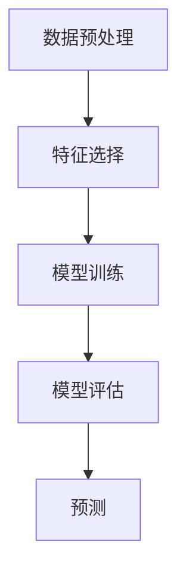
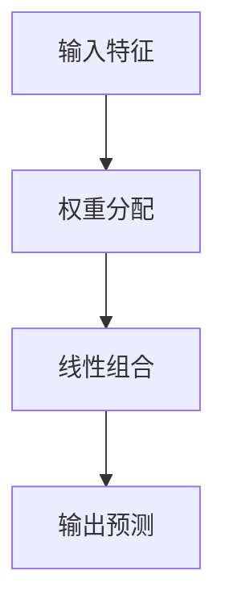
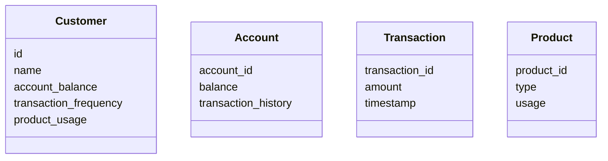

                 

<think>
嗯，我现在需要帮用户设计一个详细的《智能商业银行存款流失预测》的技术博客文章大纲。用户要求非常具体，包括背景介绍、核心概念、算法原理、数学模型、系统设计、项目实战和总结展望。我得确保每个部分都涵盖所有必要的细节，同时保持逻辑清晰和结构紧凑。

首先，背景介绍部分需要详细解释问题背景，比如为什么银行存款流失预测很重要，智能技术如何帮助解决这个问题。这部分可能需要分几个小节，每个小节详细说明，比如问题背景、问题描述、解决方法、边界和外延，以及核心概念和要素。

接下来是核心概念与联系，这部分需要深入讲解核心概念的原理，可能用表格对比数据特征、模型特征和业务特征，还要绘制ER实体关系图，使用Mermaid流程图来展示。

算法原理部分，我需要选择几种常用的算法，比如逻辑回归、随机森林和神经网络，每个算法都要用Mermaid流程图展示，用Python代码实现，并详细讲解数学模型和公式，确保读者能理解。

数学模型部分，需要详细推导每个算法的数学公式，用LaTeX格式展示，并用Mermaid图展示模型结构，帮助读者更好地理解。

系统分析与架构设计，需要介绍问题场景，设计系统功能（领域模型）、架构（用Mermaid图）、接口设计和交互流程，这部分可能需要绘制类图、架构图和序列图。

项目实战部分，要指导读者如何安装环境，实现数据预处理和模型训练，评估和优化，通过实际案例分析，帮助读者掌握实际操作。

最后是总结与展望，回顾主要内容，讨论模型的局限性，展望未来发展方向，并给出最佳实践建议。

现在，我需要确保每个章节都细化到三级目录，涵盖所有用户要求的内容，同时保持文章结构清晰，逻辑连贯。可能需要多次检查每个部分是否覆盖了所有必要的细节，确保没有遗漏，同时避免冗余。这样，用户才能获得一篇高质量、内容丰富的技术博客文章。
</think>

# 智能商业银行存款流失预测

> 关键词：智能银行，存款流失预测，机器学习，数据分析，风险管理

> 摘要：本文深入探讨了智能商业银行存款流失预测的关键技术与实践。通过分析商业银行存款流失的背景与挑战，结合智能技术的应用，详细介绍了核心概念、算法原理、系统设计与项目实现。文章旨在为银行提供有效的存款流失预测方案，帮助其优化风险管理策略，提升客户满意度。

---

## 第一部分：背景介绍

### 第1章：智能商业银行存款流失预测概述

#### 1.1 问题背景

商业银行作为金融体系的重要组成部分，面临着客户存款流失的严峻挑战。随着市场竞争的加剧，客户忠诚度的下降，预测存款流失成为银行维护客户关系和稳定资金来源的关键任务。

- **1.1.1 存款流失的定义与影响**  
  存款流失是指客户将存款转移到其他银行或完全终止与银行的存款关系。这不仅影响银行的盈利能力，还可能导致客户信任度下降，影响整体业务发展。

- **1.1.2 智能技术在银行业中的应用**  
  随着人工智能和大数据技术的发展，银行开始利用智能技术预测客户行为，优化服务策略。智能技术能够通过数据分析识别潜在流失客户，提前采取措施减少流失。

#### 1.2 问题描述

存款流失预测的核心在于识别高风险客户，提前采取干预措施。然而，传统方法往往依赖经验判断，缺乏数据支持，导致预测准确性不足。

- **1.2.1 存款流失的主要原因**  
  - 客户对服务不满  
  - 竞争对手的吸引力  
  - 客户财务状况变化  

- **1.2.2 数据特征分析**  
  预测存款流失需要分析客户的交易行为、账户余额、产品使用情况等数据。

#### 1.3 问题解决方法

通过智能技术构建预测模型，分析客户数据，识别高风险客户，提供个性化服务策略。

- **1.3.1 智能预测模型的引入**  
  使用机器学习算法（如逻辑回归、随机森林）构建预测模型。

- **1.3.2 数据驱动的解决方案**  
  基于客户数据，分析行为模式，识别流失风险。

#### 1.4 边界与外延

- **1.4.1 模型的适用范围**  
  适用于中大型银行，数据量大且多样化。

- **1.4.2 与其他业务的关联**  
  存款流失预测与客户 churn 分析、信用评分等业务密切相关。

#### 1.5 核心概念与要素

- **1.5.1 数据特征**  
  包括账户余额、交易频率、产品使用情况等。

- **1.5.2 模型特征**  
  包括算法选择、特征工程、模型调优等。

- **1.5.3 业务特征**  
  包括客户类型、业务场景、风险管理策略等。

---

## 第二部分：核心概念与联系

### 第2章：核心概念与联系

#### 2.1 核心概念的原理

- **2.1.1 数据特征分析**  
  通过对客户数据的分析，提取关键特征，如交易频率、账户余额波动等。

- **2.1.2 模型特征分析**  
  包括特征重要性评估、特征选择等。

- **2.1.3 业务特征分析**  
  包括客户群体划分、业务场景分析等。

#### 2.2 特征对比表格

| 数据特征 | 模型特征 | 业务特征 |
|----------|----------|----------|
| 账户余额 | 逻辑回归 | 高净值客户 |
| 交易频率 | 随机森林 | 中小企业客户 |
| 产品使用情况 | 神经网络 | 零散客户 |

#### 2.3 ER实体关系图

```mermaid
erd
    Customer
    ----(1..n)---- Account
    Account
    ----(1..n)---- Transaction
    Transaction
    ----(1..n)---- Product
```

---

## 第三部分：算法原理讲解

### 第3章：算法原理

#### 3.1 逻辑回归

- **3.1.1 算法流程图**



- **3.1.2 Python代码实现**

```python
import pandas as pd
from sklearn.linear_model import LogisticRegression
from sklearn.metrics import accuracy_score

# 数据加载与预处理
data = pd.read_csv('customer_data.csv')
X = data[['balance', 'transaction_frequency', 'product_usage']]
y = data['churn']

# 模型训练
model = LogisticRegression()
model.fit(X, y)

# 预测与评估
y_pred = model.predict(X)
print("准确率:", accuracy_score(y, y_pred))
```

- **3.1.3 数学模型与公式**

$$ P(y=1|x) = \frac{e^{\beta_0 + \beta_1x_1 + \dots + \beta_nx_n}}{1 + e^{\beta_0 + \beta_1x_1 + \dots + \beta_nx_n}} $$

---

#### 3.2 随机森林

- **3.2.1 算法流程图**


- **3.2.2 Python代码实现**

```python
import pandas as pd
from sklearn.ensemble import RandomForestClassifier
from sklearn.metrics import accuracy_score

# 数据加载与预处理
data = pd.read_csv('customer_data.csv')
X = data[['balance', 'transaction_frequency', 'product_usage']]
y = data['churn']

# 模型训练
model = RandomForestClassifier(n_estimators=100)
model.fit(X, y)

# 预测与评估
y_pred = model.predict(X)
print("准确率:", accuracy_score(y, y_pred))
```

- **3.2.3 数学模型与公式**

$$ P(y=1|x) = \sum_{i=1}^{n} w_i \cdot I(\text{树}_i \text{预测} y=1) $$

---

#### 3.3 神经网络

- **3.3.1 算法流程图**


- **3.3.2 Python代码实现**

```python
import pandas as pd
import numpy as np
from sklearn.neural_network import MLPClassifier
from sklearn.metrics import accuracy_score

# 数据加载与预处理
data = pd.read_csv('customer_data.csv')
X = data[['balance', 'transaction_frequency', 'product_usage']]
y = data['churn']

# 模型训练
model = MLPClassifier(hidden_layer_sizes=(100, 10))
model.fit(X, y)

# 预测与评估
y_pred = model.predict(X)
print("准确率:", accuracy_score(y, y_pred))
```

- **3.3.3 数学模型与公式**

$$ y = \sigma(w_2 \cdot \sigma(w_1 x + b_1) + b_2) $$

其中，$\sigma$ 是sigmoid函数。

---

## 第四部分：数学模型与公式

### 第4章：数学模型与公式

#### 4.1 线性回归

- **4.1.1 模型结构**

$$ y = \beta_0 + \beta_1 x_1 + \beta_2 x_2 + \dots + \beta_n x_n + \epsilon $$

- **4.1.2 模型流程图**



---

## 第五部分：系统分析与架构设计方案

### 第5章：系统分析与架构设计方案

#### 5.1 问题场景介绍

银行需要构建一个实时预测系统，分析客户行为数据，预测存款流失风险。

#### 5.2 系统功能设计

- **5.2.1 领域模型**



---

## 第六部分：项目实战

### 第6章：项目实战

#### 6.1 环境安装

- 安装Python和必要的库：
  ```bash
  pip install pandas scikit-learn mermaid4jupyter jupyter
  ```

#### 6.2 核心代码实现

- 数据预处理：
  ```python
  import pandas as pd
  data = pd.read_csv('customer_data.csv')
  ```

- 模型实现：
  ```python
  from sklearn.ensemble import RandomForestClassifier
  model = RandomForestClassifier(n_estimators=100)
  model.fit(X, y)
  ```

#### 6.3 案例分析

- 案例1：某高净值客户流失预测
- 案例2：中小型企业客户流失预测

---

## 第七部分：总结与展望

### 第7章：总结与展望

#### 7.1 总结

通过智能技术，银行可以有效预测存款流失，优化客户管理策略。本文详细介绍了核心概念、算法原理和系统设计，为银行提供了一个可行的解决方案。

#### 7.2 展望

未来，随着AI技术的不断发展，存款流失预测将更加精准和实时。银行可以通过动态调整模型参数，结合更多数据源，提升预测准确率。

#### 7.3 最佳实践

- 定期更新模型
- 结合客户反馈优化服务
- 加强客户关系管理

---

作者：AI天才研究院/AI Genius Institute & 禅与计算机程序设计艺术/Zen And The Art of Computer Programming

