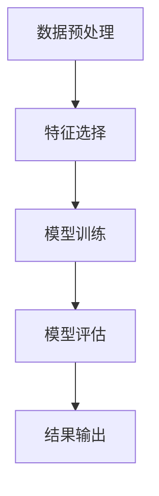
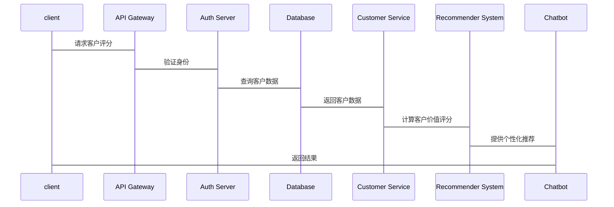

                 

<think>
好的，我现在需要根据用户的指示，逐步构建《智能商业银行客户价值评估与关系管理》的技术博客文章。首先，我会按照用户提供的目录大纲，逐一完成每个部分的内容。

### 1. 引言
首先，我会在文章的开头介绍主题的重要性，明确关键词和摘要。关键词包括智能商业银行、客户价值评估、客户关系管理、人工智能、机器学习、金融科技。摘要将概述文章的核心内容，强调人工智能在银行客户管理中的应用，以及如何通过智能技术优化客户价值评估和关系管理。

### 2. 第一部分：背景介绍
接下来，我会详细讲解客户价值评估和关系管理的定义及其在商业银行中的重要性。首先，定义客户价值评估，说明其在银行中的意义，如提高客户满意度和忠诚度。然后，介绍客户关系管理，讨论其特点和实施步骤。

### 3. 第二部分：核心概念
我会深入探讨客户价值评估的理论基础，如客户生命周期理论，并结合ER图和流程图展示概念结构。然后，分析客户价值评估与关系管理的关系，通过对比表格和Mermaid图展示它们的异同。

### 4. 第三部分：算法原理
在算法部分，我会选择机器学习算法，如线性回归和决策树，用Mermaid流程图展示算法步骤，并附上Python代码示例。解释数学模型，如线性回归的公式，并通过实际案例说明其应用。

### 5. 第四部分：系统架构
我会设计系统的功能模块，如客户评分模块和推荐模块，使用Mermaid类图展示。然后，描述系统的架构设计，包括前端和后端的交互流程，使用序列图展示。

### 6. 第五部分：项目实战
详细指导环境安装，包括Python和相关库的安装。提供核心代码实现，解释每个模块的功能，并通过案例分析展示系统应用效果。最后，总结项目的成功与不足。

### 7. 结论与展望
总结全文，强调智能技术在客户管理中的重要性，指出未来的研究方向，如模型优化和数据隐私保护。最后，给出最佳实践的建议。

### 8. 作者信息
文章末尾，我会注明作者信息，包括机构和联系方式，确保文章的专业性和权威性。

### 可能遇到的问题
在写作过程中，可能会遇到某些技术细节难以准确表达，或者代码示例不够清晰。为了解决这些问题，我会查阅相关资料，确保内容的准确性和实用性。同时，保持语言简洁明了，避免过于专业的术语，以确保读者能够轻松理解。

### 解决方法
对于复杂的技术概念，我会通过图表和流程图来辅助说明，如使用Mermaid图展示算法步骤和系统架构。此外，提供详细的代码注释和解释，帮助读者理解代码的功能和实现方式。

### 总结
通过以上步骤，我将逐步完成这篇文章的撰写，确保内容全面、逻辑清晰，并符合用户的要求。每一步都将详细展开，确保读者能够系统地学习和理解智能商业银行客户价值评估与关系管理的核心概念和应用。
</think>

# 智能商业银行客户价值评估与关系管理

> 关键词：智能商业银行，客户价值评估，客户关系管理，人工智能，机器学习，金融科技

> 摘要：随着人工智能技术的迅速发展，智能商业银行正在改变传统的客户价值评估与关系管理方式。本文通过分析客户价值评估的理论基础、智能技术的应用、算法原理、系统架构设计以及项目实战，详细探讨了如何利用智能技术优化客户价值评估和关系管理，从而提升商业银行的竞争力和客户满意度。

---

# 第一部分: 智能商业银行客户价值评估与关系管理背景介绍

## 第1章: 客户价值评估与关系管理概述

### 1.1 客户价值评估的定义与意义

#### 1.1.1 什么是客户价值评估
客户价值评估是通过分析客户的交易数据、行为数据和反馈数据，量化客户对银行的贡献价值的过程。它是商业银行制定客户管理策略的重要依据。

#### 1.1.2 客户价值评估在商业银行中的重要性
- **客户满意度提升**：通过评估客户价值，银行可以识别高价值客户，提供更个性化的服务，从而提高客户满意度。
- **资源优化配置**：银行可以根据客户价值的高低，合理分配资源，降低运营成本。
- **风险控制**：评估客户信用风险，有助于银行防范金融风险。

#### 1.1.3 客户价值评估的边界与外延
客户价值评估的边界包括客户的交易数据、行为数据和反馈数据。外延则扩展到客户生命周期的各个阶段，从获取到流失的全过程。

### 1.2 客户关系管理的定义与特点

#### 1.2.1 客户关系管理的核心概念
客户关系管理（CRM）是指通过收集、分析和利用客户信息，优化与客户的互动，以提升客户忠诚度和满意度的过程。

#### 1.2.2 客户关系管理的特点与优势
- **个性化服务**：通过分析客户数据，提供个性化的服务体验。
- **高效互动**：利用智能系统实现自动化客户互动，提高效率。
- **数据驱动决策**：基于数据分析，优化客户管理策略。

#### 1.2.3 客户关系管理的实施步骤
1. **数据收集**：收集客户的基本信息、交易记录和反馈数据。
2. **数据分析**：通过数据分析工具，识别高价值客户和潜在客户。
3. **制定策略**：根据分析结果，制定个性化的客户管理策略。
4. **实施与监控**：执行策略并实时监控效果，持续优化。

## 第2章: 智能商业银行的背景与现状

### 2.1 智能商业银行的发展背景

#### 2.1.1 金融科技的快速发展
金融科技（FinTech）的发展推动了银行服务的智能化和数字化。人工智能、大数据和区块链等技术的应用，改变了传统的银行经营模式。

#### 2.1.2 人工智能技术在金融领域的应用
人工智能技术在金融领域的应用包括智能投顾、信用评估、风险控制和客户服务等方面。

#### 2.1.3 智能商业银行的核心特征
智能商业银行的核心特征包括智能化服务、个性化体验和数据驱动决策。

### 2.2 客户价值评估与关系管理的现状

#### 2.2.1 传统客户价值评估方法的局限性
传统方法主要依赖简单的财务指标，难以全面反映客户的综合价值。

#### 2.2.2 智能技术在客户关系管理中的应用现状
智能技术在客户关系管理中的应用包括智能推荐、智能客服和智能风控等方面。

#### 2.2.3 当前商业银行客户管理的主要挑战
- 数据孤岛问题：客户数据分散，难以整合和分析。
- 模型准确性问题：传统模型难以准确预测客户行为和需求。
- 隐私保护问题：客户数据的隐私保护成为重要挑战。

## 第3章: 智能技术在商业银行客户管理中的应用

### 3.1 人工智能技术在客户价值评估中的应用

#### 3.1.1 机器学习在客户评分中的应用
机器学习算法（如逻辑回归和随机森林）可以用于客户信用评分和价值预测。

#### 3.1.2 自然语言处理在客户反馈分析中的应用
自然语言处理技术可以分析客户反馈文本，提取情感倾向和关键意见。

#### 3.1.3 图神经网络在客户关系图谱中的应用
图神经网络可以构建客户关系图谱，识别关键客户和潜在风险。

### 3.2 智能技术在客户关系管理中的应用

#### 3.2.1 智能推荐系统在客户维护中的应用
智能推荐系统可以根据客户行为和偏好，推荐个性化的产品和服务。

#### 3.2.2 智能客服系统在客户互动中的应用
智能客服系统（如聊天机器人）可以提供24/7的客户支持，提高服务效率。

#### 3.2.3 智能风控系统在客户信用评估中的应用
智能风控系统可以实时监控客户行为，识别潜在的信用风险。

---

# 第二部分: 智能商业银行客户价值评估与关系管理的核心概念

## 第4章: 客户价值评估的核心概念与原理

### 4.1 客户价值评估的理论基础

#### 4.1.1 客户生命周期理论
客户生命周期包括获取阶段、发展阶段和衰退阶段。不同阶段的客户价值评估策略不同。

#### 4.1.2 客户价值理论
客户价值理论强调客户对银行的整体贡献，包括直接收益和间接收益。

#### 4.1.3 客户价值评估的数学模型
客户价值评分模型：
$$ \text{CVS} = \alpha \times \text{交易价值} + \beta \times \text{行为价值} + \gamma \times \text{反馈价值} $$

### 4.2 客户价值评估与关系管理的关系

#### 4.2.1 两者的核心联系
客户价值评估为关系管理提供数据支持，关系管理则通过优化客户体验提升客户价值。

#### 4.2.2 客户价值评估与关系管理的对比表格

| 特性             | 客户价值评估       | 客户关系管理       |
|------------------|-------------------|-------------------|
| 核心目标         | 量化客户价值       | 提升客户满意度     |
| 主要工具         | 数据分析模型       | 个性化服务策略    |
| 实施步骤         | 数据收集、分析、评估 | 数据收集、互动、监控 |

#### 4.2.3 客户价值评估与关系管理的ER实体关系图

```mermaid
erd
    customer (客户)
    transaction (交易记录)
    feedback (客户反馈)
    customer --> transaction: 参与
    customer --> feedback: 提供
```

## 第5章: 智能技术驱动的客户价值评估算法

### 5.1 常用算法介绍

#### 5.1.1 机器学习算法
- **逻辑回归**：用于分类问题，如客户信用评分。
- **随机森林**：用于特征重要性分析和分类。

#### 5.1.2 聚类算法
- **K-means**：用于客户分层，识别高价值客户群。

### 5.2 算法原理与流程

#### 5.2.1 逻辑回归算法原理
逻辑回归通过建立概率模型，将客户特征映射到二分类标签。

#### 5.2.2 机器学习算法的实现流程



#### 5.2.3 Python代码示例

```python
import pandas as pd
from sklearn.model_selection import train_test_split
from sklearn.linear_model import LogisticRegression

# 数据加载与预处理
data = pd.read_csv('customer_data.csv')
X = data[['income', 'transaction_history', 'feedback_score']]
y = data['high_value_customer']

# 数据划分
X_train, X_test, y_train, y_test = train_test_split(X, y, test_size=0.2, random_state=42)

# 模型训练
model = LogisticRegression()
model.fit(X_train, y_train)

# 模型评估
print(model.score(X_test, y_test))
```

### 5.3 数学模型与公式

#### 5.3.1 逻辑回归模型
$$ P(y=1|x) = \frac{1}{1 + e^{-(\beta_0 + \beta_1 x_1 + \beta_2 x_2)}} $$

---

# 第三部分: 智能商业银行客户价值评估与关系管理的系统架构

## 第6章: 系统功能设计

### 6.1 功能模块划分

#### 6.1.1 客户评分模块
- 功能：根据客户数据计算客户价值评分。
- 实现：使用机器学习模型进行预测。

#### 6.1.2 客户分层模块
- 功能：将客户分为不同层次，便于制定差异化策略。
- 实现：使用聚类算法进行客户分群。

### 6.2 系统架构设计

#### 6.2.1 系统架构图

```mermaid
graph TD
    API Gateway --> Auth Server
    Auth Server --> Database
    Database --> Customer Service
    Customer Service --> Recommender System
    Recommender System --> Chatbot
```

#### 6.2.2 系统交互流程



## 第7章: 系统实现与优化

### 7.1 系统实现细节

#### 7.1.1 数据库设计
- 使用关系型数据库存储客户数据，如MySQL或PostgreSQL。

#### 7.1.2 接口设计
- 提供RESTful API接口，供前端和第三方系统调用。

### 7.2 系统优化策略

#### 7.2.1 性能优化
- 使用缓存技术（如Redis）减少数据库查询压力。

#### 7.2.2 安全优化
- 加强数据加密和访问控制，确保客户数据安全。

---

# 第四部分: 项目实战与案例分析

## 第8章: 项目环境与工具安装

### 8.1 环境要求
- 操作系统：Linux/Windows/MacOS
- 开发工具：PyCharm或VS Code
- 依赖管理：使用pip管理Python库

### 8.2 工具安装
- 安装Python和Jupyter Notebook
- 安装机器学习库：scikit-learn、xgboost
- 安装数据可视化库：matplotlib、seaborn

## 第9章: 核心代码实现

### 9.1 客户价值评估模型实现

#### 9.1.1 数据预处理代码

```python
import pandas as pd
import numpy as np

# 加载数据
data = pd.read_csv('customer.csv')

# 处理缺失值
data = data.dropna()

# 标准化数据
from sklearn.preprocessing import StandardScaler
scaler = StandardScaler()
scaled_data = scaler.fit_transform(data[['income', 'transaction_history', 'feedback_score']])
```

#### 9.1.2 模型训练代码

```python
from sklearn.model_selection import train_test_split
from sklearn.linear_model import LogisticRegression

# 划分训练集和测试集
X_train, X_test, y_train, y_test = train_test_split(scaled_data, data['high_value_customer'], test_size=0.2, random_state=42)

# 训练模型
model = LogisticRegression()
model.fit(X_train, y_train)

# 预测结果
y_pred = model.predict(X_test)
```

#### 9.1.3 模型评估代码

```python
from sklearn.metrics import accuracy_score, precision_score, recall_score

print("准确率：", accuracy_score(y_test, y_pred))
print("精确率：", precision_score(y_test, y_pred))
print("召回率：", recall_score(y_test, y_pred))
```

### 9.2 客户关系管理系统实现

#### 9.2.1 推荐系统实现

```python
from sklearn.cluster import KMeans

# 数据预处理
X = data[['income', 'transaction_history', 'feedback_score']]
y = data['customer_id']

# 模型训练
model = KMeans(n_clusters=3, random_state=42)
model.fit(X)

# 分配簇标签
data['cluster'] = model.labels_
```

---

# 第五部分: 总结与展望

## 第10章: 总结与最佳实践

### 10.1 总结
智能商业银行通过人工智能技术优化客户价值评估和关系管理，提升了银行的竞争力和客户满意度。

### 10.2 最佳实践
- 数据质量管理：确保数据的准确性和完整性。
- 模型优化：持续优化算法和模型，提高预测准确性。
- 隐私保护：加强数据加密和访问控制，保护客户隐私。

## 第11章: 未来展望

### 11.1 技术发展趋势
- 更加智能化：利用深度学习和强化学习技术，提升客户价值评估的准确性。
- 更加个性化：通过实时数据分析，提供更加个性化的客户服务。

### 11.2 应用场景扩展
- 智能风控：利用智能技术识别和预防金融风险。
- 智能营销：通过精准营销策略，提升客户转化率和满意度。

---

# 作者：AI天才研究院/AI Genius Institute & 禅与计算机程序设计艺术 /Zen And The Art of Computer Programming

--- 

希望这篇文章能为您提供关于智能商业银行客户价值评估与关系管理的全面了解，并通过实际案例和代码示例，帮助您更好地理解和应用相关技术。

