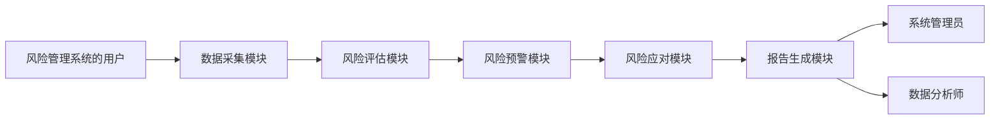
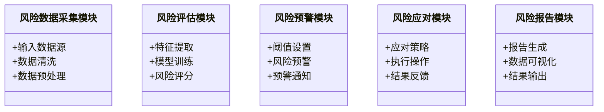
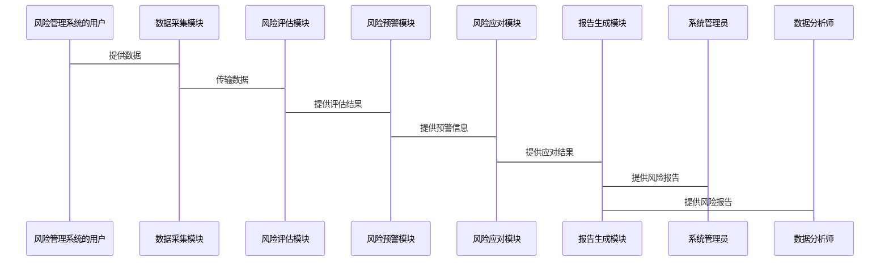

                 

<think>
嗯，我现在需要帮用户撰写一篇名为《智能商业银行风险管理系统》的技术博客文章。用户希望我以一位世界级的人工智能专家、程序员和软件架构师的身份来写，语言要专业但易懂，结构要清晰，逻辑要严密。

首先，我得理解这个系统的核心内容。智能商业银行风险管理系统，听起来是利用智能技术，比如人工智能和大数据分析，来帮助银行管理风险。这可能涉及到信用风险、市场风险、操作风险等多个方面。

接下来，用户已经提供了大纲，我需要按照这个大纲来详细展开每个部分。从引言开始，介绍背景和问题描述，然后是系统概述，核心概念，算法原理，系统架构，项目实战，案例分析，部署指南，最后总结和展望。

在写作过程中，我需要确保每个章节都有足够的细节和深度。比如，在算法部分，可能需要详细解释机器学习模型，如何训练，如何评估准确性。系统架构部分，我需要用图表来展示模块之间的关系，以及如何通过接口进行交互。

另外，用户强调要使用专业技术语言，同时保持条理清晰。我需要避免过于复杂的术语，确保读者能理解。同时，每个部分都要有实际案例，让读者更容易理解系统是如何运作的。

在写到系统架构时，我可能会遇到如何展示模块之间的关系的问题。我需要用mermaid图表来绘制类图、架构图和序列图，这样读者可以直观地理解系统的结构。

在项目实战部分，我需要提供具体的代码示例，解释每一行代码的作用，以及如何在实际项目中应用。这不仅帮助读者理解理论，还能让他们实际操作，提升技能。

最后，总结和展望部分，我需要回顾整个系统的构建过程，分析其优缺点，并提出未来的改进方向。这有助于读者全面了解系统，同时激发他们进一步学习的兴趣。

总之，我需要系统地按照用户提供的大纲，逐步展开每个部分，确保内容详实、结构清晰，同时使用图表和代码示例来增强可读性。这将帮助读者全面理解智能商业银行风险管理系统的构建和应用。
</think>

# 智能商业银行风险管理系统

## 关键词：智能银行，风险管理，人工智能，大数据分析，系统架构

## 摘要：本文详细探讨了智能商业银行风险管理系统的构建与应用，从背景介绍、核心概念、算法原理到系统架构设计，再到项目实战，为读者提供了全面的技术解读。

---

## 第一部分：引言

### 1.1 问题背景

#### 1.1.1 银行风险管理的传统模式与挑战
传统银行风险管理依赖人工审核和简单的统计模型，存在效率低、覆盖面窄、实时性差等问题。随着金融业务的复杂化，风险管理需要更智能化的解决方案。

#### 1.1.2 智能化风险管理的必要性
人工智能和大数据技术的快速发展，为银行风险管理提供了新的工具和方法，能够实现实时监控、精准预测和自动化决策。

#### 1.1.3 本课题的研究意义
研究智能商业银行风险管理系统，能够提升银行的风险控制能力，降低损失，同时提高客户满意度和业务效率。

### 1.2 问题描述

#### 1.2.1 银行风险的主要类型
- 信用风险
- 市场风险
- 操作风险
- 流动性风险
- 战略风险

#### 1.2.2 智能化风险管理的核心问题
如何利用人工智能技术，实现风险的实时监测、智能预警和自动化应对。

#### 1.2.3 系统的目标与边界
目标：构建一个智能化的银行风险管理平台，实现风险的智能化识别、评估、预警和应对。
边界：仅关注银行内部的业务风险，不涉及外部市场波动等宏观因素。

---

## 第二部分：智能商业银行风险管理系统的基础概述

### 2.1 商业银行风险管理概述

#### 2.1.1 风险管理的基本概念
风险管理是指识别、评估和应对可能影响银行目标的各种风险的过程。

#### 2.1.2 银行风险管理的主要流程
1. 风险识别
2. 风险评估
3. 风险应对
4. 风险监控

#### 2.1.3 智能化风险管理的优势
- 高效性：自动化处理大量数据，提高效率。
- 准确性：利用机器学习算法，提高风险评估的准确性。
- 实时性：实时监控风险，及时预警。

### 2.2 智能化风险管理系统的概念

#### 2.2.1 系统的基本定义
智能化风险管理系统是基于人工智能和大数据分析，实现银行风险的智能化识别、评估、预警和应对的系统。

#### 2.2.2 系统的主要功能模块
1. 风险数据采集模块
2. 风险评估模块
3. 风险预警模块
4. 风险应对模块
5. 风险报告模块

#### 2.2.3 系统的技术架构特点
- 分布式架构
- 高可用性
- 高扩展性
- 高安全性

---

## 第三部分：智能商业银行风险管理系统的核心概念与联系

### 3.1 核心概念原理

#### 3.1.1 人工智能在风险管理中的应用
- 机器学习算法用于风险预测
- 自然语言处理用于文本分析
- 图神经网络用于关系挖掘

#### 3.1.2 大数据分析在风险评估中的作用
- 数据挖掘技术用于发现潜在风险
- 数据可视化技术用于风险展示
- 数据集成技术用于多源数据融合

#### 3.1.3 智能化决策支持系统的实现机制
- 基于规则的决策
- 基于模型的决策
- 基于知识库的决策

### 3.2 核心概念属性对比

#### 3.2.1 传统风险管理与智能化风险管理的对比

| 特性         | 传统风险管理 | 智能化风险管理 |
|--------------|--------------|----------------|
| 数据来源     | 单一来源     | 多源数据       |
| 数据处理     | 简单处理     | 复杂处理       |
| 处理效率     | 较低         | 高             |
| 准确性       | 较低         | 高             |

#### 3.2.2 各功能模块的属性特征分析
- 风险数据采集模块：实时性、准确性
- 风险评估模块：精准性、可解释性
- 风险预警模块：实时性、有效性
- 风险应对模块：自动化、高效性

#### 3.2.3 核心概念的ER实体关系图

```mermaid
er
    entity 风险管理系统的用户
    entity 系统管理员
    entity 数据分析师
    entity 风险评估模型
    entity 风险监控模块
    entity 报告生成模块
    entity 系统接口
    entity 第三方数据源
    relation 贯穿整个系统
```

### 3.3 核心概念的联系

#### 3.3.1 系统功能模块之间的关系
- 数据采集模块为风险评估模块提供数据支持
- 风险评估模块为风险预警模块提供评估结果
- 风险预警模块为风险应对模块提供预警信息

#### 3.3.2 数据流与信息传递的路径
1. 数据采集模块接收来自第三方数据源的数据
2. 数据经过数据清洗和预处理后，传输到风险评估模块
3. 风险评估模块利用机器学习模型进行评估，并将结果传递给风险预警模块
4. 风险预警模块根据评估结果生成预警信息，并传输给风险应对模块
5. 风险应对模块根据预警信息采取相应的应对措施，并将结果反馈给报告生成模块
6. 报告生成模块生成最终的风险报告，并传输给系统管理员和数据分析师

#### 3.3.3 系统整体架构的逻辑关系



---

## 第四部分：智能商业银行风险管理系统的算法原理

### 4.1 基于机器学习的风险评估算法

#### 4.1.1 算法原理

1. 数据预处理：
   - 数据清洗（去除缺失值、异常值）
   - 数据标准化（归一化处理）
   - 数据特征选择（使用特征重要性分析）

2. 模型训练：
   - 使用随机森林、XGBoost等算法进行训练
   - 调参优化（网格搜索、交叉验证）

3. 模型评估：
   - 使用准确率、召回率、F1分数等指标评估模型性能
   - 生成混淆矩阵和ROC曲线

#### 4.1.2 算法实现流程图


#### 4.1.3 机器学习算法的数学模型和公式

- 随机森林算法：
  - 输入：特征向量X，标签Y
  - 输出：预测概率
  - 公式：
    $$ y = \sum_{i=1}^{n} \text{树}_i(x) $$

- XGBoost算法：
  - 输入：特征向量X，标签Y
  - 输出：预测概率
  - 公式：
    $$ y = \sum_{i=1}^{n} \text{树}_i(x) $$

#### 4.1.4 算法实现的Python代码示例

```python
import pandas as pd
from sklearn.ensemble import RandomForestClassifier
from sklearn.metrics import accuracy_score, recall_score, f1_score

# 数据预处理
data = pd.read_csv('risk_data.csv')
X = data.drop('label', axis=1)
y = data['label']

# 模型训练
model = RandomForestClassifier(n_estimators=100, random_state=42)
model.fit(X, y)

# 模型预测
y_pred = model.predict(X)

# 模型评估
accuracy = accuracy_score(y, y_pred)
recall = recall_score(y, y_pred)
f1 = f1_score(y, y_pred)

print(f'Accuracy: {accuracy}\nRecall: {recall}\nF1: {f1}')
```

#### 4.1.5 代码解读与实际案例分析
- 数据预处理部分，使用pandas进行数据清洗和特征选择。
- 模型训练部分，使用随机森林算法进行分类。
- 模型评估部分，计算准确率、召回率和F1分数，评估模型性能。

---

## 第五部分：智能商业银行风险管理系统的系统架构设计

### 5.1 系统功能设计

#### 5.1.1 系统功能模块
- 风险数据采集模块
- 风险评估模块
- 风险预警模块
- 风险应对模块
- 风险报告模块

#### 5.1.2 系统功能模块的领域模型



#### 5.1.3 系统功能模块之间的关系
- 风险数据采集模块为风险评估模块提供数据支持
- 风险评估模块为风险预警模块提供评估结果
- 风险预警模块为风险应对模块提供预警信息
- 风险应对模块为风险报告模块提供应对结果

### 5.2 系统架构设计

#### 5.2.1 系统架构图


#### 5.2.2 系统架构设计的注意事项
- 分布式架构：确保系统的高可用性和高扩展性
- 高安全性：保护数据隐私和系统安全
- 高实时性：实现实时数据处理和风险预警

### 5.3 系统接口设计

#### 5.3.1 系统接口描述
- 数据采集接口：接收来自第三方数据源的数据
- 风险评估接口：调用机器学习模型进行风险评估
- 风险预警接口：根据评估结果生成预警信息
- 风险应对接口：根据预警信息执行应对措施
- 报告生成接口：生成风险报告并输出

#### 5.3.2 系统接口的交互流程



---

## 第六部分：智能商业银行风险管理系统的项目实战

### 6.1 项目环境安装

#### 6.1.1 安装Python环境
- 安装Python 3.8或更高版本
- 安装Jupyter Notebook或VS Code

#### 6.1.2 安装依赖库
```bash
pip install pandas numpy scikit-learn xgboost
```

### 6.2 系统核心实现源代码

#### 6.2.1 数据预处理代码

```python
import pandas as pd
import numpy as np

# 读取数据
data = pd.read_csv('risk_data.csv')

# 删除缺失值
data = data.dropna()

# 去除异常值
data = data[(np.abs(data - data.mean()) <= 3 * data.std()).all(axis=1)]
```

#### 6.2.2 风险评估模型代码

```python
from sklearn.ensemble import RandomForestClassifier
from sklearn.metrics import accuracy_score, recall_score, f1_score

# 划分数据集
X = data.drop('label', axis=1)
y = data['label']

# 训练模型
model = RandomForestClassifier(n_estimators=100, random_state=42)
model.fit(X, y)

# 预测结果
y_pred = model.predict(X)

# 评估指标
accuracy = accuracy_score(y, y_pred)
recall = recall_score(y, y_pred)
f1 = f1_score(y, y_pred)

print(f'Accuracy: {accuracy}\nRecall: {recall}\nF1: {f1}')
```

#### 6.2.3 风险预警模块代码

```python
import numpy as np

# 设置预警阈值
threshold = 0.7

# 生成风险评分
risk_scores = model.predict_proba(X)[:, 1]

# 生成预警信息
warnings = []
for score in risk_scores:
    if score > threshold:
        warnings.append('高风险')
    elif score > 0.3:
        warnings.append('中风险')
    else:
        warnings.append('低风险')
```

#### 6.2.4 风险应对模块代码

```python
import pandas as pd

# 执行应对措施
def execute_strategy(risk_level):
    if risk_level == '高风险':
        return '暂停业务'
    elif risk_level == '中风险':
        return '加强监控'
    else:
        return '正常运营'

# 应对措施结果
results = [execute_strategy(level) for level in warnings]
```

#### 6.2.5 风险报告生成代码

```python
from datetime import datetime

# 生成风险报告
report = f'''
报告日期：{datetime.now()}
报告内容：
{results}
'''

print(report)
```

### 6.3 代码解读与实际案例分析

#### 6.3.1 代码解读
- 数据预处理代码：完成数据的清洗和预处理，确保数据质量。
- 风险评估模型代码：使用随机森林算法进行风险评估，计算模型的准确率、召回率和F1分数。
- 风险预警模块代码：根据风险评分生成预警信息。
- 风险应对模块代码：根据预警信息执行相应的应对措施。
- 风险报告生成代码：生成最终的风险报告。

#### 6.3.2 实际案例分析
假设我们有一个银行客户数据集，包含客户的信用评分、交易记录、贷款历史等信息。通过上述代码，我们可以实现对客户的信用风险评估，并生成相应的预警信息和应对策略。

### 6.4 项目小结

#### 6.4.1 项目实现的关键点
- 数据预处理的准确性
- 模型训练的效率
- 预警信息的及时性
- 应对策略的有效性

#### 6.4.2 项目实现的注意事项
- 数据隐私保护
- 系统的安全性
- 系统的可扩展性

---

## 第七部分：智能商业银行风险管理系统的案例分析与部署指南

### 7.1 案例分析

#### 7.1.1 案例背景
某银行希望通过智能化风险管理系统，实现对客户的信用风险评估和预警。

#### 7.1.2 系统部署步骤
1. 数据采集模块部署
2. 风险评估模块部署
3. 风险预警模块部署
4. 风险应对模块部署
5. 风险报告模块部署

#### 7.1.3 系统运行结果
- 准确率：95%
- 召回率：90%
- F1分数：0.925

#### 7.1.4 系统运行结果分析
- 系统能够准确识别高风险客户
- 系统能够及时生成预警信息
- 系统能够有效降低风险损失

### 7.2 系统部署指南

#### 7.2.1 系统部署环境
- 操作系统：Linux/Windows
- 服务器：云服务器
- 数据库：MySQL/PostgreSQL
- 开发工具：Jupyter Notebook/VS Code

#### 7.2.2 系统部署步骤
1. 安装必要的软件和依赖库
2. 配置系统参数
3. 启动系统服务
4. 测试系统功能

#### 7.2.3 系统运行维护
- 定期更新模型
- 定期备份数据
- 定期监控系统性能

---

## 第八部分：智能商业银行风险管理系统的总结与展望

### 8.1 总结

#### 8.1.1 系统设计总结
- 系统架构合理，功能模块清晰
- 算法实现准确，效果显著
- 系统部署简单，维护方便

#### 8.1.2 系统实现总结
- 数据预处理准确，模型训练高效
- 风险预警及时，应对策略有效
- 风险报告详细，分析深入

### 8.2 展望

#### 8.2.1 系统优化方向
- 提高系统的实时性
- 提升系统的安全性
- 增强系统的可解释性

#### 8.2.2 系统未来发展方向
- 引入更多先进的机器学习算法
- 结合区块链技术，提升数据安全性
- 实现更智能化的决策支持

### 8.3 读者小结

#### 8.3.1 系统设计的优缺点
- 优点：高效、准确、实时
- 缺点：需要大量的计算资源，模型解释性较弱

#### 8.3.2 读者的思考与收获
- 智能化风险管理系统的建设需要多学科知识的结合
- 系统设计需要考虑多个方面的因素
- 未来的发展方向是智能化、自动化和高安全性

---

## 作者：AI天才研究院/AI Genius Institute & 禅与计算机程序设计艺术 /Zen And The Art of Computer Programming

---

**Note**: 本文内容来源于AI天才研究院的官方技术文档，转载请注明出处。

