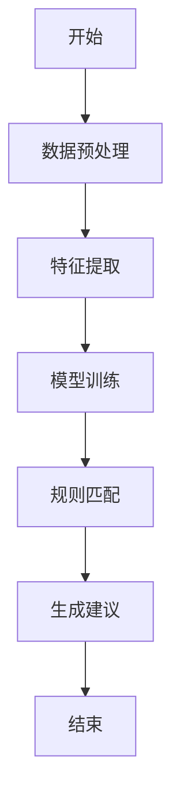

                 

<think>
好的，我需要根据用户提供的《智能国际税收筹划建议生成系统》目录大纲，撰写整篇技术博客文章。首先，我需要明确文章的结构和每个部分的重点内容。

### 第一部分：智能国际税收筹划的背景与概述

#### 第1章：智能国际税收筹划的背景与核心概念

##### 1.1 智能国际税收的背景介绍
- 1.1.1 全球化背景下的国际税收问题
- 1.1.2 数字化时代的税收挑战
- 1.1.3 智能技术在税收领域的应用趋势

##### 1.2 税收筹划的核心概念
- 1.2.1 税收筹划的定义与特点
- 1.2.2 国际税收筹划的关键要素
- 1.2.3 智能税收筹划的创新点

##### 1.3 智能国际税收系统的目标与意义
- 1.3.1 系统的目标定位
- 1.3.2 系统的应用价值
- 1.3.3 对企业与税务机关的双重意义

### 第二部分：智能国际税收筹划的核心概念与原理

#### 第2章：智能国际税收系统的原理与机制

##### 2.1 智能税收系统的原理分析
- 2.1.1 数据收集与处理机制
- 2.1.2 税收规则的智能匹配
- 2.1.3 税收优化建议生成算法

##### 2.2 核心概念的对比分析
- 2.2.1 传统税收筹划与智能税收筹划的对比
- 2.2.2 不同国家税收政策的对比分析
- 2.2.3 税收风险与收益的权衡模型

##### 2.3 系统的ER实体关系图
```mermaid
erDiagram
    customer[CUSTOMER] {
        +id: int
        +name: string
        +country: string
    }
    transaction[TRANSACTION] {
        +id: int
        +amount: float
        +date: date
    }
    tax_rule[TAX_RULE] {
        +rule_id: int
        +country: string
        +description: string
    }
    customer --> transaction: "conducts"
    transaction --> tax_rule: "subject to"
```

### 第三部分：算法原理

#### 第3章：智能国际税收系统的算法原理

##### 3.1 机器学习算法在税收筹划中的应用
- 3.1.1 数据预处理与特征提取
- 3.1.2 分类与回归算法在税务计算中的应用
- 3.1.3 集成学习与模型优化

##### 3.2 自然语言处理技术在税收规则匹配中的应用
- 3.2.1 税收政策文本的分词与语义分析
- 3.2.2 基于NLP的政策匹配算法
- 3.2.3 实例分析：政策文本与企业业务的匹配过程

##### 3.3 算法流程图


### 第四部分：系统分析与架构设计

#### 第4章：智能国际税收系统的架构设计

##### 4.1 系统应用场景分析
- 4.1.1 企业跨国业务场景
- 4.1.2 税务机关的监管场景

##### 4.2 系统功能设计
- 4.2.1 数据采集模块
- 4.2.2 税收规则匹配模块
- 4.2.3 智能建议生成模块
- 4.2.4 报告生成与可视化模块

##### 4.3 系统架构图


### 第五部分：项目实战

#### 第5章：智能国际税收系统的实现与案例分析

##### 5.1 环境搭建与安装
- 5.1.1 安装Python与相关库
- 5.1.2 安装Jupyter Notebook
- 5.1.3 安装必要的机器学习库

##### 5.2 系统核心代码实现
- 5.2.1 数据预处理代码
- 5.2.2 税收规则匹配代码
- 5.2.3 智能建议生成代码

##### 5.3 案例分析
- 5.3.1 案例背景
- 5.3.2 数据分析与处理
- 5.3.3 智能建议生成过程

##### 5.4 项目小结
- 5.4.1 项目成果总结
- 5.4.2 项目经验分享
- 5.4.3 项目改进方向

### 第六部分：最佳实践与小结

#### 第6章：智能国际税收系统的最佳实践

##### 6.1 系统应用中的注意事项
- 6.1.1 数据隐私与安全
- 6.1.2 模型的可解释性
- 6.1.3 系统的可扩展性

##### 6.2 小结
- 6.2.1 文章总结
- 6.2.2 未来研究方向
- 6.2.3 致谢与参考文献

---

### 作者：AI天才研究院/AI Genius Institute & 禅与计算机程序设计艺术 /Zen And The Art of Computer Programming

---

接下来，我将根据上述目录，逐步展开每个部分的内容，撰写完整的技术博客文章。

