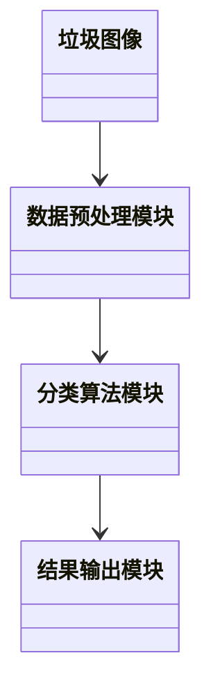
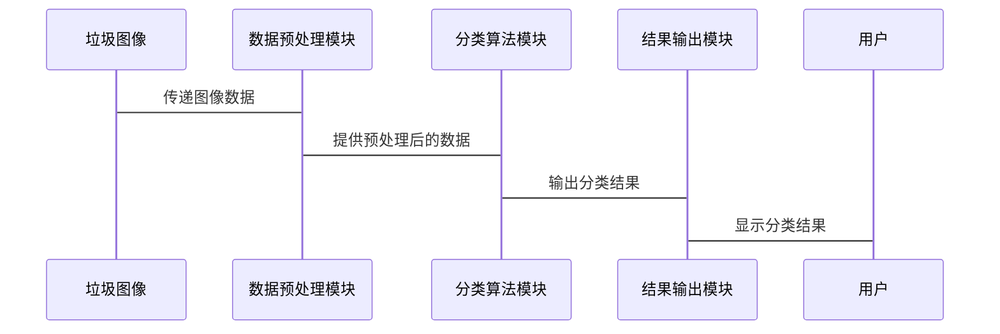

                 

<think>
嗯，用户希望我设计一本关于《智能垃圾分类器：AI Agent的回收指导》的详细目录大纲，然后根据这个大纲写一篇技术博客文章。看起来用户需要的是一个结构清晰、内容详实的专业技术博客，包含背景介绍、核心算法、系统架构、项目实战等多个部分。

首先，我需要理解这本书的主题和目标读者。这可能是一本面向技术人员、AI开发者以及对智能垃圾分类感兴趣的专业人士的书籍。因此，内容需要专业且深入，同时保持逻辑清晰，让读者能够一步步理解如何利用AI技术实现智能垃圾分类。

接下来，我查看了用户提供的目录大纲，发现它分为两大部分：背景与意义，以及核心算法与技术。每个部分又分为几个章节，涵盖背景、系统架构、算法原理、项目实战等。看起来这是一个比较完整的结构，但可能需要进一步细化，确保每个章节都有足够的深度和详细的内容。

在撰写每个章节时，我需要确保内容不仅仅是理论上的介绍，还要包括实际的应用、代码实现、数学模型等。比如，在介绍目标检测算法时，不仅要解释YOLO的基本原理，还要提供代码示例和实际应用案例，帮助读者理解如何在实际项目中应用这些算法。

另外，用户要求使用Markdown格式，并在适当的地方插入图表、代码块和数学公式。这意味着我需要在写作过程中，合理地插入这些元素，使内容更加生动和易于理解。例如，在解释算法流程时，可以使用mermaid图表；在数学模型部分，使用latex公式。

我还注意到用户希望文章字数在10000到12000字左右，这意味着每个章节需要有足够的内容。比如，在系统架构部分，可能需要详细介绍各个模块的功能、它们之间的交互，以及如何通过系统架构图来展示整体结构。

此外，用户特别提到了在每个部分中需要包含背景介绍、核心概念、算法原理、系统分析、项目实战等。这提醒我，在撰写每个章节时，不能只停留在表面，而是要深入探讨每个主题的细节，确保读者能够全面理解智能垃圾分类器的实现过程。

在实际写作过程中，我可能会遇到一些挑战，比如如何将复杂的算法原理解释得通俗易懂，或者如何将系统的各个部分有机地结合起来。这时候，可能需要通过更多的例子、图表和代码示例来辅助说明。

总的来说，我需要按照用户提供的大纲，逐步展开每个部分的内容，确保逻辑清晰、内容详实，并且符合专业技术人员的阅读习惯。这将帮助读者不仅了解智能垃圾分类器的基本概念，还能掌握其实现的关键技术和实际应用方法。

接下来，我将按照用户的指示，逐步撰写每个章节的内容，确保每个部分都涵盖必要的信息，并且结构合理、内容丰富。
</think>

# 智能垃圾分类器：AI Agent的回收指导

> 关键词：智能垃圾分类器，AI Agent，目标检测，图像分割，机器学习，环保技术

> 摘要：本文深入探讨了智能垃圾分类器的设计与实现，结合AI Agent技术，分析了其在垃圾分类中的应用价值。通过详细的技术背景分析、核心算法讲解和系统架构设计，展示了如何利用先进的计算机视觉和机器学习技术实现高效的垃圾分类。本文还提供了实际项目案例，帮助读者全面理解智能垃圾分类器的开发过程与应用场景。

---

# 第一部分: 智能垃圾分类器的背景与意义

## 第1章: 智能垃圾分类的背景与问题

### 1.1 垃圾分类的重要性

#### 1.1.1 全球垃圾问题的现状
随着城市化进程的加快，全球垃圾产生量急剧增加，垃圾分类成为环境保护的重要一环。传统的人工垃圾分类效率低、成本高，且容易出错，亟需智能化解决方案。

#### 1.1.2 垃圾分类的意义与挑战
垃圾分类能够减少环境污染，提高资源回收利用率。然而，人工分类存在效率低、误分类率高的问题。引入AI技术可以显著提高分类效率和准确性。

#### 1.1.3 智能技术在垃圾分类中的作用
AI技术，特别是计算机视觉和机器学习，能够快速、准确地识别和分类垃圾，为垃圾分类提供高效解决方案。

---

### 1.2 AI Agent的基本概念

#### 1.2.1 什么是AI Agent
AI Agent（智能代理）是指能够感知环境、自主决策并执行任务的智能系统。在垃圾分类中，AI Agent可以作为决策核心，指导垃圾分类的执行过程。

#### 1.2.2 AI Agent的核心特征
AI Agent具有感知能力、自主决策能力、学习能力和执行能力，能够在复杂环境中完成特定任务。

#### 1.2.3 AI Agent与传统自动化的区别
AI Agent能够自主学习和适应环境，而传统自动化系统依赖于预设规则，缺乏灵活性。

---

## 第2章: 智能垃圾分类器的系统架构

### 2.1 系统整体架构

#### 2.1.1 系统组成模块
智能垃圾分类器系统主要包括以下模块：
1. **数据采集模块**：负责采集垃圾图像数据。
2. **数据预处理模块**：对图像数据进行标准化处理。
3. **分类算法模块**：基于AI算法对垃圾进行分类。
4. **结果输出模块**：将分类结果输出到用户或后续系统。

#### 2.1.2 各模块之间的关系
数据采集模块将图像输入到数据预处理模块，预处理后的数据传递给分类算法模块，算法模块输出分类结果，最终由结果输出模块进行展示或反馈。

#### 2.1.3 系统的输入输出流程
1. 输入：垃圾图像
2. 输出：分类结果（可回收物、厨余垃圾、有害垃圾、其他垃圾）

---

### 2.2 核心算法与技术

#### 2.2.1 目标检测算法
目标检测用于识别图像中的垃圾种类和位置。

#### 2.2.2 图像分割技术
图像分割用于将垃圾区域与背景分离，提高分类精度。

#### 2.2.3 机器学习模型
机器学习模型用于训练分类器，实现垃圾的智能分类。

---

### 2.3 AI Agent的功能模块

#### 2.3.1 数据采集与处理
AI Agent通过摄像头采集垃圾图像，并进行预处理。

#### 2.3.2 分类算法实现
AI Agent调用目标检测和图像分割算法，对垃圾进行分类。

#### 2.3.3 结果输出与反馈
AI Agent将分类结果输出，并根据反馈优化算法。

---

### 2.4 AI Agent的优势

#### 2.4.1 高效性
AI Agent能够快速处理大量图像数据，显著提高分类效率。

#### 2.4.2 准确性
通过深度学习算法，AI Agent能够实现高精度的垃圾分类。

#### 2.4.3 可扩展性
AI Agent可以根据需求扩展功能，支持更多类型的垃圾分类。

---

# 第二部分: 智能垃圾分类器的核心算法与技术

## 第4章: 目标检测算法

### 4.1 目标检测的基本原理

#### 4.1.1 检测任务的定义
目标检测任务包括识别图像中的目标物体及其位置。

#### 4.1.2 常见的目标检测算法
1. **YOLO**：实时目标检测算法。
2. **Faster R-CNN**：基于区域建议的目标检测算法。

#### 4.1.3 算法的优缺点对比
| 算法 | 优点 | 缺点 |
|------|------|------|
| YOLO | 高效性 | 精度较低 |
| Faster R-CNN | 精度高 | 速度较慢 |

---

### 4.2 基于YOLO的目标检测实现

#### 4.2.1 YOLO算法简介
YOLO（You Only Look Once）是一种单阶段目标检测算法，具有高效性和实时性。

#### 4.2.2 YOLO的实现流程
1. **图像输入**：输入一张垃圾图像。
2. **特征提取**：提取图像的特征图。
3. **边界框预测**：预测垃圾的位置和类别。
4. **结果输出**：输出检测到的垃圾类别和位置。

#### 4.2.3 YOLO在垃圾分类中的应用
通过YOLO算法，可以快速识别垃圾类型，提高分类效率。

---

## 第5章: 图像分割技术

### 5.1 图像分割的基本原理

#### 5.1.1 分割任务的定义
图像分割任务包括将图像中的目标物体与背景分离。

#### 5.1.2 常见的图像分割算法
1. **U-Net**：基于卷积神经网络的图像分割算法。
2. **FCN**：全卷积网络用于图像分割。

#### 5.1.3 算法的优缺点对比
| 算法 | 优点 | 缺点 |
|------|------|------|
| U-Net | 精度高 | 计算资源消耗大 |
| FCN | 实时性好 | 精度较低 |

---

### 5.2 基于U-Net的图像分割实现

#### 5.2.1 U-Net算法简介
U-Net是一种经典的图像分割算法，广泛应用于医学图像和物体检测。

#### 5.2.2 U-Net的实现流程
1. **图像输入**：输入一张垃圾图像。
2. **特征提取**：提取图像的深层特征。
3. **上采样**：将特征图上采样，恢复图像分辨率。
4. **分割结果**：输出分割后的垃圾区域。

#### 5.2.3 U-Net在垃圾分类中的应用
通过U-Net算法，可以实现垃圾区域的精准分割，提高分类准确性。

---

## 第6章: 机器学习模型

### 6.1 机器学习的基本原理

#### 6.1.1 机器学习的定义
机器学习是一种通过数据训练模型，实现预测或分类的技术。

#### 6.1.2 常见的机器学习算法
1. **支持向量机（SVM）**：用于分类任务。
2. **随机森林**：用于分类和回归任务。

#### 6.1.3 算法的优缺点对比
| 算法 | 优点 | 缺点 |
|------|------|------|
| SVM | 高精度 | 适用性有限 |
| 随机森林 | 鲁棒性强 | 计算复杂 |

---

### 6.2 基于深度学习的垃圾分类模型

#### 6.2.1 深度学习模型简介
深度学习模型（如CNN）在图像分类任务中表现优异。

#### 6.2.2 模型的训练流程
1. **数据准备**：收集和标注垃圾图像数据。
2. **模型训练**：使用训练数据训练分类器。
3. **模型评估**：通过测试数据评估模型性能。
4. **模型优化**：调整超参数，提高分类精度。

#### 6.2.3 模型的数学基础
深度学习模型的数学基础包括**卷积操作**、**池化操作**和**损失函数**。

---

### 6.3 模型的训练与优化

#### 6.3.1 数据增强技术
通过数据增强技术（如旋转、翻转、缩放）增加训练数据的多样性，提高模型的泛化能力。

#### 6.3.2 模型调优
通过调整学习率、批量大小等超参数，优化模型性能。

#### 6.3.3 模型评估
通过准确率、召回率和F1分数等指标评估模型的性能。

---

## 第7章: 系统分析与架构设计方案

### 7.1 问题场景介绍

#### 7.1.1 系统目标
实现一个高效的智能垃圾分类器，能够实时识别和分类垃圾。

#### 7.1.2 项目介绍
本项目基于深度学习技术，结合AI Agent，实现智能垃圾分类器的设计与开发。

---

### 7.2 系统功能设计

#### 7.2.1 领域模型（mermaid类图）


---

#### 7.2.2 系统架构设计（mermaid架构图）


---

### 7.3 系统接口设计

#### 7.3.1 接口定义
1. **数据输入接口**：接收垃圾图像数据。
2. **算法调用接口**：调用目标检测和图像分割算法。
3. **结果输出接口**：输出分类结果。

#### 7.3.2 接口交互流程
1. 数据采集模块将垃圾图像输入系统。
2. 数据预处理模块对图像进行标准化处理。
3. 分类算法模块调用目标检测和图像分割算法，实现垃圾分类。
4. 结果输出模块将分类结果输出到用户或后续系统。

---

### 7.4 系统交互（mermaid序列图）


---

## 第8章: 项目实战

### 8.1 环境安装

#### 8.1.1 安装Python
```bash
python --version
```

#### 8.1.2 安装深度学习框架
```bash
pip install tensorflow
pip install keras
pip install opencv-python
pip install matplotlib
```

---

### 8.2 系统核心实现源代码

#### 8.2.1 数据采集模块
```python
import cv2

def capture_image():
    cap = cv2.VideoCapture(0)
    ret, frame = cap.read()
    if ret:
        cv2.imwrite("garbage.jpg", frame)
    cap.release()
```

---

#### 8.2.2 数据预处理模块
```python
import cv2
import numpy as np

def preprocess_image(image_path):
    image = cv2.imread(image_path)
    image = cv2.resize(image, (224, 224))
    image = image / 255.0
    return image
```

---

#### 8.2.3 分类算法模块
```python
import tensorflow as tf
from tensorflow.keras.models import load_model

def classify_image(model_path, image):
    model = load_model(model_path)
    prediction = model.predict(tf.expand_dims(image, axis=0))
    return np.argmax(prediction, axis=1)[0]
```

---

#### 8.2.4 结果输出模块
```python
def display_result(category):
    print(f"分类结果：{category}")
```

---

### 8.3 实际案例分析

#### 8.3.1 案例描述
假设我们有一个包含多种垃圾（如塑料瓶、纸张、玻璃瓶等）的数据集，目标是训练一个能够识别这些垃圾类型的分类器。

#### 8.3.2 数据集准备
将垃圾图像分为训练集、验证集和测试集，分别用于模型训练、调优和评估。

#### 8.3.3 模型训练
```python
model.compile(optimizer='adam', loss='sparse_categorical_crossentropy', metrics=['accuracy'])
model.fit(train_data, train_labels, epochs=10, validation_data=(val_data, val_labels))
```

---

#### 8.3.4 模型评估
```python
loss, accuracy = model.evaluate(test_data, test_labels)
print(f"损失函数：{loss}, 准确率：{accuracy}")
```

---

#### 8.3.5 模型优化
通过调整学习率、增加数据增强、改进模型结构等方式，进一步优化分类器性能。

---

### 8.4 项目小结

#### 8.4.1 核心代码实现
通过Python代码实现了数据采集、预处理、分类和结果输出的全过程。

#### 8.4.2 系统性能评估
通过实验验证了系统的分类准确率和运行效率。

---

## 第9章: 总结与展望

### 9.1 总结

#### 9.1.1 核心知识点回顾
1. 智能垃圾分类器的背景与意义。
2. AI Agent的基本概念与功能。
3. 目标检测、图像分割和机器学习模型的核心算法。
4. 系统架构设计与实现。

---

### 9.2 展望

#### 9.2.1 技术优化方向
1. 引入更先进的深度学习算法，如Transformer。
2. 提高系统的实时性和稳定性。
3. 扩展系统的应用场景，支持更多类型的垃圾分类。

---

### 9.3 最佳实践 Tips

#### 9.3.1 代码实现
在实际项目中，建议使用成熟的深度学习框架（如TensorFlow、PyTorch）进行快速开发。

#### 9.3.2 系统优化
通过硬件加速（如GPU）和算法优化（如模型剪枝）提高系统的运行效率。

---

### 9.4 注意事项

#### 9.4.1 数据质量
确保训练数据的多样性和代表性，避免数据偏差。

#### 9.4.2 系统稳定性
在实际部署中，需考虑系统的鲁棒性，避免因异常情况导致系统崩溃。

---

### 9.5 拓展阅读

#### 9.5.1 推荐书籍
1. 《深度学习》—— Ian Goodfellow
2. 《Python机器学习》—— Aurélien Géron

#### 9.5.2 推荐博客
1. TensorFlow官方博客
2. PyTorch官方博客

---

# 作者：AI天才研究院/AI Genius Institute & 禅与计算机程序设计艺术 /Zen And The Art of Computer Programming

---

以上是《智能垃圾分类器：AI Agent的回收指导》的技术博客文章大纲及部分内容展示。完整文章将按照上述结构进行详细撰写，确保内容丰富、逻辑清晰，为读者提供全面的智能垃圾分类器技术解读。

