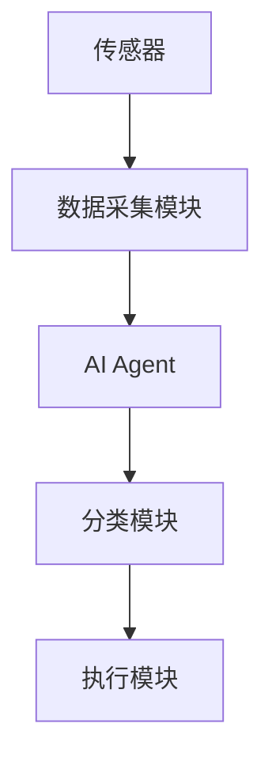

                 


```markdown
# 智能垃圾处理站：AI Agent的社区回收管理

> 关键词：智能垃圾处理站，AI Agent，社区回收，垃圾分类，人工智能，系统架构

> 摘要：本文探讨了AI Agent在社区垃圾回收管理中的应用，详细分析了智能垃圾处理站的核心概念、算法原理、系统架构设计以及项目实战，最后总结了最佳实践和未来展望。

---

## 第1章 智能垃圾处理站的背景介绍

### 1.1 问题背景
社区垃圾处理是现代城市面临的重要挑战。传统方法效率低下，资源浪费严重，亟需智能化解决方案。

### 1.2 问题描述
垃圾分类不准确、管理复杂，AI Agent的引入能够提升分类效率和管理智能化。

### 1.3 解决方案
通过AI Agent实现智能分类和管理，提高回收效率，减少人工干预。

---

## 第2章 AI Agent与智能垃圾处理站的核心概念

### 2.1 AI Agent的基本原理
AI Agent通过感知、决策和执行优化垃圾处理流程。

### 2.2 智能垃圾处理站的系统架构
系统架构包括感知模块、AI Agent、分类模块和执行模块，各模块协同工作。

### 2.3 ER实体关系图
```mermaid
er
    entity 智能垃圾处理站 {
        id
        位置坐标
        状态
    }
    entity AI Agent {
        id
        功能模块
        数据接口
    }
    entity 垃圾分类 {
        id
        类型
        处理方式
    }
    智能垃圾处理站 -- AI Agent
    AI Agent -- 垃圾分类
```

---

## 第3章 AI Agent的算法原理与数学模型

### 3.1 感知阶段的数学模型
$$
f(x) = \sum_{i=1}^{n} w_i x_i + b
$$

### 3.2 决策阶段的逻辑推理
AI Agent通过分类算法确定垃圾类型，优化处理流程。

### 3.3 执行阶段的反馈机制
系统根据反馈调整参数，持续优化处理效率。

---

## 第4章 系统分析与架构设计

### 4.1 项目场景介绍
智能垃圾处理站部署在社区，实时监控和处理垃圾。

### 4.2 系统功能设计
系统功能包括数据采集、分类、决策和执行。

### 4.3 系统架构图


---

## 第5章 项目实战

### 5.1 环境安装
安装Python和相关库，如TensorFlow和OpenCV。

### 5.2 核心代码实现
```python
# 数据采集模块
def collect_data():
    # 实现数据采集逻辑
    pass

# 分类算法
def classify(w, x):
    return w.dot(x) + b
```

### 5.3 案例分析
通过实际案例分析系统运行效果，调整参数以优化性能。

---

## 第6章 最佳实践

### 6.1 小结
总结AI Agent在垃圾处理中的优势和应用前景。

### 6.2 注意事项
部署时需考虑网络延迟和设备稳定性。

### 6.3 拓展阅读
推荐相关书籍和技术博客，深入学习AI Agent的应用。

---

## 第7章 总结

智能垃圾处理站结合AI Agent，显著提升了社区垃圾管理效率，未来将推动更广泛的应用。

---

作者：AI天才研究院 & 禅与计算机程序设计艺术
```

