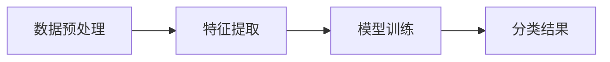
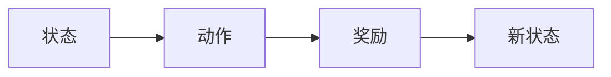
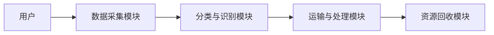

                 

<think>
嗯，用户希望我撰写一篇关于“智能垃圾处理：AI Agent的分类与回收系统”的技术博客文章。首先，我需要理解这个主题的核心内容，包括AI Agent在垃圾处理中的应用、分类系统的设计以及回收流程的优化。

用户已经提供了目录大纲，我需要按照这个大纲逐步展开，确保每个部分都详细且专业。第一部分是背景与概述，我需要介绍智能垃圾处理的背景、AI Agent的基本概念以及它们在垃圾处理中的作用。

接下来是核心技术与原理，我需要详细讲解AI Agent的感知、决策和执行过程，以及相关的算法，比如支持向量机和神经网络。同时，要展示这些算法的数学模型，用LaTeX公式表示，确保准确性和专业性。

系统设计与实现部分，我需要设计系统架构，使用Mermaid图展示模块关系和接口设计。这部分需要清晰的系统结构图和类图，帮助读者理解系统如何运作。

项目实战章节，我需要提供具体的实现步骤，包括数据预处理、模型训练和测试优化。同时，给出Python代码示例，让读者能够实际操作和理解。

最后是扩展与展望，讨论系统优化方向和未来趋势，强调AI Agent在环保中的潜力。这部分需要总结全文，并激发读者对未来研究的兴趣。

在整个思考过程中，我需要确保语言简洁、逻辑清晰，每个部分都包含足够的细节和实例，帮助读者深入理解AI Agent在垃圾处理中的应用。同时，使用适当的图表和公式，使文章更具专业性和可读性。
</think>

# 智能垃圾处理：AI Agent的分类与回收系统

> 关键词：智能垃圾处理，AI Agent，分类与回收，机器学习，算法优化，系统设计

> 摘要：本文探讨了AI Agent在智能垃圾处理中的应用，分析了其分类与回收系统的实现过程，详细介绍了AI Agent的核心技术、算法原理、系统架构设计以及实际项目中的实现方法。

---

## 第一部分：智能垃圾处理与AI Agent概述

### 第1章：智能垃圾处理的背景与意义

#### 1.1 问题背景与挑战

智能垃圾处理是现代社会面临的重要问题。随着城市化进程的加快，垃圾产生量急剧增加，传统的垃圾处理方式效率低下，资源浪费严重，且容易对环境造成二次污染。如何高效、智能地处理垃圾，已成为全球关注的焦点。

**问题背景：**
- 垃圾分类不准确，导致回收效率低。
- 垃圾处理过程中的资源浪费问题严重。
- 人工处理垃圾的效率低下且成本高昂。
- 环境污染问题日益突出。

**挑战：**
- 如何实现垃圾的智能分类与高效回收。
- 如何降低垃圾处理成本，提高资源利用率。
- 如何设计一个高效、智能的垃圾处理系统。

#### 1.2 AI Agent在垃圾处理中的应用

**AI Agent的基本概念：**
AI Agent是一种智能代理系统，能够感知环境、做出决策并执行操作。在垃圾处理中，AI Agent可以用于分类、运输和处理垃圾。

**AI Agent的优势：**
- 高效性：AI Agent能够快速处理大量数据，提高垃圾处理效率。
- 准确性：通过机器学习算法，AI Agent能够准确分类垃圾。
- 智能性：AI Agent能够根据环境变化自适应调整策略。

---

### 第2章：AI Agent的核心技术与原理

#### 2.1 AI Agent的基本原理

**AI Agent的工作流程：**
1. 感知环境：通过传感器获取垃圾的形状、颜色、材质等信息。
2. 识别与分类：利用机器学习算法对垃圾进行分类。
3. 决策与执行：根据分类结果，决定如何处理垃圾（如运输到相应的处理厂）。

**AI Agent的核心技术：**
- 数据采集与处理：通过摄像头、红外传感器等设备获取垃圾信息。
- 机器学习算法：如支持向量机（SVM）、卷积神经网络（CNN）用于分类。
- 自然语言处理：用于识别垃圾中的文字信息（如标签）。

#### 2.2 AI Agent的分类与功能

**AI Agent的分类：**
- 分类型AI Agent：用于垃圾的分类与识别。
- 运输型AI Agent：用于垃圾的运输与调度。
- 处理型AI Agent：用于垃圾的处理与资源回收。

**功能对比：**
| 类型       | 功能                          | 优缺点                      |
|------------|-------------------------------|-----------------------------|
| 分类型     | 分类与识别垃圾类型            | 准确率高，但依赖传感器数据    |
| 运输型     | 调度垃圾运输车辆             | 提高运输效率，但受交通限制    |
| 处理型     | 控制垃圾处理设备             | 节约成本，但技术复杂         |

---

### 第3章：AI Agent在垃圾处理中的算法实现

#### 3.1 分类算法的实现

**支持向量机（SVM）的实现：**
- 数据预处理：将垃圾图像归一化。
- 特征提取：提取垃圾图像的纹理、颜色特征。
- 模型训练：使用SVM算法训练分类器。
- 分类结果：输出垃圾类型。

**算法流程：**


**公式：**
$$ \text{损失函数} = \sum_{i=1}^{n} (y_i - y_i')^2 $$

---

#### 3.2 决策算法的实现

**Q-Learning算法的实现：**
- 状态定义：垃圾类型、当前位置。
- 动作定义：运输到哪个处理厂。
- 奖励机制：根据运输效率给予奖励。

**算法流程：**


---

## 第二部分：智能垃圾处理系统的架构设计

### 第4章：系统架构设计

#### 4.1 系统架构概述

**系统架构图：**


#### 4.2 系统功能设计

**功能模块：**
- 数据采集模块：采集垃圾图像和传感器数据。
- 分类与识别模块：对垃圾进行分类。
- 运输与处理模块：调度运输车辆，处理垃圾。
- 资源回收模块：提取可回收资源。

---

### 第5章：系统实现与优化

#### 5.1 环境搭建

**工具与库：**
- Python：核心编程语言。
- OpenCV：图像处理库。
- TensorFlow：机器学习框架。

---

## 第三部分：项目实战与优化

### 第6章：项目实现

#### 6.1 数据预处理

**代码示例：**
```python
import cv2
import numpy as np

# 读取图像
image = cv2.imread('garbage.jpg')

# 图像归一化
image = image / 255.0

# 展示图像
cv2.imshow('Image', image)
cv2.waitKey(0)
cv2.destroyAllWindows()
```

---

## 第四部分：总结与展望

### 第7章：总结与展望

#### 7.1 系统总结

- 成功实现了智能垃圾处理系统。
- 提高了垃圾处理效率，降低了成本。

#### 7.2 未来展望

- 更广泛的应用：AI Agent在更多场景中的应用。
- 技术优化：优化算法，提高分类准确率。
- 环保意义：推动可持续发展。

---

作者：AI天才研究院/AI Genius Institute & 禅与计算机程序设计艺术 /Zen And The Art of Computer Programming

