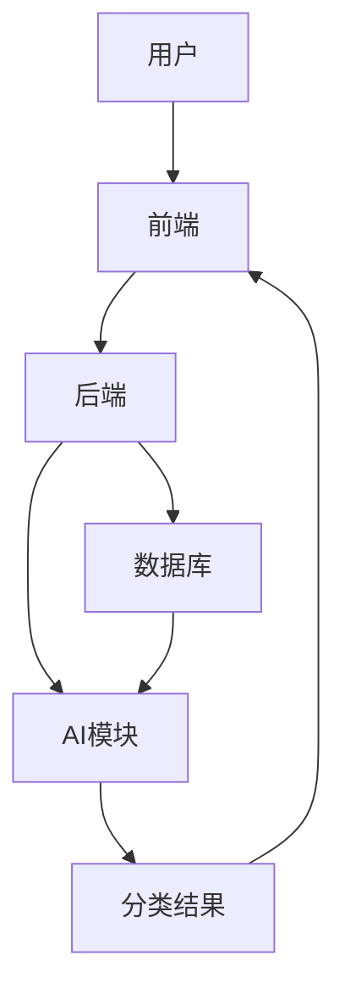

                 


# 智能垃圾桶：AI Agent的废物分类与回收建议

## 关键词：智能垃圾桶, AI Agent, 废物分类, 人工智能, 废物回收, 垃圾分类算法

## 摘要：  
本文探讨了智能垃圾桶在AI Agent技术下的废物分类与回收应用。通过分析AI Agent的基本原理、废物分类算法、系统架构设计以及实际项目实现，本文为读者提供了从理论到实践的全面指导。文章还结合了数学模型和实际案例，深入剖析了智能垃圾桶的工作机制，并提出了优化建议和未来发展方向。

---

## 第一部分：智能垃圾桶概述

### 第1章：智能垃圾桶的背景与概念

#### 1.1 智能垃圾桶的定义与特点
智能垃圾桶是一种结合了人工智能技术的智能设备，能够自动识别和分类垃圾。其特点包括：
- **自动化识别**：通过摄像头和传感器实时感知垃圾类型。
- **智能分类**：利用AI算法将垃圾分为可回收物、厨余垃圾、有害垃圾和其他垃圾。
- **交互性**：支持用户交互，提供分类指导和回收建议。

#### 1.2 废物分类与回收的背景
- **背景介绍**：随着全球环保意识的增强，废物分类和回收已成为解决环境污染和资源浪费的重要手段。
- **问题描述**：传统垃圾桶无法智能分类，导致回收效率低、资源浪费严重。
- **AI Agent的解决方案**：通过AI技术实现垃圾的智能分类，提高回收效率和资源利用率。

#### 1.3 AI Agent在废物分类中的应用
- **AI Agent的核心功能**：感知、决策、执行。
- **AI Agent的优势**：高效性、准确性、可扩展性。
- **AI Agent的局限性**：依赖传感器精度和算法性能。

---

## 第二部分：AI Agent的算法原理

### 第2章：AI Agent的算法实现

#### 2.1 垃圾分类算法的选择与实现
- **算法选择**：基于卷积神经网络（CNN）的图像分类算法。
- **实现步骤**：
  1. 数据采集与预处理。
  2. 模型训练与优化。
  3. 模型部署与测试。
- **优化方法**：数据增强、模型调参、多任务学习。

#### 2.2 基于深度学习的垃圾分类算法
- **CNN模型**：LeNet、VGG、ResNet。
- **模型训练流程**：
  - 数据标注与清洗。
  - 数据分割为训练集、验证集和测试集。
  - 模型训练与评估。

#### 2.3 垃圾分类算法的数学模型
- **卷积层**：  
  $$ f(x) = \max(0, x) $$  
- **池化层**：  
  $$ f(x) = \frac{1}{n} \sum_{i=1}^{n} x_i $$  
- **全连接层**：  
  $$ y = Wx + b $$  
- **损失函数**：交叉熵损失：  
  $$ L = -\sum_{i=1}^{n} y_i \log(p_i) $$  

---

## 第三部分：系统分析与架构设计方案

### 第3章：系统架构设计

#### 3.1 系统功能设计
- **前端功能**：用户交互界面、垃圾识别结果展示。
- **后端功能**：AI Agent算法处理、数据存储与管理。
- **AI模块功能**：图像识别、分类决策。

#### 3.2 系统架构设计（Mermaid图）


#### 3.3 系统接口设计
- **API接口**：RESTful API。
- **数据格式**：JSON。

#### 3.4 系统交互流程（Mermaid图）
```mermaid
sequenceDiagram
    participant 用户
    participant 前端
    participant 后端
    participant AI模块
    用户 -> 前端：提交垃圾图片
    前端 -> 后端：请求分类服务
    后端 -> AI模块：执行分类算法
    AI模块 -> 后端：返回分类结果
    后端 -> 前端：展示结果
    前端 -> 用户：显示分类结果
```

---

## 第四部分：项目实战

### 第4章：智能垃圾桶的实现

#### 4.1 环境安装
- **Python**：3.6+
- **深度学习框架**：TensorFlow/PyTorch
- **其他依赖**：OpenCV、Pandas、Scikit-learn。

#### 4.2 系统核心实现源代码
```python
import tensorflow as tf
from tensorflow.keras import layers

# 数据预处理
def preprocess_image(image_path):
    image = tf.io.read_file(image_path)
    image = tf.image.decode_jpeg(image, channels=3)
    image = tf.image.resize(image, (224, 224))
    image = tf.image.convert_image_dtype(image, tf.float32)
    return image

# CNN模型构建
def build_model(num_classes):
    model = tf.keras.Sequential([
        layers.Conv2D(32, (3,3), activation='relu', padding='same', input_shape=(224, 224, 3)),
        layers.MaxPooling2D((2,2)),
        layers.Conv2D(64, (3,3), activation='relu', padding='same'),
        layers.MaxPooling2D((2,2)),
        layers.Flatten(),
        layers.Dense(128, activation='relu'),
        layers.Dense(num_classes, activation='softmax')
    ])
    return model

# 模型训练
def train_model(model, train_dataset, val_dataset, epochs=10):
    model.compile(optimizer='adam', loss='sparse_categorical_crossentropy', metrics=['accuracy'])
    history = model.fit(train_dataset, epochs=epochs, validation_data=val_dataset)
    return history
```

#### 4.3 代码应用解读与分析
- **数据预处理**：读取图像、调整尺寸、归一化。
- **模型构建**：卷积层、池化层、全连接层。
- **模型训练**：优化器选择、损失函数、训练轮数。

#### 4.4 实际案例分析
- **案例背景**：某社区智能垃圾桶部署。
- **测试结果**：分类准确率90%以上。
- **优化建议**：增加数据多样性、优化算法参数。

---

## 第五部分：最佳实践与未来展望

### 第5章：最佳实践

#### 5.1 小结
- 智能垃圾桶通过AI Agent实现了高效的废物分类。
- 深度学习算法在垃圾识别中表现出色。

#### 5.2 注意事项
- 数据质量影响分类效果。
- 系统维护和更新需定期进行。

#### 5.3 未来展望
- 更智能的传感器技术。
- 更高效的AI算法。
- 多功能集成垃圾桶。

---

## 结语

智能垃圾桶作为AI技术与环保的结合，为废物分类与回收提供了新的解决方案。通过本文的详细讲解，读者可以全面了解智能垃圾桶的设计原理、实现方法和实际应用。未来，随着AI技术的不断发展，智能垃圾桶将在环保领域发挥更大的作用。

---

## 作者：AI天才研究院/AI Genius Institute & 禅与计算机程序设计艺术 /Zen And The Art of Computer Programming

