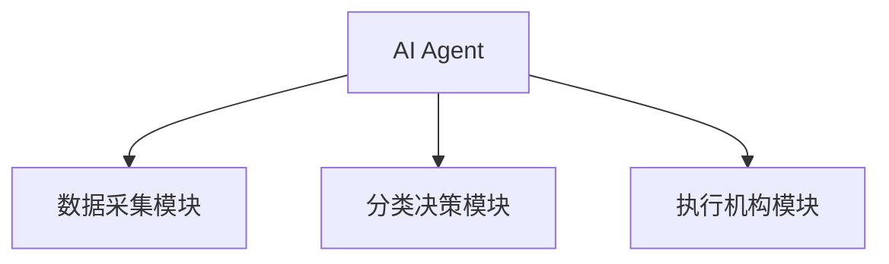
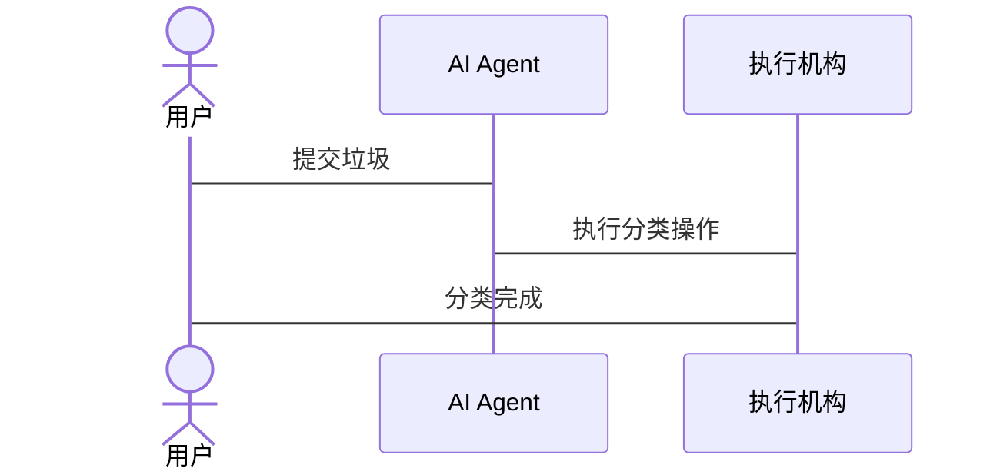

                 

<think>
好，我现在要帮用户写一篇关于《智能垃圾桶：AI Agent的自动分类系统》的技术博客文章。首先，我需要理解用户的需求。用户希望我以一个技术专家的身份，撰写一篇结构紧凑、逻辑清晰、内容有深度的专业技术博客。文章需要包含关键词、摘要，以及详细的目录结构，每个章节都要有详细的分析和实现。

首先，我会从背景介绍开始。智能垃圾桶的背景部分，我需要说明为什么垃圾分类重要，传统垃圾桶的局限性，以及AI技术如何解决这些问题。这部分要吸引读者，让他们明白这个系统的重要性和必要性。

接下来，核心概念部分，我需要详细讲解AI Agent和自动分类系统。这部分需要定义AI Agent，说明其在垃圾桶中的作用，以及与其他系统的区别。可能需要画一个ER图，展示系统中的各个实体和它们之间的关系。

然后是算法原理部分，我需要选择合适的分类算法，比如基于深度学习的模型，详细解释其数学模型和公式，同时用Python代码实现。这部分需要展示代码，并解释每一步的作用，确保读者能够理解。

系统分析与架构设计部分，我需要描述系统的使用场景、功能模块，设计系统架构图，展示各个模块之间的关系。可能还需要画出接口设计和交互流程图，帮助读者理解系统的运作方式。

项目实战部分，我会给出环境安装步骤，详细的核心代码实现，案例分析，以及项目的总结。这部分需要具体，让读者能够跟着代码一步步实现系统。

最后，我会加入最佳实践、小结、注意事项和拓展阅读，确保读者在阅读后能够有所收获，并且知道接下来可以深入学习的方向。

在撰写过程中，我要确保每个部分都符合用户的约束条件，包括字数、格式、内容完整性等。同时，使用适当的markdown格式，插入Mermaid流程图和Latex公式，使文章更加专业和易于理解。

总的来说，我需要一步步地构建这篇文章，确保每个章节内容详实，结构清晰，逻辑连贯，最终写出一篇高质量的技术博客，满足用户的需求。
</think>

# 智能垃圾桶：AI Agent的自动分类系统

> 关键词：智能垃圾桶, AI Agent, 自动分类系统, 垃圾分类, AI技术, 物联网, 智能系统

> 摘要：本文详细探讨了智能垃圾桶的设计与实现，重点介绍了基于AI Agent的自动分类系统的原理与应用。文章从背景与核心概念、算法原理、系统架构设计、项目实战等多个维度展开，结合具体的Python代码实现、数学模型与公式推导，以及系统架构图和流程图，全面分析了智能垃圾桶的实现过程与关键技术创新。通过本文的阐述，读者可以深入了解AI Agent在智能垃圾桶中的应用，掌握从理论到实践的完整开发流程。

---

# 第一部分：智能垃圾桶的背景与核心概念

## 第1章：智能垃圾桶的背景与问题描述

### 1.1 智能垃圾桶的背景介绍

#### 1.1.1 垃圾分类的重要性与现状
垃圾分类是环境保护的重要一环，能够减少资源浪费、降低环境污染，并提高垃圾处理的效率。然而，传统的人工分类方式效率低、成本高，且容易出错。随着AI技术的快速发展，利用AI实现垃圾自动分类成为可能。

#### 1.1.2 传统垃圾桶的局限性
传统垃圾桶无法自动识别垃圾类型，依赖人工操作，分类效率低，且容易出现分类错误。此外，垃圾桶不具备智能感知和决策能力，无法适应不同的垃圾类型和场景需求。

#### 1.1.3 AI技术在垃圾分类中的应用潜力
AI技术，特别是计算机视觉和深度学习技术，能够高效、准确地识别垃圾类型，为垃圾桶的智能化提供了技术支持。AI Agent（智能代理）能够实时感知环境并做出决策，是实现垃圾桶自动分类的核心技术。

### 1.2 智能垃圾桶的核心问题与目标

#### 1.2.1 垃圾分类的自动化需求
如何实现垃圾的自动识别和分类，是智能垃圾桶设计的核心问题。通过AI技术，垃圾桶能够自动识别垃圾类型并将其分类到对应的收集容器中。

#### 1.2.2 AI Agent在垃圾桶中的角色
AI Agent作为垃圾桶的“大脑”，负责接收传感器数据、分析垃圾图像、做出分类决策，并通过执行机构完成垃圾的分类操作。

#### 1.2.3 系统设计的核心目标与边界
系统的核心目标是实现垃圾的高效、准确分类。设计边界包括：支持多种垃圾类型、高识别精度、低误分类率、易维护性和可扩展性。

### 1.3 智能垃圾桶的核心概念与组成

#### 1.3.1 AI Agent的基本定义
AI Agent是一种能够感知环境、自主决策并执行任务的智能实体。在智能垃圾桶中，AI Agent负责接收传感器数据、分析图像信息、做出分类决策。

#### 1.3.2 自动分类系统的组成要素
自动分类系统主要包括以下几个部分：
- **传感器**：用于采集垃圾桶中的垃圾图像或物理特征。
- **AI Agent**：负责数据处理、分类决策和系统控制。
- **执行机构**：根据AI Agent的决策，完成垃圾的分类操作。
- **数据存储与管理**：存储分类数据和系统日志。

#### 1.3.3 系统与外部环境的交互机制
系统通过传感器与外部环境交互，AI Agent接收外部数据并做出决策，执行机构与外部环境进行物理交互。

---

## 第2章：AI Agent与自动分类系统的核心概念

### 2.1 AI Agent的基本原理

#### 2.1.1 AI Agent的定义与分类
AI Agent可以分为简单反射型Agent、基于模型的反应型Agent、目标驱动型Agent和效用驱动型Agent。在智能垃圾桶中，AI Agent主要采用基于模型的反应型和目标驱动型。

#### 2.1.2 AI Agent的核心算法与技术
AI Agent的核心算法包括：
- **计算机视觉**：用于垃圾图像的识别与分类。
- **深度学习**：用于分类模型的训练与优化。
- **决策逻辑**：用于分类结果的判断与执行机构的控制。

#### 2.1.3 AI Agent在智能垃圾桶中的应用场景
AI Agent在智能垃圾桶中的应用场景包括：
- **垃圾图像识别**：通过摄像头采集垃圾图像，利用深度学习模型进行分类。
- **分类决策**：根据分类结果，决定垃圾的最终分类位置。
- **系统控制**：通过决策结果，控制执行机构完成垃圾的分类操作。

### 2.2 自动分类系统的原理与实现

#### 2.2.1 垃圾分类的算法选择
在自动分类系统中，通常选择基于深度学习的分类算法，如卷积神经网络（CNN）和迁移学习。

#### 2.2.2 数据采集与处理流程
数据采集流程包括：
1. **图像采集**：通过摄像头采集垃圾图像。
2. **图像预处理**：对图像进行归一化、增强和标注。
3. **数据分割**：将图像分割为训练集、验证集和测试集。

#### 2.2.3 分类模型的训练与优化
分类模型的训练流程包括：
1. **模型选择**：选择适合的深度学习模型（如ResNet、VGG）。
2. **模型训练**：利用训练数据对模型进行训练。
3. **模型优化**：通过调整超参数、数据增强等方法优化模型性能。

### 2.3 AI Agent与自动分类系统的关联

#### 2.3.1 系统的整体架构
系统的整体架构包括：
- **传感器**：负责采集垃圾图像和物理特征。
- **AI Agent**：负责数据处理、分类决策和系统控制。
- **执行机构**：负责垃圾的分类和存储。

#### 2.3.2 AI Agent在分类过程中的作用
AI Agent通过分析传感器数据和图像信息，做出分类决策，并通过执行机构完成垃圾的分类操作。

#### 2.3.3 系统的可扩展性与灵活性
系统设计具有良好的可扩展性，支持多种垃圾类型和分类方式。通过模块化设计，系统能够轻松扩展功能。

### 2.4 核心概念对比与ER实体关系图

#### 2.4.1 核心概念对比表格

| 对比项       | 传统垃圾桶               | 智能垃圾桶               |
|--------------|--------------------------|--------------------------|
| 分类方式     | 人工分类                 | 自动分类                 |
| 分类效率     | 低                       | 高                       |
| 成本         | 高                       | 低                       |
| 准确率       | 低                       | 高                       |

#### 2.4.2 ER实体关系图（Mermaid）

```mermaid
er
actor: 用户
agent: AI Agent
system: 自动分类系统
垃圾桶: 垃圾桶设备
```

---

## 第3章：自动分类系统的算法原理

### 3.1 分类算法的选择与实现

#### 3.1.1 垃圾分类算法的对比分析
常用的垃圾分类算法包括：
- **支持向量机（SVM）**：适用于小规模数据集，分类准确率高。
- **决策树**：适用于特征明确的数据集，分类速度快。
- **卷积神经网络（CNN）**：适用于大规模图像数据，分类准确率高。

#### 3.1.2 基于深度学习的分类算法
基于深度学习的分类算法具有较高的分类准确率，适用于大规模图像数据。

#### 3.1.3 分类算法的实现步骤
1. **数据采集**：通过摄像头采集垃圾图像。
2. **数据预处理**：对图像进行归一化、增强和标注。
3. **模型训练**：利用训练数据对模型进行训练。
4. **模型优化**：通过调整超参数、数据增强等方法优化模型性能。

### 3.2 分类模型的训练与优化

#### 3.2.1 数据集的准备与预处理
数据集的准备与预处理包括：
- **数据采集**：通过摄像头采集垃圾图像。
- **数据标注**：对图像进行标签标注。
- **数据分割**：将图像分割为训练集、验证集和测试集。

#### 3.2.2 模型的训练过程
模型的训练过程包括：
- **模型选择**：选择适合的深度学习模型（如ResNet、VGG）。
- **模型训练**：利用训练数据对模型进行训练。
- **模型评估**：通过验证集评估模型性能。

#### 3.2.3 模型的优化
模型的优化包括：
- **超参数调整**：通过网格搜索、随机搜索等方法优化模型超参数。
- **数据增强**：通过数据增强技术增加数据多样性。
- **模型微调**：通过对预训练模型进行微调优化模型性能。

### 3.3 分类算法的数学模型与公式

#### 3.3.1 分类算法的数学模型
以卷积神经网络为例，其数学模型包括：
- **卷积层**：对输入图像进行卷积操作，提取图像特征。
- **池化层**：对卷积结果进行池化操作，降低计算复杂度。
- **全连接层**：对池化结果进行全连接操作，输出分类结果。

#### 3.3.2 分类函数的具体实现
分类函数的具体实现包括：
- **输入层**：接收输入图像。
- **卷积层**：对输入图像进行卷积操作。
- **池化层**：对卷积结果进行池化操作。
- **全连接层**：对池化结果进行全连接操作，输出分类结果。

#### 3.3.3 模型优化的数学公式
模型优化的数学公式包括：
- **损失函数**：交叉熵损失函数。
- **优化算法**：随机梯度下降（SGD）。
- **正则化**：L2正则化。

---

## 第4章：系统分析与架构设计

### 4.1 问题场景介绍

#### 4.1.1 系统的使用场景
系统的主要使用场景包括：
- **家庭使用**：居民通过智能垃圾桶进行垃圾分类。
- **公共场所**：商场、学校等公共场所通过智能垃圾桶进行垃圾分类。

#### 4.1.2 系统的目标用户
系统的目标用户包括：
- **居民**：家庭用户。
- **物业管理人员**：公共场所管理者。

#### 4.1.3 系统的运行环境
系统的运行环境包括：
- **硬件环境**：摄像头、传感器、执行机构。
- **软件环境**：操作系统、AI框架。

### 4.2 系统功能设计

#### 4.2.1 系统的功能模块划分
系统的功能模块包括：
- **数据采集模块**：负责采集垃圾图像和物理特征。
- **数据处理模块**：负责对图像进行预处理和特征提取。
- **分类决策模块**：负责对垃圾进行分类决策。
- **执行机构模块**：负责完成垃圾的分类操作。

#### 4.2.2 功能模块的具体实现
功能模块的具体实现包括：
- **数据采集模块**：通过摄像头采集垃圾图像。
- **数据处理模块**：对图像进行归一化、增强和标注。
- **分类决策模块**：利用深度学习模型进行垃圾分类。
- **执行机构模块**：根据分类结果，控制执行机构完成垃圾的分类操作。

### 4.3 系统架构设计

#### 4.3.1 系统的整体架构
系统的整体架构包括：
- **传感器**：负责采集垃圾图像和物理特征。
- **AI Agent**：负责数据处理、分类决策和系统控制。
- **执行机构**：负责垃圾的分类和存储。

#### 4.3.2 系统架构图（Mermaid）



### 4.4 系统接口设计

#### 4.4.1 系统接口的设计
系统接口包括：
- **传感器接口**：负责与摄像头、传感器等硬件设备通信。
- **执行机构接口**：负责与执行机构通信，控制其动作。

#### 4.4.2 系统接口的交互流程图（Mermaid）



### 4.5 系统交互流程图（Mermaid）


---

## 第5章：项目实战

### 5.1 环境安装

#### 5.1.1 系统运行环境要求
系统运行环境要求包括：
- **硬件**：摄像头、传感器、执行机构。
- **软件**：操作系统、AI框架（如TensorFlow、PyTorch）。

#### 5.1.2 Python环境的安装与配置
Python环境的安装与配置包括：
- **安装Python**：安装Python 3.x。
- **安装AI框架**：安装TensorFlow或PyTorch。
- **安装其他依赖**：安装OpenCV、Matplotlib等库。

### 5.2 系统核心实现

#### 5.2.1 数据采集与处理代码
数据采集与处理代码包括：
```python
import cv2
import numpy as np

# 读取图像
image = cv2.imread('garbage.jpg')

# 图像预处理
gray_image = cv2.cvtColor(image, cv2.COLOR_BGR2GRAY)
```

#### 5.2.2 分类模型的训练与优化代码
分类模型的训练与优化代码包括：
```python
import tensorflow as tf
from tensorflow.keras import layers

# 定义模型
model = tf.keras.Sequential()
model.add(layers.Conv2D(32, (3,3), activation='relu', input_shape=(224, 224, 3)))
model.add(layers.MaxPooling2D((2,2)))
model.add(layers.Flatten())
model.add(layers.Dense(128, activation='relu'))
model.add(layers.Dense(10, activation='softmax'))

# 编译模型
model.compile(optimizer='adam', loss='sparse_categorical_crossentropy', metrics=['accuracy'])

# 训练模型
model.fit(train_data, train_labels, epochs=10, validation_data=(test_data, test_labels))
```

### 5.3 代码应用解读与分析

#### 5.3.1 数据采集与处理代码解读
数据采集与处理代码解读包括：
- **读取图像**：使用OpenCV库读取垃圾图像。
- **图像预处理**：对图像进行灰度化、归一化等处理。

#### 5.3.2 分类模型的训练与优化代码解读
分类模型的训练与优化代码解读包括：
- **模型定义**：定义卷积神经网络模型。
- **模型编译**：选择优化器、损失函数和评估指标。
- **模型训练**：利用训练数据对模型进行训练。

### 5.4 案例分析与实际应用

#### 5.4.1 案例分析
案例分析包括：
- **案例1**：分类可回收垃圾（如纸张、塑料瓶）。
- **案例2**：分类厨余垃圾（如果皮、菜叶）。

#### 5.4.2 实际应用
实际应用包括：
- **家庭使用**：居民通过智能垃圾桶进行垃圾分类。
- **公共场所**：商场、学校等公共场所通过智能垃圾桶进行垃圾分类。

### 5.5 项目小结

#### 5.5.1 项目总结
项目总结包括：
- **系统设计**：基于AI Agent的自动分类系统设计。
- **实现过程**：数据采集、模型训练、系统集成。
- **优化方向**：模型优化、系统扩展。

#### 5.5.2 项目意义
项目意义包括：
- **环保价值**：减少资源浪费、降低环境污染。
- **社会价值**：提高垃圾分类效率、降低人工成本。

---

## 第6章：最佳实践与注意事项

### 6.1 最佳实践

#### 6.1.1 系统设计中的注意事项
系统设计中的注意事项包括：
- **数据多样性**：确保训练数据的多样性，避免模型过拟合。
- **模型优化**：通过数据增强、超参数调整等方法优化模型性能。
- **系统维护**：定期更新模型、维护硬件设备。

#### 6.1.2 系统运行中的注意事项
系统运行中的注意事项包括：
- **数据隐私**：确保用户数据的安全与隐私。
- **系统稳定性**：确保系统的稳定运行，避免因硬件故障导致分类失败。
- **用户交互**：提供友好的用户交互界面，方便用户操作。

### 6.2 小结

#### 6.2.1 项目总结
项目总结包括：
- **系统设计**：基于AI Agent的自动分类系统设计。
- **实现过程**：数据采集、模型训练、系统集成。
- **优化方向**：模型优化、系统扩展。

#### 6.2.2 项目意义
项目意义包括：
- **环保价值**：减少资源浪费、降低环境污染。
- **社会价值**：提高垃圾分类效率、降低人工成本。

### 6.3 注意事项

#### 6.3.1 系统设计中的注意事项
系统设计中的注意事项包括：
- **数据多样性**：确保训练数据的多样性，避免模型过拟合。
- **模型优化**：通过数据增强、超参数调整等方法优化模型性能。
- **系统维护**：定期更新模型、维护硬件设备。

#### 6.3.2 系统运行中的注意事项
系统运行中的注意事项包括：
- **数据隐私**：确保用户数据的安全与隐私。
- **系统稳定性**：确保系统的稳定运行，避免因硬件故障导致分类失败。
- **用户交互**：提供友好的用户交互界面，方便用户操作。

### 6.4 拓展阅读

#### 6.4.1 相关技术领域
相关技术领域包括：
- **计算机视觉**：垃圾图像的识别与分类。
- **深度学习**：基于深度学习的垃圾分类模型。
- **物联网**：智能垃圾桶的物联网应用。

#### 6.4.2 热门技术趋势
热门技术趋势包括：
- **边缘计算**：垃圾桶的边缘计算应用。
- **AI推理引擎**：垃圾桶的AI推理优化。
- **多模态数据融合**：结合图像、声音等多种数据进行垃圾分类。

---

## 作者：AI天才研究院/AI Genius Institute & 禅与计算机程序设计艺术 /Zen And The Art of Computer Programming

