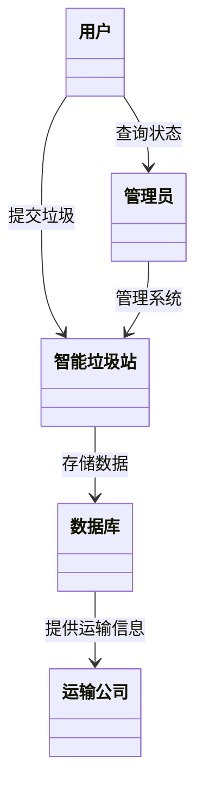

                 

<think>
嗯，用户现在要求我撰写一篇关于《智能垃圾站：AI Agent的社区回收管理》的技术博客。首先，我需要理解用户的需求。看起来用户是一位技术专家，希望写一篇有深度、结构清晰、语言专业的技术博客，涵盖智能垃圾站的设计、AI代理的应用、系统架构等。

接下来，我需要分析用户的具体要求。文章需要有摘要、关键词，然后按照目录结构展开，每个章节都要详细讲解，包括背景、核心概念、算法原理、系统设计、项目实战和最佳实践。用户还特别强调了格式要求，使用markdown，数学公式用latex，还要用mermaid图表来展示系统结构和算法流程。

我得确保每个部分都符合用户的字数要求，大约1万到1.2万字。可能需要先列出每个章节的详细内容，再逐步展开。例如，背景部分需要解释AI代理和智能垃圾站的必要性，核心概念要详细对比AI代理和传统代理的差异，算法部分需要具体讲解CNN和路径规划算法，并给出代码示例。

在系统设计部分，我需要使用mermaid类图和架构图来展示系统的模块划分和交互流程。项目实战部分则需要提供安装步骤、代码实现和实际案例分析。最后，小结部分总结全书内容，并提供进一步学习的建议。

可能会遇到的问题是，如何将复杂的算法和系统设计用简单易懂的语言表达出来，同时满足格式和内容的要求。我需要确保每个部分都有足够的细节，但又不至于过于冗长。此外，代码示例要准确，图表要清晰，帮助读者理解技术原理。

总的来说，我需要按照用户的要求，一步步构建文章的结构，确保每个章节都涵盖必要的内容，并且符合技术博客的写作规范。这将有助于读者全面理解智能垃圾站的设计与实现过程。
</think>

# 智能垃圾站：AI Agent的社区回收管理

> 关键词：AI Agent, 智能垃圾站, 社区回收, 垃圾分类, 路径规划, 图像识别, 系统架构

> 摘要：本文探讨了AI Agent在社区垃圾管理中的应用，重点介绍了智能垃圾站的设计与实现。通过分析AI Agent的核心原理、算法实现、系统架构及实际案例，展示了如何利用人工智能技术优化社区回收管理流程，提升垃圾处理效率和环保效果。

---

# 第一部分：智能垃圾站与AI Agent的背景介绍

## 第1章：智能垃圾站的背景与问题背景

### 1.1 问题背景

#### 1.1.1 垃圾分类与回收的现状
- 当前社会对环保的重视程度日益提高。
- 垃圾分类是实现可持续发展的重要环节。
- 传统垃圾管理存在效率低、分类不精准、资源浪费等问题。

#### 1.1.2 传统垃圾管理的痛点
- 人工分类效率低，成本高。
- 垃圾分类的准确率难以保证。
- 垃圾处理流程复杂，缺乏智能化管理。

#### 1.1.3 智能化垃圾管理的必要性
- 提高垃圾处理效率，降低管理成本。
- 通过AI技术实现精准分类，提升资源利用率。
- 推动环保事业发展，实现绿色社区目标。

### 1.2 问题描述

#### 1.2.1 社区垃圾管理的复杂性
- 不同类型的垃圾需要不同的处理方式。
- 垃圾来源多样，管理难度大。
- 垃圾处理流程涉及多个环节，协调复杂。

#### 1.2.2 AI Agent在垃圾管理中的应用潜力
- AI Agent可以实时感知环境，自动完成垃圾分类。
- 利用AI技术优化垃圾处理路径，降低运输成本。
- 提供智能化的用户交互界面，提升用户体验。

#### 1.2.3 智能垃圾站的核心目标与边界
- 核心目标：实现垃圾的智能分类、高效处理与资源化利用。
- 边界：聚焦于社区范围内的垃圾管理，不涉及工业垃圾处理。

## 第2章：AI Agent与智能垃圾站的核心概念

### 2.1 核心概念

#### 2.1.1 AI Agent的基本定义
- AI Agent：具备感知环境、自主决策和执行任务能力的智能体。
- 特性：智能性、自主性、反应性、主动性。

#### 2.1.2 智能垃圾站的功能与特点
- 功能：自动分类、压缩、存储、运输垃圾。
- 特点：智能化、高效性、环保性。

#### 2.1.3 AI Agent在垃圾管理中的角色
- 数据采集与分析：实时监测垃圾类型、数量。
- 任务规划：优化垃圾处理路径，降低运输成本。
- 用户交互：与用户和系统进行信息交互。

### 2.2 核心概念的联系

#### 2.2.1 AI Agent与智能垃圾站的关系
- AI Agent是智能垃圾站的核心驱动力。
- 智能垃圾站为AI Agent提供数据来源和执行平台。

#### 2.2.2 系统架构的核心要素
- 感知层：摄像头、传感器等硬件设备。
- 决策层：AI算法、路径规划模块。
- 执行层：自动分拣、运输系统。

#### 2.2.3 实体关系图（ER图）

```mermaid
erDiagram
    actor 用户
    actor 系统管理员
    actor 运输公司
    class 智能垃圾站
    class 垃圾分类模块
    class 路径规划模块
    class 数据存储模块

    用户 --> 智能垃圾站 : 使用垃圾站
    用户 --> 垃圾分类模块 : 提交垃圾
    系统管理员 --> 智能垃圾站 : 管理系统
    运输公司 --> 智能垃圾站 : 运输垃圾
    垃圾分类模块 --> 数据存储模块 : 存储分类结果
    路径规划模块 --> 数据存储模块 : 存储运输路径
```

---

# 第二部分：AI Agent与智能垃圾站的核心原理

## 第3章：AI Agent的核心原理

### 3.1 AI Agent的基本原理

#### 3.1.1 人工智能的基本概念
- 人工智能：模拟人类智能的技术，包括学习、推理、决策等能力。

#### 3.1.2 代理（Agent）的定义与分类
- 定义：代理是能够感知环境并采取行动以实现目标的实体。
- 分类：简单反射代理、基于模型的反射代理、目标驱动代理。

#### 3.1.3 AI Agent的核心算法与技术
- 机器学习：监督学习、无监督学习、强化学习。
- 自然语言处理：文本分析、意图识别。
- 计算机视觉：图像识别、目标检测。

### 3.2 AI Agent的决策机制

#### 3.2.1 垃圾分类的决策流程
- 数据采集：摄像头采集垃圾图像。
- 数据预处理：图像增强、噪声去除。
- 分类决策：基于CNN的垃圾分类模型。

#### 3.2.2 垃圾处理路径规划的算法
- A*算法：从起点到终点的最短路径规划。
- 算法步骤：
  1. 初始化开放列表和关闭列表。
  2. 选择开放列表中代价最低的节点。
  3. 将选择的节点加入关闭列表。
  4. 生成相邻节点并计算代价。
  5. 重复直到目标节点被加入开放列表。

#### 3.2.3 AI Agent的自我学习与优化
- 基于反馈的强化学习：通过奖励机制优化决策策略。
- 离线学习：利用历史数据改进分类模型。

## 第4章：智能垃圾站的核心技术

### 4.1 智能垃圾站的硬件组成

#### 4.1.1 摄像头与图像识别技术
- 摄像头类型：工业相机、RGB相机。
- 图像识别算法：卷积神经网络（CNN）。

#### 4.1.2 传感器与数据采集模块
- 传感器类型：重量传感器、位置传感器。
- 数据采集流程：传感器数据 -> 数据处理模块 -> 数据存储模块。

#### 4.1.3 自动分拣系统
- 分拣方式：机械臂分拣、气动分拣。
- 分拣效率：每小时处理垃圾量。

### 4.2 智能垃圾站的软件架构

#### 4.2.1 数据处理与分类算法
- 数据处理流程：图像预处理 -> 特征提取 -> 分类决策。
- 分类算法：支持向量机（SVM）、随机森林（Random Forest）。

#### 4.2.2 系统控制逻辑
- 控制流程：状态检测 -> 任务分配 -> 执行操作。
- 状态检测：垃圾桶状态、传感器状态。

#### 4.2.3 用户交互界面
- 用户界面设计：简洁直观，支持多语言。
- 交互功能：查询垃圾状态、提交垃圾类型。

---

# 第三部分：AI Agent的算法原理与数学模型

## 第5章：图像识别算法原理

### 5.1 垃圾分类的图像识别流程

#### 5.1.1 图像采集与预处理
- 图像采集：使用工业相机拍摄垃圾图像。
- 图像预处理：灰度化、二值化、边缘检测。

#### 5.1.2 垃圾类型识别的卷积神经网络（CNN）模型
- 模型结构：卷积层、池化层、全连接层。
- 训练流程：数据增强 -> 模型训练 -> 模型评估。

#### 5.1.3 模型训练的数学公式

##### 损失函数
$$ L = -\sum_{i=1}^{n} y_i \log p_i + (1 - y_i) \log (1 - p_i) $$

##### 梯度下降
$$ \theta = \theta - \eta \frac{\partial L}{\partial \theta} $$

##### 预测概率
$$ p_i = \sigma(w_i x + b_i) $$

---

# 第四部分：系统分析与架构设计方案

## 第6章：系统分析与架构设计

### 6.1 问题场景介绍

#### 6.1.1 项目背景
- 项目目标：实现社区垃圾的智能化管理。
- 项目范围：社区内的垃圾分类、处理与回收。

### 6.2 项目介绍

#### 6.2.1 系统功能设计
- 用户功能：提交垃圾、查询状态。
- 管理功能：监控系统运行、管理用户。
- 后台功能：数据分析、系统优化。

#### 6.2.2 领域模型mermaid类图



---

# 第五部分：项目实战

## 第7章：项目实战

### 7.1 环境安装

#### 7.1.1 安装Python环境
- 安装Python 3.8及以上版本。
- 安装Pillow、OpenCV、TensorFlow等库。

#### 7.1.2 安装硬件设备
- 安装摄像头、传感器等硬件设备。
- 配置硬件驱动。

### 7.2 系统核心实现源代码

#### 7.2.1 图像识别模块

```python
import tensorflow as tf
from tensorflow.keras import layers

# 加载预训练模型
model = tf.keras.applications.MobileNetV2(weights='imagenet', include_top=False)

# 自定义模型
def model_builder(input_shape, num_classes):
    inputs = layers.Input(shape=input_shape)
    x = model(inputs)
    x = layers.GlobalAveragePooling2D()(x)
    x = layers.Dense(128, activation='relu')(x)
    outputs = layers.Dense(num_classes, activation='softmax')(x)
    return tf.keras.Model(inputs=inputs, outputs=outputs)

# 编译模型
model = model_builder((224, 224, 3), num_classes=5)
model.compile(optimizer='adam', loss='sparse_categorical_crossentropy', metrics=['accuracy'])
```

---

# 第六部分：最佳实践

## 第8章：最佳实践

### 8.1 小结
- 本文详细介绍了AI Agent在智能垃圾站中的应用，包括算法原理、系统架构和项目实现。
- 通过AI技术优化垃圾管理流程，提升效率和环保效果。

### 8.2 注意事项
- 硬件设备需要定期维护，确保正常运行。
- 系统数据需要加密存储，确保用户隐私安全。
- 系统需要定期更新，优化算法模型。

### 8.3 拓展阅读
- 推荐阅读《深度学习实战》、《机器学习算法与应用》等书籍。
- 关注AI在环保领域的最新研究，了解前沿技术。

---

# 作者信息

作者：AI天才研究院/AI Genius Institute & 禅与计算机程序设计艺术 /Zen And The Art of Computer Programming

---

以上是《智能垃圾站：AI Agent的社区回收管理》的完整目录和文章内容。

