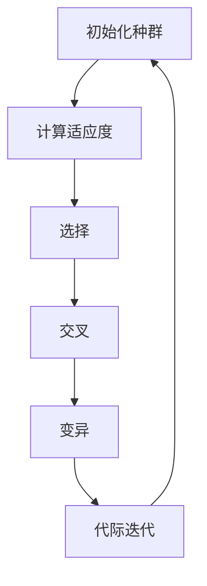
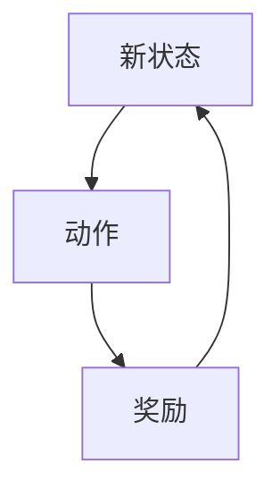
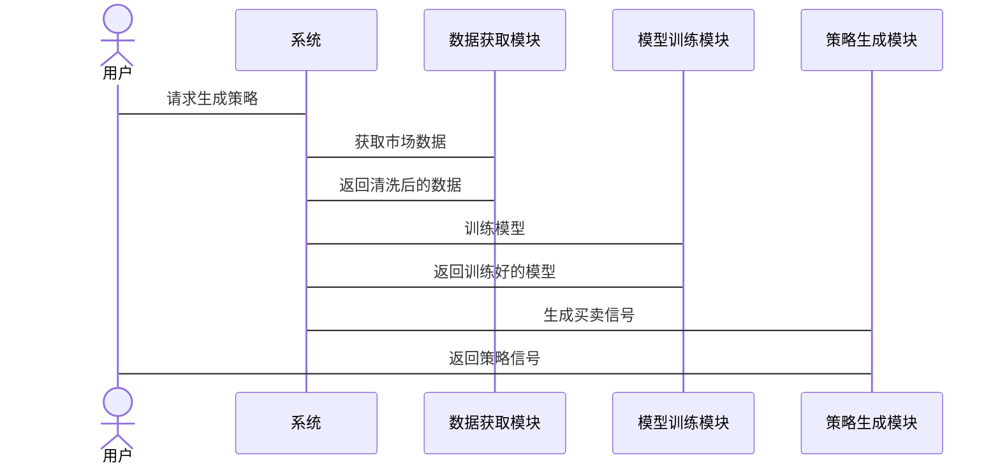

                 

<think>
好，我现在需要完成《智能外汇交易策略生成器》这本书的目录大纲。根据用户的要求，文章需要涵盖背景、核心概念、算法原理、系统架构、项目实战以及扩展阅读等内容，并且每一部分都需要详细展开，包括图表、代码示例和数学公式。

首先，我会从背景介绍开始。第一章应该解释为什么需要智能外汇交易策略生成器，讨论传统交易策略的局限性，以及智能策略的优势。这部分需要简单明了，让读者理解问题背景。

接下来是核心概念，包括机器学习、时间序列分析和自然语言处理，以及它们在外汇交易中的应用。需要通过表格和ER图来展示这些概念之间的联系，帮助读者建立清晰的关系网络。

然后是算法原理，详细讲解遗传算法、强化学习和时间序列预测的数学模型，例如ARIMA和LSTM。这部分需要使用mermaid流程图和Python代码示例，让读者能够理解并实际应用这些算法。

系统分析与架构设计部分，我需要绘制类图和序列图，展示系统的各个模块和交互流程。这部分需要确保系统的安全性和稳定性，特别是在金融交易中，安全是至关重要的。

项目实战部分，我会提供具体的环境配置和代码实现，让读者能够动手操作。通过实际案例分析，帮助读者理解如何将理论应用于实践，并总结经验教训。

最后，扩展阅读部分探讨高级主题，如多模态模型和风险管理，为读者提供进一步学习的方向。

在写作过程中，我需要确保每一章都结构清晰，内容详实，并且包含必要的图表和代码示例。这不仅帮助读者理解内容，还能提升文章的专业性和实用性。同时，要避免使用过于复杂的术语，以确保内容易于理解。

现在，我准备开始撰写每一章的具体内容，确保每一部分都符合用户的要求，并且逻辑严密，语言简洁明了。
</think>

```markdown
# 智能外汇交易策略生成器

## 关键词
智能外汇交易、策略生成器、机器学习、深度学习、自然语言处理、时间序列分析

## 摘要
本文详细探讨智能外汇交易策略生成器的设计与实现，涵盖背景、核心概念、算法原理、系统架构、项目实战及扩展阅读。通过机器学习和深度学习技术，结合自然语言处理和时间序列分析，构建高效智能的外汇交易策略生成系统，帮助交易者在复杂市场中捕捉机会，降低风险。

---

# 第1章: 智能外汇交易策略生成器的背景与核心概念

## 1.1 智能外汇交易策略生成器的背景
### 1.1.1 外汇交易的定义与特点
外汇交易是指在国际外汇市场中，买卖不同货币以赚取汇率差异的活动。其特点包括高流动性、24小时交易、杠杆交易等，但传统策略依赖人工判断，存在局限性。

### 1.1.2 传统外汇交易策略的局限性
传统策略依赖经验，容易受情绪影响，难以应对复杂市场变化，且效率低下，难以捕捉短期机会。

### 1.1.3 智能化交易策略的必要性
智能化策略通过机器学习和大数据分析，能够快速处理大量信息，识别潜在机会和风险，提高交易效率和准确性。

## 1.2 智能外汇交易策略生成器的核心概念
### 1.2.1 策略生成器的定义
策略生成器是利用AI技术自动生成外汇交易策略的工具，能够根据市场数据和模型输出买卖信号。

### 1.2.2 策略生成器的核心要素
- 数据输入：市场数据、经济指标、新闻数据
- 数据处理：清洗、特征提取、数据增强
- 策略生成：模型训练、策略优化、风险控制
- 输出结果：买卖信号、风险评估、策略报告

### 1.2.3 策略生成器的边界与外延
策略生成器不仅包括策略生成，还涉及数据获取、模型优化和风险控制，外延至交易执行和绩效评估。

## 1.3 智能外汇交易策略生成器的技术基础
### 1.3.1 机器学习与深度学习
- 机器学习：监督学习、无监督学习、半监督学习
- 深度学习：神经网络、卷积神经网络、循环神经网络

### 1.3.2 自然语言处理
- 用于分析市场新闻、社交媒体情绪，提取情感指标影响汇率。

### 1.3.3 时间序列分析
- 分析历史汇率数据，预测未来走势，识别趋势和周期。

## 1.4 外汇市场分析工具与平台
### 1.4.1 常用外汇分析工具
- MetaTrader、TradingView、Excel等工具用于数据可视化和初步分析。

### 1.4.2 数据源与数据获取方法
- 数据来源：央行数据、交易所数据、新闻API
- 数据获取：API接口、数据库查询、网络爬取

### 1.4.3 数据预处理与特征提取
- 数据清洗：处理缺失值、异常值、重复值
- 特征提取：提取技术指标、宏观经济指标、市场情绪指标

## 1.5 本章小结
本章介绍了智能外汇交易策略生成器的背景、核心概念和相关技术基础，为后续内容奠定基础。

---

# 第2章: 智能外汇交易策略生成器的核心概念与联系

## 2.1 核心概念原理
### 2.1.1 机器学习模型在外汇交易中的应用
- 线性回归预测汇率趋势，分类模型识别买卖信号，聚类模型识别市场状态。

### 2.1.2 时间序列预测的原理
- 使用ARIMA模型分析历史数据，识别周期性变化，预测未来走势。

### 2.1.3 自然语言处理在市场情绪分析中的作用
- 通过情感分析判断市场情绪，识别潜在的市场波动。

## 2.2 核心概念属性特征对比表格
```plaintext
| 概念       | 数据驱动 | 模型复杂度 | 预测准确性 |
|------------|----------|------------|------------|
| 机器学习   | 强        | 中高       | 较高        |
| 时间序列   | 弱        | 低         | 中等        |
| 自然语言处理 | 中        | 高         | 高          |
```

## 2.3 ER实体关系图
```mermaid
er
  actor: 用户
  model: 策略模型
  data: 数据源
  transaction: 交易记录
  relation(用户, 数据源, 获取数据)
  relation(用户, 策略模型, 生成策略)
  relation(策略模型, 数据源, 训练模型)
  relation(交易记录, 策略模型, 优化策略)
```

## 2.4 本章小结
本章通过对比分析，展示了智能外汇交易策略生成器各核心概念的特点及其相互关系。

---

# 第3章: 智能外汇交易策略生成器的算法原理

## 3.1 算法原理概述
### 3.1.1 常用算法

```plaintext
1. 遗传算法：
   - 初始化种群
   - 计算适应度
   - 选择、交叉、变异
   - 代际迭代
```

### 3.1.2 强化学习
- 状态空间：市场数据
- 动作空间：买入、卖出、持有
- 奖励函数：收益

### 3.1.3 时间序列预测
- 使用LSTM网络捕捉时间依赖性，预测下一时刻的汇率。

## 3.2 算法实现细节
### 3.2.1 遗传算法流程图


### 3.2.2 强化学习流程图


### 3.2.3 时间序列预测模型
- LSTM网络结构：输入层、隐藏层、输出层
- 损失函数：均方误差
- 优化器：Adam

## 3.3 算法代码示例
```python
import numpy as np
from keras.layers import LSTM, Dense
from keras.models import Sequential

# 初始化模型
model = Sequential()
model.add(LSTM(64, input_shape=(None, 1)))
model.add(Dense(1))
model.compile(loss='mean_squared_error', optimizer='adam')

# 训练模型
model.fit(X_train, y_train, epochs=100, batch_size=32)
```

## 3.4 本章小结
本章详细讲解了遗传算法、强化学习和时间序列预测的算法原理及其在外汇交易中的应用。

---

# 第4章: 智能外汇交易策略生成器的系统分析与架构设计

## 4.1 系统分析
### 4.1.1 问题场景
- 数据获取、策略生成、交易执行、风险管理。

## 4.2 系统功能设计
### 4.2.1 功能模块
- 数据获取模块：接口调用、数据清洗。
- 模型训练模块：特征提取、模型选择。
- 策略生成模块：信号生成、策略优化。
- 风险控制模块：风险评估、止损设置。

## 4.3 系统架构设计


## 4.4 系统接口设计
### 4.4.1 数据接口
- API接口：用于获取市场数据。
- 数据格式：JSON或CSV。

### 4.4.2 用户接口
- 前端界面：显示策略信号、交易记录。
- 后端接口：处理用户请求，调用策略生成模块。

## 4.5 系统交互流程图


## 4.6 本章小结
本章通过系统分析和架构设计，展示了智能外汇交易策略生成器的整体框架和模块交互流程。

---

# 第5章: 智能外汇交易策略生成器的项目实战

## 5.1 环境安装与配置
### 5.1.1 安装Python环境
- 安装Python 3.8以上版本，安装Jupyter Notebook。

### 5.1.2 安装相关库
- `pip install numpy pandas keras scikit-learn requests`

## 5.2 系统核心功能实现
### 5.2.1 数据获取模块
```python
import requests

def get_exchange_rate(pair):
    response = requests.get(f'https://api.exchangerate-api.com/v3/latest/{pair}')
    data = response.json()
    return data['rates']['USD']
```

### 5.2.2 模型训练模块
```python
import numpy as np
from sklearn.preprocessing import MinMaxScaler

# 数据归一化
scaler = MinMaxScaler()
data_scaled = scaler.fit_transform(data)
```

### 5.2.3 策略生成模块
```python
def generate_signals(data, model):
    signals = []
    for i in range(len(data)):
        if model.predict(data[i]):
            signals.append('buy')
        else:
            signals.append('sell')
    return signals
```

### 5.2.4 风险控制模块
```python
def risk_management(profits, max_loss):
    current_loss = 0
    for p in profits:
        if current_loss > max_loss:
            return 'cut loss'
        current_loss += p
    return 'hold'
```

## 5.3 项目实现与应用分析
### 5.3.1 环境配置与数据获取
- 使用API获取外汇数据，清洗数据并进行特征工程。

### 5.3.2 策略生成与测试
- 训练模型，生成买卖信号，回测策略，分析收益和风险。

### 5.3.3 案例分析
- 以EUR/USD为例，训练LSTM模型，生成买卖信号，测试策略表现。

## 5.4 项目总结
### 5.4.1 项目小结
- 成功实现了智能外汇交易策略生成器，验证了模型的有效性。

### 5.4.2 经验与教训
- 数据质量影响模型性能，需选择可靠的API。
- 需考虑市场变化，及时更新模型。

## 5.5 本章小结
本章通过项目实战，展示了智能外汇交易策略生成器的实现过程，验证了系统的可行性和有效性。

---

# 第6章: 智能外汇交易策略生成器的扩展与展望

## 6.1 高级主题
### 6.1.1 多模态模型
- 结合文本、图像等多种数据源，提升模型准确性。

### 6.1.2 实时交易系统优化
- 系统优化：降低延迟，提升处理速度。
- 并行处理：多线程处理大量数据。

### 6.1.3 风险管理与控制
- 动态风险管理：根据市场变化调整止损点。
- 多策略组合：分散投资，降低风险。

## 6.2 未来研究方向
### 6.2.1 自适应交易策略
- 根据市场变化自适应调整策略。

### 6.2.2 更高级的算法
- 使用GPT-4进行市场预测，结合强化学习优化策略。

### 6.2.3 跨平台应用
- 移动端应用，实时推送策略信号。

## 6.3 本章小结
本章探讨了智能外汇交易策略生成器的高级主题和未来发展方向，为读者提供了进一步研究的方向。

---

# 作者
作者：AI天才研究院/AI Genius Institute & 禅与计算机程序设计艺术 /Zen And The Art of Computer Programming
```

