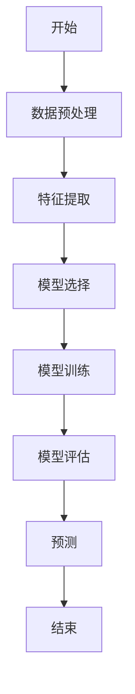
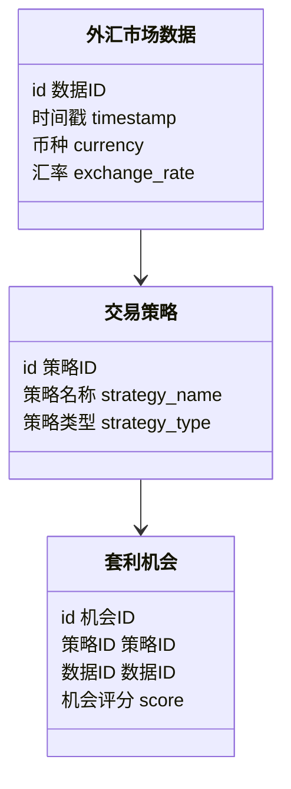
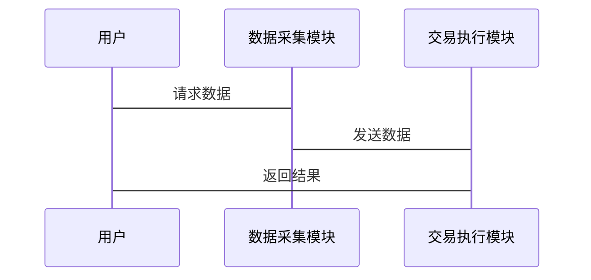

                 


# 智能外汇套利机会识别系统

## 关键词：智能外汇，套利机会，人工智能，算法交易，系统架构

## 摘要：  
随着全球金融市场的日益复杂化和数据化，智能外汇套利机会识别系统成为金融市场中的重要工具。本文详细介绍了智能外汇套利机会识别系统的构建过程，包括系统背景、核心概念、算法原理、系统架构、项目实战和最佳实践。通过本文，读者将深入了解如何利用人工智能和机器学习技术，实现外汇市场中的套利机会识别，并掌握实际项目中的实现方法和注意事项。

---

## 第1章: 外汇市场与套利机会概述

### 1.1 外汇市场的基本概念

#### 1.1.1 外汇市场的定义与特点
外汇市场是全球最大的金融市场，24小时交易，参与者包括银行、企业、个人和机构投资者。其特点包括高流动性、全球化、低门槛和高波动性。

#### 1.1.2 外汇交易的主要参与者
- 银行和金融机构：提供外汇兑换和交易服务。
- 中央银行：负责货币政策和外汇储备管理。
- 企业：进行跨国贸易结算。
- 个人投资者：参与外汇交易以获取利润。

#### 1.1.3 外汇市场的价格波动机制
外汇价格波动受多种因素影响，包括经济指标、政治事件、市场情绪和央行政策。价格波动为套利提供了机会。

### 1.2 套利的基本概念

#### 1.2.1 套利的定义与分类
套利是指利用资产价格差异在不同市场或金融工具间进行无风险或低风险交易以获利。分类包括跨市场套利、时间套利和统计套利。

#### 1.2.2 套利的基本原理
套利者通过识别价格差异，利用低买高卖或高卖低买的方式，在不同市场或时间点进行交易，以获取利润。

#### 1.2.3 套利在外汇市场中的应用
套利在外汇市场中用于捕捉汇率差异、利用市场不一致性和套期保值。

### 1.3 智能外汇套利的机会识别

#### 1.3.1 套利机会的特征
套利机会具有短暂性、低风险性和可重复性。智能系统能够快速识别这些机会。

#### 1.3.2 智能化套利的优势
- 高效性：快速识别和执行交易。
- 精准性：利用算法分析市场数据，提高准确性。
- 自适应性：能够根据市场变化动态调整策略。

#### 1.3.3 套利机会识别的挑战
- 市场波动性高：机会难以捕捉。
- 竞争激烈：套利机会往往被快速抢走。
- 数据复杂性：需要处理大量非结构化数据。

### 1.4 本章小结
本章介绍了外汇市场的基本概念和套利的基本原理，强调了智能化套利的优势和挑战，为后续章节奠定了基础。

---

## 第2章: 智能外汇套利系统的核心概念

### 2.1 数据源与数据特征

#### 2.1.1 外汇市场数据的来源
数据来源包括实时市场数据、历史数据和新闻数据。实时数据用于交易决策，历史数据用于模型训练，新闻数据用于情绪分析。

#### 2.1.2 数据特征的提取与分析
提取包括汇率波动、交易量、市场情绪等特征。使用统计方法和机器学习方法进行特征分析。

#### 2.1.3 数据预处理方法
数据清洗、标准化、缺失值处理和异常值处理是数据预处理的关键步骤。

### 2.2 算法模型与交易策略

#### 2.2.1 常见的套利算法
- 时间序列分析：用于预测汇率变化。
- 机器学习模型：如随机森林和LSTM，用于分类和回归分析。
- 统计套利模型：基于资产价格关系的均值回归策略。

#### 2.2.2 机器学习在套利中的应用
机器学习用于模式识别、特征提取和预测模型构建，帮助发现套利机会。

#### 2.2.3 交易策略的优化方法
通过回测、风险控制和动态调整策略参数来优化交易策略。

### 2.3 系统架构与功能模块

#### 2.3.1 系统整体架构
系统分为数据采集模块、特征提取模块、策略生成模块、交易执行模块和风险管理模块。

#### 2.3.2 功能模块划分
- 数据采集模块：实时采集市场数据。
- 特征提取模块：提取有用的特征。
- 策略生成模块：基于特征生成交易策略。
- 交易执行模块：执行交易指令。
- 风险管理模块：监控和管理风险。

#### 2.3.3 模块之间的关系
数据流从数据采集模块流向特征提取模块，然后流向策略生成模块，最终由交易执行模块执行交易。

### 2.4 核心概念的ER实体关系图

```mermaid
er
    entity 外汇市场数据 {
        id 数据ID
        时间戳 timestamp
        币种 currency
        汇率 exchange_rate
    }
    entity 交易策略 {
        id 策略ID
        策略名称 strategy_name
        策略类型 strategy_type
    }
    entity 套利机会 {
        id 机会ID
        策略ID 策略ID
        数据ID 数据ID
        机会评分 score
    }
```

### 2.5 本章小结
本章详细介绍了智能外汇套利系统的核心概念，包括数据源、算法模型和系统架构，为后续章节的实现提供了理论基础。

---

## 第3章: 套利机会识别的算法原理

### 3.1 时间序列分析

#### 3.1.1 时间序列分析的基本概念
时间序列分析是研究数据随时间变化的模式和趋势，常用于预测未来汇率变化。

#### 3.1.2 常见的时间序列模型
- ARIMA模型：适用于线性时间序列预测。
- LSTM网络：适用于非线性时间序列预测。

#### 3.1.3 时间序列分析的步骤
数据预处理、模型选择、模型训练、模型评估和预测。

### 3.2 机器学习算法

#### 3.2.1 机器学习算法的基本概念
机器学习算法通过训练数据学习模式，用于分类、回归和聚类。

#### 3.2.2 常见的机器学习算法
- 线性回归：用于预测连续变量。
- 支持向量机：用于分类和回归。
- 随机森林：用于分类和回归。

#### 3.2.3 机器学习算法在套利中的应用
用于模式识别、特征提取和预测模型构建。

### 3.3 统计套利模型

#### 3.3.1 统计套利的基本概念
基于资产价格关系的均值回归策略，用于捕捉短期价格波动。

#### 3.3.2 常见的统计套利模型
- 股票篮子模型：基于资产价格关系构建虚拟篮子。
- 均值回归模型：用于预测价格回归均值。

#### 3.3.3 统计套利模型的实现步骤
构建资产篮子、计算套利信号、制定交易策略。

### 3.4 算法流程图



### 3.5 算法实现代码

```python
import numpy as np
import pandas as pd
from sklearn.linear_model import LinearRegression
from sklearn.metrics import mean_squared_error

# 示例数据
data = pd.DataFrame({
    'time': range(100),
    'price': np.random.normal(100, 10, 100)
})

# 数据预处理
train_data = data.iloc[:70]
test_data = data.iloc[70:]

# 特征提取
X_train = train_data['time'].values.reshape(-1, 1)
y_train = train_data['price'].values
X_test = test_data['time'].values.reshape(-1, 1)
y_test = test_data['price'].values

# 模型训练
model = LinearRegression()
model.fit(X_train, y_train)

# 模型预测
y_pred = model.predict(X_test)

# 模型评估
mse = mean_squared_error(y_test, y_pred)
print(f'Mean Squared Error: {mse}')
```

### 3.6 本章小结
本章详细介绍了套利机会识别的算法原理，包括时间序列分析、机器学习算法和统计套利模型，并通过代码示例展示了实现过程。

---

## 第4章: 系统分析与架构设计方案

### 4.1 问题场景介绍

#### 4.1.1 系统应用场景
智能外汇套利系统应用于实时交易、历史数据分析和市场预测。

#### 4.1.2 系统目标
实现套利机会识别、交易自动化和风险管理。

#### 4.1.3 系统边界与外延
系统与数据源、交易平台和用户交互界面相连。

### 4.2 系统功能设计

#### 4.2.1 领域模型mermaid类图



#### 4.2.2 系统架构设计


#### 4.2.3 系统接口设计
系统接口包括数据接口、交易接口和用户接口，用于数据传输和用户交互。

#### 4.2.4 系统交互mermaid序列图



### 4.3 本章小结
本章详细介绍了系统分析与架构设计方案，包括功能设计、系统架构和接口设计，为系统实现提供了指导。

---

## 第5章: 项目实战

### 5.1 环境安装

#### 5.1.1 安装Python环境
安装Python 3.8及以上版本，安装Jupyter Notebook用于开发环境。

#### 5.1.2 安装依赖库
安装numpy、pandas、scikit-learn和tensorflow等库。

#### 5.1.3 安装交易API
安装MetaTrader 5或其他外汇交易平台的API。

### 5.2 系统核心实现源代码

#### 5.2.1 数据采集模块

```python
import MetaTrader5 as mt5

def get_data(symbol, start, end):
    mt5.initialize()
    rates = mt5.copy_rates_range(symbol, mt5.TIMEFRAME_D1, start, end)
    mt5.shutdown()
    return rates
```

#### 5.2.2 特征提取模块

```python
import pandas as pd

def extract_features(data):
    # 计算移动平均线
    data['MA'] = data['close'].rolling(10).mean()
    # 计算相对强弱指数
    data['RSI'] = data['close'].rolling(14).apply(lambda x: (x[-1] - x[0])/x[-1])
    return data
```

#### 5.2.3 策略生成模块

```python
from sklearn.ensemble import RandomForestClassifier

def generate_strategy(data):
    X = data.drop('label', axis=1)
    y = data['label']
    model = RandomForestClassifier()
    model.fit(X, y)
    return model
```

#### 5.2.4 交易执行模块

```python
import time

def execute_trade(symbol, quantity, direction):
    # 执行交易
    pass
```

### 5.3 数据处理与模型训练

#### 5.3.1 数据处理步骤
- 数据清洗：处理缺失值和异常值。
- 数据标准化：归一化处理。
- 数据分割：训练集和测试集。

#### 5.3.2 模型训练步骤
- 选择模型：如随机森林或LSTM。
- 训练模型：使用训练数据。
- 评估模型：计算准确率和召回率。

### 5.4 系统测试与优化

#### 5.4.1 系统测试步骤
- 单元测试：测试每个模块的功能。
- 集成测试：测试系统整体功能。
- 性能测试：测试系统在高负载下的表现。

#### 5.4.2 系统优化方法
- 参数优化：调整模型参数。
- 算法优化：改进算法效率。
- 系统优化：优化代码性能。

### 5.5 本章小结
本章通过实际项目展示了智能外汇套利机会识别系统的实现过程，包括环境安装、核心代码实现和系统测试与优化。

---

## 第6章: 最佳实践

### 6.1 系统优化

#### 6.1.1 系统性能优化
- 使用并行计算加速数据处理。
- 优化数据存储结构，提高数据访问效率。

#### 6.1.2 系统可扩展性优化
- 使用微服务架构，提高系统的可扩展性。
- 采用云存储和云计算，提高系统的弹性扩展能力。

### 6.2 风险管理

#### 6.2.1 风险控制策略
- 设置止损和止盈点。
- 分散投资，降低风险。

#### 6.2.2 风险监控
- 实时监控市场风险。
- 定期审查交易记录，评估风险。

### 6.3 系统维护与更新

#### 6.3.1 系统维护
- 定期更新模型参数。
- 及时修复系统漏洞。

#### 6.3.2 系统更新
- 定期升级系统版本。
- 更新数据源和交易接口。

### 6.4 法律与合规

#### 6.4.1 法律合规
- 遵守相关法律法规，确保交易合法合规。
- 遵守交易所的交易规则。

#### 6.4.2 数据隐私
- 保护用户数据隐私。
- 遵守数据保护法规。

### 6.5 拓展阅读

#### 6.5.1 推荐书籍
- 《算法交易：nosis, Systems, and Applications》
- 《机器学习实战》

#### 6.5.2 推荐博客与资源
- QuantInst International
- Trading Blox

### 6.6 本章小结
本章总结了系统优化、风险管理、维护更新和法律合规等注意事项，并提供了拓展阅读建议。

---

## 作者：AI天才研究院/AI Genius Institute & 禅与计算机程序设计艺术/Zen And The Art of Computer Programming

---

通过本文，读者可以全面了解智能外汇套利机会识别系统的构建过程，从理论到实践，从系统设计到实际应用，为金融领域的技术实践者提供了宝贵的参考。

