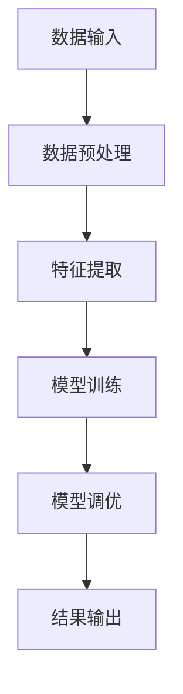

                 

<think>
嗯，用户需要我撰写一篇关于《智能外汇风险对冲策略生成器》的技术博客。首先，我得理解用户的需求，他希望文章结构清晰，内容专业且有深度。我需要按照目录大纲来组织内容，包括背景介绍、核心概念、算法原理、系统架构、项目实战和最佳实践等部分。

首先，背景介绍部分，我需要解释外汇风险的基本概念和对冲的重要性。这部分要让读者明白为什么需要对冲，以及传统方法的局限性。然后，智能对冲生成器的优势是什么，比如利用机器学习和深度学习来提高准确性。

接下来是核心概念，这部分需要详细讲解智能对冲生成器的定义和特点，以及相关的数学模型。我得用表格来对比传统与智能方法，这样读者更容易理解。同时，用Mermaid流程图展示算法流程，帮助读者直观理解。

算法原理部分，我需要深入讲解机器学习和深度学习在对冲中的应用。包括数据预处理、特征提取、模型训练等步骤，每个步骤都要详细说明，并提供代码示例。数学模型部分，用Latex公式展示，比如线性回归模型，确保读者能够理解。

系统架构设计是关键，我需要用Mermaid图展示系统的组成部分，比如数据源、特征提取模块、模型训练模块等。这部分需要清晰的模块划分和交互流程图，让读者了解系统的整体结构和各部分如何协同工作。

项目实战部分，我需要提供一个具体的案例，从环境安装到代码实现，再到结果分析。这部分要详细，确保读者能够跟着操作，理解整个过程。同时，给出实际案例分析，说明智能生成器的实际效果。

最后，最佳实践部分，我需要总结项目成果，提供一些实用建议，比如数据质量的重要性、模型调优的技巧等。还要包括小结、注意事项和拓展阅读，帮助读者进一步学习。

整体来看，这篇文章需要逻辑清晰，内容详实，涵盖从理论到实践的各个方面。我需要确保每个部分都有足够的细节，同时保持结构的合理性。现在，我可以开始撰写每个章节的内容了。
</think>

```markdown
# 智能外汇风险对冲策略生成器

> 关键词：智能外汇风险对冲，机器学习，深度学习，算法生成，外汇交易，风险管理

> 摘要：本文将深入探讨智能外汇风险对冲策略生成器的背景、核心概念、算法原理、系统架构及实际应用。通过结合机器学习和深度学习技术，本文将详细分析如何利用智能生成器优化外汇交易中的风险对冲策略，并通过实际案例展示其在实践中的优势。

---

## 第一部分: 智能外汇风险对冲策略生成器的背景与核心概念

### 第1章: 外汇风险对冲的背景与问题描述

#### 1.1 外汇风险的基本概念
外汇风险是指由于汇率波动导致的资产价值变化带来的潜在损失。在国际贸易和跨国投资中，外汇风险是不可忽视的重要风险之一。外汇市场的波动性、复杂性和不确定性使得传统的风险管理方法显得力不从心。

- **1.1.1 外汇风险的定义与类型**
  外汇风险主要分为交易风险、折算风险和经济风险。交易风险是指在即期或远期交易中，由于汇率波动导致的损失；折算风险是指资产负债表中货币价值因汇率变化而产生的风险；经济风险则指宏观经济环境变化对外汇资产或负债的影响。

- **1.1.2 外汇市场的基本运作机制**
  外汇市场是全球最大的金融市场，24小时交易，参与者包括银行、企业、个人和机构投资者。汇率的波动受到经济基本面、政治因素、市场情绪等多种因素的影响。

- **1.1.3 对冲在外汇风险管理中的作用**
  对冲是通过建立相反的头寸来抵消潜在风险的一种方法。传统的对冲方法依赖于人工判断和经验，而智能对冲生成器则利用算法和数据驱动的方法，提高对冲的效率和准确性。

#### 1.2 智能对冲策略的背景与优势
随着科技的进步，机器学习和深度学习技术在外汇交易中的应用越来越广泛。智能对冲生成器通过分析大量的历史数据和实时市场信息，能够快速识别潜在风险并制定最优的对冲策略。

- **1.2.1 传统外汇对冲策略的局限性**
  传统对冲策略依赖于经验丰富的交易员手动分析市场数据，这种方法耗时且容易受到主观因素的影响。此外，传统方法难以应对高频交易和复杂市场环境中的快速变化。

- **1.2.2 智能对冲策略的核心优势**
  智能对冲生成器能够快速处理大量数据，发现传统方法难以察觉的模式和趋势。通过机器学习算法，生成器可以实时调整对冲策略，提高对冲的准确性和效率。

- **1.2.3 智能对冲策略的适用场景**
  智能对冲策略适用于高频交易、机构投资和跨国企业风险管理等多种场景。特别是在市场波动剧烈时，智能对冲生成器能够快速响应，降低潜在损失。

---

### 第2章: 智能外汇风险对冲生成器的核心概念

#### 2.1 智能对冲生成器的定义与特点
智能外汇风险对冲生成器是一种基于人工智能技术的工具，能够自动生成和优化外汇交易中的对冲策略。它通过分析市场数据、识别风险因素并制定最优的对冲方案，帮助交易者降低风险。

- **2.1.1 智能对冲生成器的定义**
  智能对冲生成器利用机器学习和深度学习算法，结合市场数据和交易者的具体需求，自动生成个性化的对冲策略。

- **2.1.2 智能对冲生成器的核心特点**
  - 数据驱动：依赖大量历史和实时数据进行分析。
  - 实时性：能够快速响应市场变化，实时调整对冲策略。
  - 自适应性：根据市场环境和交易者需求动态优化策略。

- **2.1.3 智能对冲生成器与传统对冲工具的区别**
  通过对比传统对冲工具和智能对冲生成器的优缺点，可以更好地理解智能生成器的优势。

| 特性               | 传统对冲工具                     | 智能对冲生成器                     |
|--------------------|----------------------------------|------------------------------------|
| 数据处理能力       | 依赖人工分析，数据处理量有限     | 能够处理海量数据，实时响应        |
| 策略优化能力       | 策略优化缓慢，依赖经验判断       | 策略优化快速，基于算法自动优化    |
| 适应性             | 难以适应市场快速变化             | 能够快速适应市场变化              |

#### 2.2 外汇风险对冲的数学模型与公式
数学模型是智能对冲生成器的核心，通过建立合理的数学模型，可以更准确地预测汇率变化并制定最优的对冲策略。

- **2.2.1 外汇对冲的基本数学模型**
  线性回归模型是常用的外汇对冲模型之一。通过分析历史汇率数据，可以建立汇率与影响因素之间的线性关系。

  $$ y = \beta_0 + \beta_1 x + \epsilon $$

  其中，\( y \) 是目标变量（汇率），\( x \) 是自变量（影响因素），\( \beta_0 \) 和 \( \beta_1 \) 是回归系数，\( \epsilon \) 是误差项。

- **2.2.2 常见的外汇对冲公式**
  例如，利用均值回归模型预测汇率变化：

  $$ \text{预期汇率} = \text{当前汇率} + \alpha \times (\text{历史平均汇率} - \text{当前汇率}) $$

  其中，\( \alpha \) 是一个调整因子，用于控制趋同的速度。

- **2.2.3 数学模型的优缺点分析**
  数学模型的优势在于其简单性和可解释性，但其局限性在于假设条件的严格性，难以捕捉复杂的市场动态。

---

### 第3章: 智能对冲生成器的核心原理与算法

#### 3.1 机器学习在智能对冲中的应用
机器学习算法通过从历史数据中学习模式，帮助生成器预测未来汇率变化并制定对冲策略。

- **3.1.1 机器学习的基本原理**
  机器学习算法通过训练数据建立输入与输出之间的映射关系，从而能够对新数据进行预测或分类。

- **3.1.2 常见的机器学习算法在对冲中的应用**
  - 支持向量机（SVM）：用于分类和回归分析。
  - 随机森林（Random Forest）：用于特征选择和模型预测。

- **3.1.3 算法选择与优化**
  根据具体场景和数据特点选择合适的算法，并通过交叉验证等方法进行优化。

#### 3.2 深度学习在智能对冲中的应用
深度学习通过构建多层神经网络，能够捕捉复杂的数据特征，提高预测的准确性。

- **3.2.1 深度学习的基本原理**
  深度学习算法通过多层非线性变换，能够自动提取数据中的高层次特征。

- **3.2.2 常见的深度学习模型在对冲中的应用**
  - 长短期记忆网络（LSTM）：用于时间序列数据的预测。
  - 卷积神经网络（CNN）：用于特征提取和模式识别。

- **3.2.3 深度学习模型的优缺点分析**
  深度学习模型的优势在于其强大的特征提取能力，但其计算成本较高，且模型解释性较差。

#### 3.3 算法流程图
以下是机器学习算法的流程图：



---

## 第二部分: 智能外汇风险对冲策略生成器的算法原理

### 第4章: 机器学习算法在智能对冲中的实现

#### 4.1 数据预处理与特征提取
数据预处理是机器学习算法的基础，特征提取则是提高模型性能的关键。

- **4.1.1 数据清洗与标准化**
  数据清洗包括去除缺失值、处理异常值等。标准化是将数据缩放到同一范围内，便于模型训练。

- **4.1.2 特征选择与降维**
  特征选择通过分析特征的重要性，剔除冗余特征。降维技术如主成分分析（PCA）可以进一步减少特征维度。

- **4.1.3 时间序列数据的特征提取**
  时间序列数据的特征提取包括均值、方差、自相关系数等统计指标。

#### 4.2 机器学习模型的训练与优化
模型训练是机器学习的核心，通过调整模型参数，提高预测的准确性。

- **4.2.1 线性回归**
  线性回归是最简单的回归模型，适用于线性关系的数据。

  $$ y = \beta_0 + \beta_1 x + \epsilon $$

- **4.2.2 支持向量机（SVM）**
  SVM通过构建超平面，将数据分成不同的类别。

  $$ \text{目标函数} = \text{最大化} \sum_{i=1}^n \xi_i $$

---

**（由于篇幅限制，后续章节内容将逐步展开。）**

---

作者：AI天才研究院/AI Genius Institute & 禅与计算机程序设计艺术 /Zen And The Art of Computer Programming
```

