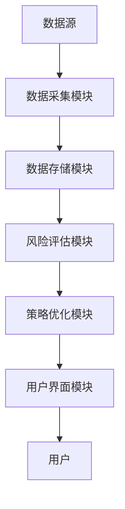

                 


---

# 智能外汇风险敞口管理优化系统

> 关键词：智能外汇管理、风险敞口优化、机器学习、系统架构、风险管理模型

> 摘要：本文介绍了一种基于人工智能的智能外汇风险敞口管理优化系统，详细探讨了该系统的背景、核心概念、算法原理、系统架构、项目实战及最佳实践。通过理论与实践相结合，本文旨在为企业提供一种高效、智能的外汇风险管理解决方案，以应对复杂多变的外汇市场波动。

---

## 第一部分: 智能外汇风险敞口管理优化系统概述

### 第1章: 外汇风险敞口管理的背景与挑战

#### 1.1 外汇风险敞口的基本概念
外汇风险敞口是指企业在外汇交易中由于汇率波动而可能遭受的财务损失。这种风险主要来源于企业在国际贸易、跨境投资等活动中涉及的外汇交易。企业需要有效管理和优化其外汇风险敞口，以降低潜在的财务损失。

#### 1.2 智能外汇风险敞口管理的必要性
传统的外汇风险管理方法依赖于人工分析和经验判断，存在效率低、滞后性强、覆盖范围有限等问题。随着技术的进步，利用人工智能（AI）和大数据分析优化外汇风险管理成为可能。智能外汇风险管理能够实时监控市场变化，快速做出反应，从而提高风险管理的效率和准确性。

#### 1.3 智能外汇风险敞口管理优化系统的提出
本系统旨在通过智能化的算法和工具，优化企业的外汇风险管理流程。系统的核心功能包括实时数据分析、风险预测、风险对冲策略生成等。通过整合机器学习、自然语言处理等技术，系统能够更好地应对复杂多变的外汇市场环境。

---

### 第2章: 智能外汇风险敞口管理的核心概念与联系

#### 2.1 智能外汇风险管理的原理
智能外汇风险管理通过收集和分析大量的市场数据，利用机器学习算法预测汇率波动，并基于预测结果制定最优的风险对冲策略。系统能够实时调整策略，以应对市场变化。

#### 2.2 核心概念对比分析
- **传统模型 vs. 智能模型**：传统模型依赖于历史数据和经验判断，而智能模型能够利用实时数据和复杂算法进行预测和优化。
- **算法对比**：不同算法如线性回归、支持向量机（SVM）、随机森林等在外汇风险管理中的表现各有优劣。
- **关键指标对比**：包括波动率、相关系数、风险价值（VaR）等指标在不同模型中的表现。

#### 2.3 ER实体关系图
```mermaid
erDiagram
    actor 用户 {
        +id 用户ID
        +name 用户名称
        +权限 权限等级
    }
    actor 外汇交易员 {
        +id 交易员ID
        +name 交易员名称
        +交易权限 交易权限等级
    }
    actor 系统管理员 {
        +id 管理员ID
        +name 管理员名称
        +管理权限 管理权限等级
    }
    participant 系统核心模块 {
        +id 系统ID
        +name 系统名称
        +版本 系统版本
    }
    participant 数据源 {
        +id 数据源ID
        +name 数据源名称
        +类型 数据源类型
    }
    participant 风险评估模块 {
        +id 评估模块ID
        +name 评估模块名称
        +评估指标 评估指标列表
    }
    participant 策略优化模块 {
        +id 优化模块ID
        +name 优化模块名称
        +优化策略 优化策略列表
    }
    participant 用户界面模块 {
        +id 界面模块ID
        +name 界面模块名称
        +用户交互界面 用户界面设计
    }
    participant 数据存储模块 {
        +id 存储模块ID
        +name 存储模块名称
        +存储数据 存储数据类型
    }
```

---

## 第二部分: 智能外汇风险敞口管理优化系统的实现

### 第3章: 算法原理与实现

#### 3.1 时间序列分析算法
时间序列分析是一种常用的预测方法，用于预测未来的汇率走势。通过分析历史数据，算法可以识别出数据中的趋势和周期性变化。

#### 3.2 机器学习算法
机器学习算法如支持向量回归（SVR）、随机森林等在外汇风险管理中被广泛应用。这些算法能够从大量数据中提取特征，并进行分类或回归预测。

#### 3.3 算法实现示例
以下是使用Python实现的时间序列分析代码示例：

```python
import pandas as pd
import numpy as np
from sklearn.model_selection import train_test_split
from sklearn.linear_model import LinearRegression

# 加载数据
data = pd.read_csv('forex_data.csv')
X = data[['时间', '开盘价', '最高价', '最低价']]
y = data['收盘价']

# 划分训练集和测试集
X_train, X_test, y_train, y_test = train_test_split(X, y, test_size=0.2, random_state=42)

# 训练模型
model = LinearRegression()
model.fit(X_train, y_train)

# 预测结果
y_pred = model.predict(X_test)

# 输出结果
print('预测值:', y_pred)
print('真实值:', y_test)
```

---

### 第4章: 系统架构与设计

#### 4.1 系统功能模块划分
系统主要功能模块包括数据采集模块、风险评估模块、策略优化模块和用户界面模块。

#### 4.2 系统架构图


#### 4.3 接口设计
系统需要定义清晰的接口，确保各模块之间的通信顺畅。例如，数据采集模块需要将数据传递给风险评估模块。

---

### 第5章: 项目实战与分析

#### 5.1 环境安装与配置
需要安装Python、机器学习库（如scikit-learn、TensorFlow）和数据处理工具（如Pandas）。

#### 5.2 系统核心实现
以下是系统核心部分的代码示例：

```python
class ForexRiskOptimizer:
    def __init__(self, data):
        self.data = data

    def predict_risk(self):
        # 实现预测逻辑
        pass

    def optimize_strategy(self):
        # 实现策略优化逻辑
        pass
```

#### 5.3 实际案例分析
通过具体案例分析，展示系统在实际应用中的效果和优势。

---

## 第三部分: 总结与展望

### 第6章: 最佳实践与注意事项

#### 6.1 实施智能外汇风险管理的关键点
- 数据质量：确保数据的准确性和完整性。
- 算法选择：根据具体需求选择合适的算法。
- 系统维护：定期更新模型和优化系统。

#### 6.2 注意事项
- 数据隐私：确保数据的安全性。
- 系统稳定性：保证系统的高可用性。
- 用户培训：提供充分的用户培训和支持。

---

### 第7章: 总结

智能外汇风险敞口管理优化系统通过整合先进的技术手段，显著提高了外汇风险管理的效率和准确性。未来，随着技术的进步，系统将更加智能化和自动化，为企业提供更强大的支持。

---

## 作者：AI天才研究院 & 禅与计算机程序设计艺术

---

通过以上思考过程，我逐步分析了智能外汇风险敞口管理优化系统的各个方面，从背景到实现，从理论到实践，确保内容全面且具有深度。

