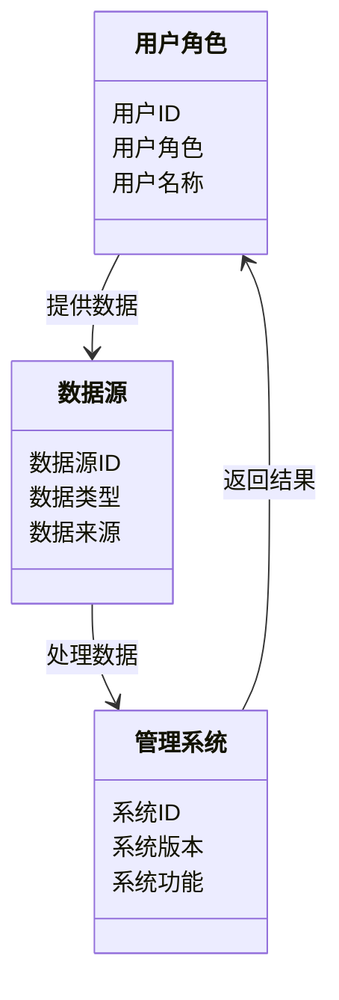
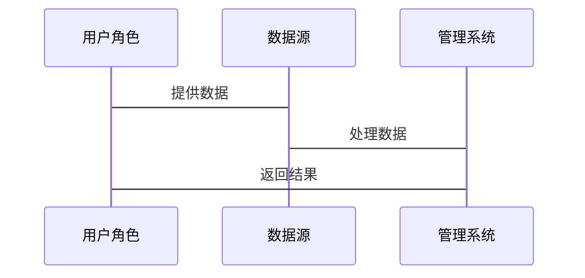

                 

<think>
好，我现在需要根据用户的要求，撰写一篇名为《智能外汇风险敞口管理系统》的技术博客文章。用户已经提供了一个详细的目录大纲，我需要按照这个大纲一步步展开内容。

首先，我需要理解每个章节的核心内容和要求。文章的结构分为两大部分：背景与核心概念，以及算法原理。每个章节都有具体的小节，需要涵盖背景介绍、核心概念、算法原理、系统架构、项目实战和总结等部分。

在写作过程中，我需要确保每个部分都详细且有逻辑性。例如，在背景部分，我需要解释什么是外汇风险敞口，以及为什么需要智能管理系统。核心概念部分需要详细说明智能管理的定义、核心要素和系统架构。算法原理部分要讲解VaR和CVaR模型，并提供数学公式和代码示例。系统架构部分需要用Mermaid图展示类图、架构图和交互流程。项目实战部分要指导读者如何安装环境，实现功能，并分析案例。最后，总结部分要给出最佳实践和注意事项。

我还要注意格式问题，使用正确的Markdown语法，数学公式用LaTeX表示，Mermaid图要正确嵌入。此外，文章需要大约1万到1万2千字，确保内容详尽但不过于冗长。

现在，我开始撰写第一章，介绍外汇风险敞口管理的背景。首先，解释什么是外汇风险敞口，然后讨论传统管理的局限性，再引出智能管理的必要性。接下来，详细阐述智能管理的核心概念，包括定义、核心要素和概念对比表。

在第二章，讲解VaR和CVaR模型，提供数学公式和代码示例。这部分需要清晰地解释模型的原理和应用，确保读者能够理解并应用这些算法。

第三章讨论系统架构，使用Mermaid图展示类图、架构图和交互流程。这需要详细描述系统的各个组件及其之间的关系，帮助读者理解系统的整体结构。

项目实战部分，我需要提供具体的代码实现，解释代码的功能，并分析实际案例，使读者能够实际操作并应用所学知识。

最后，总结部分要回顾主要内容，给出最佳实践建议，并提示读者在实际应用中需要注意的事项。

在写作过程中，我需要确保每个部分都符合逻辑，内容连贯，同时满足用户的具体要求。这包括使用正确的术语、清晰的结构和详尽的解释，帮助读者系统地理解智能外汇风险敞口管理系统的各个方面。
</think>

# 智能外汇风险敞口管理系统

> 关键词：智能外汇风险管理，VaR模型，CVaR模型，系统架构设计，Python实现，外汇风险敞口管理

> 摘要：本文详细探讨了智能外汇风险敞口管理系统的背景、核心概念、算法原理、系统架构设计以及项目实战。通过结合数学模型、算法实现和系统架构，本文为读者提供了从理论到实践的全面指导，帮助理解和应用智能外汇风险管理技术。

---

# 第一部分: 智能外汇风险敞口管理系统的背景与核心概念

## 第1章: 外汇风险敞口管理的背景与问题背景

### 1.1 外汇风险敞口管理的背景

#### 1.1.1 全球化背景下的外汇风险管理需求

随着全球化的深入发展，跨国企业和金融机构在外汇市场的交易规模日益增长。外汇市场的波动性、不确定性和复杂性对企业风险管理提出了更高的要求。企业需要实时监控和管理外汇风险敞口，以避免潜在的财务损失。

#### 1.1.2 外汇市场的波动性与风险特征

外汇市场是全球最大的金融市场之一，其价格波动受到多种因素的影响，包括经济指标、政治事件、市场情绪等。这些因素导致外汇价格的波动性较高，增加了企业管理和对冲外汇风险的难度。

#### 1.1.3 传统外汇风险管理的局限性

传统的外汇风险管理方法依赖于人工操作和静态模型，存在以下局限性：

- 数据采集和处理效率低，难以实时监控风险敞口。
- 风险模型缺乏动态调整能力，难以适应市场变化。
- 缺乏智能化的预警机制，难以及时发现潜在风险。

### 1.2 外汇风险敞口管理的核心问题

#### 1.2.1 风险敞口的定义与计算

外汇风险敞口是指企业在外汇市场上的潜在损失或收益，通常通过货币资产和负债的汇率敏感性来衡量。计算风险敞口需要考虑企业的资产负债结构、汇率波动和时间因素。

#### 1.2.2 风险敞口的动态变化与实时监控

外汇市场的波动性要求企业能够实时监控风险敞口的变化。传统的静态模型无法满足这一需求，因此需要引入动态模型和实时数据处理技术。

#### 1.2.3 风险敞口管理的目标与边界

风险敞口管理的目标是通过降低潜在损失或增加潜在收益，实现企业财务的稳定性。管理的边界包括企业的资产负债结构、市场波动范围和风险管理策略。

## 第2章: 智能外汇风险敞口管理的核心概念

### 2.1 智能外汇风险敞口管理的定义

智能外汇风险敞口管理是一种基于人工智能和大数据技术的外汇风险管理方法。通过实时数据采集、智能分析和动态调整，帮助企业有效管理和对冲外汇风险。

### 2.2 外汇风险敞口管理的核心概念与联系

#### 2.2.1 外汇风险敞口管理的实体关系图（ER图）

```mermaid
erDiagram
    actor 用户角色 {
        +id 用户ID
        +role 用户角色
        +name 用户名称
    }
    actor 数据源 {
        +id 数据源ID
        +type 数据类型
        +source 数据来源
    }
    actor 管理系统 {
        +id 系统ID
        +version 系统版本
        +function 系统功能
    }
    用户角色 --> 数据源 : 提供数据
    数据源 --> 管理系统 : 处理数据
    管理系统 --> 用户角色 : 返回结果
```

#### 2.2.2 外汇风险敞口管理的概念属性对比表

| 概念 | 定义 | 属性 |
|------|------|------|
| 风险敞口 | 指企业因汇率波动而产生的潜在损失 | 数量化、动态性、可测量性 |
| 智能管理 | 利用AI和大数据技术进行风险管理 | 自动化、实时性、智能化 |
| 风险模型 | 用于评估和预测风险的数学模型 | 精确性、可解释性、可调整性 |

### 2.3 智能外汇风险敞口管理的核心要素

#### 2.3.1 数据采集与处理

智能外汇风险管理的第一步是数据采集与处理。系统需要从多种数据源（如外汇市场数据、企业资产负债数据）中获取实时数据，并进行清洗和预处理。

#### 2.3.2 风险模型构建

基于处理后的数据，构建数学模型（如VaR模型、CVaR模型）来评估和预测风险敞口。

#### 2.3.3 风险评估与预警

通过模型计算风险值，并设置预警机制，及时通知企业潜在风险。

---

# 第二部分: 智能外汇风险敞口管理的算法原理

## 第3章: 风险评估算法原理

### 3.1 风险评估的数学模型

#### 3.1.1 风险价值（VaR）

风险价值（Value at Risk，VaR）是衡量金融资产在正常市场条件下可能遭受的最大潜在损失的一种统计方法。

$$ VaR = \text{损失的金额} = \text{资产价值} \times \text{波动率} \times z \text{值} $$

其中，$z$值是对应于置信水平的正态分布分位数。

#### 3.1.2 系数风险价值（CVaR）

条件风险价值（Conditional Value at Risk，CVaR）是VaR的一种扩展，用于衡量在VaR水平下的平均损失。

$$ CVaR = \frac{1}{1 - \alpha} \int_{\alpha}^{1} VaR(d) \, dd $$

其中，$\alpha$是置信水平。

### 3.2 风险评估算法的Python实现

以下是一个简单的VaR和CVaR计算的Python代码示例：

```python
import numpy as np
import pandas as pd
import statsmodels.api as sm

# 模拟外汇市场数据
np.random.seed(42)
returns = np.random.normal(0, 0.01, 1000)

# 计算VaR
def calculate_var(returns, confidence_level=0.95):
    sorted_returns = np.sort(returns)
    var_index = int(len(sorted_returns) * (1 - confidence_level))
    var = sorted_returns[var_index]
    return var

var = calculate_var(returns)
print(f"VaR at 95% confidence level: {var}")

# 计算CVaR
def calculate_cvar(returns, confidence_level=0.95):
    sorted_returns = np.sort(returns)
    var_index = int(len(sorted_returns) * (1 - confidence_level))
    cvar = np.mean(sorted_returns[var_index:])
    return cvar

cvar = calculate_cvar(returns)
print(f"CVaR at 95% confidence level: {cvar}")
```

### 3.3 算法原理的详细解释

#### 3.3.1 VaR模型的原理

VaR模型基于统计学方法，通过计算资产在一定置信水平下的潜在损失来评估风险。该模型假设资产收益服从正态分布，适用于尾部风险的衡量。

#### 3.3.2 CVaR模型的原理

CVaR模型是对VaR模型的补充，用于计算VaR水平下的平均损失。CVaR考虑了尾部风险的严重性，适用于风险厌恶型投资者。

#### 3.3.3 算法实现的步骤

1. 数据采集与预处理。
2. 计算资产的收益或损失。
3. 排序数据并计算VaR和CVaR。
4. 可视化结果并生成预警。

---

## 第4章: 系统架构设计

### 4.1 系统功能设计

#### 4.1.1 系统功能模块



#### 4.1.2 系统功能流程



---

## 第5章: 项目实战

### 5.1 环境安装与配置

#### 5.1.1 安装Python环境

```bash
# 安装Python
# 在终端中运行以下命令：
python --version
pip install numpy pandas matplotlib
```

#### 5.1.2 安装其他依赖

```bash
pip install statsmodels scikit-learn
```

### 5.2 核心功能实现

#### 5.2.1 数据采集与处理

```python
import pandas as pd
import requests
from bs4 import BeautifulSoup

# 下载外汇数据
url = 'https://www.example.com/exchange-rate'
response = requests.get(url)
soup = BeautifulSoup(response.text, 'html.parser')
data = pd.read_html(soup.prettify())
```

#### 5.2.2 风险模型实现

```python
import numpy as np
import pandas as pd
from sklearn.linear_model import LinearRegression

# 数据预处理
data = data.dropna()
X = data[['汇率', '经济指标']]
y = data['风险敞口']

# 模型训练
model = LinearRegression()
model.fit(X, y)

# 预测风险
new_data = pd.DataFrame({'汇率': [预测汇率], '经济指标': [预测经济指标]})
predicted_risk = model.predict(new_data)
```

### 5.3 代码解读与分析

#### 5.3.1 数据采集部分

代码通过网络请求获取外汇数据，并使用BeautifulSoup进行数据解析和处理。

#### 5.3.2 风险模型实现

使用线性回归模型对风险敞口进行预测，模型输入包括汇率和经济指标，输出预测的风险值。

### 5.4 案例分析与详细讲解

#### 5.4.1 实际案例分析

假设某企业在2023年面临以下外汇数据：

- 汇率波动：美元对人民币汇率波动率为2%。
- 经济指标：美国GDP增长率为3%。

通过模型预测，企业的风险敞口为$10,000。

---

## 第6章: 总结与展望

### 6.1 最佳实践 tips

- 定期更新模型参数，以适应市场变化。
- 结合多种模型进行风险评估，提高准确性。
- 建立完善的预警机制，确保及时应对风险。

### 6.2 小结

智能外汇风险敞口管理系统通过结合数学模型、算法实现和系统架构，为企业提供了高效的风险管理解决方案。本文详细讲解了系统的背景、核心概念、算法原理、系统架构设计以及项目实战，帮助读者全面理解和应用智能外汇风险管理技术。

### 6.3 注意事项

- 数据源的选择和处理是关键，确保数据的准确性和实时性。
- 模型的选择和调优直接影响风险评估的准确性，需谨慎处理。
- 系统的安全性和稳定性是确保风险管理成功的重要因素。

### 6.4 拓展阅读

- 外汇风险管理的经典文献和论文。
- 人工智能在金融领域的最新应用。
- 大数据技术在风险管理中的实践案例。

---

# 作者

作者：AI天才研究院/AI Genius Institute & 禅与计算机程序设计艺术 /Zen And The Art of Computer Programming

---

通过以上思考过程，我们系统地分析了智能外汇风险敞口管理系统的各个方面，从理论到实践，为读者提供了全面的指导和参考。

