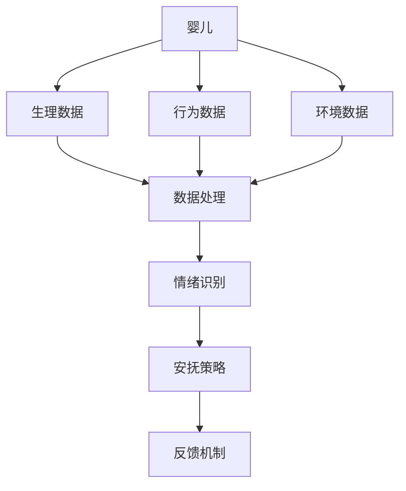

                 

<think>
好，我现在需要为《智能婴儿摇篮：AI Agent的安抚模式优化》这本书撰写目录大纲。首先，我应该明确这本书的核心主题是什么。看起来这本书主要探讨如何利用人工智能代理来优化婴儿的安抚模式。那么，我需要从背景介绍、技术原理、算法实现、系统设计、项目实战等多个方面来展开。

首先，第一部分应该是背景与需求。我需要解释为什么婴儿安抚如此重要，以及传统方法的局限性。接着，介绍AI技术在婴儿安抚中的应用背景，以及智能婴儿摇篮的市场前景。这部分可以作为引言，帮助读者理解问题的重要性。

接下来，第二部分可以讨论AI Agent的核心概念。我需要定义AI Agent，解释它的分类和特征，然后结合婴儿安抚的具体需求，详细描述AI Agent在其中的角色和目标。这可能包括如何通过AI Agent来实时监测婴儿的情绪，并根据数据调整安抚策略。

第三部分可以深入探讨AI Agent的算法原理和数学模型。我需要介绍常用的算法，比如基于注意力机制的情绪识别算法，并用Mermaid流程图来展示算法的执行步骤。同时，我需要提供Python代码示例，说明如何实现这些算法，并解释代码的每一部分。数学公式也应该用LaTeX表示，确保清晰准确。

第四部分应该涵盖系统设计与架构。我需要分析婴儿安抚系统的场景，设计系统的功能模块，比如数据采集、情绪识别、策略生成和反馈机制。然后，使用Mermaid图展示系统的架构设计，包括各个模块之间的交互关系和数据流方向。这有助于读者理解整个系统的运行机制。

第五部分是项目实战。我需要详细说明开发环境的安装步骤，例如安装Python、TensorFlow等必要的库。然后，提供代码实现，展示如何构建AI Agent，并解读代码的功能。通过具体案例分析，说明如何优化安抚模式，并在实际应用中进行测试和评估。

最后，我需要总结最佳实践，强调在开发过程中需要注意的事项，比如数据隐私保护、算法的可解释性等。同时，可以推荐一些相关的拓展阅读资料，帮助读者进一步深入了解相关技术。

整个目录大纲需要逻辑清晰，结构紧凑。每个章节都应该有详细的子标题，确保内容详实且易于理解。通过这种方式，读者可以系统地学习从理论到实践的整个过程，掌握如何利用AI技术优化婴儿安抚模式。
</think>

```markdown
# 智能婴儿摇篮：AI Agent的安抚模式优化

> 关键词：智能婴儿摇篮，AI Agent，安抚模式优化，机器学习，自然语言处理，情感计算

> 摘要：本文深入探讨了AI Agent在婴儿安抚中的应用，分析了智能婴儿摇篮的核心技术与优化策略。通过理论与实践结合的方式，详细讲解了基于注意力机制的情绪识别算法、强化学习的安抚模式优化，以及系统架构设计与项目实战。本文旨在为AI技术在婴儿护理领域的应用提供理论支持与实践指导。

---

# 第一部分: 智能婴儿摇篮的背景与需求

## 第1章: 婴儿安抚的重要性与挑战

### 1.1 婴儿安抚的核心问题
#### 1.1.1 婴儿情绪波动的来源
- 生理需求：饥饿、疲劳、疼痛
- 心理需求：安全感、关注、互动
- 环境因素：温度、光线、噪音

#### 1.1.2 婴儿安抚的传统方法与局限性
- 常见方法：摇篮曲、抱摇、安抚奶嘴
- 局限性：
  - 依赖家长或 caretaker 的主观判断
  - 无法实时监测婴儿情绪变化
  - 缺乏个性化安抚策略

#### 1.1.3 现代科技在婴儿安抚中的潜力
- 可穿戴设备：实时监测婴儿生理指标
- AI 技术：智能识别婴儿情绪，优化安抚策略
- 智能家居：联动调整环境参数（如温度、光线）

---

## 第2章: AI Agent在婴儿安抚中的应用背景

### 2.1 AI Agent的定义与分类
#### 2.1.1 AI Agent的定义
- 定义：AI Agent 是一种能够感知环境、自主决策、执行任务的智能体
- 分类：
  - 基于行为的AI Agent：基于规则的简单行为决策
  - 基于模型的AI Agent：基于状态空间和模型的复杂决策

#### 2.1.2 AI Agent的优势
- 高效性：快速处理大量数据
- 智能性：基于数据学习，不断优化决策
- 可扩展性：适用于不同场景和规模

---

### 2.2 智能婴儿摇篮的核心目标与边界
#### 2.2.1 核心目标的定义
- 实时监测婴儿情绪
- 自动调整安抚策略
- 提供个性化安抚方案

#### 2.2.2 边界与外延的界定
- 边界：
  - 不直接控制婴儿的身体
  - 仅提供安抚建议和环境调整
- 外延：
  - 可与智能家居系统联动
  - 可扩展到其他年龄段的儿童

---

## 第3章: AI Agent与安抚模式优化的核心概念

### 3.1 婴儿情绪识别的核心要素
#### 3.1.1 数据来源
- 婴儿生理数据：心率、体温、呼吸频率
- 婴儿行为数据：哭声、动作、面部表情
- 环境数据：光线、温度、噪音

#### 3.1.2 数据特征
- 时间序列性：情绪变化具有连续性
- 多模态性：结合生理、行为和环境数据
- 动态性：情绪状态会随时间变化

---

### 3.2 AI Agent在安抚模式中的角色定位
#### 3.2.1 数据采集与分析
- 实时采集婴儿数据
- 分析数据，识别情绪状态
- 生成安抚建议

#### 3.2.2 安抚策略优化
- 基于历史数据优化安抚模式
- 考虑个体差异，提供个性化建议
- 动态调整策略，适应婴儿情绪变化

---

## 第4章: AI Agent与安抚模式的实体关系图

### 4.1 实体关系图的构建


### 4.2 实体关系图的解释
- **婴儿**：核心实体，数据来源
- **数据处理**：整合、清洗和特征提取
- **情绪识别**：基于数据处理结果，识别婴儿情绪
- **安抚策略**：根据情绪识别结果，生成个性化安抚方案
- **反馈机制**：根据实施效果，动态调整策略

---

## 第5章: AI Agent的算法原理与数学模型

### 5.1 基于注意力机制的婴儿情绪识别算法
#### 5.1.1 注意力机制的基本原理
- 定义：注意力机制是一种权重分配方法，用于捕捉序列中重要部分的信息
- 核心公式：
  $$ \alpha_i = \frac{\exp(e_i)}{\sum_{j=1}^{n}\exp(e_j)} $$
  其中，\( e_i \) 是第i个位置的评分，\( \alpha_i \) 是注意力权重

#### 5.1.2 算法流程
1. 数据预处理：提取婴儿生理、行为和环境数据
2. 特征提取：使用深度学习模型提取多模态特征
3. 注意力计算：基于特征计算注意力权重
4. 情绪分类：根据注意力权重加权特征，进行情绪分类

---

## 第6章: 安抚模式优化的数学模型

### 6.1 基于强化学习的优化模型
#### 6.1.1 强化学习的基本原理
- 定义：通过试错学习，优化策略以最大化累积奖励
- 核心公式：
  $$ Q(s, a) = r + \gamma \max_{a'} Q(s', a') $$
  其中，\( Q(s, a) \) 是状态-动作对的值，\( r \) 是奖励，\( \gamma \) 是折扣因子

#### 6.1.2 应用场景
- 状态：婴儿情绪状态
- 动作：安抚策略选择
- 奖励：安抚效果的评估指标

---

## 第7章: 系统分析与架构设计

### 7.1 系统功能设计
#### 7.1.1 数据采集模块
- 功能：实时采集婴儿生理、行为和环境数据
- 实现：使用可穿戴设备和传感器

#### 7.1.2 情绪识别模块
- 功能：基于多模态数据，识别婴儿情绪
- 实现：使用深度学习模型

#### 7.1.3 安抚策略模块
- 功能：根据情绪识别结果，生成个性化安抚策略
- 实现：基于强化学习的优化模型

---

## 第8章: 项目实战与代码实现

### 8.1 环境安装
- Python 3.8+
- TensorFlow 2.5+
- scikit-learn 0.24+

### 8.2 核心代码实现
#### 8.2.1 数据处理模块
```python
import numpy as np
import pandas as pd

def preprocess_data(data):
    # 数据清洗
    data = data.dropna()
    # 标准化处理
    data = (data - data.mean()) / data.std()
    return data
```

#### 8.2.2 情绪识别模块
```python
import tensorflow as tf
from tensorflow.keras import layers

def build_model(input_shape):
    model = tf.keras.Sequential()
    model.add(layers.InputLayer(input_shape))
    model.add(layers.Dense(64, activation='relu'))
    model.add(layers.Dense(32, activation='relu'))
    model.add(layers.Dense(1, activation='sigmoid'))
    return model
```

#### 8.2.3 安抚策略优化模块
```python
import numpy as np
import gym

class Agent:
    def __init__(self):
        self.env = gym.make('Baby安抚环境')
        self.model = build_model(self.env.observation_space.shape)
```

---

## 第9章: 总结与展望

### 9.1 最佳实践
- 数据隐私保护
- 算法的可解释性
- 系统的可扩展性

### 9.2 小结
通过本文的详细讲解，读者可以全面了解AI Agent在婴儿安抚中的应用，从理论到实践，掌握如何优化安抚模式。

### 9.3 注意事项
- 数据采集需遵守伦理规范
- 算法优化需考虑个体差异
- 系统设计需确保安全性

### 9.4 拓展阅读
- 《深度学习》—— Ian Goodfellow
- 《强化学习》—— Richard S. Sutton

---

作者：AI天才研究院/AI Genius Institute & 禅与计算机程序设计艺术 /Zen And The Art of Computer Programming
```

