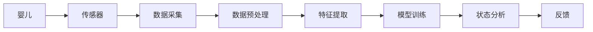
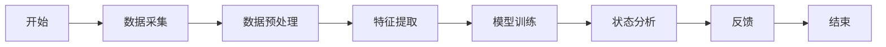
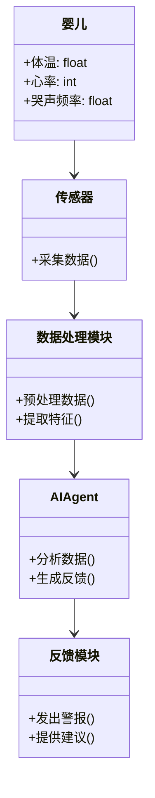
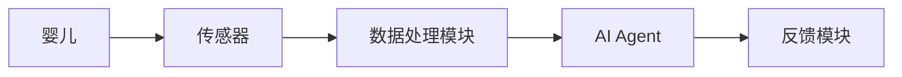
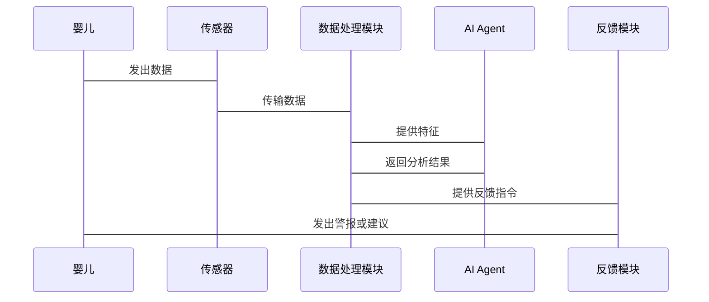

                 


# 智能婴儿监护器：AI Agent的婴儿状态分析

> 关键词：智能婴儿监护器、AI Agent、婴儿状态分析、算法原理、系统架构、项目实战

> 摘要：本文深入探讨了智能婴儿监护器中AI Agent的婴儿状态分析技术，从背景介绍、核心概念、算法原理、系统架构到项目实战，全面解析了AI Agent在婴儿监护中的应用。

---

# 第一部分: 智能婴儿监护器的背景与核心概念

## 第1章: 智能婴儿监护器的背景介绍

### 1.1 智能婴儿监护器的背景

#### 1.1.1 婴儿监护的传统方式与局限性
传统的婴儿监护主要依赖于家长的感官（如听声音、观察）和简单的婴儿监测设备（如体温计、心率计）。这些方法存在以下局限性：
- **实时性不足**：家长无法实时监控婴儿的状态，尤其是在夜间或家长不在场的情况下。
- **准确性有限**：传统设备可能无法准确捕捉婴儿的微小变化，容易出现误报或漏报。
- **缺乏主动性**：无法主动分析婴儿的状态并采取相应的措施。

#### 1.1.2 智能化婴儿监护的需求与趋势
随着人工智能技术的发展，智能化婴儿监护的需求日益增长。家长和医疗专业人员需要一种更智能、更高效的工具来实时监控婴儿的状态，预防潜在的健康风险。

#### 1.1.3 AI Agent在婴儿监护中的作用
AI Agent（智能代理）通过感知、分析和反馈机制，能够实时监测婴儿的状态，提供准确的分析结果，并在必要时采取主动措施（如发出警报或建议）。AI Agent的引入显著提高了婴儿监护的效率和准确性。

### 1.2 问题背景与问题描述

#### 1.2.1 婴儿监护的核心问题
婴儿监护的核心问题在于如何实时、准确地监测婴儿的生理和行为状态，并在异常情况下及时采取措施。这些问题包括：
- 监测婴儿的体温、心率、呼吸频率等生理指标。
- 分析婴儿的哭声、睡眠状态、运动情况等行为特征。
- 预测婴儿可能的健康风险，如低血糖、窒息、脱水等。

#### 1.2.2 AI Agent在婴儿状态分析中的目标
AI Agent的目标是通过整合多种传感器数据和历史信息，建立婴儿状态的数学模型，实现以下功能：
- 实时感知婴儿的生理和行为状态。
- 分析数据，识别异常情况。
- 提供反馈，指导家长或医护人员采取相应措施。

#### 1.2.3 界定问题的边界与外延
在设计AI Agent时，需要明确系统的边界和外延：
- **边界**：系统的输入是婴儿的生理数据和行为数据，输出是婴儿的状态分析结果和建议。
- **外延**：系统可以与其他设备（如智能音箱、智能家居）联动，提供更全面的监护服务。

### 1.3 核心概念与结构

#### 1.3.1 智能婴儿监护器的概念结构
智能婴儿监护器由以下部分组成：
- **传感器**：采集婴儿的生理数据（如心率、体温）和行为数据（如哭声、运动）。
- **数据处理模块**：对传感器数据进行预处理和特征提取。
- **AI Agent**：通过机器学习模型分析数据，生成婴儿的状态分析结果。
- **反馈模块**：根据分析结果，发出警报或建议。

#### 1.3.2 AI Agent的核心要素
AI Agent的核心要素包括：
- **感知模块**：负责采集和处理数据。
- **分析模块**：通过机器学习模型对数据进行分析。
- **反馈模块**：根据分析结果采取相应的行动。

#### 1.3.3 婴儿状态分析的系统组成
婴儿状态分析系统由以下几个模块组成：
- **数据采集模块**：采集婴儿的生理和行为数据。
- **数据预处理模块**：对采集的数据进行清洗和标准化。
- **特征提取模块**：提取有助于状态分析的关键特征。
- **模型训练模块**：训练机器学习模型。
- **状态分析模块**：利用模型对婴儿状态进行实时分析。

## 1.4 本章小结
本章介绍了智能婴儿监护器的背景、核心问题和系统结构。通过分析传统婴儿监护的局限性，提出了AI Agent在婴儿监护中的重要作用，并明确了系统的组成和目标。

---

# 第二部分: AI Agent的核心概念与原理

## 第2章: AI Agent的核心概念与联系

### 2.1 AI Agent的原理

#### 2.1.1 AI Agent的感知机制
AI Agent通过多种传感器（如心率传感器、温度传感器、麦克风）采集婴儿的生理和行为数据。感知机制包括以下步骤：
1. **数据采集**：通过传感器获取原始数据。
2. **数据预处理**：对数据进行清洗、归一化等处理，消除噪声。
3. **特征提取**：提取有助于状态分析的关键特征（如心率变异、哭声频率）。

#### 2.1.2 AI Agent的分析与决策
分析与决策模块利用机器学习模型对特征进行分析，生成婴儿的状态分析结果。分析过程包括：
1. **特征输入**：将提取的特征输入模型。
2. **模型推理**：模型对特征进行分析，生成预测结果。
3. **结果解释**：将模型的预测结果转化为可理解的解释。

#### 2.1.3 AI Agent的反馈机制
反馈机制根据分析结果采取相应的行动，例如：
- **发出警报**：当检测到异常情况时，向家长或医护人员发出警报。
- **提供建议**：根据婴儿的状态，提供护理建议（如调整室温、增加喂食）。

### 2.2 核心概念对比

#### 2.2.1 婴儿监护的传统方法与AI Agent的对比
| 特性                | 传统方法               | AI Agent               |
|---------------------|------------------------|-------------------------|
| 监测范围            | 有限，仅限于单一指标   | 全面，涵盖生理和行为指标 |
| 监测频率            | 低，依赖人工检查        | 高，实时监测            |
| 分析准确性           | 低，依赖人工经验        | 高，基于机器学习模型    |

#### 2.2.2 不同AI Agent模型的性能对比
| 模型类型             | 分类准确率   | 实时性     | 资源消耗   |
|----------------------|--------------|------------|------------|
| 支持向量机 (SVM)     | 85%          | 较低       | 中等       |
| 随机森林 (Random Forest) | 90%          | 较高       | 较高       |
| 卷积神经网络 (CNN)   | 95%          | 高         | 高         |

#### 2.2.3 婴儿状态分析的关键指标对比
| 指标                 | 体温          | 心率          | 哭声频率       |
|----------------------|---------------|---------------|---------------|
| 正常范围             | 36°C - 37°C    | 120次/分钟 - 140次/分钟 | 50Hz - 60Hz    |
| 异常判断标准          | ±1σ           | ±2σ           | ±1.5σ         |

### 2.3 实体关系图

#### 2.3.1 实体关系图的Mermaid流程图


## 2.4 本章小结
本章详细介绍了AI Agent的核心概念和原理，通过对比传统方法与AI Agent的差异，明确了AI Agent在婴儿监护中的优势。同时，通过Mermaid图展示了系统的实体关系，帮助读者更好地理解系统的组成和流程。

---

# 第三部分: AI Agent的算法原理

## 第3章: AI Agent的算法原理

### 3.1 算法原理概述

#### 3.1.1 AI Agent的核心算法
AI Agent的核心算法包括感知算法和反馈算法。感知算法负责数据的采集和特征提取，反馈算法负责根据分析结果采取相应的行动。

#### 3.1.2 算法的数学模型
以下是感知算法的数学模型：
$$
y = f(x) = \sum_{i=1}^{n} w_i x_i + b
$$
其中，\( y \) 是输出，\( x_i \) 是输入特征，\( w_i \) 是权重，\( b \) 是偏置。

#### 3.1.3 算法的流程图


### 3.2 算法实现与优化

#### 3.2.1 算法实现
以下是感知算法的Python实现：
```python
import numpy as np

# 数据预处理
def preprocess(data):
    # 假设data是传感器采集的原始数据
    # 这里进行归一化处理
    normalized_data = (data - np.mean(data)) / np.std(data)
    return normalized_data

# 特征提取
def extract_features(normalized_data):
    # 提取均值、方差等特征
    features = [np.mean(normalized_data), np.std(normalized_data)]
    return features

# 模型训练
def train_model(features, labels):
    # 使用随机森林模型进行训练
    from sklearn.ensemble import RandomForestClassifier
    model = RandomForestClassifier(n_estimators=100)
    model.fit(features, labels)
    return model

# 状态分析
def analyze_state(model, new_features):
    # 预测状态
    prediction = model.predict(new_features)
    return prediction
```

#### 3.2.2 算法优化
为了提高算法的准确性和效率，可以采取以下优化措施：
- **数据增强**：在训练数据中加入更多样化的数据，提高模型的泛化能力。
- **模型调优**：通过调整模型参数（如随机森林的树数）优化模型性能。
- **在线学习**：实时更新模型，适应新的数据变化。

### 3.3 算法的数学模型

#### 3.3.1 感知模型
感知模型可以表示为：
$$
y = f(x) = \sum_{i=1}^{n} w_i x_i + b
$$
其中，\( y \) 是输出，\( x_i \) 是输入特征，\( w_i \) 是权重，\( b \) 是偏置。

#### 3.3.2 反馈模型
反馈模型可以表示为：
$$
action = g(state)
$$
其中，\( state \) 是婴儿的状态，\( action \) 是反馈动作（如发出警报）。

### 3.4 算法实现与优化
在实现算法时，需要注意以下几点：
- **数据预处理**：确保数据的准确性和完整性。
- **特征选择**：选择对婴儿状态分析最有意义的特征。
- **模型选择**：根据数据特点选择合适的模型，并进行充分的训练和验证。

### 3.5 本章小结
本章详细讲解了AI Agent的核心算法，包括感知算法和反馈算法的实现与优化。通过数学模型和Python代码的示例，帮助读者更好地理解算法的实现过程。

---

# 第四部分: 系统分析与架构设计

## 第4章: 系统分析与架构设计

### 4.1 系统运行场景

#### 4.1.1 婴儿房的环境
婴儿房是一个相对封闭的环境，通常配备有温度传感器、心率传感器、麦克风等设备。这些设备负责采集婴儿的生理和行为数据。

#### 4.1.2 系统的功能需求
系统需要实现以下功能：
- 实时采集婴儿的生理数据和行为数据。
- 对数据进行分析，生成婴儿的状态分析结果。
- 根据分析结果，采取相应的反馈措施。

### 4.2 系统功能设计

#### 4.2.1 领域模型的Mermaid类图


#### 4.2.2 系统架构设计的Mermaid架构图


#### 4.2.3 系统接口设计
系统接口包括：
- **数据采集接口**：与传感器连接，获取婴儿的数据。
- **数据处理接口**：对数据进行预处理和特征提取。
- **模型接口**：与AI Agent的模型进行交互，获取分析结果。
- **反馈接口**：根据分析结果，发出警报或建议。

#### 4.2.4 系统交互的Mermaid序列图


### 4.3 本章小结
本章详细描述了系统的运行场景、功能设计和架构设计。通过Mermaid图展示了系统的各个模块之间的关系，帮助读者更好地理解系统的整体架构和运行流程。

---

# 第五部分: 项目实战

## 第5章: 项目实战

### 5.1 项目环境安装

#### 5.1.1 安装Python
安装Python 3.8或更高版本，确保系统支持所需的库。

#### 5.1.2 安装必要的库
安装以下Python库：
- `numpy`：用于数据处理。
- `scikit-learn`：用于机器学习模型训练。
- `mermaid`：用于生成图表。
- `tensorflow`：用于深度学习模型训练。

### 5.2 系统核心实现

#### 5.2.1 数据采集模块
数据采集模块负责从传感器获取婴儿的生理和行为数据。以下是数据采集模块的实现：
```python
import serial

# 与传感器通信，假设传感器通过串口发送数据
ser = serial.Serial('COM3', 9600)
data = ser.readline().decode().strip()
ser.close()
```

#### 5.2.2 数据预处理模块
数据预处理模块对采集的数据进行清洗和标准化处理。以下是数据预处理模块的实现：
```python
import numpy as np

def preprocess(data):
    # 假设data是一个包含多个传感器数据的列表
    # 这里进行归一化处理
    normalized_data = (data - np.mean(data)) / np.std(data)
    return normalized_data
```

#### 5.2.3 特征提取模块
特征提取模块从预处理后的数据中提取有助于状态分析的关键特征。以下是特征提取模块的实现：
```python
def extract_features(normalized_data):
    # 提取均值、方差等特征
    features = [np.mean(normalized_data), np.std(normalized_data)]
    return features
```

#### 5.2.4 模型训练模块
模型训练模块使用机器学习模型对特征进行训练，生成婴儿状态的分类模型。以下是模型训练模块的实现：
```python
from sklearn.ensemble import RandomForestClassifier

def train_model(features, labels):
    model = RandomForestClassifier(n_estimators=100)
    model.fit(features, labels)
    return model
```

#### 5.2.5 状态分析模块
状态分析模块利用训练好的模型对实时数据进行分析，生成婴儿的状态分析结果。以下是状态分析模块的实现：
```python
def analyze_state(model, new_features):
    prediction = model.predict(new_features)
    return prediction
```

### 5.3 实际案例分析

#### 5.3.1 数据采集与预处理
假设我们采集了以下数据：
- 体温：36.8°C
- 心率：130次/分钟
- 哭声频率：55Hz

预处理后得到：
- 体温：标准化后的值为0.8
- 心率：标准化后的值为0.9
- 哭声频率：标准化后的值为0.7

#### 5.3.2 特征提取与模型训练
提取特征：
- 均值：0.85
- 方差：0.05

训练模型：
使用随机森林模型，训练数据包括多个婴儿的状态数据（如正常、发烧、哭声异常等）。

#### 5.3.3 状态分析
将提取的特征输入模型，生成预测结果：
- 预测结果为“正常”。

#### 5.3.4 反馈生成
根据预测结果，反馈模块发出相应的指令：
- 如果预测结果为“异常”，发出警报并建议采取措施（如调整室温、联系医生）。
- 如果预测结果为“正常”，无需采取行动。

### 5.4 项目小结
本章通过实际案例分析，展示了系统的实现过程，包括数据采集、预处理、特征提取、模型训练和状态分析。通过具体代码的实现，帮助读者更好地理解和应用AI Agent在婴儿监护中的实际应用。

---

# 第六部分: 最佳实践

## 第6章: 最佳实践

### 6.1 小结
本文详细探讨了智能婴儿监护器中AI Agent的婴儿状态分析技术，从背景介绍、核心概念、算法原理、系统架构到项目实战，全面解析了AI Agent在婴儿监护中的应用。

### 6.2 注意事项
在实际应用中，需要注意以下几点：
- **数据隐私**：确保婴儿的数据隐私，避免数据泄露。
- **伦理问题**：在使用AI Agent时，需遵守相关伦理规范，尊重家长和婴儿的隐私权。
- **系统维护**：定期更新系统和模型，确保系统的准确性和稳定性。

### 6.3 拓展阅读
为了进一步深入理解AI Agent在婴儿监护中的应用，可以阅读以下资料：
- 《机器学习实战》：了解机器学习的基本原理和应用。
- 《深度学习》：掌握深度学习的核心技术。
- 《人工智能：一种现代方法》：系统学习人工智能的基本理论和应用。

### 6.4 本章小结
本章总结了文章的主要内容，并提出了实际应用中的注意事项和拓展阅读资料，帮助读者更好地理解和应用AI Agent在婴儿监护中的技术。

---

# 作者：AI天才研究院/AI Genius Institute & 禅与计算机程序设计艺术 /Zen And The Art of Computer Programming

---

以上是《智能婴儿监护器：AI Agent的婴儿状态分析》的技术博客文章。文章内容涵盖了从理论到实践的各个方面，详细讲解了AI Agent在婴儿监护中的应用。

