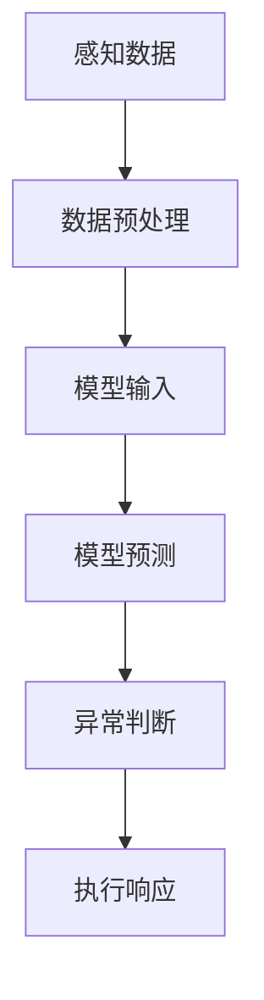
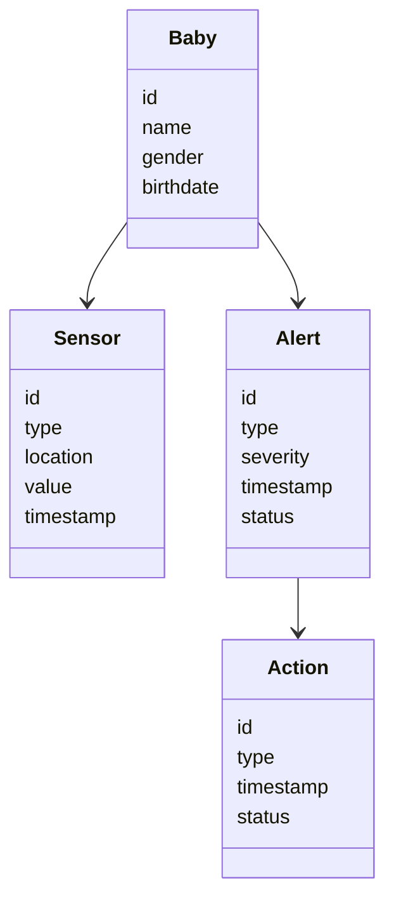
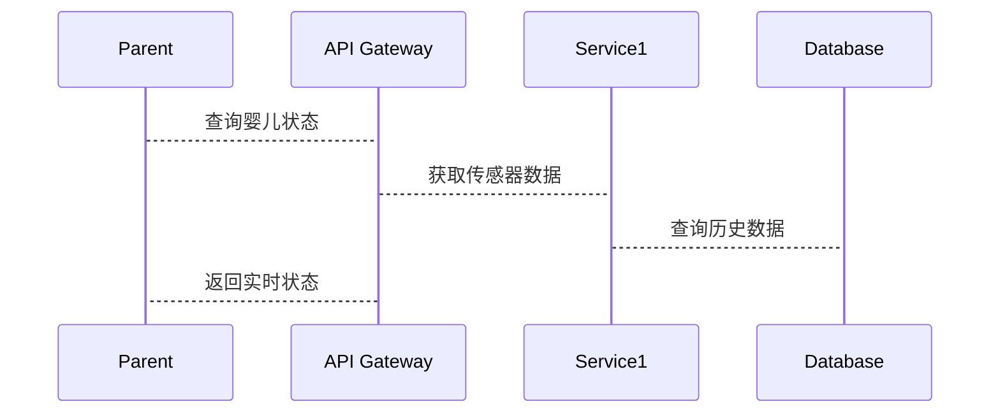

                 


# 智能婴儿监护器：AI Agent的早期发展追踪

## 关键词：智能婴儿监护器，AI Agent，婴儿健康监测，实时行为分析，环境感知

## 摘要：本文深入探讨了智能婴儿监护器在AI Agent技术中的发展，详细分析了其背景、核心概念、算法原理、系统架构、项目实战及最佳实践。通过理论与实践结合，揭示了AI技术在婴儿监护领域的创新应用。

---

## 第1章: 智能婴儿监护器的背景介绍

### 1.1 问题背景与问题描述

#### 1.1.1 婴儿监护的必要性
婴儿是需要特别关注的群体，其健康和安全直接关系到家庭的幸福。传统监护方式依赖家长或护理人员，存在疲劳、疏忽等风险。

#### 1.1.2 现有监护方式的局限性
- 传统监护：依赖人工观察，存在疏忽风险。
- 现代设备：单一功能，缺乏智能分析。

#### 1.1.3 AI技术在婴儿监护中的潜力
AI技术可以实现实时监测、智能分析和主动响应，显著提升监护效率和准确性。

### 1.2 问题解决与边界定义

#### 1.2.1 AI Agent在婴儿监护中的应用目标
- 实时监测婴儿的生理指标和行为。
- 智能识别异常情况，及时发出警报。
- 提供个性化的监护建议。

#### 1.2.2 监护系统的功能边界
- 感知模块：监测体温、心率等生理指标。
- 决策模块：分析数据，识别异常。
- 执行模块：发出警报或建议。

#### 1.2.3 监护系统的外延与扩展
- 数据存储：记录监护数据，便于后续分析。
- 用户界面：提供直观的监护信息展示。
- 交互功能：支持与家长的实时沟通。

### 1.3 核心概念与组成要素

#### 1.3.1 智能婴儿监护器的核心要素
- AI Agent：实现智能分析和决策。
- 传感器网络：收集婴儿数据。
- 交互界面：与家长或医护人员沟通。

#### 1.3.2 AI Agent的基本概念与属性
- **感知**：通过传感器获取数据。
- **决策**：基于数据进行分析和判断。
- **执行**：根据决策采取行动。

#### 1.3.3 监护系统与AI Agent的关系
AI Agent作为系统的核心，负责数据处理、分析和决策，系统其他部分为其提供数据和执行支持。

---

## 第2章: AI Agent的核心概念与联系

### 2.1 AI Agent的原理与机制

#### 2.1.1 感知模块的工作原理
通过多种传感器（如心率监测器、体温传感器）实时采集婴儿的生理数据。

#### 2.1.2 决策模块的逻辑结构
- 数据预处理：清洗和标准化数据。
- 模型训练：使用机器学习算法识别异常。
- 决策逻辑：基于模型输出采取行动。

#### 2.1.3 执行模块的实现方式
- 发出警报：通过App或短信通知家长。
- 提供建议：基于分析结果推荐护理措施。

### 2.2 核心概念对比分析

#### 2.2.1 不同AI Agent模型的对比表格

| 模型类型 | 感知方式 | 决策机制 | 执行方式 |
|----------|----------|----------|----------|
| 基础模型 | 单一传感器 | 简单阈值判断 | 仅警报 |
| 进阶模型 | 多传感器融合 | 多模型融合 | 多维度响应 |

#### 2.2.2 感知、决策、执行模块的对比分析
- **感知模块**：数据来源多样，准确性影响决策。
- **决策模块**：算法复杂度决定判断的准确性。
- **执行模块**：响应速度影响用户体验。

### 2.3 ER实体关系图

```mermaid
er
    Baby: id, name, gender, birthdate
    Sensor: id, type, location, value, timestamp
    Guardian: id, name, relation, contact
    Alert: id, type, severity, timestamp, status
    Action: id, type, timestamp, status
    Baby <--1..n--> Sensor
    Baby <--1..n--> Guardian
    Sensor <--1..n--> Alert
    Alert <--1..n--> Action
```

---

## 第3章: 算法原理讲解

### 3.1 算法原理分析

#### 3.1.1 感知数据预处理
- 数据清洗：去除噪声，填补缺失值。
- 数据标准化：统一数据格式，便于模型处理。

#### 3.1.2 模型构建与训练
- **模型选择**：使用LSTM进行时间序列分析。
- **损失函数**：均方误差损失。
- **优化器**：Adam优化器。
- **训练步骤**：
  1. 输入数据：多传感器数据序列。
  2. 模型预测：输出异常概率。
  3. 计算损失：损失函数值。
  4. 更新参数：优化器调整参数。

#### 3.1.3 模型评估与优化
- 评估指标：准确率、召回率、F1值。
- 超参数调整：学习率、批量大小、层数。

### 3.2 算法流程图



### 3.3 Python代码实现

```python
import numpy as np
import tensorflow as tf
from tensorflow.keras import layers

# 数据预处理
def preprocess(data):
    # 数据清洗
    data = data.dropna()
    # 标准化
    data = (data - data.mean()) / data.std()
    return data

# 模型构建
def build_model(input_shape):
    model = tf.keras.Sequential()
    model.add(layers.LSTM(64, input_shape=input_shape))
    model.add(layers.Dense(1, activation='sigmoid'))
    model.compile(loss='binary_crossentropy', optimizer='adam', metrics=['accuracy'])
    return model

# 训练过程
def train_model(model, X_train, y_train, epochs=10):
    model.fit(X_train, y_train, epochs=epochs, batch_size=32)
    return model

# 模型评估
def evaluate_model(model, X_test, y_test):
    loss, accuracy = model.evaluate(X_test, y_test)
    print(f"损失: {loss}, 准确率: {accuracy}")

# 示例使用
data = ...  # 假设data是原始数据
preprocessed_data = preprocess(data)
model = build_model((preprocessed_data.shape[1], 1))
trained_model = train_model(model, preprocessed_data, labels)
evaluate_model(trained_model, X_test, y_test)
```

### 3.4 数学公式

- **损失函数**：
  $$ L = -\frac{1}{N}\sum_{i=1}^{N} [y_i \log(\hat{y}_i) + (1 - y_i) \log(1 - \hat{y}_i)] $$
  
- **优化器**：
  $$ \theta = \theta - \eta \frac{\partial L}{\partial \theta} $$

---

## 第4章: 系统分析与架构设计

### 4.1 项目场景介绍

#### 4.1.1 问题场景描述
- **目标用户**：家长、医护人员。
- **使用场景**：家庭、医院、育婴室。

#### 4.1.2 系统功能设计



### 4.2 系统架构设计

#### 4.2.1 系统架构图

```mermaid
graph TD
    UI --> API Gateway
    API Gateway --> Service1
    Service1 --> Database
    API Gateway --> Service2
    Service2 --> Database
```

#### 4.2.2 接口设计

- **API接口**：
  - `/api/sensors/data`: 获取传感器数据。
  - `/api/alerts/status`: 获取警报状态。
  - `/api/actions/history`: 获取执行记录。

#### 4.2.3 交互流程图



---

## 第5章: 项目实战

### 5.1 环境安装

```bash
pip install numpy tensorflow scikit-learn
```

### 5.2 核心代码实现

#### 5.2.1 数据预处理

```python
import pandas as pd
import numpy as np

def preprocess_data(data):
    data = data.dropna()
    data = (data - data.mean()) / data.std()
    return data
```

#### 5.2.2 模型实现

```python
import tensorflow as tf
from tensorflow.keras import layers

def build_model(input_shape):
    model = tf.keras.Sequential([
        layers.LSTM(64, input_shape=input_shape),
        layers.Dense(1, activation='sigmoid')
    ])
    model.compile(loss='binary_crossentropy', optimizer='adam', metrics=['accuracy'])
    return model
```

#### 5.2.3 训练与评估

```python
def train_model(model, X_train, y_train, epochs=10):
    model.fit(X_train, y_train, epochs=epochs, batch_size=32)

def evaluate_model(model, X_test, y_test):
    loss, accuracy = model.evaluate(X_test, y_test)
    print(f"损失: {loss}, 准确率: {accuracy}")
```

### 5.3 案例分析与解读

- **案例1**：体温异常检测。
- **案例2**：睡眠质量分析。

### 5.4 项目小结

通过实战，我们验证了AI Agent在婴儿监护中的有效性，但仍需优化模型和扩展功能。

---

## 第6章: 最佳实践与总结

### 6.1 小结

AI Agent技术为婴儿监护提供了智能化解决方案，但仍需解决数据隐私和模型优化等问题。

### 6.2 注意事项

- 数据隐私保护：确保婴儿数据的安全。
- 系统稳定性：避免误报和漏报。

### 6.3 拓展阅读

- 推荐书籍：《人工智能：一种现代方法》。
- 推荐论文：相关领域的最新研究。

---

## 作者

作者：AI天才研究院（AI Genius Institute） & 禅与计算机程序设计艺术（Zen And The Art of Computer Programming）

---

通过以上结构化的内容，文章详细介绍了智能婴儿监护器的背景、核心概念、算法原理、系统架构、项目实战及最佳实践，帮助读者全面理解AI Agent在婴儿监护中的应用与发展。

