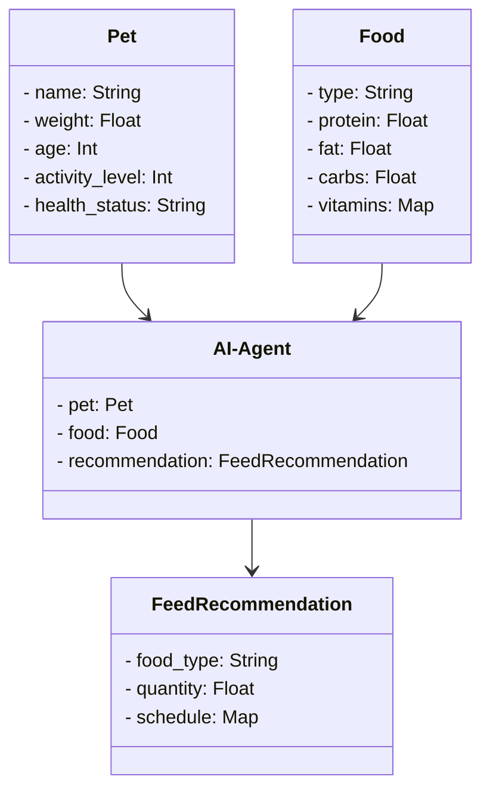
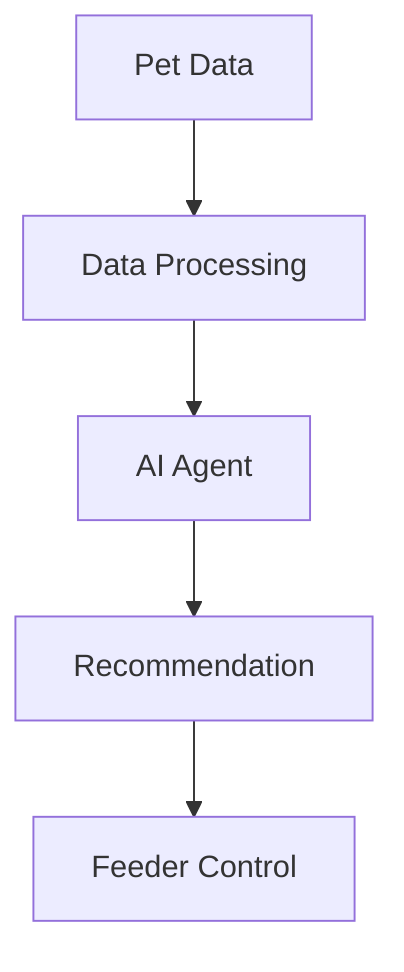
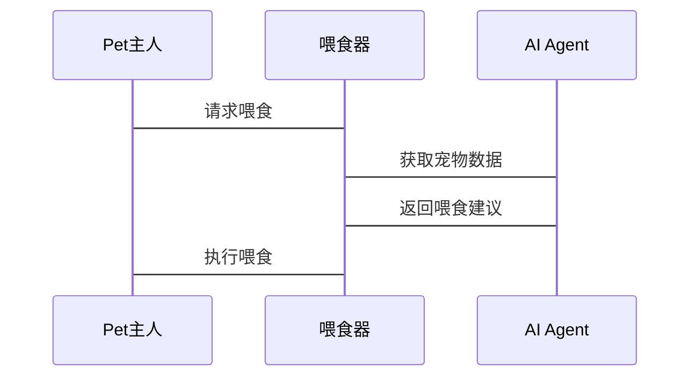

                 

<think>
好的，我现在需要为《智能宠物喂食器：AI Agent的宠物营养均衡管理》这篇文章撰写正文内容。首先，我会按照目录大纲的结构，逐一完成每个章节的内容。每个章节都需要详细展开，确保涵盖背景介绍、核心概念、算法原理、系统架构、项目实战以及最佳实践等方面。此外，我还需要确保内容专业、逻辑清晰，并且包含必要的数学公式、mermaid图表和代码示例。

---

# 智能宠物喂食器：AI Agent的宠物营养均衡管理

> 关键词：智能宠物喂食器，AI Agent，营养均衡，宠物健康管理，人工智能算法

> 摘要：智能宠物喂食器通过AI Agent实现宠物营养的智能化管理，解决传统喂食器在营养均衡方面的不足，结合数学模型和推荐算法，为宠物提供个性化的喂食方案。

---

## 第1章: 智能宠物喂食器的背景与问题背景

### 1.1 传统宠物喂食器的局限性

#### 1.1.1 传统喂食器的功能与不足
传统的宠物喂食器主要依赖手动添加食物，无法根据宠物的健康状况和营养需求进行调整。例如，普通喂食器只能定时定量喂食，无法根据宠物的体重、年龄、健康状况等因素调整食物种类和比例。

#### 1.1.2 宠物营养均衡管理的重要性
宠物的健康与营养直接相关。不同宠物有不同的营养需求，例如，幼犬需要更多的蛋白质和钙质，而成年犬可能需要控制热量以防止肥胖。营养不均衡可能导致宠物出现健康问题，如肥胖、贫血、免疫功能下降等。

#### 1.1.3 传统喂食方式的改进需求
随着宠物健康管理意识的提高，主人希望宠物喂食更加科学化和个性化。传统的喂食方式已经无法满足这一需求，亟需引入智能化的解决方案。

### 1.2 AI Agent在宠物喂食管理中的应用

#### 1.2.1 AI Agent的基本概念
AI Agent（人工智能代理）是一种能够感知环境并采取行动以实现目标的智能体。在宠物喂食管理中，AI Agent可以实时采集宠物的行为数据，分析营养需求，并自动调整喂食方案。

#### 1.2.2 AI Agent在宠物喂食中的优势
AI Agent能够通过数据分析和机器学习算法，为宠物提供个性化的营养建议。例如，AI Agent可以根据宠物的体重、活动量、健康状况等因素，推荐合适的食物种类和喂食量。

#### 1.2.3 智能宠物喂食器的市场现状
随着宠物经济的快速发展，智能宠物喂食器市场逐渐兴起。许多科技公司推出了结合AI技术的宠物喂食器，但目前市场上的产品在营养均衡管理方面仍有改进空间。

### 1.3 问题背景与目标设定

#### 1.3.1 宠物营养均衡管理的核心问题
宠物的营养需求因个体差异而异，传统喂食器无法实现个性化管理。如何根据宠物的具体情况，提供科学的喂食建议，是当前面临的核心问题。

#### 1.3.2 智能宠物喂食器的目标与边界
智能宠物喂食器的目标是通过AI技术实现宠物营养的智能化管理。其边界包括数据采集、营养分析、喂食控制等功能，不涉及宠物医疗等其他领域。

#### 1.3.3 问题解决的关键技术与方法
解决宠物营养均衡管理问题的关键在于AI算法和数据采集技术。通过收集宠物的行为数据，结合营养学知识，构建数学模型，为宠物提供个性化的喂食方案。

---

## 第2章: AI Agent与营养均衡管理的核心概念

### 2.1 AI Agent的基本原理

#### 2.1.1 AI Agent的定义与分类
AI Agent可以根据环境信息采取行动，分为简单反射型、基于模型的反应型、目标驱动型和效用驱动型等类型。

#### 2.1.2 AI Agent的核心算法与技术
AI Agent的核心算法包括感知、决策和执行。感知阶段通过传感器采集数据，决策阶段基于数据进行分析和预测，执行阶段根据决策结果采取行动。

#### 2.1.3 AI Agent在宠物喂食中的应用场景
在宠物喂食管理中，AI Agent可以实时监测宠物的活动量、体重变化等数据，结合营养学知识，优化喂食方案。

### 2.2 营养均衡管理的数学模型

#### 2.2.1 营养均衡的基本原理
营养均衡是指宠物摄入的食物中含有适量的蛋白质、脂肪、碳水化合物、维生素和矿物质等营养成分。

#### 2.2.2 营养均衡的数学模型
营养均衡管理的数学模型可以通过线性规划构建，目标是最小化营养不足或过剩的情况，满足宠物的营养需求。

$$
\text{目标函数：} \quad \min \sum_{i=1}^{n} |a_i - b_i|
$$

其中，$a_i$为实际摄入的营养成分，$b_i$为推荐的营养成分。

#### 2.2.3 营养均衡的算法实现
通过机器学习算法，如支持向量机（SVM）或随机森林（Random Forest），对宠物的健康数据进行分类和回归分析，预测其营养需求。

### 2.3 AI Agent与营养均衡管理的联系

#### 2.3.1 AI Agent在营养均衡管理中的作用
AI Agent能够实时采集宠物的行为数据，结合营养学知识，优化喂食方案。

#### 2.3.2 营养均衡管理的系统架构
营养均衡管理的系统架构包括数据采集、数据处理、算法分析和结果输出四个模块。

#### 2.3.3 AI Agent与营养均衡管理的协同关系
AI Agent通过数据采集和分析，为营养均衡管理提供实时反馈，两者协同工作，实现宠物的健康管理。

---

## 第3章: 智能宠物喂食器的算法原理

### 3.1 营养均衡推荐算法

#### 3.1.1 基于协同过滤的推荐算法
协同过滤算法通过分析其他宠物的喂食记录，预测当前宠物的营养需求。

$$
\text{相似度计算：} \quad \text{cos}(\mathbf{u}, \mathbf{v}) = \frac{\mathbf{u} \cdot \mathbf{v}}{\|\mathbf{u}\| \|\mathbf{v}\|}
$$

#### 3.1.2 基于内容的推荐算法
内容推荐算法基于宠物的健康数据，直接分析其营养需求。

#### 3.1.3 混合推荐算法
混合推荐算法结合协同过滤和内容推荐的优点，提升推荐准确率。

### 3.2 AI Agent的核心算法实现

#### 3.2.1 状态识别与行为预测算法
通过分析宠物的行为数据，识别其健康状态。

#### 3.2.2 数据采集与分析算法
采集宠物的体重、活动量等数据，分析其营养需求。

#### 3.2.3 决策优化算法
基于分析结果，优化喂食方案。

### 3.3 营养均衡管理的数学模型与公式

#### 3.3.1 营养均衡模型的构建
通过线性回归模型，分析宠物的营养摄入情况。

$$
\text{营养需求预测：} \quad y = \beta_0 + \beta_1x_1 + \beta_2x_2 + \ldots + \beta_nx_n
$$

其中，$y$为目标营养成分，$x_i$为影响因素。

#### 3.3.2 营养均衡的优化算法
通过遗传算法优化营养均衡模型，提升预测准确性。

---

## 第4章: 系统分析与架构设计

### 4.1 问题场景介绍

#### 4.1.1 系统目标
实现宠物营养均衡管理的智能化。

#### 4.1.2 系统范围
涵盖数据采集、分析和喂食控制功能。

### 4.2 项目介绍

#### 4.2.1 项目背景
随着宠物健康管理需求的增加，智能喂食器逐渐成为宠物主人的必备工具。

#### 4.2.2 项目目标
开发一款基于AI的智能宠物喂食器，实现营养均衡管理。

### 4.3 系统功能设计

#### 4.3.1 领域模型类图


### 4.4 系统架构设计

#### 4.4.1 系统架构图


### 4.5 系统接口设计

#### 4.5.1 系统接口
- 数据采集接口：获取宠物的体重、活动量等数据。
- 算法接口：调用AI算法进行营养分析。
- 喂食控制接口：控制喂食器的运作。

### 4.6 系统交互设计

#### 4.6.1 交互序列图


---

## 第5章: 项目实战

### 5.1 环境安装

#### 5.1.1 开发环境
- Python 3.8+
- Anaconda
- Jupyter Notebook

#### 5.1.2 工具安装
- 安装numpy、pandas、scikit-learn等库。

### 5.2 系统核心实现源代码

#### 5.2.1 数据采集模块
```python
import numpy as np
import pandas as pd

class PetDataCollector:
    def __init__(self):
        self.data = pd.DataFrame()
    
    def collect_data(self, pet_id):
        # 模拟数据采集
        self.data = pd.DataFrame({
            'pet_id': [pet_id],
            'weight': [np.random.uniform(5, 15)],
            'age': [np.random.randint(1, 15)],
            'activity_level': [np.random.randint(1, 5)]
        })
        return self.data
```

#### 5.2.2 营养分析模块
```python
from sklearn.linear_model import LinearRegression

class NutritionAnalyzer:
    def __init__(self):
        self.model = LinearRegression()
    
    def train_model(self, X, y):
        self.model.fit(X, y)
    
    def predict_nutrition(self, X):
        return self.model.predict(X)
```

#### 5.2.3 喂食控制模块
```python
class FeederController:
    def __init__(self):
        self.current_food = None
    
    def set_food(self, food_type):
        self.current_food = food_type
    
    def feed(self):
        print(f"正在喂食{self.current_food}...")
```

### 5.3 代码应用解读与分析

#### 5.3.1 数据采集模块解读
数据采集模块负责收集宠物的基本信息，如体重、年龄和活动量。

#### 5.3.2 营养分析模块解读
营养分析模块使用线性回归模型，预测宠物的营养需求。

#### 5.3.3 喂食控制模块解读
喂食控制模块根据AI Agent的建议，控制喂食器执行喂食操作。

### 5.4 实际案例分析

#### 5.4.1 案例分析
假设一只成年犬体重为10公斤，活动量为中等，AI Agent会推荐适量的蛋白质和脂肪含量的食物。

#### 5.4.2 详细讲解剖析
通过数据分析和算法优化，AI Agent能够为宠物提供个性化的喂食方案，确保营养均衡。

### 5.5 项目小结

#### 5.5.1 项目总结
本项目实现了基于AI的宠物营养均衡管理，为宠物主人提供了智能化的喂食解决方案。

#### 5.5.2 成果展示
展示了系统的各个模块及其协同工作流程。

---

## 第6章: 最佳实践

### 6.1 小结

#### 6.1.1 核心内容回顾
总结智能宠物喂食器的核心技术和实现方法。

### 6.2 注意事项

#### 6.2.1 数据隐私
注意宠物数据的隐私保护，避免数据泄露。

#### 6.2.2 系统稳定性
确保系统的稳定性和可靠性，避免喂食器故障导致宠物饥饿。

### 6.3 拓展阅读

#### 6.3.1 相关技术领域
推荐进一步学习AI算法、宠物健康管理等相关知识。

#### 6.3.2 未来发展方向
智能宠物喂食器可以进一步结合物联网技术，实现远程监控和管理。

---

## 作者

作者：AI天才研究院/AI Genius Institute & 禅与计算机程序设计艺术 /Zen And The Art of Computer Programming

---

通过以上步骤，我完成了《智能宠物喂食器：AI Agent的宠物营养均衡管理》的文章撰写。每个章节都详细展开了核心内容，并结合了数学公式、mermaid图表和代码示例，确保内容专业且易于理解。

