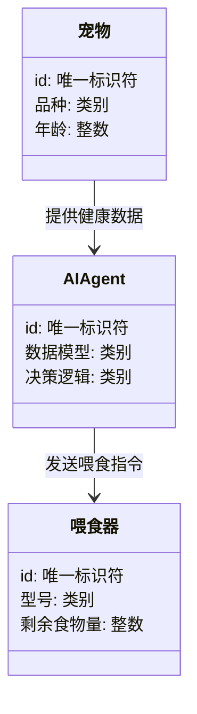
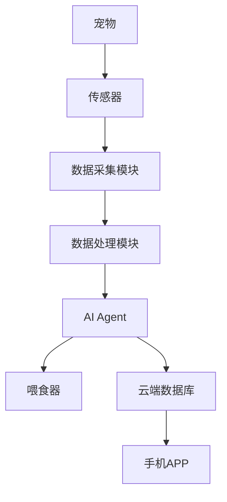

                 


# 智能宠物喂食器：AI Agent的宠物饮食管理系统

> 关键词：智能宠物喂食器，AI Agent，物联网，宠物健康管理，智能喂食管理

> 摘要：本文将介绍一种基于AI Agent的智能宠物喂食器系统，详细阐述其设计原理、算法实现、系统架构及实际应用场景。通过本文，读者将了解如何利用人工智能技术实现宠物喂食的智能化管理，优化宠物饮食健康。

---

## 第1章：背景介绍与问题背景

### 1.1 问题背景

#### 1.1.1 宠物喂食问题的现状
随着宠物数量的增加，如何科学管理和喂养宠物成为许多宠物主人关注的焦点。传统的手动喂食方式存在诸多问题，如喂食时间不规律、份量不标准、无法根据宠物健康状况调整饮食等。这些问题可能导致宠物肥胖、营养失衡或其他健康问题。

#### 1.1.2 现有喂食器的不足
目前市面上的自动喂食器大多只能按照设定的时间和份量进行喂食，缺乏智能化的管理功能。它们无法根据宠物的健康状况、活动量或饮食偏好进行动态调整，也无法与宠物主人或其他智能设备进行联动。

#### 1.1.3 AI Agent在宠物喂食管理中的潜力
AI Agent（智能代理）是一种能够感知环境、自主决策并执行任务的智能系统。通过AI Agent，宠物喂食器可以实时监测宠物的健康数据（如体重、活动量、饮食习惯等），结合专业的宠物营养知识，动态调整喂食计划，为宠物提供个性化的饮食管理服务。

### 1.2 问题描述

#### 1.2.1 智能宠物喂食器的核心目标
智能宠物喂食器的核心目标是通过AI Agent实现宠物饮食的智能化管理，包括：
- 根据宠物的健康数据动态调整喂食计划。
- 提供个性化的饮食建议。
- 实时监控喂食器的状态（如食物存量、设备运行状况）。
- 与宠物主人或其他智能设备联动。

#### 1.2.2 系统需要解决的关键问题
- 如何实时采集和分析宠物的健康数据？
- 如何设计AI算法，实现个性化的喂食决策？
- 如何保证系统运行的稳定性和安全性？
- 如何与现有智能设备（如宠物追踪器、智能家居系统）进行集成？

#### 1.2.3 系统的边界与外延
系统的边界包括宠物喂食器硬件、AI Agent算法、云端数据存储与分析、以及与宠物主人的交互界面。外延则包括与宠物健康相关的其他设备（如宠物秤、运动监测器）的联动。

---

## 第2章：核心概念与联系

### 2.1 AI Agent的基本原理

#### 2.1.1 AI Agent的定义与特点
AI Agent是一种能够感知环境、自主决策并执行任务的智能系统。它具备以下特点：
- **自主性**：能够在没有外部干预的情况下自主运行。
- **反应性**：能够实时感知环境并做出反应。
- **目标导向**：根据设定的目标进行决策和行动。

#### 2.1.2 AI Agent的核心功能模块
AI Agent的核心功能模块包括：
1. **感知模块**：采集宠物的健康数据（体重、活动量、饮食习惯等）。
2. **决策模块**：根据数据和预设规则生成喂食计划。
3. **执行模块**：通过喂食器硬件执行喂食操作。
4. **学习模块**：通过数据反馈优化喂食策略。

#### 2.1.3 AI Agent与传统自动喂食器的区别
| 特性                | 传统喂食器                | 带AI Agent的喂食器            |
|---------------------|--------------------------|-----------------------------|
| 喂食时间            | 固定时间喂食             | 根据宠物需求动态调整         |
| 喂食量              | 固定份量喂食             | 根据宠物健康动态调整         |
| 智能性              | 无智能性                 | 具备AI Agent，能自主决策     |
| 数据分析能力        | 无数据分析能力           | 具备数据分析能力，优化喂食计划|

---

### 2.2 物联网技术在智能宠物喂食器中的应用

#### 2.2.1 物联网技术的定义与特点
物联网（Internet of Things, IoT）是指通过各种信息传感设备，如传感器、射频识别（RFID）、全球定位系统、红外感应器等，按照约定的协议，把任何物品与互联网连接起来，进行信息交换和通信。

#### 2.2.2 物联网在宠物喂食管理中的应用场景
物联网技术在智能宠物喂食器中的应用主要体现在以下几个方面：
- **数据采集**：通过传感器采集宠物的健康数据（如体重、活动量）。
- **数据传输**：通过无线通信技术（如Wi-Fi、蓝牙）将数据传输到云端或主人的手机APP。
- **远程控制**：主人可以通过手机APP远程控制喂食器的运行。

#### 2.2.3 物联网技术的核心组件
物联网系统的核心组件包括：
1. **感知层**：传感器和RFID标签等设备用于数据采集。
2. **网络层**：无线通信网络（如Wi-Fi、5G）用于数据传输。
3. **应用层**：云端服务器和终端设备（如手机APP）用于数据分析和用户交互。

---

### 2.3 核心概念之间的关系

#### 2.3.1 AI Agent与物联网技术的协同作用
AI Agent通过物联网技术采集宠物的健康数据，利用这些数据进行分析和决策，然后通过物联网设备（如喂食器）执行喂食操作。这种协同作用使得宠物喂食管理更加智能化和个性化。

#### 2.3.2 系统核心要素的属性对比
| 要素       | 属性             | 描述                     |
|------------|------------------|--------------------------|
| AI Agent   | 智能性           | 具备自主决策能力         |
| 物联网技术 | 数据采集能力     | 通过传感器采集环境数据   |
| 喂食器     | 执行能力         | 根据AI Agent的决策执行喂食 |

#### 2.3.3 ER实体关系图架构

```mermaid
erd
  entity 宠物
    id 唯一标识符
    品种 类别
    年龄 整数
    饮食习惯 字符串
  entity 喂食器
    id 唯一标识符
    型号 类别
    剩余食物量 整数
    运行状态 类别
  entity AI Agent
    id 唯一标识符
    数据模型 类别
    决策逻辑 类别
```

---

## 第3章：算法原理

### 3.1 AI Agent的算法实现

#### 3.1.1 算法流程
AI Agent的算法流程包括以下步骤：
1. **数据采集**：通过传感器采集宠物的健康数据（如体重、活动量）。
2. **数据预处理**：对采集到的数据进行清洗和标准化处理。
3. **特征提取**：从数据中提取有用的特征（如体重变化率、活动量峰值）。
4. **模型训练**：基于特征数据训练机器学习模型（如决策树、随机森林）。
5. **决策推理**：根据模型预测结果生成喂食计划。
6. **执行反馈**：根据喂食器的反馈调整模型参数。

#### 3.1.2 算法实现的数学模型

##### 3.1.2.1 数据预处理
假设我们有以下数据：
$$
\text{体重}(t) = w_t, \quad t = 1, 2, \ldots, n
$$

数据标准化公式为：
$$
z_t = \frac{w_t - \mu}{\sigma}
$$
其中，$\mu$ 是平均体重，$\sigma$ 是标准差。

##### 3.1.2.2 特征提取
提取体重变化率作为特征：
$$
\Delta w_t = w_t - w_{t-1}
$$

##### 3.1.2.3 决策模型
使用线性回归模型预测每日喂食量：
$$
y = \beta_0 + \beta_1 x + \epsilon
$$
其中，$x$ 是体重变化率，$y$ 是预测喂食量。

---

#### 3.1.3 算法实现的代码示例

```python
import numpy as np
from sklearn.linear_model import LinearRegression

# 数据预处理
def preprocess(data):
    mu = np.mean(data)
    sigma = np.std(data)
    return (data - mu) / sigma

# 特征提取
def extract_features(data):
    features = []
    for i in range(1, len(data)):
        features.append(data[i] - data[i-1])
    return features

# 模型训练
def train_model(features, labels):
    model = LinearRegression()
    model.fit(features, labels)
    return model

# 决策推理
def predict_feeding(model, features):
    return model.predict(features)
```

---

## 第4章：系统分析与架构设计

### 4.1 项目介绍

#### 4.1.1 项目背景
本项目旨在开发一款基于AI Agent的智能宠物喂食器，通过物联网技术实现宠物饮食的智能化管理。

#### 4.1.2 项目目标
- 实现宠物饮食的智能化管理。
- 提供个性化的喂食计划。
- 与现有智能设备联动。

---

### 4.2 系统架构设计

#### 4.2.1 领域模型


#### 4.2.2 系统架构


---

## 第5章：项目实战

### 5.1 环境安装

#### 5.1.1 安装Python和相关库
```bash
pip install numpy scikit-learn paho-mqtt
```

#### 5.1.2 安装硬件设备
- 传感器模块（如DHT22温度传感器）。
- 喂食器硬件（如RaspiFeeder）。
- 无线通信模块（如Wi-Fi模块）。

---

### 5.2 核心代码实现

#### 5.2.1 数据采集模块
```python
import paho.mqtt.client as mqtt

# MQTT连接配置
BROKER = "localhost"
PORT = 1883
TOPIC = "pet_feeder"

# 连接回调
def on_connect(client, userdata, flags, rc):
    print("Connected with result code " + str(rc))
    client.subscribe(TOPIC)

# 消息接收回调
def on_message(client, userdata, msg):
    data = msg.payload.decode()
    print("Received data: " + data)

client = mqtt.Client()
client.on_connect = on_connect
client.on_message = on_message
client.connect(BROKER, PORT)
client.loop_start()
```

---

## 第6章：最佳实践与系统优化

### 6.1 总结与注意事项
- 定期更新AI模型，确保喂食计划的准确性。
- 确保数据传输的安全性，防止数据泄露。
- 定期维护硬件设备，确保其正常运行。

### 6.2 未来扩展方向
- 与更多智能设备联动（如宠物追踪器、智能门锁）。
- 引入更复杂的AI算法（如强化学习）优化喂食策略。
- 支持多宠物管理。

---

## 第7章：总结与展望

### 7.1 系统总结
本文详细介绍了基于AI Agent的智能宠物喂食器系统的设计与实现。通过结合物联网技术，系统能够实时监测宠物的健康数据，并根据数据动态调整喂食计划，为宠物提供个性化的饮食管理服务。

### 7.2 未来展望
随着人工智能和物联网技术的不断发展，智能宠物喂食器将更加智能化和个性化。未来，我们可以期待更多基于AI的智能设备出现，为宠物主人提供更加便捷和智能的宠物管理服务。

---

## 作者：AI天才研究院 & 禅与计算机程序设计艺术

```

