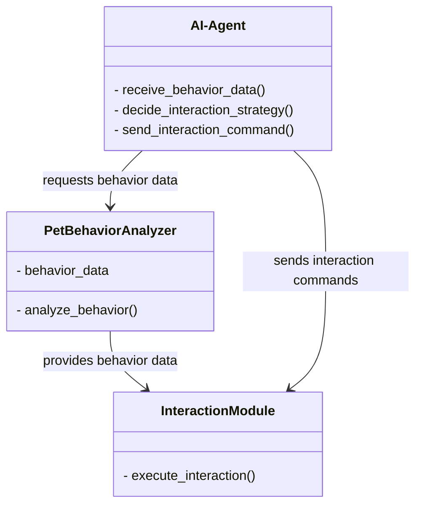
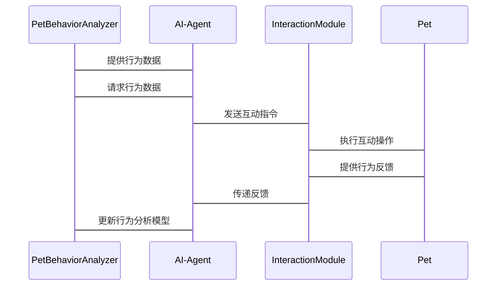

                 


# 智能宠物玩具：AI Agent的互动模式自适应

> 关键词：智能宠物玩具，AI Agent，自适应互动模式，强化学习，系统架构设计，宠物行为管理

> 摘要：随着人工智能技术的不断发展，智能宠物玩具逐渐成为宠物主人关注的焦点。本文深入探讨了AI Agent在智能宠物玩具中的应用，重点分析了自适应互动模式的核心算法原理、系统架构设计以及实际项目实现。通过详细的技术分析和案例解读，本文为读者提供了从理论到实践的全面指导，帮助理解并实现智能宠物玩具的自适应互动功能。

---

## 第1章 智能宠物玩具的背景与现状

### 1.1 问题背景

#### 1.1.1 宠物行为管理的挑战
宠物作为人类的伙伴，其行为管理一直是宠物主人面临的难题。传统宠物玩具的功能单一，无法根据宠物的行为动态调整互动策略，导致宠物兴趣下降，互动效果不佳。

#### 1.1.2 传统宠物玩具的局限性
传统宠物玩具通常仅提供固定的互动方式，缺乏智能化和个性化。例如，自动摇晃的玩具球只能提供机械式的互动，无法根据宠物的具体行为做出反馈。

#### 1.1.3 智能化宠物玩具的需求
随着科技的进步，宠物主人对智能化宠物玩具的需求日益增长。通过引入AI技术，智能宠物玩具可以实现个性化的互动模式，提升宠物的娱乐性和训练效果。

### 1.2 问题描述

#### 1.2.1 宠物互动模式的单一性
传统宠物玩具的互动模式固定，无法满足宠物多样化的互动需求，导致宠物容易感到乏味。

#### 1.2.2 用户对宠物行为引导的需求
宠物主人希望通过玩具引导宠物进行特定行为的训练，例如定点如厕、减少 aggression 等。传统玩具无法实现这些复杂的行为引导。

#### 1.2.3 智能化互动的潜在价值
智能化宠物玩具可以通过AI技术实现个性化的互动模式，提升宠物的训练效果和娱乐体验，同时为宠物主人提供便捷的管理工具。

### 1.3 智能宠物玩具的定义与特点

#### 1.3.1 智能宠物玩具的定义
智能宠物玩具是一种结合了人工智能技术的宠物玩具，能够通过传感器和AI算法实现与宠物的智能互动。

#### 1.3.2 智能宠物玩具的核心特点
- **智能化**：通过AI技术实现自适应互动模式，能够根据宠物的行为动态调整互动策略。
- **个性化**：根据宠物的个体特征和行为习惯，提供个性化的互动体验。
- **可扩展性**：支持多种互动模式和训练场景，能够适应不同宠物的需求。

#### 1.3.3 与传统宠物玩具的区别
传统宠物玩具仅提供固定的互动方式，而智能宠物玩具能够通过AI技术实现动态调整的互动策略，提供更加丰富和个性化的互动体验。

### 1.4 AI Agent在智能宠物玩具中的应用

#### 1.4.1 AI Agent的基本概念
AI Agent（人工智能代理）是指能够感知环境、自主决策并执行任务的智能体。在智能宠物玩具中，AI Agent负责分析宠物的行为数据，制定互动策略。

#### 1.4.2 AI Agent在宠物互动中的作用
- **行为分析**：通过传感器采集宠物的行为数据，分析其兴趣点和情绪状态。
- **互动策略制定**：根据分析结果，动态调整互动模式，例如增加或减少互动的频率、强度或类型。
- **实时反馈**：在互动过程中实时反馈宠物的行为，帮助其建立正确的行为模式。

#### 1.4.3 智能宠物玩具的市场现状与趋势
当前，智能宠物玩具市场逐渐兴起，但大多数产品仍处于初级阶段，未来随着AI技术的不断发展，智能宠物玩具将更加智能化和个性化。

## 第2章 AI Agent与自适应互动模式的核心概念

### 2.1 AI Agent的基本原理

#### 2.1.1 AI Agent的定义与分类
AI Agent可以分为简单反射型AI Agent和复杂决策型AI Agent。简单反射型AI Agent基于预设的规则做出反应，而复杂决策型AI Agent则能够通过学习和推理做出决策。

#### 2.1.2 AI Agent的核心功能
- **感知环境**：通过传感器采集宠物的行为数据，例如动作频率、持续时间、行为类型等。
- **决策制定**：根据感知数据，分析宠物的行为状态，制定互动策略。
- **执行操作**：根据决策结果，控制玩具的运动方式，例如旋转、振动、发声等。

#### 2.1.3 AI Agent与智能宠物玩具的结合
在智能宠物玩具中，AI Agent负责分析宠物的行为数据，制定互动策略，并通过玩具的运动方式与宠物进行互动。

### 2.2 自适应互动模式的定义与特点

#### 2.2.1 自适应互动模式的定义
自适应互动模式是指根据宠物的行为动态调整互动策略，以提高互动的有效性和趣味性。

#### 2.2.2 自适应互动模式的核心特征
- **动态调整**：根据宠物的行为实时调整互动策略。
- **个性化**：针对不同宠物的行为特点，提供个性化的互动体验。
- **反馈机制**：通过实时反馈宠物的行为，帮助其建立正确的行为模式。

#### 2.2.3 自适应互动模式与传统互动模式的对比
传统互动模式基于固定的规则进行互动，而自适应互动模式能够根据宠物的行为动态调整互动策略，提供更加灵活和个性化的互动体验。

### 2.3 AI Agent与自适应互动模式的关系

#### 2.3.1 AI Agent在自适应互动中的角色
AI Agent负责分析宠物的行为数据，制定互动策略，并通过玩具的运动方式与宠物进行互动。

#### 2.3.2 自适应互动模式对AI Agent的需求
自适应互动模式需要AI Agent具备实时感知、动态决策和快速执行的能力。

#### 2.3.3 两者结合的实现方式
通过AI Agent对宠物行为的实时分析，动态调整互动策略，实现自适应互动模式。

### 2.4 核心概念对比表

| 比较项 | AI Agent | 自适应互动模式 |
|--------|----------|----------------|
| 定义   | AI Agent 是具有自主决策能力的智能体 | 自适应互动模式是根据环境变化动态调整的互动方式 |
| 核心功能 | 数据采集、决策制定、执行操作 | 动态调整互动策略、实时反馈、个性化互动 |
| 应用场景 | 智能宠物玩具、个性化推荐、智能助手 | 智能宠物玩具、教育互动

---

## 第3章 自适应互动模式的核心算法原理

### 3.1 强化学习算法

#### 3.1.1 强化学习的基本原理
强化学习是一种通过试错机制，通过奖励或惩罚来优化决策策略的算法。在智能宠物玩具中，强化学习可以用于训练宠物完成特定行为。

#### 3.1.2 强化学习在自适应互动中的应用
通过强化学习算法，AI Agent可以根据宠物的行为反馈，动态调整互动策略，例如增加或减少互动的频率和强度。

#### 3.1.3 强化学习的数学模型
强化学习的核心是通过状态-动作-奖励的三元组来优化决策策略。状态表示当前环境的状态，动作是AI Agent采取的行动，奖励是对动作的反馈。

### 3.2 自适应算法

#### 3.2.1 自适应算法的基本原理
自适应算法是一种能够根据环境变化动态调整参数的算法。在智能宠物玩具中，自适应算法可以用于调整互动模式，以适应宠物的行为变化。

#### 3.2.2 自适应算法在自适应互动中的应用
通过自适应算法，AI Agent可以根据宠物的行为数据，动态调整互动策略，例如改变互动的频率、强度或类型。

#### 3.2.3 自适应算法的数学模型
自适应算法通常基于反馈机制，通过不断调整参数来优化决策策略。

### 3.3 算法实现的Python代码示例

```python
import numpy as np

# 强化学习算法示例
class ReinforcementLearningAgent:
    def __init__(self, actions):
        self.actions = actions
        self.learning_rate = 0.1
        self.discount_factor = 0.9
        self.q_values = np.zeros(len(actions))

    def choose_action(self):
        # 随机选择一个动作
        return np.random.choice(self.actions)

    def update_q_values(self, current_state, action, reward, next_state):
        # 更新Q值
        self.q_values[action] = self.learning_rate * (reward + self.discount_factor * max(self.q_values)) + (1 - self.learning_rate) * self.q_values[action]

# 自适应算法示例
class AdaptiveInteraction:
    def __init__(self, initial_parameters):
        self.parameters = initial_parameters

    def adjust_parameters(self, feedback):
        # 根据反馈调整参数
        self.parameters = self.parameters * (1 + feedback * 0.1)

# 示例使用
actions = [0, 1, 2]
agent = ReinforcementLearningAgent(actions)
interaction = AdaptiveInteraction(initial_parameters=[1, 1, 1])

for _ in range(10):
    action = agent.choose_action()
    reward = np.random.random()
    feedback = np.random.random()
    agent.update_q_values(current_state, action, reward, next_state)
    interaction.adjust_parameters(feedback)
```

### 3.4 算法实现的详细解读

#### 3.4.1 强化学习算法的实现细节
- **状态空间**：表示宠物行为的状态，例如宠物是否表现出兴趣。
- **动作空间**：AI Agent可以采取的互动方式，例如旋转、振动、发声等。
- **奖励机制**：根据宠物的行为反馈给予奖励或惩罚，例如当宠物表现出兴趣时给予奖励。

#### 3.4.2 自适应算法的实现细节
- **参数调整**：根据宠物的行为反馈动态调整互动策略的参数，例如互动频率、互动强度等。
- **反馈机制**：通过实时反馈宠物的行为，动态调整互动策略。

#### 3.4.3 算法实现的代码分析
通过Python代码示例可以看出，强化学习算法和自适应算法在智能宠物玩具中的实现主要涉及状态、动作、奖励和反馈的处理。通过不断调整参数和优化Q值，实现自适应互动模式。

---

## 第4章 系统分析与架构设计

### 4.1 系统功能设计

#### 4.1.1 领域模型
通过领域模型类图，展示系统中各模块之间的关系和功能。例如，AI Agent模块负责分析宠物行为，互动模块负责执行互动操作。

#### 4.1.2 领域模型类图


### 4.2 系统架构设计

#### 4.2.1 系统架构图
通过系统架构图，展示系统的整体架构，包括数据采集层、AI处理层和互动执行层。


#### 4.2.2 交互流程图
通过交互流程图，展示系统中各模块之间的交互流程，例如AI Agent如何根据宠物行为数据调整互动策略。



### 4.3 系统接口设计

#### 4.3.1 数据接口
- **输入接口**：从传感器获取宠物的行为数据。
- **输出接口**：向互动模块发送互动指令。

#### 4.3.2 API设计
- **API名称**：`/api/analyze_behavior`
- **功能**：分析宠物的行为数据，返回互动策略。
- **请求参数**：宠物的行为数据。
- **返回参数**：互动策略。

### 4.4 交互流程图分析

通过交互流程图，展示系统中各模块之间的交互流程，例如AI Agent如何根据宠物行为数据调整互动策略。

---

## 第5章 项目实战与实现细节

### 5.1 项目实战环境安装

#### 5.1.1 系统环境要求
- **操作系统**：Windows/Mac/Linux
- **Python版本**：Python 3.8及以上
- **依赖库**：numpy、scikit-learn、matplotlib

#### 5.1.2 安装依赖
```bash
pip install numpy scikit-learn matplotlib
```

### 5.2 核心代码实现

#### 5.2.1 AI Agent实现
```python
class AIAgent:
    def __init__(self):
        self.behavior_data = []
        self.interaction_strategy = "default"

    def analyze_behavior(self, data):
        self.behavior_data.append(data)
        # 分析行为数据，调整互动策略
        if len(self.behavior_data) > 10:
            self.interaction_strategy = self.choose_best_strategy()

    def choose_best_strategy(self):
        # 假设策略1、2、3是不同的互动模式
        return ["strategy1", "strategy2", "strategy3"][np.random.randint(3)]
```

#### 5.2.2 自适应互动实现
```python
class AdaptiveInteraction:
    def __init__(self):
        self.strategy = "default"

    def adjust_strategy(self, feedback):
        # 根据反馈调整互动策略
        if feedback > 0.8:
            self.strategy = "intensify"
        elif feedback < 0.2:
            self.strategy = "weaken"
        else:
            self.strategy = "balanced"
```

### 5.3 案例分析与实现解读

#### 5.3.1 案例分析
通过具体案例分析，展示如何根据宠物的行为数据动态调整互动策略。

#### 5.3.2 实现解读
详细解读代码实现，包括AI Agent的行为分析模块和自适应互动模块的实现细节。

### 5.4 项目小结

---

## 第6章 最佳实践与小结

### 6.1 最佳实践

#### 6.1.1 系统设计
- **模块化设计**：确保系统模块清晰，便于维护和扩展。
- **数据采集**：确保行为数据的准确性和实时性。

#### 6.1.2 算法优化
- **算法选择**：根据具体需求选择合适的算法，例如强化学习和自适应算法。
- **参数调整**：根据实际效果动态调整算法参数，优化互动策略。

### 6.2 小结

通过本文的详细讲解，读者可以系统地了解智能宠物玩具中AI Agent的互动模式自适应技术。从理论到实践，本文提供了全面的指导，帮助读者实现个性化的自适应互动模式。

### 6.3 注意事项

- **数据隐私**：确保宠物行为数据的安全和隐私。
- **用户体验**：确保互动体验的舒适性和趣味性。

### 6.4 拓展阅读

- **强化学习**：深入学习强化学习的算法和应用。
- **自适应算法**：研究自适应算法在其他领域的应用。

---

## 作者：AI天才研究院/AI Genius Institute & 禅与计算机程序设计艺术/Zen And The Art of Computer Programming

