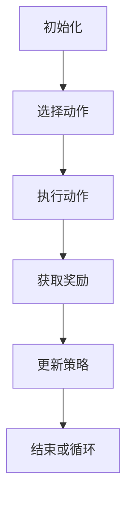
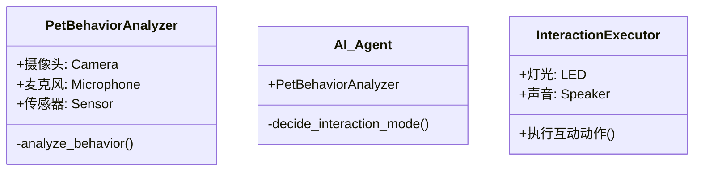
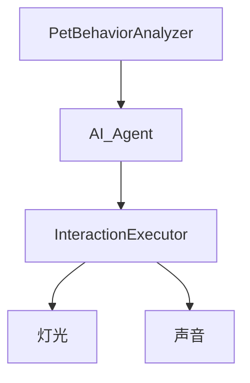

                 


# 智能宠物玩具：AI Agent的互动模式调整

> 关键词：智能宠物玩具，AI Agent，互动模式，机器学习，情感计算，行为分析，多模态数据

> 摘要：本文详细探讨了智能宠物玩具中AI Agent的互动模式调整技术。通过分析宠物行为数据，结合机器学习和多模态数据融合技术，提出了动态调整互动模式的实现方法，并通过实际案例展示了其在提升宠物互动体验中的应用价值。

---

## 正文部分

---

### 第一部分: 智能宠物玩具与AI Agent概述

#### 第1章: 背景介绍

##### 1.1 问题背景

###### 1.1.1 宠物行为分析与互动需求

宠物是人类生活中重要的伴侣，其行为模式多样且复杂。不同宠物（如猫、狗）有不同的性格特征和行为习惯，传统的宠物玩具无法满足个性化互动需求。例如，有些宠物喜欢追逐光线或声音，而另一些则更倾向于挖掘或攀爬。

###### 1.1.2 智能宠物玩具的定义与目标

智能宠物玩具是指能够通过传感器、摄像头或其他智能设备感知宠物行为，并通过AI技术动态调整互动模式的玩具。其目标是通过智能化手段，提供个性化的互动体验，增强宠物的娱乐性和幸福感。

###### 1.1.3 AI Agent在宠物互动中的作用

AI Agent（智能体）是实现智能宠物玩具的核心技术。它能够实时感知宠物的行为数据，分析其情绪和需求，并通过调整互动模式（如灯光、声音、运动轨迹）来满足宠物的互动需求。

##### 1.2 问题描述

###### 1.2.1 宠物行为模式的复杂性

宠物的行为受到多种因素影响，包括情绪、健康状况、环境刺激等。传统玩具无法理解这些复杂因素，导致互动单一且缺乏针对性。

###### 1.2.2 传统宠物玩具的局限性

传统宠物玩具通常只能提供固定模式的互动，无法根据宠物的实时行为进行调整。例如，激光笔只能以固定速度移动，无法根据宠物的追逐速度或兴趣变化进行调整。

###### 1.2.3 智能化互动的需求与挑战

随着人工智能技术的发展，宠物主人希望宠物玩具能够更加智能化，能够理解宠物的需求并提供个性化的互动体验。然而，如何在复杂环境中实现精准的行为分析和模式调整，是当前技术面临的主要挑战。

##### 1.3 问题解决

###### 1.3.1 AI Agent的核心功能

AI Agent需要具备以下核心功能：
- 数据采集与感知
- 行为分析与模式识别
- 互动模式调整

###### 1.3.2 互动模式调整的实现路径

互动模式调整需要结合宠物的行为数据和环境数据，通过机器学习算法预测宠物的需求，并动态调整互动策略。

###### 1.3.3 技术与产品的结合

AI Agent需要与硬件设备（如摄像头、传感器）结合，实现数据采集、分析和反馈的闭环。

##### 1.4 边界与外延

###### 1.4.1 智能宠物玩具的适用范围

智能宠物玩具适用于各类宠物，但需要根据宠物的种类和性格进行定制化设计。

###### 1.4.2 AI Agent的局限性与限制

目前的AI Agent技术在复杂环境下的行为预测和模式调整能力有限，仍需进一步优化。

###### 1.4.3 与其他智能设备的协同

智能宠物玩具可以与其他智能家居设备协同工作，例如通过与智能音箱联动，提供更加丰富的互动形式。

##### 1.5 概念结构与核心要素

###### 1.5.1 智能宠物玩具的系统架构

智能宠物玩具的系统架构包括：
- 数据采集模块（摄像头、麦克风）
- 数据处理模块（AI Agent）
- 互动执行模块（灯光、声音）

###### 1.5.2 AI Agent的功能模块

AI Agent的功能模块包括：
- 感知模块（数据采集与特征提取）
- 决策模块（行为分析与模式调整）
- 执行模块（互动反馈）

###### 1.5.3 互动模式调整的逻辑流程

互动模式调整的逻辑流程包括：
1. 数据采集与预处理
2. 行为分析与需求预测
3. 互动模式调整与反馈

---

### 第二部分: AI Agent的核心概念与原理

#### 第2章: AI Agent的基本原理

##### 2.1 AI Agent的感知机制

###### 2.1.1 数据采集与处理

AI Agent通过摄像头、麦克风等设备采集宠物的行为数据，包括视觉数据（图像/视频）、听觉数据（声音/语音）和行为数据（动作/传感器）。

###### 2.1.2 行为分析与模式识别

基于机器学习算法，AI Agent对宠物的行为数据进行分析，识别其情绪、兴趣和行为模式。例如，通过图像识别技术识别宠物的姿势和动作。

###### 2.1.3 情感计算与反馈

AI Agent通过情感计算技术分析宠物的情绪状态，并根据其需求调整互动模式。例如，当宠物表现出焦虑时，AI Agent可以通过舒缓的声音或节奏缓慢的互动来安抚宠物。

##### 2.2 AI Agent的决策机制

###### 2.2.1 基于规则的决策

基于预设的规则库，AI Agent可以根据宠物的行为特征进行模式匹配，例如当宠物表现出追逐行为时，AI Agent可以通过动态调整激光笔的运动轨迹来引导宠物的互动。

###### 2.2.2 基于机器学习的决策

通过监督学习或强化学习算法，AI Agent可以自适应地优化互动策略。例如，通过强化学习训练AI Agent在不同情境下选择最优的互动模式。

###### 2.2.3 多目标优化的决策模型

AI Agent需要在多个目标之间进行权衡，例如在提高互动趣味性的同时，保证宠物的身心健康。这需要建立多目标优化模型，并通过动态权重调整来实现。

##### 2.3 AI Agent的执行机制

###### 2.3.1 互动模式的动态调整

AI Agent根据分析结果动态调整互动模式，例如改变灯光的颜色和亮度、调整声音的频率和音量、改变玩具的运动速度和方向。

###### 2.3.2 反馈机制与自适应学习

通过实时反馈机制，AI Agent可以不断优化互动策略。例如，当宠物表现出更高的互动兴趣时，AI Agent可以记录并强化这种模式；当宠物表现出不感兴趣时，AI Agent可以尝试其他互动形式。

###### 2.3.3 系统的实时响应与优化

AI Agent需要具备实时响应能力，能够在毫秒级别内完成数据处理和互动模式调整，确保互动的流畅性和实时性。

#### 第3章: 多模态数据融合与分析

##### 3.1 多模态数据的采集

###### 3.1.1 视觉数据采集（图像/视频）

通过摄像头采集宠物的视觉数据，包括宠物的姿势、表情和动作。

###### 3.1.2 听觉数据采集（声音/语音）

通过麦克风采集宠物的声音，例如宠物的叫声、呼吸声和环境音。

###### 3.1.3 行为数据采集（动作/传感器）

通过传感器采集宠物的运动数据，例如宠物的运动速度、加速度和位置。

##### 3.2 数据融合与处理

###### 3.2.1 数据清洗与预处理

对采集到的数据进行去噪和标准化处理，确保数据的质量和一致性。

###### 3.2.2 数据特征提取

通过特征提取算法（如主成分分析）提取数据的关键特征，降低数据维度。

###### 3.2.3 数据融合算法

采用多模态数据融合算法（如融合视觉和听觉数据）进行综合分析，提高行为识别的准确性。

##### 3.3 数据分析与模式识别

###### 3.3.1 基于深度学习的模式识别

使用深度学习模型（如卷积神经网络）对宠物的行为模式进行识别和分类。

###### 3.3.2 基于规则的模式匹配

通过预设的规则库对宠物行为进行模式匹配，例如识别宠物的攻击性行为或友好行为。

###### 3.3.3 情感计算与行为预测

通过情感计算技术预测宠物的情绪状态，并结合行为数据进行行为预测。

---

### 第三部分: 算法原理

#### 第4章: 强化学习与自适应算法

##### 4.1 强化学习算法

###### 4.1.1 算法原理

强化学习是一种基于奖励机制的机器学习方法，通过不断试错来优化决策策略。在智能宠物玩具中，AI Agent可以通过强化学习优化互动模式。

###### 4.1.2 算法流程



###### 4.1.3 代码实现

```python
import numpy as np
import random

class AI_Agent:
    def __init__(self, action_space):
        self.action_space = action_space
        self.reward_history = []
    
    def choose_action(self, state):
        # 随机选择动作（简化版）
        return random.choice(self.action_space)
    
    def update_policy(self, reward):
        self.reward_history.append(reward)
        # 简单的策略更新方法（可根据具体场景优化）
        pass
```

##### 4.2 自适应算法

###### 4.2.1 算法原理

自适应算法是一种动态调整参数的算法，能够根据环境变化和反馈结果优化互动模式。

###### 4.2.2 代码实现

```python
def adaptive_algorithm(current_mode, feedback):
    # 根据反馈调整模式参数
    if feedback == 'positive':
        return current_mode + 1
    elif feedback == 'negative':
        return current_mode - 1
    else:
        return current_mode
```

---

### 第四部分: 系统分析与架构设计

#### 第5章: 系统架构设计

##### 5.1 项目背景

智能宠物玩具的开发目标是通过AI技术实现个性化的互动模式调整，提升宠物的互动体验。

##### 5.2 系统功能设计

###### 5.2.1 领域模型类图



###### 5.2.2 系统架构图



---

### 第五部分: 项目实战

#### 第6章: 项目实战

##### 6.1 环境安装

需要安装的环境包括摄像头、麦克风、传感器等硬件设备，以及相应的AI算法库（如OpenCV、TensorFlow）。

##### 6.2 核心代码实现

###### 6.2.1 数据采集模块

```python
import cv2

def capture_image():
    cap = cv2.VideoCapture(0)
    ret, frame = cap.read()
    if ret:
        cv2.imwrite("pet_image.jpg", frame)
    cap.release()
```

###### 6.2.2 行为分析模块

```python
import tensorflow as tf
from tensorflow.keras.models import load_model

model = load_model("behavior_model.h5")
def predict_behavior(image):
    prediction = model.predict(image)
    return prediction.argmax()
```

###### 6.2.3 互动模式调整模块

```python
def adjust_interaction_mode(feedback):
    if feedback == 'bored':
        return 'increase_intensity'
    elif feedback == 'excited':
        return 'decrease_intensity'
    else:
        return 'keep_current_mode'
```

##### 6.3 案例分析与优化

通过实际案例分析，验证AI Agent的互动模式调整效果，并根据反馈不断优化算法。

##### 6.4 项目小结

总结项目实施过程中的经验与教训，提出改进建议。

---

### 第六部分: 最佳实践与小结

#### 第7章: 最佳实践与小结

##### 7.1 最佳实践

- 数据采集要多样化，结合视觉、听觉和行为数据
- 算法要具备自适应能力，能够动态调整互动模式
- 系统设计要注重实时性和稳定性

##### 7.2 项目小结

通过本文的分析与实践，我们展示了如何利用AI技术实现智能宠物玩具的互动模式调整。未来的研究方向包括优化算法性能、提升系统的实时性和稳定性，以及扩展更多宠物种类的支持。

---

### 第七部分: 作者信息

作者：AI天才研究院/AI Genius Institute & 禅与计算机程序设计艺术 /Zen And The Art of Computer Programming

--- 

**全文完**

